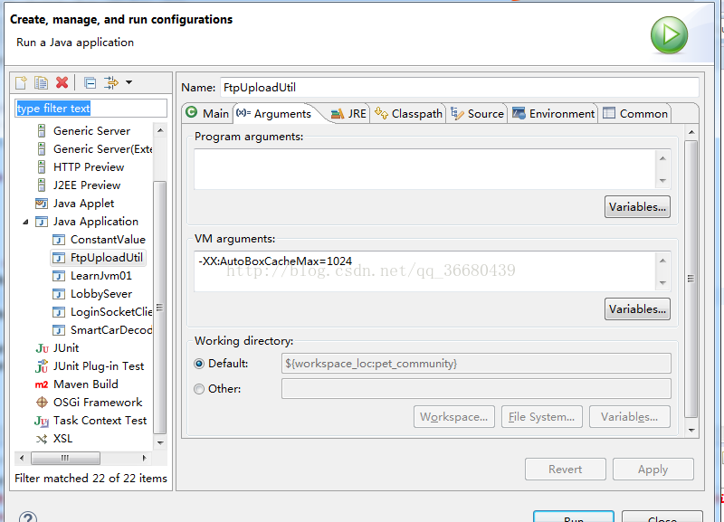

# 概述

相信大家在面试的过程中可能都遇到过这样一道题吧！

```java
public static void main(String[] args) {
        Integer a = 1000,b = 1000;

        Integer c = 100,d = 100;

        System.out.println(a == b);   // false
        System.out.println(c == d);		// true
    }
```

相信大家得出的答案都是 false true

但是在这里我一定要说，这个答案不是绝对的  c==d 一定是true，但是a==b 却不一定就是false ，也有可能是true。

但是我得到的值是 true，true 如果不相信的同学或者抱有怀疑的同学请往下看！


我们首先要明白 通常情况下为什么答案会是 false，true。


Integer c = 1000 实际在内部做了Integer c = Integer.valueOf(100)的操作。我们来看一下Integer.class的源码。

```java
		/**
     * Returns an {@code Integer} instance representing the specified
     * {@code int} value.  If a new {@code Integer} instance is not
     * required, this method should generally be used in preference to
     * the constructor {@link #Integer(int)}, as this method is likely
     * to yield significantly better space and time performance by
     * caching frequently requested values.
     *
     * This method will always cache values in the range -128 to 127,
     * inclusive, and may cache other values outside of this range.
     *
     * @param  i an {@code int} value.
     * @return an {@code Integer} instance representing {@code i}.
     * @since  1.5
     */
    public static Integer valueOf(int i) {
        if (i >= IntegerCache.low && i <= IntegerCache.high)
            return IntegerCache.cache[i + (-IntegerCache.low)];
        return new Integer(i);
    }
```


从上面的代码中可以看到，当i >= IntegerCache.low && i <= IntegerCache.high的时候会从cache数组里直接取值，否则new一个新的Integer对象。

```java
private static class IntegerCache {
        static final int low = -128;
        static final int high;
        static final Integer cache[];

        static {
            // high value may be configured by property
            int h = 127;
            String integerCacheHighPropValue =
                sun.misc.VM.getSavedProperty("java.lang.Integer.IntegerCache.high");
            if (integerCacheHighPropValue != null) {
                try {
                    int i = parseInt(integerCacheHighPropValue);
                    i = Math.max(i, 127);
                    // Maximum array size is Integer.MAX_VALUE
                    h = Math.min(i, Integer.MAX_VALUE - (-low) -1);
                } catch( NumberFormatException nfe) {
                    // If the property cannot be parsed into an int, ignore it.
                }
            }
            high = h;

            cache = new Integer[(high - low) + 1];
            int j = low;
            for(int k = 0; k < cache.length; k++)
                cache[k] = new Integer(j++);

            // range [-128, 127] must be interned (JLS7 5.1.7)
            assert IntegerCache.high >= 127;
        }

        private IntegerCache() {}
    }
```


从上面的Integer.class源码中 可以看出，low的默认值是-128，high的值与integerCacheHighPropValue有关，

```java
String integerCacheHighPropValue = sun.misc.VM.getSavedProperty("java.lang.Integer.IntegerCache.high");
```


当我们未对vm中的Integercache进行设置的时候其莫认真是127，cache数组也就是从-128到127，这也就不难理解为什么。


在开文时提到的经典面试题的结果会是false 和 true，之所以我后面强调不一定，就是因为当ntegerCacheHighPropValue不为null的时候取决于jvm中的设置，


在eclipse中我们可以做这样的操作：




这时候再来执行那段代码，你就会得到结果是 true和true，下次谁再问你这样的问题，可以大声的告诉他不一定，实力装13一波！


