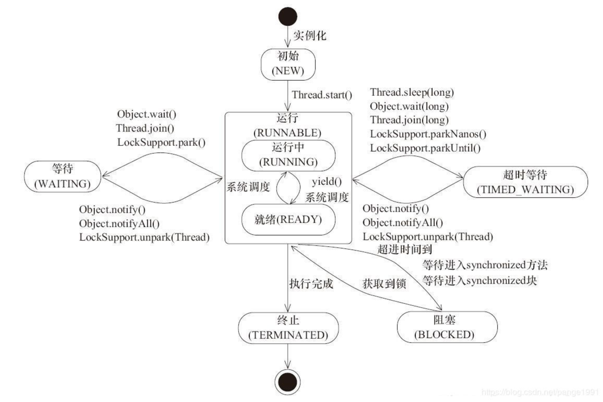

# 概述

我们学习一下Java的线程的状态：

1. 初始(NEW)：新创建了一个线程对象，但还没有调用start()方法。

2. 运行(RUNNABLE)：Java线程中将就绪（ready）和运行中（running）两种状态笼统的称为“运行”。

线程对象创建后，其他线程(比如main线程）调用了该对象的start()方法。该状态的线程位于可运行线程池中，等待被线程调度选中，获取CPU的使用权，此时处于就绪状态（ready）。就绪状态的线程在获得CPU时间片后变为运行中状态（running）。

3. 阻塞(BLOCKED)：表示线程阻塞于锁。

4. 等待(WAITING)：进入该状态的线程需要等待其他线程做出一些特定动作（通知或中断）。

5. 超时等待(TIMED_WAITING)：该状态不同于WAITING，它可以在指定的时间后自行返回。

6. 终止(TERMINATED)：表示该线程已经执行完毕。


这6种状态定义在Thread类的State枚举中，可查看源码进行一一对应。

```java
public enum State {
        NEW,
        RUNNABLE,
        BLOCKED,
        WAITING,
        TIMED_WAITING,
        TERMINATED;
    }
    public State getState() {
        return State.values()[nativeGetStatus(started)];
    }
```


# **线程的状态**




### 状态具体解析：

### **1. 初始状态**

实现Runnable接口和继承Thread可以得到一个线程类，new一个实例出来，线程就进入了初始状态。

### **2.运行状态之就绪状态**

1、就绪状态只是说你资格运行，调度程序没有挑选到你，你就永远是就绪状态。

2、调用线程的start()方法，此线程进入就绪状态。

3、当前线程sleep()方法结束，其他线程join()结束，等待用户输入完毕，某个线程拿到对象锁，这些线程也将进入就绪状态。

4、当前线程时间片用完了，调用当前线程的yield()方法，当前线程进入就绪状态。

5、锁池里的线程拿到对象锁后，进入就绪状态。

### **3.运行状态之运行态**

线程调度程序从可运行池中选择一个线程作为当前线程时线程所处的状态。这也是线程进入运行状态的唯一一种方式。

### **4. 阻塞状态**

阻塞状态是线程阻塞在进入synchronized关键字修饰的方法或代码块(获取锁)时的状态。

### **5. 等待**

处于这种状态的线程不会被分配CPU执行时间，它们要等待被显式地唤醒，否则会处于无限期等待的状态。

### **6. 超时等待**

处于这种状态的线程不会被分配CPU执行时间，不过无须无限期等待被其他线程显示地唤醒，在达到一定时间后它们会自动唤醒。

### **7. 终止状态**

1、当线程的run()方法完成时，或者主线程的main()方法完成时，我们就认为它终止了。这个线程对象也许是活的，但是，它已经不是一个单独执行的线程。线程一旦终止了，就不能复生。

2、在一个终止的线程上调用start()方法，会抛出java.lang.IllegalThreadStateException异常。


# 多线程特性

## 共享性

​		数据共享性是线程安全的主要原因之一。如果所有的数据只是在线程内有效，那就不存在线程安全性问题，这也是我们在编程的时候经常不需要考虑线程安全的主要原因之一。但是，在多线程编程中，数据共享是不可避免的。最典型的场景是数据库中的数据，为了保证数据的一致性，我们通常需要共享同一个数据库中数据，即使是在主从的情况下，访问的也同一份数据，主从只是为了访问的效率和数据安全，而对同一份数据做的副本。我们现在，通过一个简单的示例来演示多线程下共享数据导致的问题：

```java
package com.frewen.java.demo;
 
public class ShareData {
    public static int count = 0;
 
    public static void main(String[] args) {
        final ShareData data = new ShareData();
        for (int i = 0; i < 10; i++) {
            new Thread(new Runnable() {
                @Override
                public void run() {
                    try {
                        //进入的时候暂停1毫秒，增加并发问题出现的几率
                        Thread.sleep(1);
                    } catch (InterruptedException e) {
                        e.printStackTrace();
                    }
                    for (int j = 0; j < 100; j++) {
                        data.addCount();
                    }
                    System.out.print(count + " ");
                }
            }).start();
 
        }
        try {
            //主程序暂停3秒，以保证上面的程序执行完成
            Thread.sleep(3000);
        } catch (InterruptedException e) {
            e.printStackTrace();
        }
        System.out.println("count=" + count);
    }
 
    public void addCount() {
        count++;
    }
}
```

上述代码的目的是对count进行加一操作，执行1000次，不过这里是通过10个线程来实现的，每个线程执行100次，正常情况下，应该输出1000。不过，如果你运行上面的程序，你会发现结果却不是这样。下面是某次的执行结果（每次运行的结果不一定相同，有时候也可能获取到正确的结果）

可以看出，对共享变量操作，在多线程环境下很容易出现各种意想不到的的结果。

## 互斥性

资源互斥是指同时只允许一个访问者对其进行访问，具有唯一性和排它性。我们通常允许多个线程同时对数据进行读操作，但同一时间内只允许一个线程对数据进行写操作。所以我们通常将锁分为共享锁和排它锁，也叫做读锁和写锁。如果资源不具有互斥性，即使是共享资源，我们也不需要担心线程安全。例如，对于不可变的数据共享，所有线程都只能对其进行读操作，所以不用考虑线程安全问题。但是对共享数据的写操作，一般就需要保证互斥性，上述例子中就是因为没有保证互斥性才导致数据的修改产生问题。Java 中提供多种机制来保证互斥性，最简单的方式是使用Synchronized。现在我们在上面程序中加上Synchronized再执行：

```java
public class ShareData {
    public static int count = 0;
 
    public static void main(String[] args) {
        final ShareData data = new ShareData();
        for (int i = 0; i < 10; i++) {
            new Thread(new Runnable() {
                @Override
                public void run() {
                    try {
                        //进入的时候暂停1毫秒，增加并发问题出现的几率
                        Thread.sleep(1);
                    } catch (InterruptedException e) {
                        e.printStackTrace();
                    }
                    for (int j = 0; j < 100; j++) {
                        data.addCount();
                    }
                    System.out.print(count + " ");
                }
            }).start();
 
        }
        try {
            //主程序暂停3秒，以保证上面的程序执行完成
            Thread.sleep(3000);
        } catch (InterruptedException e) {
            e.printStackTrace();
        }
        System.out.println("count=" + count);
    }
 
    /**
     * 增加 synchronized 关键字
     */
    public synchronized void addCount() {
        count++;
    }
}
```

现在再执行上述代码，会发现无论执行多少次，返回的最终结果都是1000。

## 原子性

原子性就是指对数据的操作是一个独立的、不可分割的整体。换句话说，就是一次操作，是一个连续不可中断的过程，数据不会执行的一半的时候被其他线程所修改。保证原子性的最简单方式是操作系统指令，就是说如果一次操作对应一条操作系统指令，这样肯定可以能保证原子性。但是很多操作不能通过一条指令就完成。例如，对long类型的运算，很多系统就需要分成多条指令分别对高位和低位进行操作才能完成。还比如，我们经常使用的整数 i++ 的操作，其实需要分成三个步骤：

（1）读取整数 i 的值；

（2）对 i 进行加一操作；

（3）将结果写回内存。这个过程在多线程下就可能出现如下现象：


这也是代码段一执行的结果为什么不正确的原因。对于这种组合操作，要保证原子性，最常见的方式是加锁，如Java中的Synchronized或Lock都可以实现，代码段二就是通过Synchronized实现的。除了锁以外，还有一种方式就是CAS（Compare And Swap），即修改数据之前先比较与之前读取到的值是否一致，如果一致，则进行修改，如果不一致则重新执行，这也是乐观锁的实现原理。不过CAS在某些场景下不一定有效，比如另一线程先修改了某个值，然后再改回原来值，这种情况下，CAS是无法判断的。

## 可见性

要理解可见性，需要先对JVM的内存模型有一定的了解，JVM的内存模型与操作系统类似，如图所示：

​    

从这个图中我们可以看出，每个线程都有一个自己的工作内存（相当于CPU高级缓冲区，这么做的目的还是在于进一步缩小存储系统与CPU之间速度的差异，提高性能），对于共享变量，线程每次读取的是工作内存中共享变量的副本，写入的时候也直接修改工作内存中副本的值，然后在某个时间点上再将工作内存与主内存中的值进行同步。这样导致的问题是，如果线程1对某个变量进行了修改，线程2却有可能看不到线程1对共享变量所做的修改。通过下面这段程序我们可以演示一下不可见的问题：

```java
package com.frewen.java.demo.concurrent;
 
public class VisibilityTest {
    private static boolean ready;
    private static int number;
 
    private static class ReaderThread extends Thread {
        public void run() {
            try {
                Thread.sleep(10);
            } catch (InterruptedException e) {
                e.printStackTrace();
            }
            if (!ready) {
                System.out.println(ready);
            }
            System.out.println(number);
        }
    }
 
    private static class WriterThread extends Thread {
        public void run() {
            try {
                Thread.sleep(10);
            } catch (InterruptedException e) {
                e.printStackTrace();
            }
            number = 100;
            ready = true;
        }
    }
 
    public static void main(String[] args) {
        new WriterThread().start();
        new ReaderThread().start();
    }
}
```

从直观上理解，这段程序应该只会输出100，ready的值是不会打印出来的。实际上，如果多次执行上面代码的话，可能会出现多种不同的结果，下面是我运行出来的某两次的结果：

```
false
100

true
100
```

当然，这个结果也只能说是有可能是可见性造成的，当写线程（WriterThread）设置ready=true后，读线程（ReaderThread）看不到修改后的结果，所以会打印false，对于第二个结果，也就是执行if (!ready)时还没有读取到写线程的结果，但执行System.out.println(ready)时读取到了写线程执行的结果。不过，这个结果也有可能是线程的交替执行所造成的。Java 中可通过Synchronized或Volatile来保证可见性，具体细节会在后续的文章中分析。

## 有序性

为了提高性能，编译器和处理器可能会对指令做重排序。重排序可以分为三种：

（1）编译器优化的重排序。编译器在不改变单线程程序语义的前提下，可以重新安排语句的执行顺序。

（2）指令级并行的重排序。现代处理器采用了指令级并行技术（Instruction-Level Parallelism， ILP）来将多条指令重叠执行。如果不存在数据依赖性，处理器可以改变语句对应机器指令的执行顺序。

（3）内存系统的重排序。由于处理器使用缓存和读/写缓冲区，这使得加载和存储操作看上去可能是在乱序执行。

我们可以直接参考一下JSR 133 中对重排序问题的描述：


先看上图中的（1）源码部分，从源码来看，要么指令 1 先执行要么指令 3先执行。如果指令 1 先执行，r2不应该能看到指令 4 中写入的值。如果指令 3 先执行，r1不应该能看到指令 2 写的值。但是运行结果却可能出现r2==2，r1==1的情况，这就是“重排序”导致的结果。上图（2）即是一种可能出现的合法的编译结果，编译后，指令1和指令2的顺序可能就互换了。因此，才会出现r2==2，r1==1的结果。Java 中也可通过Synchronized或Volatile来保证顺序性。


# 面试题-Thread为什么没有Running的状态？

文章参考：https://www.cnblogs.com/lijizhi/p/11422345.html

有人常觉得 Java 线程状态中还少了个 running 状态，这其实是把两个不同层面的状态混淆了。对 Java 线程状态而言，不存在所谓的running 状态，它的 runnable 状态包含了 running 状态。

那为何 JVM 中没有去区分这两种状态呢？

现在的时分（time-sharing）多任务（multi-task）操作系统架构通常都是用所谓的“时间分片（time quantum or time slice）”方式进行抢占式（preemptive）轮转调度（round-robin式）。

更复杂的可能还会加入优先级（priority）的机制。

这个时间分片通常是很小的，一个线程一次最多只能在 cpu 上运行比如10-20ms 的时间（此时处于 running 状态），也即大概只有0.01秒这一量级，时间片用后就要被切换下来放入调度队列的末尾等待再次调度。（也即回到 ready 状态）

注：如果期间进行了 I/O 的操作还会导致提前释放时间分片，并进入等待队列。

又或者是时间分片没有用完就被抢占，这时也是回到 ready 状态。

这一切换的过程称为线程的上下文切换（context switch），当然 cpu 不是简单地把线程踢开就完了，还需要把被相应的执行状态保存到内存中以便后续的恢复执行。

显然，10-20ms 对人而言是很快的，

不计切换开销（每次在1ms 以内），相当于1秒内有50-100次切换。事实上时间片经常没用完，线程就因为各种原因被中断，实际发生的切换次数还会更多。

