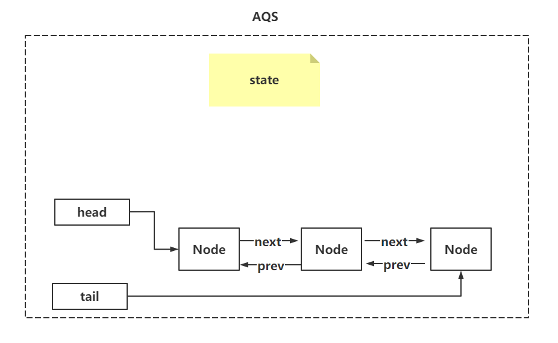
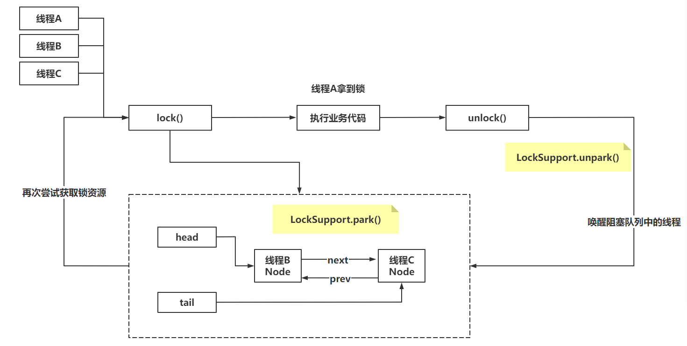

文章参考：https://cloud.fynote.com/share/d/7057

# 概述

ReentrantLock和Synchronized关键字的区别

synchronized同步锁，锁升级，但是synchronized只有升级，没有降级，锁竞争激烈，不推荐synchronized

ReentrantLock同步锁，内部是基于CAS和AQS实现的，在锁竞争比较激烈时，推荐使用ReentrantLock

ReentrantLock基本使用（可重入锁）：

获取锁：ReentrantLock对象.lock();

释放锁：ReentrantLock对象.unlock();

## CAS、AQS概念

#### 2.1 CAS（乐观锁实现方式）

Compare And Swap，是针对一个值进行修改（原子性）

在Java中提供了Unsafe类实现了CAS的操作。

ABA问题：添加版本号。

CAS自旋次数过多：

- synchronized基于自适应自旋锁解决。
- LongAdder基于Cell[]，在CAS实现失败，将数据扔到Cell[]中，后期再添加

劣势：CAS只能保证修改一个值的时候，是原子性的。CAS无法直接锁住一段代码。

#### 2.2 AQS

AQS是什么：就是Java中的一个类，名字：AbstractQueuedSynchronizer

AQS是JUC中的一个基础类（并发基础类），很多其他类都是基于AQS实现的：

- ReentrantLock
- CountDownLatch
- 信号量
- 阻塞队列~
- 线程池的Worker类

AQS中维护着一个非常重要的属性：state

还维护着一个双向队列：Node类

## 源码分析

#### 3.1 加锁流程

如果在线程B被唤醒之后：

- 非公平锁，线程B会和其他线程一起竞争锁资源
- 公平锁，其他线程需要先到AQS排队

