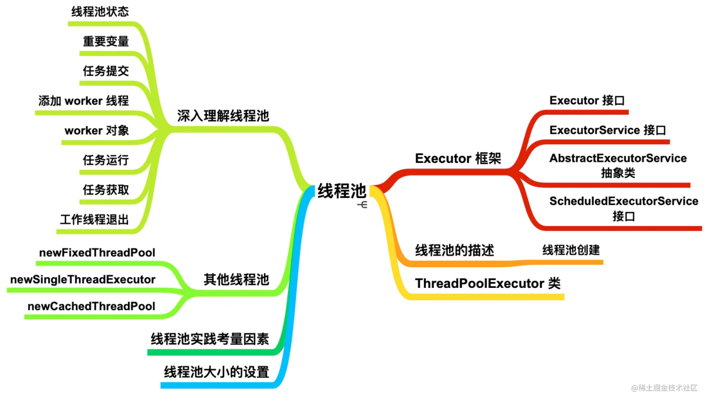
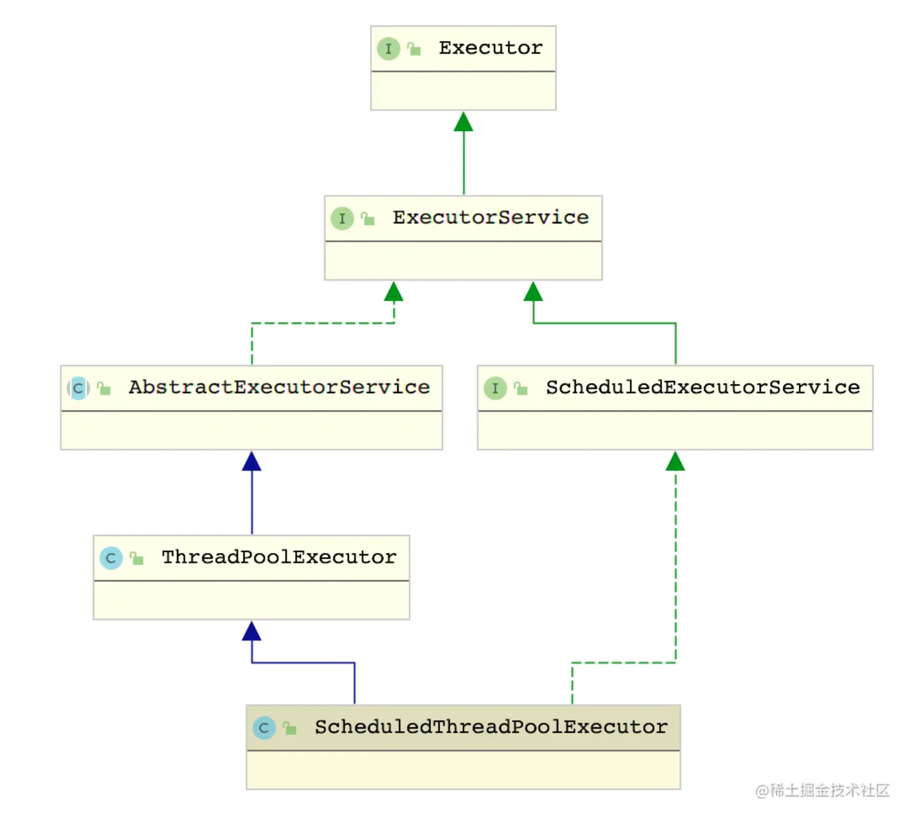
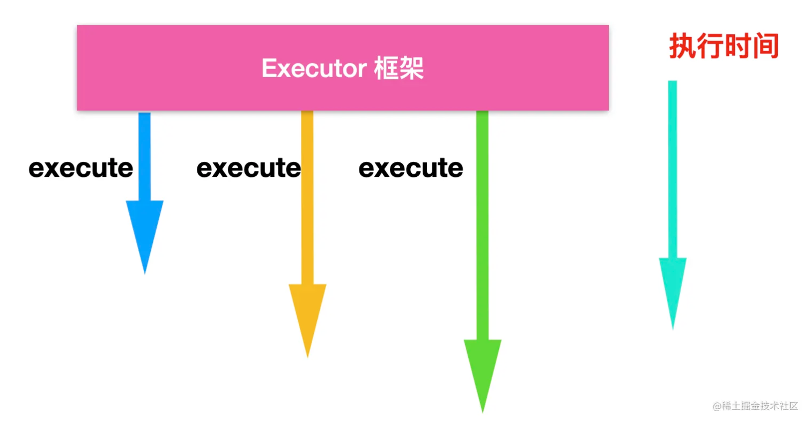
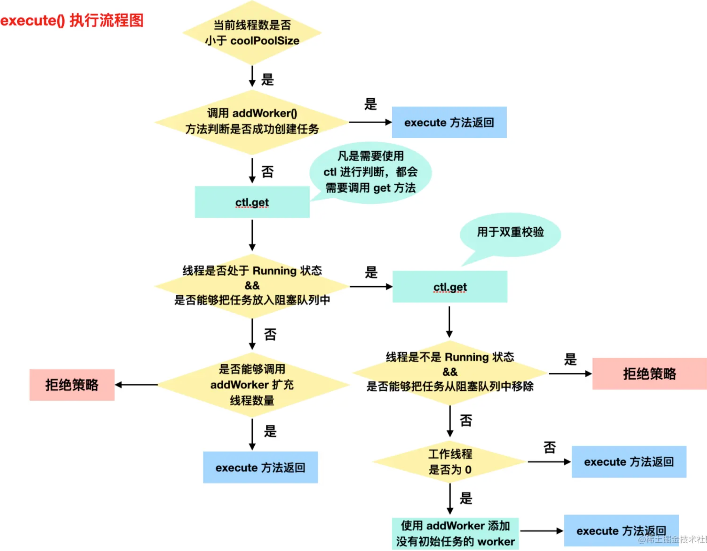
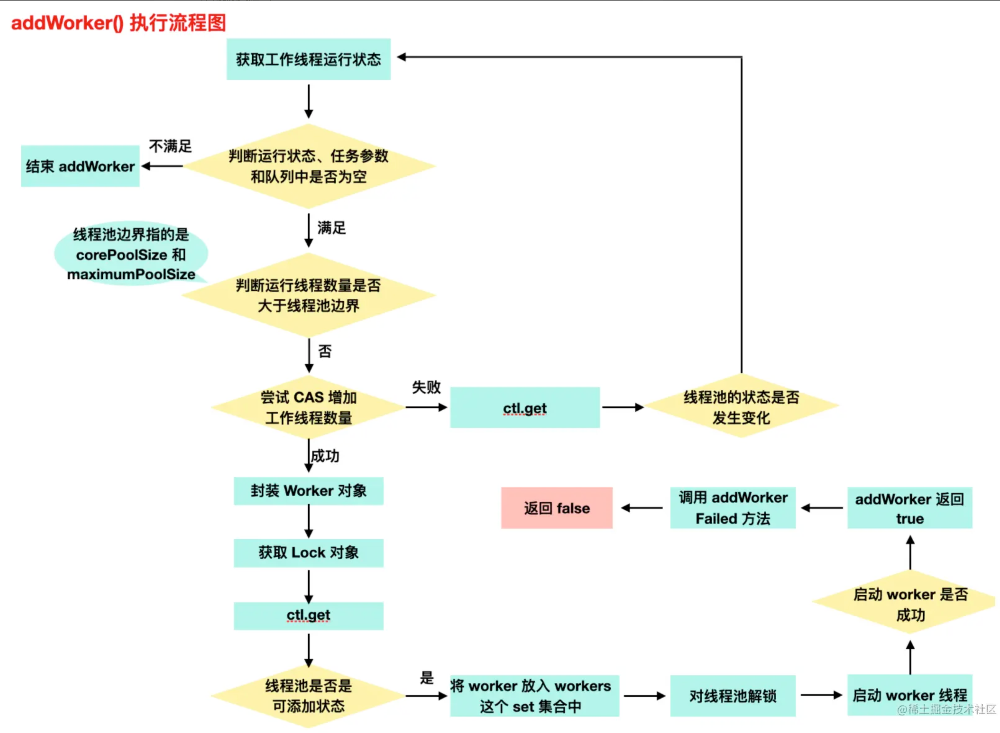

[TOC]

# 概述



线程需要的时候要进行创建，不需要的时候需要进行销毁，但是线程的创建和销毁都是一个开销比较大的操作。

虽然我们程序员创建一个线程很容易，直接使用 new Thread() 创建就可以了，但是操作系统做的工作会多很多，它需要发出 `系统调用`，陷入内核，调用内核 API 创建线程，为线程分配资源等，这一些操作有很大的开销。

所以，在高并发大流量的情况下，频繁的创建和销毁线程会大大拖慢响应速度，那么有什么能够提高响应速度的方式吗？方式有很多，尽量避免线程的创建和销毁是一种提升性能的方式，也就是把线程 `复用` 起来，因为性能是我们日常最关注的因素。

我们先来通过认识一下 Executor 框架、然后通过描述线程池的基本概念入手、逐步认识线程池的核心类，然后慢慢进入线程池的原理中，带你一步一步理解线程池。

在 Java 中可以通过线程池来达到这样的效果。今天我们就来详细讲解一下 Java 的`线程池`。

# Executor 框架

为什么要先说一下 Executor 呢？因为我认为 Executor 是线程池的一个驱动，我们平常创建并执行线程用的一般都是 new Thread().start() 这个方法，这个方法更多强调 **创建一个线程并开始运行**。而我们后面讲到创建线程池更多体现在**驱动执行**上。

Executor 的总体框架如下，我们下面会对 Executor 框架中的每个类进行介绍。



我们首先来认识一下 Executor

# Executor 接口

Executor 是 `java.util.concurrent` 的顶级接口，这个接口只有一个方法，那就是 `execute` 方法。

```java
public interface Executor {

    /**
     * Executes the given command at some time in the future.  The command
     * may execute in a new thread, in a pooled thread, or in the calling
     * thread, at the discretion of the {@code Executor} implementation.
     *
     * @param command the runnable task
     * @throws RejectedExecutionException if this task cannot be
     * accepted for execution
     * @throws NullPointerException if command is null
     */
    void execute(Runnable command);
}
```

我们平常创建并启动线程会使用 `new Thread().start()` ，而 Executor 中的 execute 方法替代了显示创建线程的方式。Executor 的设计初衷就是将任务提交和任务执行细节进行解藕。使用 Executor 框架，你可以使用如下的方式创建线程：

```java
Executor executor = Executors.xxx // xxx 其实就是 Executor 的实现类，我们后面会说
executor.execute(new RunnableTask1());
executor.execute(new RunnableTask2());
```

execute方法接收一个 `Runnable` 实例，它用来执行一个任务，而任务就是一个实现了 Runnable 接口的类，但是 execute 方法不能接收实现了 `Callable` 接口的类，也就是说，execute 方法不能接收具有返回值的任务。

execute 方法创建的线程是异步执行的，也就是说，你不用等待每个任务执行完毕后再执行下一个任务。



比如下面就是一个简单的使用 Executor 创建并执行线程的示例:

```java
public class RunnableTask implements Runnable{

    @Override
    public void run() {
        System.out.println("running");
    }

    public static void main(String[] args) {
        Executor executor = Executors.newSingleThreadExecutor(); // 你可能不太理解这是什么意思，我们后面会说。
        executor.execute(new RunnableTask());
    }
}
```

Executor 就相当于是族长，大佬只发号令，族长让你异步执行你就得异步执行，族长说不用`汇报`任务你就不用回报，但是这个族长管的事情有点少，所以除了 Executor 之外，我们还需要认识其他管家，比如说管你这个线程啥时候终止，啥时候暂停，判断你这个线程当前的状态等，`ExecutorService` 就是一位大管家。

# ExecutorService接口


```java
public interface ExecutorService extends Executor {

    void shutdown();

    List<Runnable> shutdownNow();

    boolean isShutdown();

    boolean isTerminated();

    boolean awaitTermination(long timeout, TimeUnit unit)
        throws InterruptedException;

    <T> Future<T> submit(Callable<T> task);

    <T> Future<T> submit(Runnable task, T result);

    Future<?> submit(Runnable task);

    <T> List<Future<T>> invokeAll(Collection<? extends Callable<T>> tasks)
        throws InterruptedException;
        
    <T> List<Future<T>> invokeAll(Collection<? extends Callable<T>> tasks,
                                  long timeout, TimeUnit unit)
        throws InterruptedException;

    <T> T invokeAny(Collection<? extends Callable<T>> tasks)
        throws InterruptedException, ExecutionException;

    <T> T invokeAny(Collection<? extends Callable<T>> tasks,
                    long timeout, TimeUnit unit)
        throws InterruptedException, ExecutionException, TimeoutException;
}

```


# ThreadPoolExecutor


# 源码解析

我们先来聊聊线程池状态，线程池状态是一个非常有趣的设计点，ThreadPoolExecutor 使用 `ctl` 来存储线程池状态，这些状态也叫做线程池的`生命周期`。想想也是，线程池作为一个存储管理线程的资源池，它自己也要有这些状态，以及状态之间的变更才能更好的满足我们的需求。ctl 其实就是一个 `AtomicInteger` 类型的变量，保证`原子性`。

ctl 除了存储线程池状态之外，它还存储 `workerCount` 这个概念，workerCount 指示的是有效线程数，workerCount 表示的是已经被允许启动但不允许停止的工作线程数量。workerCount 的值与实际活动线程的数量不同。

**ctl 高低位来判断是线程池状态还是工作线程数量，线程池状态位于高位**。

这里有个设计点，为什么使用 AtomicInteger 而不是存储上线更大的 AtomicLong 之类的呢？

Lea 并非没有考虑过这个问题，为了表示 int 值，目前 workerCount 的大小是**（2 ^ 29）-1（约 5 亿个线程），而不是（2 ^ 31）-1（20亿个）可表示的线程**。如果将来有问题，可以将该变量更改为 AtomicLong。但是在需要之前，使用 int 可以使此代码更快，更简单，int 存储占用存储空间更小。

runState 具有如下几种状态：

```java
private static final int RUNNING    = -1 << COUNT_BITS; 
private static final int SHUTDOWN   =  0 << COUNT_BITS;
private static final int STOP       =  1 << COUNT_BITS;
private static final int TIDYING    =  2 << COUNT_BITS;
private static final int TERMINATED =  3 << COUNT_BITS;
```

我们先上状态轮转图，然后根据状态轮转图做详细的解释。


## 任务添加策略

当一个任务被添加进线程池时：

1. 线程数量未达到 corePoolSize，则新建一个线程(核心线程)执行任务
2. 线程数量达到了 corePools，则将任务移入队列等待
3. 队列已满，新建线程(非核心线程)执行任务
4. 队列已满，总线程数又达到了 maximumPoolSize，就会由基于饱和策略进行处理(RejectedExecutionHandler)或者抛出异常

说白了就是先利用核心线程，核心线程用完，新来的就加入等待队列，一旦队列满了，那么只能开始非核心线程来执行了。

上面的策略，会在阅读代码的时候体现出来，并且在代码中也能窥探出真正复用空闲线程的实现原理。

## execute执行任务

接下来我们就从线程池执行任务的入口分析。

一个线程池可以接受任务类型有Runnable和Callable，分别对应了execute和submit方法。目前我们只分析execute的执行过程。

```java
    /**
     * Executes the given task sometime in the future.  The task
     * may execute in a new thread or in an existing pooled thread.
     *
     * If the task cannot be submitted for execution, either because this
     * executor has been shutdown or because its capacity has been reached,
     * the task is handled by the current {@code RejectedExecutionHandler}.
     *
     * @param command the task to execute
     * @throws RejectedExecutionException at discretion of
     *         {@code RejectedExecutionHandler}, if the task
     *         cannot be accepted for execution
     * @throws NullPointerException if {@code command} is null
     */
    public void execute(Runnable command) {
        // 异常判断。如果任务为null 则直接抛出异常
        if (command == null)
            throw new NullPointerException();
        // 获取ctl对象
        int c = ctl.get();
        // 第一步： 判断 ctl 的值是否小于核心线程池的数量 获取活动的线程数如果小于核心线程数
        if (workerCountOf(c) < corePoolSize) {
            // 则直接启动一个核心线程执行任务
            // 这个方法很重要，我们详细分析一下
            if (addWorker(command, true)){
                return;
            }
            // 线程添加不成功，需要再次判断，每需要一次判断都会获取 ctl 的值
            c = ctl.get();
        }

        // 第二步：当前运行线程数量大于等于核心线程数，并且能够成功的放入阻塞队列。
        // 如果线程池正在运行，workQueue.offer加入任务队列，成功的话会进行二次检查
        if (isRunning(c) && workQueue.offer(command)) {
            // 再次检查一些ctl对象
            int recheck = ctl.get();
            // 如果不是运行态并且成功的从阻塞队列中删除
            if (!isRunning(recheck) && remove(command))
                // 执行拒绝策略
                reject(command);
            else if (workerCountOf(recheck) == 0)
                // 如果加入到队里成功之后
                // 启动非核心线程执行，注意这里任务是null，
                // 其实里面会去取任务队列里的任务执行
                addWorker(null, false);
        } else if (!addWorker(command, false))
            // 第三步：加入不了队列（即队列满了），尝试启动非核心线程
            // 如果非核心线程启动失败。
            // 说明到达了最大线程数量的限制，
            // 调用reject(command)会使用第7个参数抛出异常
            reject(command);
    }
```

总结一下，execute的执行逻辑就是：

如果 当前活动线程数 < 指定的核心线程数，则使用 addWorker 创建并启动一个线程来执行新提交的任务（此时新建的线程相当于核心线程）；如果创建成功，那么 execute 方法会直接返回。如果没创建成功，可能是由于线程池已经 shutdown，可能是由于并发情况下 workerCountOf(c) < corePoolSize ，别的线程先创建了 worker 线程，导致 workerCoun t>= corePoolSize。

如果 当前活动线程数 >= 指定的核心线程数，且缓存队列未满，则将任务添加到缓存队列中；

如果线程池还在 Running 状态，会将 task 加入阻塞队列，加入成功后会进行 `double-check` 双重校验，继续下面的步骤，如果加入失败，可能是由于队列线程已满，此时会判断是否能够加入线程池中，如果线程池也满了的话，就会直接执行拒绝策略，如果线程池能加入，execute 方法结束。

如果 当前活动线程数 >= 指定的核心线程数，且缓存队列已满，则创建并启动一个线程来执行新提交的任务（此时新建的线程相当于非核心线程）;

从代码中我们也可以看出，即便当前活动的线程有空闲的，只要这个活动的线程数量小于设定的核心线程数，那么依旧会启动一个新线程来执行任务。也就是说不会去复用任何线程。在execute方法里面我们没有看到线程复用的影子，那么我们继续来看看addWorker方法。

根据源码画出的执行流程图：




## addWorker添加任务

从上面的执行流程可以看出，添加一个 worker 涉及的工作也非常多，这也是一个比价难啃的点，我们一起来分析下，这是 worker 的源码：

```java
 	/**
     *
     * @param firstTask  任务
     * @param core       是否是核心线程
     * @return true      if successful
     */
    private boolean addWorker(Runnable firstTask, boolean core) {
        // retry 的用法相当于 goto
        retry:
        for (; ; ) {
            // ctl 高低位来判断是线程池状态还是工作线程数量，
            // 线程池状态位于高位,
            // ctl 除了存储线程池状态之外，它还存储 workerCount 这个概念，
            // workerCount 指示的是有效线程数，workerCount 表示的是已经被允许启动但不允许停止的工作线程数量。
            // workerCount 的值与实际活动线程的数量不同。
            int c = ctl.get();
            // 获取线程池的运行状态
            int rs = runStateOf(c);
            // 仅在必要时检查队列是否为空,
            // 线程池状态有五种，state 越小越是运行状态.
            // rs >= SHUTDOWN，表示此时线程池状态可能是 SHUTDOWN、STOP、TIDYING、TERMINATED
            // 默认 rs >= SHUTDOWN，如果 rs = SHUTDOWN，直接返回 false
            // 默认 rs < SHUTDOWN，是 RUNNING，如果任务不是空，返回 false
            // 默认 RUNNING，任务是空，如果工作队列为空，返回 false
            if (rs >= SHUTDOWN &&
                    !(rs == SHUTDOWN &&
                            firstTask == null &&
                            !workQueue.isEmpty())) {
                //
                return false;
            }
            // 进行无限循环
            for (; ; ) {
                // 获取工作的线程的数量
                int wc = workerCountOf(c);
                // 判断活动线程大约等于容量，或者最大核心线程数、或者最大线程数
                // 如果 worker 数量>线程池最大上限 CAPACITY（即使用int低29位可以容纳的最大值）
                // 或者 worker数量 > corePoolSize 或 worker数量>maximumPoolSize )，即已经超过了给定的边界
                if (wc >= CAPACITY ||
                        wc >= (core ? corePoolSize : maximumPoolSize)) {
                    return false;
                }
                // 使用 CAS 增加 worker 数量，增加成功，跳出循环。
                if (compareAndIncrementWorkerCount(c)) {
                    break retry;
                }
                // 再次检查一下 ctl
                c = ctl.get();  // Re-read ctl
                // 如果状态不等于之前获取的 state，跳出内层循环，继续去外层循环判断
                if (runStateOf(c) != rs) {
                    continue retry;
                }
                // else CAS failed due to workerCount change; retry inner loop
            }
        }
        // 前面都是判断线程池状态的判断，暂时不理会，主要看下面两个关键的地方
        boolean workerStarted = false;
        boolean workerAdded = false;
        Worker w = null;
        try {
            // 新建一个Worker对象，这个对象包含了待执行的任务，并且新建一个线程
            // 包装 Runnable 对象,设置 firstTask 的值为 -1.赋值给当前任务.
            // 使用 worker 自身这个 runnable，调用 ThreadFactory 创建一个线程，并设置给worker的成员变量thread
            w = new Worker(firstTask);
            // 下面就是这个Worker对象的构造函数
            // Worker(Runnable firstTask) {
            //     setState(-1); // inhibit interrupts until runWorker
            //     this.firstTask = firstTask;
            //     this.thread = getThreadFactory().newThread(this);
            // }
            // 获取创建Worker对象的thread对象
            final Thread t = w.thread;

            // 加锁同步方法代码块
            if (t != null) {
                final ReentrantLock mainLock = this.mainLock;
                mainLock.lock();
                try {
                    // Recheck while holding lock.
                    // Back out on ThreadFactory failure or if
                    // shut down before lock acquired.
                    // 在持有锁的时候重新检查
                    // 如果 ThreadFactory 失败或在获得锁之前关闭，请回退。
                    int rs = runStateOf(ctl.get());
                    // 线程池的运行状态判断
                    // 如果线程池在运行 running<shutdown 或者 线程池已经 shutdown，且firstTask==null
                    // （可能是 workQueue 中仍有未执行完成的任务，创建没有初始任务的 worker 线程执行）
                    //worker 数量 -1 的操作在 addWorkerFailed()
                    if (rs < SHUTDOWN ||
                            (rs == SHUTDOWN && firstTask == null)) {
                        if (t.isAlive()) // precheck that t is startable
                            throw new IllegalThreadStateException();

                        // 没有问题的话。将这个Worker对象加入到workers中.workers 就是一个 HashSet 集合
                        workers.add(w);
                        // 设置最大的池大小 largestPoolSize，workerAdded 设置为true
                        int s = workers.size();
                        if (s > largestPoolSize)
                            largestPoolSize = s;
                        workerAdded = true;
                    }
                } finally {
                    mainLock.unlock();
                }
                if (workerAdded) {
                    // 启动刚创建的worker对象里面的thread执行
                    t.start();
                    workerStarted = true;
                }
            }
        } finally {
            if (!workerStarted)
                addWorkerFailed(w);
        }
        return workerStarted;
    }
```

方法虽然有点长，但是我们只考虑两个关键的地方，先是创建一个worker对象，创建成功后，对线程池状态判断成功后，就去执行该worker对象的thread的启动。

这个方法的执行流程图如下：




[TOC]


也就是说在这个方法里面启动了一个关联到worker的线程，但是这个线程是如何执行我们传进来的runnable任务的呢？接下来看看这个Worker对象到底做了什么。

## worker 对象

Worker 位于 `ThreadPoolExecutor` 内部，它继承了 AQS 类并且实现了 Runnable 接口。Worker 类主要维护了线程运行过程中的中断控制状态。它提供了锁的获取和释放操作。在 worker 的实现中，我们使用了非重入的互斥锁而不是使用重复锁，因为 Lea 觉得我们不应该在调用诸如 setCorePoolSize 之类的控制方法时能够重新获取锁。

最重要的构造方法：

```java
  Worker(Runnable firstTask) {
            setState(-1); // inhibit interrupts until runWorker
            // 持有外部传进来的runnable任务
            this.firstTask = firstTask;
            // //创建了一个thread对象，并把自身这个runnable对象给了thread，
            // 一旦该thread执行start方法，就会执行worker的run方法
            // Thread newThread(Runnable r);
            this.thread = getThreadFactory().newThread(this);
}
```

构造一个 worker 对象需要做三步操作：

1. 初始 AQS 状态为 -1，此时不允许中断 interrupt()，只有在 worker 线程启动了，执行了 runWorker() 方法后，将 state 置为0，才能进行中断。

2. 将 firstTask 赋值给为当前类的全局变量

3. 通过 `ThreadFactory` 创建一个新的线程。

## 任务运行

我们前面的流程主要分析了线程池的 execute 方法的执行过程，这个执行过程相当于是任务提交过程，而我们下面要说的是**从队列中获取任务并运行**的这个工作流程。

一般情况下，我们会从初始任务开始运行，所以我们不需要获取第一个任务。否则，只要线程池还处于 Running 状态，我们会调用 `getTask` 方法获取任务。getTask 方法可能会返回 null，此时可能是由于线程池状态改变或者是配置参数更改而导致的退出。还有一种情况可能是由于 `异常` 而引发的，这个我们后面会细说。

下面来看一下 `runWorker` 方法的源码：


