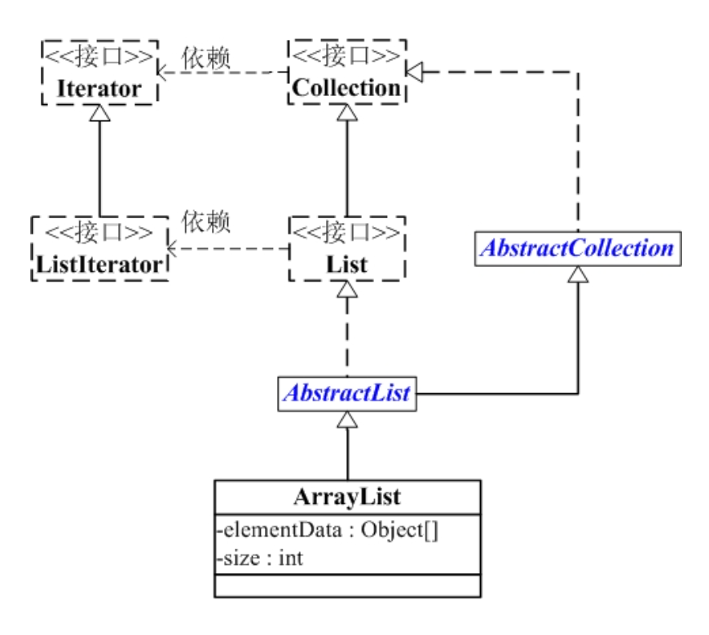

[TOC]

# 概述

讲解List，而List中ArrayList又最为常用。因此，本章我们讲解ArrayList。先对ArrayList有个整体认识，再学习它的源码，最后再通过例子来学习如何使用它。内容包括：

### ArrayList介绍

ArrayList 是一个数组队列，相当于 动态数组。与Java中的数组相比，它的容量能动态增长。它继承于AbstractList，实现了List, RandomAccess, Cloneable, java.io.Serializable这些接口。

ArrayList 继承了AbstractList，实现了List。它是一个数组队列，提供了相关的添加、删除、修改、遍历等功能。


ArrayList 实现了RandmoAccess接口，即提供了随机访问功能。RandmoAccess是java中用来被List实现，为List提供快速访问功能的。在ArrayList中，我们即可以通过元素的序号快速获取元素对象；这就是快速随机访问。稍后，我们会比较List的“快速随机访问”和“通过Iterator迭代器访问”的效率。

ArrayList 实现了Cloneable接口，即覆盖了函数clone()，能被克隆。

ArrayList 实现java.io.Serializable接口，这意味着ArrayList支持序列化，能通过序列化去传输。

和Vector不同，ArrayList中的操作不是线程安全的！所以，建议在单线程中才使用ArrayList，而在多线程中可以选择Vector或者CopyOnWriteArrayList。


### 构造函数

```java
// 默认构造函数
ArrayList()

// capacity是ArrayList的默认容量大小。当由于增加数据导致容量不足时，容量会添加上一次容量大小的一半。
ArrayList(int capacity)

// 创建一个包含collection的ArrayList
ArrayList(Collection<? extends E> collection)
```

### ArrayList的API


```java
// Collection中定义的API
boolean             add(E object)
boolean             addAll(Collection<? extends E> collection)
void                clear()
boolean             contains(Object object)
boolean             containsAll(Collection<?> collection)
boolean             equals(Object object)
int                 hashCode()
boolean             isEmpty()
Iterator<E>         iterator()
boolean             remove(Object object)
boolean             removeAll(Collection<?> collection)
boolean             retainAll(Collection<?> collection)
int                 size()
<T> T[]             toArray(T[] array)
Object[]            toArray()
// AbstractCollection中定义的API
void                add(int location, E object)
boolean             addAll(int location, Collection<? extends E> collection)
E                   get(int location)
int                 indexOf(Object object)
int                 lastIndexOf(Object object)
ListIterator<E>     listIterator(int location)
ListIterator<E>     listIterator()
E                   remove(int location)
E                   set(int location, E object)
List<E>             subList(int start, int end)
// ArrayList新增的API
Object               clone()
void                 ensureCapacity(int minimumCapacity)
void                 trimToSize()
void                 removeRange(int fromIndex, int toIndex)
```

### ArrayList数据结构


```java
java.lang.Object
   ↳     java.util.AbstractCollection<E>
         ↳     java.util.AbstractList<E>
               ↳     java.util.ArrayList<E>

public class ArrayList<E> extends AbstractList<E>
        implements List<E>, RandomAccess, Cloneable, java.io.Serializable {}
```

**ArrayList与Collection关系如下图**：



ArrayList包含了两个重要的对象：elementData 和 size。

(01) elementData 是"Object[]类型的数组"，它保存了添加到ArrayList中的元素。实际上，elementData是个动态数组，我们能通过构造函数 ArrayList(int initialCapacity)来执行它的初始容量为initialCapacity；

如果通过不含参数的构造函数ArrayList()来创建ArrayList，则elementData的容量默认是10。elementData数组的大小会根据ArrayList容量的增长而动态的增长，具体的增长方式，请参考源码分析中的ensureCapacity()函数。

(02) size 则是动态数组的实际大小。


### ArrayList源码解析

为了更了解ArrayList的原理，下面对ArrayList源码代码作出分析。ArrayList是通过数组实现的，源码比较容易理解。 

```java
package java.util;

public class ArrayList<E> extends AbstractList<E>
        implements List<E>, RandomAccess, Cloneable, java.io.Serializable
{
    // 序列版本号
    private static final long serialVersionUID = 8683452581122892189L;

    // 保存ArrayList中数据的数组
    private transient Object[] elementData;

    // ArrayList中实际数据的数量
    private int size;

    // ArrayList带容量大小的构造函数。
    public ArrayList(int initialCapacity) {
        super();
        if (initialCapacity < 0)
            throw new IllegalArgumentException("Illegal Capacity: "+
                                               initialCapacity);
        // 新建一个数组.根据传入的容量大小，创建对应的数组
        this.elementData = new Object[initialCapacity];
    }

    // ArrayList构造函数。默认容量是10。
    public ArrayList() {
        this(10);
    }

    // 创建一个包含collection的ArrayList
    public ArrayList(Collection<? extends E> c) {
        elementData = c.toArray();
        size = elementData.length;
        // c.toArray might (incorrectly) not return Object[] (see 6260652)
        if (elementData.getClass() != Object[].class)
            elementData = Arrays.copyOf(elementData, size, Object[].class);
    }


    // 将当前容量值设为 =实际元素个数
    public void trimToSize() {
        modCount++;
        int oldCapacity = elementData.length;
        if (size < oldCapacity) {
            elementData = Arrays.copyOf(elementData, size);
        }
    }


    // 确定ArrarList的容量。
    // 若ArrayList的容量不足以容纳当前的全部元素，设置 新的容量=“(原始容量x3)/2 + 1”
    public void ensureCapacity(int minCapacity) {
        // 将“修改统计数”+1
        modCount++;
        // 获取老的元素数组的大小
        int oldCapacity = elementData.length;
        // 若当前容量不足以容纳当前的元素个数，设置 新的容量=“(原始容量x3)/2 + 1”
        if (minCapacity > oldCapacity) {
          	// 将现有的元素数据复制
            Object oldData[] = elementData;
            // 计算新的元素数据容量的大小
            int newCapacity = (oldCapacity * 3)/2 + 1;
            // 
            if (newCapacity < minCapacity)
                newCapacity = minCapacity;
            // 
            elementData = Arrays.copyOf(elementData, newCapacity);
        }
    }

    // 添加元素e
    public boolean add(E e) {
        // 确定ArrayList的容量大小
        ensureCapacity(size + 1);  // Increments modCount!!
        // 添加e到ArrayList中
        elementData[size++] = e;
        return true;
    }

    // 返回ArrayList的实际大小
    public int size() {
        return size;
    }

    // 返回ArrayList是否包含Object(o)
    public boolean contains(Object o) {
        return indexOf(o) >= 0;
    }

    // 返回ArrayList是否为空
    public boolean isEmpty() {
        return size == 0;
    }

    // 正向查找，返回元素的索引值
    public int indexOf(Object o) {
        if (o == null) {
            for (int i = 0; i < size; i++)
            if (elementData[i]==null)
                return i;
            } else {
                for (int i = 0; i < size; i++)
                if (o.equals(elementData[i]))
                    return i;
            }
            return -1;
        }

        // 反向查找，返回元素的索引值
        public int lastIndexOf(Object o) {
        if (o == null) {
            for (int i = size-1; i >= 0; i--)
            if (elementData[i]==null)
                return i;
        } else {
            for (int i = size-1; i >= 0; i--)
            if (o.equals(elementData[i]))
                return i;
        }
        return -1;
    }

    // 反向查找(从数组末尾向开始查找)，返回元素(o)的索引值
    public int lastIndexOf(Object o) {
        if (o == null) {
            for (int i = size-1; i >= 0; i--)
            if (elementData[i]==null)
                return i;
        } else {
            for (int i = size-1; i >= 0; i--)
            if (o.equals(elementData[i]))
                return i;
        }
        return -1;
    }


    // 返回ArrayList的Object数组
    public Object[] toArray() {
        return Arrays.copyOf(elementData, size);
    }

    // 返回ArrayList的模板数组。所谓模板数组，即可以将T设为任意的数据类型
    public <T> T[] toArray(T[] a) {
        // 若数组a的大小 < ArrayList的元素个数；
        // 则新建一个T[]数组，数组大小是“ArrayList的元素个数”，并将“ArrayList”全部拷贝到新数组中
        if (a.length < size)
            return (T[]) Arrays.copyOf(elementData, size, a.getClass());

        // 若数组a的大小 >= ArrayList的元素个数；
        // 则将ArrayList的全部元素都拷贝到数组a中。
        System.arraycopy(elementData, 0, a, 0, size);
        if (a.length > size)
            a[size] = null;
        return a;
    }

    // 获取index位置的元素值
    public E get(int index) {
        RangeCheck(index);

        return (E) elementData[index];
    }

    // 设置index位置的值为element
    public E set(int index, E element) {
        RangeCheck(index);

        E oldValue = (E) elementData[index];
        elementData[index] = element;
        return oldValue;
    }

    // 将e添加到ArrayList中
    public boolean add(E e) {
        ensureCapacity(size + 1);  // Increments modCount!!
        elementData[size++] = e;
        return true;
    }

    // 将e添加到ArrayList的指定位置
    public void add(int index, E element) {
        if (index > size || index < 0)
            throw new IndexOutOfBoundsException(
            "Index: "+index+", Size: "+size);

        ensureCapacity(size+1);  // Increments modCount!!
        System.arraycopy(elementData, index, elementData, index + 1,
             size - index);
        elementData[index] = element;
        size++;
    }

    // 删除ArrayList指定位置的元素
    public E remove(int index) {
        RangeCheck(index);

        modCount++;
        E oldValue = (E) elementData[index];

        int numMoved = size - index - 1;
        if (numMoved > 0)
            System.arraycopy(elementData, index+1, elementData, index,
                 numMoved);
        elementData[--size] = null; // Let gc do its work

        return oldValue;
    }

    // 删除ArrayList的指定元素
    public boolean remove(Object o) {
        if (o == null) {
                for (int index = 0; index < size; index++)
            if (elementData[index] == null) {
                fastRemove(index);
                return true;
            }
        } else {
            for (int index = 0; index < size; index++)
            if (o.equals(elementData[index])) {
                fastRemove(index);
                return true;
            }
        }
        return false;
    }


    // 快速删除第index个元素
    private void fastRemove(int index) {
        modCount++;
        int numMoved = size - index - 1;
        // 从"index+1"开始，用后面的元素替换前面的元素。
        if (numMoved > 0)
            System.arraycopy(elementData, index+1, elementData, index,
                             numMoved);
        // 将最后一个元素设为null
        elementData[--size] = null; // Let gc do its work
    }

    // 删除元素
    public boolean remove(Object o) {
        if (o == null) {
            for (int index = 0; index < size; index++)
            if (elementData[index] == null) {
                fastRemove(index);
            return true;
            }
        } else {
            // 便利ArrayList，找到“元素o”，则删除，并返回true。
            for (int index = 0; index < size; index++)
            if (o.equals(elementData[index])) {
                fastRemove(index);
            return true;
            }
        }
        return false;
    }

    // 清空ArrayList，将全部的元素设为null
    public void clear() {
        modCount++;

        for (int i = 0; i < size; i++)
            elementData[i] = null;

        size = 0;
    }

    // 将集合c追加到ArrayList中
    public boolean addAll(Collection<? extends E> c) {
        Object[] a = c.toArray();
        int numNew = a.length;
        ensureCapacity(size + numNew);  // Increments modCount
        System.arraycopy(a, 0, elementData, size, numNew);
        size += numNew;
        return numNew != 0;
    }

    // 从index位置开始，将集合c添加到ArrayList
    public boolean addAll(int index, Collection<? extends E> c) {
        if (index > size || index < 0)
            throw new IndexOutOfBoundsException(
            "Index: " + index + ", Size: " + size);

        Object[] a = c.toArray();
        int numNew = a.length;
        ensureCapacity(size + numNew);  // Increments modCount

        int numMoved = size - index;
        if (numMoved > 0)
            System.arraycopy(elementData, index, elementData, index + numNew,
                 numMoved);

        System.arraycopy(a, 0, elementData, index, numNew);
        size += numNew;
        return numNew != 0;
    }

    // 删除fromIndex到toIndex之间的全部元素。
    protected void removeRange(int fromIndex, int toIndex) {
    modCount++;
    int numMoved = size - toIndex;
        System.arraycopy(elementData, toIndex, elementData, fromIndex,
                         numMoved);

    // Let gc do its work
    int newSize = size - (toIndex-fromIndex);
    while (size != newSize)
        elementData[--size] = null;
    }

    private void RangeCheck(int index) {
    if (index >= size)
        throw new IndexOutOfBoundsException(
        "Index: "+index+", Size: "+size);
    }


    // 克隆函数
    public Object clone() {
        try {
            ArrayList<E> v = (ArrayList<E>) super.clone();
            // 将当前ArrayList的全部元素拷贝到v中
            v.elementData = Arrays.copyOf(elementData, size);
            v.modCount = 0;
            return v;
        } catch (CloneNotSupportedException e) {
            // this shouldn't happen, since we are Cloneable
            throw new InternalError();
        }
    }


    // java.io.Serializable的写入函数
    // 将ArrayList的“容量，所有的元素值”都写入到输出流中
    private void writeObject(java.io.ObjectOutputStream s)
        throws java.io.IOException{
    // Write out element count, and any hidden stuff
    int expectedModCount = modCount;
    s.defaultWriteObject();

        // 写入“数组的容量”
        s.writeInt(elementData.length);

    // 写入“数组的每一个元素”
    for (int i=0; i<size; i++)
            s.writeObject(elementData[i]);

    if (modCount != expectedModCount) {
            throw new ConcurrentModificationException();
        }

    }


    // java.io.Serializable的读取函数：根据写入方式读出
    // 先将ArrayList的“容量”读出，然后将“所有的元素值”读出
    private void readObject(java.io.ObjectInputStream s)
        throws java.io.IOException, ClassNotFoundException {
        // Read in size, and any hidden stuff
        s.defaultReadObject();

        // 从输入流中读取ArrayList的“容量”
        int arrayLength = s.readInt();
        Object[] a = elementData = new Object[arrayLength];

        // 从输入流中将“所有的元素值”读出
        for (int i=0; i<size; i++)
            a[i] = s.readObject();
    }
}
```

**总结**：

(01) ArrayList 实际上是**通过一个数组去保存数据的**。当我们构造ArrayList时；若使用默认构造函数，则ArrayList的**默认容量大小是10**。

(02) 当ArrayList容量不足以容纳全部元素时，ArrayList会重新设置容量：**新的容量=“(原始容量x3)/2 + 1”**。

(03) ArrayList的克隆函数，即是将全部元素克隆到一个数组中。

(04) ArrayList实现java.io.Serializable的方式。当写入到输出流时，先写入“容量”，再依次写入“每一个元素”；当读出输入流时，先读取“容量”，再依次读取“每一个元素”。


### ArrayList遍历方式

**ArrayList支持3种遍历方式**

(01) 第一种，**通过迭代器遍历**。即通过Iterator去遍历。

```java
Integer value = null;
Iterator iter = list.iterator();
while (iter.hasNext()) {
    value = (Integer)iter.next();
}
```

(02) 第二种，**随机访问，通过索引值去遍历。**

由于ArrayList实现了RandomAccess接口，它支持通过索引值去随机访问元素。

```java
Integer value = null;
int size = list.size();
for (int i=0; i<size; i++) {
    value = (Integer)list.get(i);        
}
```

(03) 第三种，**for循环遍历**。如下：

```java
Integer value = null;
for (Integer integ:list) {
    value = integ;
}
```

下面通过一个实例，**比较这3种方式的效率**，实例代码(ArrayListRandomAccessTest.java)如下：

```java
import java.util.*;
import java.util.concurrent.*;

/*
 * @desc ArrayList遍历方式和效率的测试程序。
 *
 * @author skywang
 */
public class ArrayListRandomAccessTest {

    public static void main(String[] args) {
        List list = new ArrayList();
        for (int i=0; i<100000; i++)
            list.add(i);
        //isRandomAccessSupported(list);
        iteratorThroughRandomAccess(list) ;
        iteratorThroughIterator(list) ;
        iteratorThroughFor2(list) ;

    }

    private static void isRandomAccessSupported(List list) {
        if (list instanceof RandomAccess) {
            System.out.println("RandomAccess implemented!");
        } else {
            System.out.println("RandomAccess not implemented!");
        }

    }

    public static void iteratorThroughRandomAccess(List list) {

        long startTime;
        long endTime;
        startTime = System.currentTimeMillis();
        for (int i=0; i<list.size(); i++) {
            list.get(i);
        }
        endTime = System.currentTimeMillis();
        long interval = endTime - startTime;
        System.out.println("iteratorThroughRandomAccess：" + interval+" ms");
    }

    public static void iteratorThroughIterator(List list) {

        long startTime;
        long endTime;
        startTime = System.currentTimeMillis();
        for(Iterator iter = list.iterator(); iter.hasNext(); ) {
            iter.next();
        }
        endTime = System.currentTimeMillis();
        long interval = endTime - startTime;
        System.out.println("iteratorThroughIterator：" + interval+" ms");
    }


    public static void iteratorThroughFor2(List list) {

        long startTime;
        long endTime;
        startTime = System.currentTimeMillis();
        for(Object obj:list)
            ;
        endTime = System.currentTimeMillis();
        long interval = endTime - startTime;
        System.out.println("iteratorThroughFor2：" + interval+" ms");
    }
}
```

**运行结果**：

```java
iteratorThroughRandomAccess：3 ms
iteratorThroughIterator：8 ms
iteratorThroughFor2：5 ms
```

由此可见，**遍历ArrayList时，使用随机访问(即，通过索引序号访问)效率最高，而使用迭代器的效率最低！**

