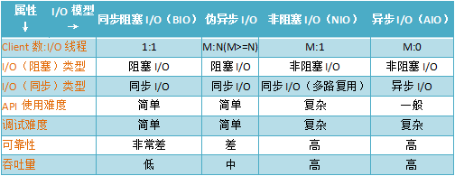

[TOC]


文章参考：https://blog.csdn.net/qq_16669583/article/details/106220189

文章参考：https://www.cnblogs.com/albertrui/p/14577656.html

# 概述

I/O 模型简单理解为：就是使用什么样的通道进行数据的发送和接收，很大程度上决定了程序通信的性能。

Java 支持 3 种网络编程模型：BIO、NIO、AIO


## BIO(Block IO)

BIO （Blocking I/O）：同步阻塞I/O模式，数据的读取写入必须阻塞在一个线程内等待其完成。这里使用那个经典的烧开水例子，这里假设一个烧开水的场景，有一排水壶在烧开水，BIO的工作模式就是， 叫一个线程停留在一个水壶那，直到这个水壶烧开，才去处理下一个水壶。但是实际上线程在等待水壶烧开的时间段什么都没有做。

BIO的服务端通信模型简单来说就是：采用BIO通信模型的服务端，通常由一个独立的Acceptor线程负责监听客户端的连接，它接收到客户端连接请求之后为每个客户端创建一个新的线程进行链路处理没处理完成后，通过输出流返回应答给客户端，线程销毁。即典型的一请求一应答通宵模型。

传统的BIO模型图如下图所示（来源于网络）：


该模型最大的问题就是缺乏弹性伸缩能力，当客户端并发访问量增加后，服务端的线程个数和客户端并发访问数呈1:1的正比关系，Java中的线程也是比较宝贵的系统资源，线程数量快速膨胀后，系统的性能将急剧下降，随着访问量的继续增大，系统最终就死-掉-了

### BIO模型代码

本节中分别介绍BIO模型的服务端和客户端的具体代码。首先介绍服务端。

#### BIO模式服务端


# NIO模型

### NIO模型介绍

NIO （New I/O）：同时支持阻塞与非阻塞模式，但这里我们以其同步非阻塞I/O模式来说明，那么什么叫做同步非阻塞？如果还拿烧开水来说，NIO的做法是叫一个线程不断的轮询每个水壶的状态，看看是否有水壶的状态发生了改变，从而进行下一步的操作。

下面我们对NIO模型中涉及到的一些基本概念进行介绍。

（1）缓冲区 Buffer

Buffer是一个对象，包含一些要写入或者读出的数据。在NIO库中，所有数据都是用缓冲区处理的。在读取数据时，它是直接读到缓冲区中的；在写入数据时，也是写入到缓冲区中。任何时候访问NIO中的数据，都是通过缓冲区进行操作。缓冲区实际上是一个数组，并提供了对数据结构化访问以及维护读写位置等信息。

​	具体的缓存区有这些：ByteBuffe、CharBuffer、 ShortBuffer、IntBuffer、LongBuffer、FloatBuffer、DoubleBuffer。他们实现了相同的接口：Buffer。

（2）通道 Channel

我们对数据的读取和写入要通过Channel，它就像水管一样，是一个通道。通道不同于流的地方就是通道是双向的，可以用于读、写和同时读写操作。底层的操作系统的通道一般都是全双工的，所以全双工的Channel比流能更好的映射底层操作系统的API。

Channel主要分两大类：
		SelectableChannel：用户网络读写
		FileChannel：用于文件操作

后面代码会涉及的ServerSocketChannel和SocketChannel都是SelectableChannel的子类。

（3）多路复用器 Selector

Selector是Java NIO 编程的基础。Selector提供选择已经就绪的任务的能力：Selector会不断轮询注册在其上的Channel，如果某个Channel上面发生读或者写事件，这个Channel就处于就绪状态，会被Selector轮询出来，然后通过SelectionKey可以获取就绪Channel的集合，进行后续的I/O操作。一个Selector可以同时轮询多个Channel，因为JDK使用了epoll()代替传统的select实现，所以没有最大连接句柄1024/2048的限制。所以，只需要一个线程负责Selector的轮询，就可以接入成千上万的客户端。


### NIO模型代码

#### NIO模型服务端

再给出NIO模型服务端代码之前先给出NIO模型服务端的通信序列图（来源于《Netty权威指南》）


NIO模型的服务端的主要步骤如下：

1. 打开ServerSocketChannel，用于监听客户端的连接，它是所有客户端连接的父管道；
2. 绑定监听端口，设置连接为非阻塞模式；
3. 创建Reactor线程，创建多路复用器并启动线程；
4. 将ServerSocketChannel注册到Reactor线程的多路复用器Selector上，监听ACCEPT事件；
5. 多路复用器在线程run方法的无限循环体内轮询准备就绪的Key；
6. 多路复用器监听到有新的客户端接入，处理新的接入请求，完成TCP三次握手，建立物理链路；
7. 设置客户端链路为非阻塞模式；
8. 将新接入的客户端连接注册到Reactor线程的多路复用器上，监听读操作，用于读取客户端发送的网络消息；
9. 异步读取客户端请求消息到缓冲区；
10. 对Buffer编解码，处理半包消息，将解码成功的消息封装成Task；
11. 将应答消息编码为Buffer，调用SocketChannel的write将消息异步发送给客户端。


下面给出2.1节中相同功能的时间服务器的NIO实现，具体实现步骤可能与上述描述的不同。

```
package nio;

/**
 * created by LMR on 2020/5/19
 */
public class TimeServer {

    public static void main(String[] args) {
        int port = 8080;
        if (args != null && args.length > 0){
            try {
                port = Integer.valueOf(args[0]);

            } catch (NumberFormatException e){

            }
        }
        MultiplexerTimeServer timeServer = new MultiplexerTimeServer(port);
        new Thread(timeServer, "NIO-MultiplexerTimeServer-001").start();
    }
}

```


#### NIO模型客户端

同样在这里首先给出NIO模型客户端的通信序列图（来源于《Netty权威指南》）：


客户端代码：


## AIO模型

### AIO模型介绍

AIO （ Asynchronous I/O）：异步非阻塞I/O模型。异步非阻塞与同步非阻塞的区别在哪里？异步非阻塞无需一个线程去轮询所有IO操作的状态改变，在相应的状态改变后，系统会通知对应的线程来处理。对应到烧开水中就是，为每个水壶上面装了一个开关，水烧开之后，水壶会自动通知我水烧开了。

### AIO模型代码

#### AIO模型服务端代码

```
public class TimeServer {
    public static void main(String[] args) {
        int port = 8080;
        if (args != null && args.length > 0){
            try {
                port = Integer.valueOf(args[0]);

            } catch (NumberFormatException e){

            }
        }

        new Thread(new AsyncTimeServerHandler(port), "AIO-MAsyncTimeServerHandler-001").start();
    }
}
```

AIO模型服务端处理类AsyncTimeServerHandler代码如下：

```java
public class AsyncTimeServerHandler implements Runnable {

    private int port;

    CountDownLatch latch;
    AsynchronousServerSocketChannel asynchronousServerSocketChannel;

    public AsyncTimeServerHandler(int port){
        this.port = port;
        try {
            asynchronousServerSocketChannel = AsynchronousServerSocketChannel.open();
            asynchronousServerSocketChannel.bind(new InetSocketAddress(port));
            System.out.println("The time server is start in port : " + port);
        }catch (IOException e){
            e.printStackTrace();
        }
    }
    @Override
    public void run() {
        latch = new CountDownLatch(1);
        doAccept();
        try {
            latch.await();
        }catch (InterruptedException e){
            e.printStackTrace();
        }
    }

    public void doAccept(){
        asynchronousServerSocketChannel.accept(this, new AcceptCompletionHandler());
    }
}
```

在收到客户端发来请求时，服务端进行相应的操作，具体实现类为AcceptCompletionHandler，代码如下：

```
package aio;

import java.nio.ByteBuffer;

import java.nio.channels.AsynchronousSocketChannel;
import java.nio.channels.CompletionHandler;

/**
 * created by LMR on 2020/5/19
 */
public class AcceptCompletionHandler implements CompletionHandler<AsynchronousSocketChannel, AsyncTimeServerHandler> {


    @Override
    public void completed(AsynchronousSocketChannel result, AsyncTimeServerHandler attachment) {

        attachment.asynchronousServerSocketChannel.accept(attachment,this);
        ByteBuffer buffer = ByteBuffer.allocate(1024);
        result.read(buffer, buffer, new ReadCompletionHandler(result));

    }


    @Override
    public void failed(Throwable exc, AsyncTimeServerHandler attachment) {
        exc.printStackTrace();
        attachment.latch.countDown();
    }
}

```

ReadCompletionHandler代码如下：

```java
package aio;

import java.io.IOException;
import java.io.UnsupportedEncodingException;
import java.nio.ByteBuffer;
import java.nio.channels.AsynchronousSocketChannel;
import java.nio.channels.CompletionHandler;

/**
 * created by LMR on 2020/5/19
 */
public class ReadCompletionHandler implements CompletionHandler<Integer, ByteBuffer> {

  private AsynchronousSocketChannel channel;

  ReadCompletionHandler(AsynchronousSocketChannel channel){
      if (this.channel == null)
         this.channel = channel;
  }
    @Override
    public void completed(Integer result, ByteBuffer attachment) {
        attachment.flip();
        byte[] body = new byte[attachment.remaining()];
        attachment.get(body);
        try {
            String req = new String(body, "UTF-8");
            System.out.println("The time server receive order : " + req);
            String curTime = "QUERY TIME ORDER".equalsIgnoreCase(req) ? new java.util.Date(
                    System.currentTimeMillis()
            ).toString() : "BAD ORDER";
            doWrite(curTime);
        }catch (UnsupportedEncodingException e){
            e.printStackTrace();
        }
    }
    private void  doWrite(String currentTime){
      if (currentTime != null && currentTime.trim().length() > 0){
          byte[] bytes = (currentTime).getBytes();
          ByteBuffer writeBuffer = ByteBuffer.allocate(bytes.length);
          writeBuffer.put(bytes);
          writeBuffer.flip();
          channel.write(writeBuffer, writeBuffer, new CompletionHandler<Integer, ByteBuffer>() {
              @Override
              public void completed(Integer result, ByteBuffer attachment) {
                  //如果没有发送，继续发送
                  if (attachment.hasRemaining()){
                      channel.write(writeBuffer, writeBuffer, this);
                  }
              }

              @Override
              public void failed(Throwable exc, ByteBuffer attachment) {
                    try {
                        channel.close();
                    }catch (IOException e){

                    }
              }
          });
      }
    }


    @Override
    public void failed(Throwable exc, ByteBuffer attachment) {
            try {
                this.channel.close();
            }catch (IOException e){

            }
    }
}

```

#### AIO模型客户端代码

```java
package aio;

/**
 * created by LMR on 2020/5/19
 */
public class TimeClient {
    public static void main(String[] args) {
        int port = 8080;
        if (args != null && args.length > 0) {
            try {
                port = Integer.valueOf(args[0]);
            } catch (NumberFormatException e) {

            }
        }
        new Thread(new AsyncTimeClientHandler("127.0.0.1", port), "AIO-AsyncTimeClientHandler-001").start();
    }
}

```

AIO模型客户端处理类AsyncTimeClientHandler代码：

```
package aio;

import java.io.IOException;
import java.io.UnsupportedEncodingException;
import java.net.InetSocketAddress;
import java.nio.ByteBuffer;
import java.nio.channels.AsynchronousSocketChannel;
import java.nio.channels.CompletionHandler;
import java.util.concurrent.CountDownLatch;

/**
 * created by LMR on 2020/5/19
 */
public class AsyncTimeClientHandler implements CompletionHandler<Void, AsyncTimeClientHandler>, Runnable {

    private AsynchronousSocketChannel client;
    private String host;
    private int port;

    private CountDownLatch latch;

    public AsyncTimeClientHandler(String host, int port)
    {
        this.host = host;
        this.port = port;
        try {
            client = AsynchronousSocketChannel.open();
        }catch (IOException e){
            e.printStackTrace();
        }
    }

    @Override
    public void run() {
        //防止异步操作没有执行完成线程就退出
        latch = new CountDownLatch(1);
        client.connect(new InetSocketAddress(host, port), this, this);
        try {
            latch.await();
        }catch (InterruptedException e){
            e.printStackTrace();
        }
        try {
            client.close();
        }catch (IOException e){
            e.printStackTrace();
        }
    }

    @Override
    public void completed(Void result, AsyncTimeClientHandler attachment) {
        byte[] req = "QUERY TIME ORDER".getBytes();
        ByteBuffer writeBuffer = ByteBuffer.allocate(req.length);
        writeBuffer.put(req);
        writeBuffer.flip();
        //异步写
        client.write(writeBuffer, writeBuffer, new CompletionHandler<Integer, ByteBuffer>() {
            @Override
            public void completed(Integer result, ByteBuffer attachment) {
                if (attachment.hasRemaining()){
                    client.write(writeBuffer,writeBuffer,this);
                }else {
                    ByteBuffer readBuffer = ByteBuffer.allocate(1024);
                    //异步读取服务端数据
                    client.read(readBuffer, readBuffer, new CompletionHandler<Integer, ByteBuffer>() {
                        @Override
                        public void completed(Integer result, ByteBuffer buffer) {
                            buffer.flip();
                            byte[] bytes = new byte[buffer.remaining()];
                            buffer.get(bytes);
                            String body;
                            try {
                                body = new String(bytes, "UTF-8");
                                System.out.println("Now is : " + body);
                                latch.countDown();
                            }catch (UnsupportedEncodingException e){
                                e.printStackTrace();
                            }
                        }

                        @Override
                        public void failed(Throwable exc, ByteBuffer attachment) {
                            try {
                                client.close();
                                latch.countDown();
                            }catch (IOException e){

                            }
                        }
                    });
                }
            }

            @Override
            public void failed(Throwable exc, ByteBuffer attachment) {

                try {
                    client.close();
                    latch.countDown();
                }catch (IOException e){

                }
            }
        });

    }


    @Override
    public void failed(Throwable exc, AsyncTimeClientHandler attachment) {
        exc.printStackTrace();
        try {
            client.close();
            latch.countDown();
        }catch (IOException e){
            e.printStackTrace();
        }
    }
}
```


# 几种I/O模型的对比




