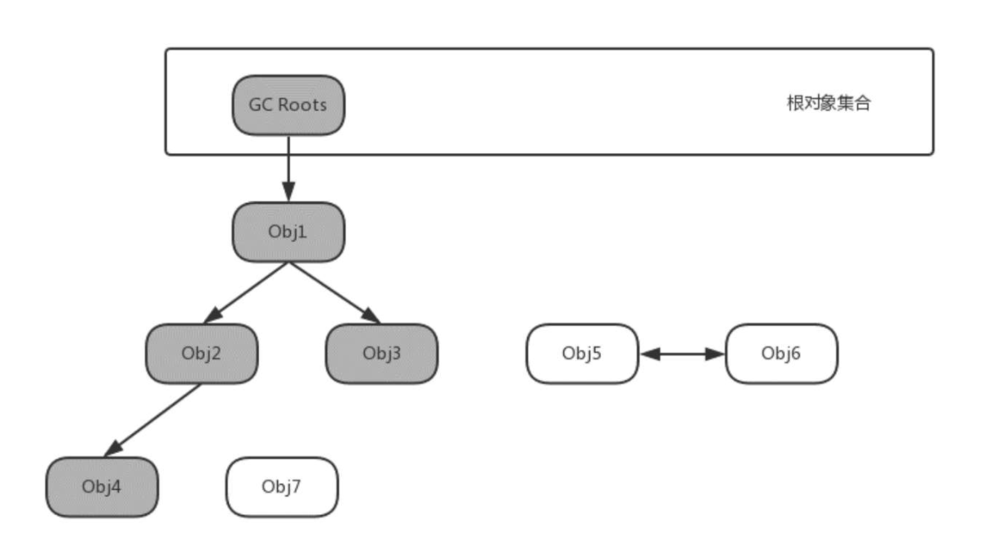
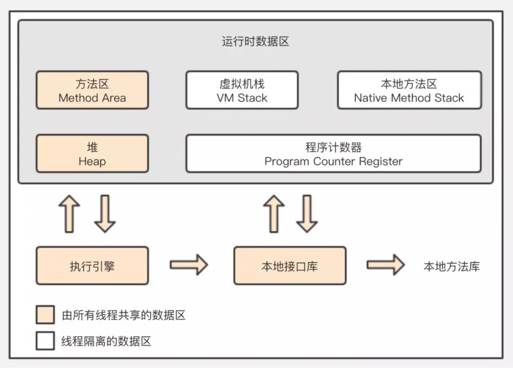
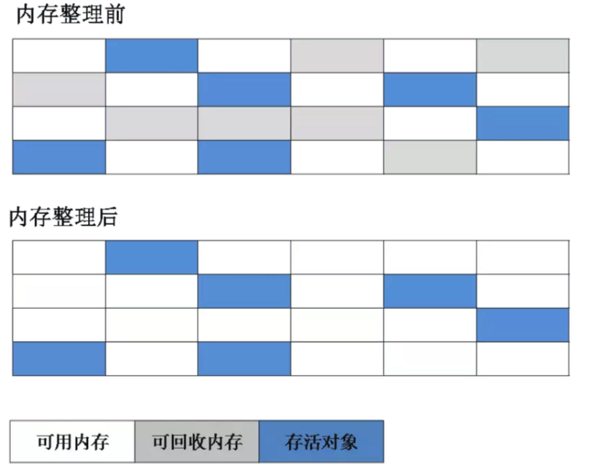
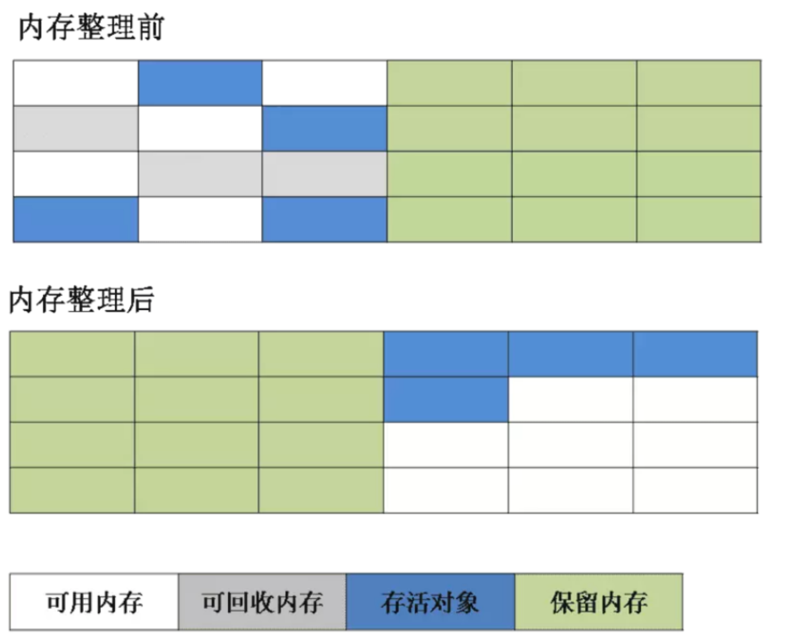
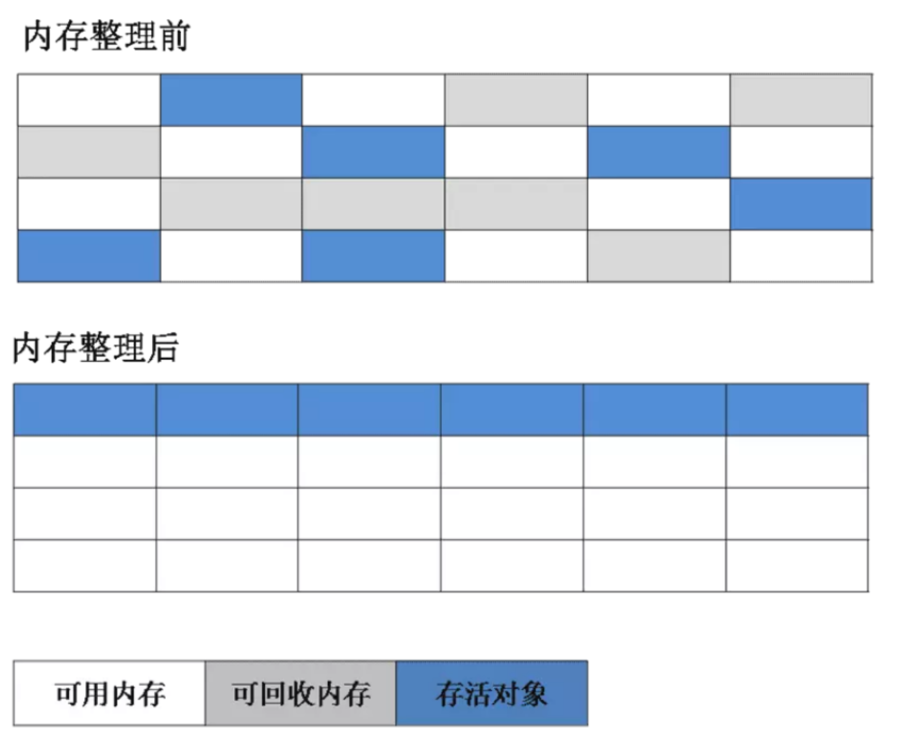
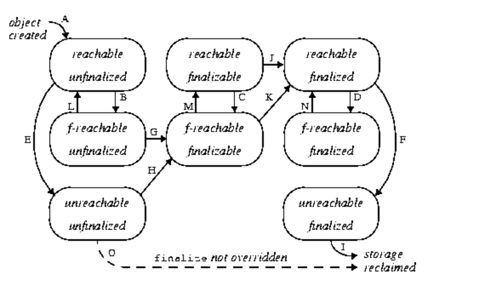

[TOC]


文章参考：https://blog.csdn.net/pi9nc/article/details/12374049

文章参考：https://www.infoq.cn/article/ZOYqRI4c-BFKmUBmzmKN

文章参考：https://blog.51cto.com/14455981/2422827

# 概述

### 1. 垃圾回收的意义

在C++中，对象所占的内存在程序结束运行之前一直被占用，在明确释放之前不能分配给其它对象；而在Java中，当没有对象引用指向原先分配给某个对象的内存时，该内存便成为垃圾。JVM的一个系统级线程会自动释放该内存块。垃圾回收意味着程序不再需要的对象是"无用信息"，这些信息将被丢弃。当一个对象不再被引用的时候，内存回收它占领的空间，以便空间被后来的新对象使用。事实上，除了释放没用的对象，垃圾回收也可以清除内存记录碎片。由于创建对象和垃圾回收器释放丢弃对象所占的内存空间，内存会出现碎片。碎片是分配给对象的内存块之间的空闲内存洞。碎片整理将所占用的堆内存移到堆的一端，JVM将整理出的内存分配给新的对象。

垃圾回收能自动释放内存空间，减轻编程的负担。这使Java虚拟机具有一些优点。

首先，它能使编程效率提高。在没有垃圾回收机制的时候，可能要花许多时间来解决一个难懂的存储器问题。在用Java语言编程的时候，靠垃圾回收机制可大大缩短时间。

其次是它保护程序的完整性， 垃圾回收是Java语言安全性策略的一个重要部份。垃圾回收的一个潜在的缺点是它的开销影响程序性能。Java虚拟机必须追踪运行程序中有用的对象，而且最终释放没用的对象。这一个过程需要花费处理器的时间。其次垃圾回收算法的不完备性，早先采用的某些垃圾回收算法就不能保证100%收集到所有的废弃内存。当然随着垃圾回收算法的不断改进以及软硬件运行效率的不断提升，这些问题都可以迎刃而解。

### 什么是垃圾回收？
垃圾回收（Garbage Collection，GC），顾名思义就是释放垃圾占用的空间，防止内存泄露。有效的使用可以使用的内存，对内存堆中已经死亡的或者长时间没有使用的对象进行清除和回收。


Java 语言出来之前，大家都在拼命的写 C 或者 C++ 的程序，而此时存在一个很大的矛盾，C++ 等语言创建对象要不断的去开辟空间，不用的时候又需要不断的去释放控件，既要写构造函数，又要写析构函数，很多时候都在重复的 allocated，然后不停的析构。于是，有人就提出，能不能写一段程序实现这块功能，每次创建，释放控件的时候复用这段代码，而无需重复的书写呢？


1960年，基于 MIT 的 Lisp 首先提出了垃圾回收的概念，而这时 Java 还没有出世呢！所以实际上 GC 并不是Java的专利，GC 的历史远远大于 Java 的历史！


### 2. 垃圾收集的算法分析

Java语言规范没有明确地说明JVM使用哪种垃圾回收算法，但是任何一种垃圾回收算法一般要做2件基本的事情：
- （1）发现无用信息对象；
- （2）回收被无用对象占用的内存空间，使该空间可被程序再次使用。


### 3、垃圾标记算法

#### 3.1. 引用计数法(Reference Counting Collector)

引用计数法是唯一没有使用根集(GC Root)的垃圾回收的法，该算法使用引用计数器来区分存活对象和不再使用的对象。

一般来说，堆中的每个对象对应一个引用计数器。当每一次创建一个对象并赋给一个变量时，引用计数器置为1。当对象被赋给任意变量时，引用计数器每次加1当对象出了作用域后(该对象丢弃不再使用)，引用计数器减1，一旦引用计数器为0，对象就满足了垃圾收集的条件。

基于引用计数器的垃圾收集器运行较快，不会长时间中断程序执行，适宜地必须实时运行的程序。但引用计数器增加了程序执行的开销，因为每次对象赋给新的变量，计数器加1，而每次现有对象出了作用域，计数器减1。 

但这种方法有一个问题，就是无法解决循环引用的问题。

比方说有两个对象 A 和 B，A 引用了 B，B 又引用了 A，除此之外没有别的对象引用 A 和 B，那么 A 和 B 在我们看来已经是垃圾对象，需要被回收，但它们的引用计数不为 0，没有达到回收的条件。正因为这个循环引用的问题，Java 并没有采用引用计数法。

目前主流的Java虚拟机没有选择引用计数算法来为垃圾标记，主要原因是引用计数算法没有解决对象之间相互循环引用的问题。

下面是这种算法的优缺点：

**优点**：实现简单，判定效率也很高；

**缺点**：难以解决对象之间循环引用导致计数器值不等于0的问题。


#### 3.2. 可达性分析法（也叫根集搜索算法）

大多数垃圾回收算法使用了根集(root set)这个概念；所谓根集就是正在执行的Java程序可以访问的引用变量的集合(包括局部变量、参数、类变量)，程序可以使用引用变量访问对象的属性和调用对象的方法。

这个算法的基本思想就是选定一些对象作为GC Roots，并组成根对象集合，然后以这些GC Roots的对象作为起始点，向下搜索，如果目标对象到GC Roots是连接着的，我们则称该目标对象是可达的，如果目标对象不可达则说明目标对象是可以被回收的对象

可达性分析法首先需要确定从根开始哪些是可达的和哪些是不可达的。如果目标对象到GC Roots是连接着的，我们则称该目标对象是可达的，如果目标对象不可达则说明目标对象是可以被回收的对象

从根集可达的对象都是活动对象，它们不能作为垃圾被回收，这也包括从根集间接可达的对象。而根集通过任意路径不可达的对象符合垃圾收集的条件，应该被回收。



从图中我们可以看出：通过可达性分析法，从GC Roots开发进行对象可达性分析，可以看出obj5、obj6、obj7的对象都是不可达的，尽管Obj6和Obj7之间存在引用关系（这种情况使用引用计数法就会存在问题）

通过可达性算法，成功解决了引用计数所无法解决的问题“循环依赖”，只要你无法与 GC Root 建立直接或间接的连接，系统就会判定你为可回收对象。那这样就引申出了另一个问题，哪些属于 GC Root。

在 Java 语言中，可作为 GC Root 的对象包括以下几种：

- 虚拟机栈（栈帧中的本地变量表）中引用的对象
- 方法区中类静态属性引用的对象
- 方法区中常量引用的对象
- 本地方法栈中 JNI（即一般说的 Native 方法）引用的对象
- 运行中（存活）的线程。
- 由引导类加载器加载的对象。
- GC控制的对象。

这个地方我们看到可以作为GC Root的对象非常多。那我们怎么去记忆呢。其实我们看分类应该就可以看的出来。基本上能作为GC Root的都是线程私有的区域里面所分配的对象引用。




==注意：在根搜索算法中不可达的对象，也并非是“非死不可”的，因为要真正宣告一个对象死亡，至少要经历两次标记过程：第一次是标记没有与GC Roots相连接的引用链；第二次是GC对在F-Queue执行队列中的对象进行的小规模标记(对象需要覆盖finalize()方法且没被调用过)。==

当然，这个我们后续再进行研究。


### 4. 垃圾回收的算法

#### 4.1 tracing算法(Tracing Collector 跟踪收集器)

tracing(跟踪算法)算法是为了解决引用计数法的问题而提出，它使用了根集的概念。基于tracing算法的垃圾收集器从根集开始扫描，识别出哪些对象可达，哪些对象不可达，并用某种方式标记可达对象，例如对每个可达对象设置一个或多个位。

**==标记清除算法==**：在扫描识别过程中，基于tracing算法的垃圾收集也称为标记和清除(mark-and-sweep)垃圾收集器. 

标记清除算法： 顾名思义分为两步：

- 标记阶段：标记出可以回收的对象。
- 清除阶段：回收被标记的对象所占用的空间。

下面这张图是从网上抠的。大家可以看一下。




下面是标记清除算法的缺点：

- 1、空间问题：清除垃圾对象后会造成内存的碎片化，导致会产生大量的不连续的内存碎片。
- 2、效率问题：标记和清除两个过程的效率都不高。


#### 4.2 copying算法(Coping Collector 复制算法)

该算法的提出是为了克服句柄的开销和解决堆碎片的垃圾回收。它开始时把堆分成一个对象区和多个空闲区，程序从对象区为对象分配空间，当对象满了，基于coping算法的垃圾回收就从根集中扫描活动对象，并将每个活动对象复制到空闲区(使得活动对象所占的内存之间没有空闲间隔)，这样空闲区变成了对象区，原来的对象区变成了空闲区，程序会在新的对象区中分配内存。

一种典型的基于coping算法(复制算法)的垃圾回收是stop-and-copy算法，它将堆内存按容量划分为大小相等的两块：对象区和空闲区域区，每次只使用其中的一块，当这一块内存将用完了，就将还存活着的对象复制到另一块内存上面，然后再把已使用过的内存空间一次清理掉。在对象区与空闲区域的切换过程中，程序暂停执行。 



复制算法的优点

- 1、可以有效避免内存的碎片化问题，实现简单，运行高效；每次都是对整个半区进行内存回收，内存分配时也不需要考虑内存碎片等情况，只要移动堆顶指针，按顺序分配内存即可；
- 2、效率相对于标记清除算法要高一些。

复制算法缺点：
- 1、因为需要将提前预留出空闲区。他需要两倍的内存，造成内存浪费。
- 2、stop-and-copy算法就是复制算法收集器要复制所有的活动对象，增加了程序等待时间，算法效率很低。

复制算法的效率与存活对象的数目多少有很大的关系，如果存活对象很少，复制算法的效率就会很高。由于绝大多数对象的生命周期很短，并且这些生命周期很短的对象都存于新生代中，所以复制算法被广泛应用于新生代中，关于新生代中复制算法的应用，会在后面的分代收集算法中详细介绍。


#### 4.3 compacting算法(Compacting Collector 压缩算法，较常用是基于压缩算法的整理标记算法)

为了解决堆碎片问题，==基于压缩算法的标记整理算法==。

主要是分为两步：先标记后整理。首先标记可以回收的垃圾对象。然后进行压缩。基于tracing的垃圾回收吸收了Compacting算法的思想，在清除的过程中，算法将所有的对象移到堆的一端，堆的另一端就变成了一个相邻的空闲内存区，收集器会对它移动的所有对象的所有引用进行更新，使得这些引用在新的位置能识别原来的对象。

在基于Compacting算法的收集器的实现中，一般增加句柄和句柄表。



基于compacting算法的标记整理算法的优点：
- 1、避免了内存碎片；
- 2、避免了“复制”算法50%的空间浪费；
- 3、主要针对对象存活率高的老年代。

#### 4.4 generation算法(Generational Collector 分代算法)


stop-and-copy垃圾收集器的一个缺陷是收集器必须复制所有的活动对象，这增加了程序等待时间，这是coping算法低效的原因。在程序设计中有这样的规律：多数对象存在的时间比较短，少数的存在时间比较长。

现在主流的Java虚拟机的垃圾收集器都采用分代收集算法（Generational Collection）。Java 堆区基于分代的概念，分为新生代（Young Generation）和老年代（TenuredGeneration），其中新生代再细分为Eden空间、From Survivor空间和ToSurvivor空间。因为Eden空间中的大多数对象生命周期很短，所以新生代的空间划分并不是均分的，HotSpot虚拟机默认Eden空间和两个Survivor空间的所占的比例为8：1：1。

##### 新生代（Young Generation）的回收算法（以复制算法为主）

所有新生成的对象首先都是放在新生代的。新生代的目标就是尽可能快速的收集掉那些生命周期短的对象。

新生代内存按照8:1:1的比例分为一个Eden空间区和两个Survivork空间(From Survivor,ToSurvivor)区。大部分对象在Eden区中生成。

回收时先将Eden区存活对象复制(采用复制算法)到一个From Survivor区，然后清空eden区，当这个From Survivor区也存放满了时，则将eden区和From Survivor区存活对象复制到另一个ToSurvivor区，然后清空eden和这个From Survivor区，此时From Survivor区是空的，然后将From Survivor区和ToSurvivor区交换，即保持ToSurvivor区为空， 如此往复。这个地方理解了没有。其实就是一次角色的互换，始终保持ToSurvivor是一个空白区域。

新生代发生的GC也叫做Minor GC，MinorGC发生频率比较高(不一定等Eden区满了才触发)。


当ToSurvivor区不足以存放 eden和From Survivor的存活对象时，就将存活对象直接存放到老年代。若是老年代也满了就会触发一次Full GC(Major GC)，也就是新生代、老年代都进行回收。

至于什么是Minor GC、Full GC我们单独讲解。

##### 老年代（Tenured Generation）的回收算法（以标记-清除、标记-整理为主）

在年轻代中经历了N次垃圾回收后仍然存活的对象，就会被放到老年代中。因此，可以认为老年代中存放的都是一些生命周期较长的对象。

内存比新生代也大很多(大概比例是1:2，也就是说)，当老年代内存满时触发Major GC即Full GC，Full

GC发生频率比较低，老年代对象存活时间比较长，存活率标记高。

老生代在发生Full GC的时候，一般采用的标记整理的压缩算法。这种算法可以避免碎片化或者空间浪费。但是好在Full GC的频率较低，所以非常适合使用。

##### 永久代（方法区.Permanet Generation）的回收算法

方法区主要用于存放类信息、常量、静态变量，如Java类、方法等。永久代对垃圾回收没有显著影响，但是有些应用可能动态生成或者调用一些class，例如Hibernate 等，在这种时候需要设置一个比较大的永久代空间来存放这些运行过程中新增的类。永久代也称方法区。

方法区主要回收的内容有：废弃常量和无用的类。对于废弃常量也可通过根搜索算法来判断，但是对于无用的类则需要同时满足下面3个条件：
- 该类所有的实例都已经被回收，也就是Java堆中不存在该类的任何实例；
- 加载该类的ClassLoader已经被回收；
- 该类对应的java.lang.Class对象没有在任何地方被引用，无法在任何地方通过反射访问该类的方法。

讲解了这么多，我们来看一下下面的整个图：


#### 4.5 adaptive算法(Adaptive Collector 自适应算法)
　　在特定的情况下，一些垃圾收集算法会优于其它算法。基于Adaptive算法的垃圾收集器就是监控当前堆的使用情况，并将选择适当算法的垃圾收集器。


### 5. System.gc()方法
命令行参数透视垃圾收集器的运行
使用System.gc()可以不管JVM使用的是哪一种垃圾回收的算法，都可以请求Java的垃圾回收。在命令行中有一个参数-verbosegc可以查看Java使用的堆内存的情况，它的格式如下：
　
```
java -verbosegc classfile
```
可以看个例子：
```
class TestGC  
{  
    public static void main(String[] args)  
    {  
　　    new TestGC();  
　　    System.gc();  
　　    System.runFinalization();  
　　 }  
}
```

在这个例子中，一个新的对象被创建，由于它没有使用，所以该对象迅速地变为不可达，程序编译后，执行命令：
java -verbosegc TestGC 后结果为：
　
```
[Full GC 168K->97K(1984K)， 0.0253873 secs]
```

需要注意的是，调用System.gc()也仅仅是一个请求(建议)。JVM接受这个消息后，并不是立即做垃圾回收，而只是对几个垃圾回收算法做了加权，使垃圾回收操作容易发生，或提早发生，或回收较多而已。

### 6. finalize()方法

在JVM垃圾回收器收集一个对象之前，一般要求程序调用适当的方法释放资源，但在没有明确释放资源的情况下，Java提供了缺省机制来终止该对象心释放资源，这个方法就是finalize（）。finalize()是Object的protected方法，子类可以覆盖该方法以实现资源清理工作，GC在回收对象之前调用该方法。
它的原型为：

```
protected void finalize() throws Throwable
```

在finalize()方法返回之后，对象消失，垃圾收集开始执行。原型中的throws Throwable表示它可以抛出任何类型的异常。之所以要使用finalize()，是存在着垃圾回收器不能处理的特殊情况。

finalize()与C\++中的析构函数不是对应的。C++中的析构函数调用的时机是确定的（对象离开作用域或delete掉），但Java中的finalize的调用具有不确定性

另外，假定你的对象（并非使用new方法）获得了一块“特殊”的内存区域，由于垃圾回收器只知道那些显示地经由new分配的内存空间，所以它不知道该如何释放这块“特殊”的内存区域，那么这个时候java允许在类中定义一个由finalize()方法。

特殊的区域例如：

##### 1）由于在分配内存的时候可能采用了类似 C语言的做法，而非JAVA的通常new做法。
这种情况主要发生在native method中，比如native method调用了C/C++方法malloc()函数系列来分配存储空间，但是除非调用free()函数，否则这些内存空间将不会得到释放，那么这个时候就可能造成内存泄漏。但是由于free()方法是在C/C++中的函数，所以finalize()中可以用本地方法来调用它。以释放这些“特殊”的内存空间。

##### 2）又或者打开的文件资源，这些资源不属于垃圾回收器的回收范围。

换言之，finalize()的主要用途是释放一些其他做法开辟的内存空间，以及做一些清理工作。因为在JAVA中并没有提够像“析构”函数或者类似概念的函数，要做一些类似清理工作的时候，必须自己动手创建一个执行清理工作的普通方法，也就是override Object这个类中的finalize()方法。例如，假设某一个对象在创建过程中会将自己绘制到屏幕上，如果不是明确地从屏幕上将其擦出，它可能永远都不会被清理。如果在finalize()加入某一种擦除功能，当GC工作时，finalize()得到了调用，图像就会被擦除。要是GC没有发生，那么这个图像就会
被一直保存下来。

所以，我们建议finalize()用于：① 清理本地对象(通过JNI创建的对象)；② 作为确保某些非内存资源(如Socket、文件等)释放的一个补充：在finalize方法中显式调用其他资源释放方法。

#### 6.1、finalize的执行过程(生命周期)

1、首先，大致描述一下finalize流程：当对象变成(GC Roots)不可达时，GC会判断该对象是否覆盖了finalize方法，若未覆盖，则直接将其回收。否则，若对象未执行过finalize方法，将其放入F-Queue队列，由一低优先级线程执行该队列中对象的finalize方法。执行finalize方法完毕后，GC会再次判断该对象是否可达，若不可达，则进行回收，否则，对象“复活”。

2、具体的finalize流程：

对象存在两种状态，涉及到两类状态空间，一是终结状态空间 F = {unfinalized, finalizable, finalized}；二是可达状态空间 R = {reachable, finalizer-reachable, unreachable}。各状态含义如下：

- unfinalized: 新建对象会先进入此状态，GC并未准备执行其finalize方法，因为该对象是可达的
- finalizable: 表示GC可对该对象执行finalize方法，GC已检测到该对象不可达。正如前面所述，GC通过F-Queue队列和一专用线程完成finalize的执行
- finalized: 表示GC已经对该对象执行过finalize方法
- reachable: 表示GC Roots引用可达
- finalizer-reachable(f-reachable)：表示不是reachable，但可通过某个finalizable对象可达
- unreachable：对象不可通过上面两种途径可达

具体的状态切换看下面的图：



变迁说明：
1、新建对象首先处于[reachable, unfinalized]状态(A)

2、随着程序的运行，一些引用关系会消失，导致状态变迁，从reachable状态变迁到f-reachable(B, C, D)或unreachable(E, F)状态

3、若JVM检测到处于unfinalized状态的对象变成f-reachable或unreachable，JVM会将其标记为finalizable状态(G,H)。若对象原处于[unreachable, unfinalized]状态，则同时将其标记为f-reachable(H)。

4、在某个时刻，JVM取出某个finalizable对象，将其标记为finalized并在某个线程中执行其finalize方法。由于是在活动线程中引用了该对象，该对象将变迁到(reachable, finalized)状态(K或J)。该动作将影响某些其他对象从f-reachable状态重新回到reachable状态(L, M, N)

5、处于finalizable状态的对象不能同时是unreahable的，由第4点可知，将对象finalizable对象标记为finalized时会由某个线程执行该对象的finalize方法，致使其变成reachable。这也是图中只有八个状态点的原因

6、程序员手动调用finalize方法并不会影响到上述内部标记的变化，因此JVM只会至多调用finalize一次，即使该对象“复活”也是如此。程序员手动调用多少次不影响JVM的行为

7、若JVM检测到finalized状态的对象变成unreachable，回收其内存(I)

8、若对象并未覆盖finalize方法，JVM会进行优化，直接回收对象（O）