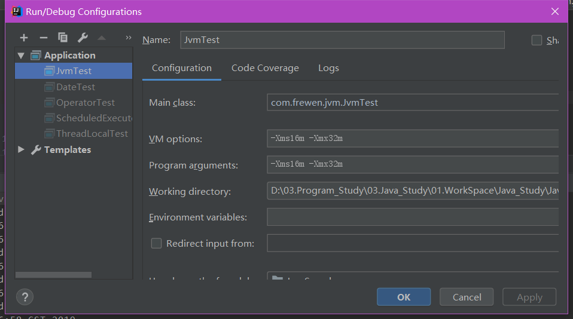

[TOC]


文章参考：https://mp.weixin.qq.com/s?__biz=MzUzMTA2NTU2Ng==&mid=2247487176&idx=1&sn=5555114ea990e77e08eac3ac0bdf39c9&chksm=fa497179cd3ef86f4b75ce7b82c3e7d25bd4dffce458f1df0e9437c0cbec2ae8268aacf81b06&mpshare=1&scene=1&srcid=#rd

# 概述

最近网上出现一个美团面试题：“一个线程OOM后，其他线程还能运行吗？”。我看网上出现了很多不靠谱的答案。这道题其实很有难度，涉及的知识点有jvm内存分配、作用域、gc等，不是简单的是与否的问题。

由于题目中给出的OOM，java中OOM又分很多类型；比如：

1、堆溢出（“java.lang.OutOfMemoryError: Java heap space”）、

2、永久带溢出（“java.lang.OutOfMemoryError:Permgen space”）、

3、不能创建线程（“java.lang.OutOfMemoryError:Unable to create new native thread”）等很多种情况。

本文主要是分析堆溢出对应用带来的影响。

先说一下答案，答案是还能运行。

​      

```java
public class JvmThread {

    public static void main(String[] args) {
        new Thread(() -> {
            List<byte[]> list = new ArrayList<byte[]>();
            while (true) {
                System.out.println(new Date().toString() + Thread.currentThread() + "==");
                byte[] b = new byte[1024 * 1024 * 1];
                list.add(b);
                try {
                    Thread.sleep(1000);
                } catch (Exception e) {
                    e.printStackTrace();
                }
            }
        }).start();

        // 线程二
        new Thread(() -> {
            while (true) {
                System.out.println(new Date().toString() + Thread.currentThread() + "==");
                try {
                    Thread.sleep(1000);
                } catch (Exception e) {
                    e.printStackTrace();
                }
            }
        }).start();
    }
}
```

结果展示：

```
Thread[Thread-1,5,main]==Wed Jun 26 10:50:01 CST 2019
Wed Jun 26 10:50:01 CST 2019Thread[Thread-0,5,main]==
Thread[Thread-1,5,main]==Wed Jun 26 10:50:02 CST 2019
Wed Jun 26 10:50:02 CST 2019Thread[Thread-0,5,main]==
Thread[Thread-1,5,main]==Wed Jun 26 10:50:03 CST 2019
Wed Jun 26 10:50:03 CST 2019Thread[Thread-0,5,main]==
Exception in thread "Thread-0" java.lang.OutOfMemoryError: Java heap space
	at com.frewen.jvm.JvmTest.lambda$testJvmHeapSpaceOOM$0(JvmTest.java:21)
	at com.frewen.jvm.JvmTest$$Lambda$1/1324119927.run(Unknown Source)
	at java.lang.Thread.run(Thread.java:748)
Thread[Thread-1,5,main]==Wed Jun 26 10:50:04 CST 2019
Thread[Thread-1,5,main]==Wed Jun 26 10:50:05 CST 2019
Thread[Thread-1,5,main]==Wed Jun 26 10:50:06 CST 2019
Thread[Thread-1,5,main]==Wed Jun 26 10:50:07 CST 2019
```


JVM启动参数设置：

```
com.frewen.jvm.JvmTest
-Xms16m -Xmx32m
-Xms16m -Xmx32m
```





上图是JVM堆空间的变化。我们仔细观察一下在14:42:05~14:42:25之间曲线变化，你会发现使用堆的数量，突然间急剧下滑！这代表这一点，当一个线程抛出OOM异常后，它所占据的内存资源会全部被释放掉，从而不会影响其他线程的运行！

讲到这里大家应该懂了，此题的答案为一个线程溢出后，进程里的其他线程还能照常运行。注意了，这个例子我只演示了堆溢出的情况。如果是栈溢出，结论也是一样的，大家可自行通过代码测试。

总结：其实发生OOM的线程一般情况下会死亡，也就是会被终结掉，该线程持有的对象占用的heap都会被gc了，释放内存。因为发生OOM之前要进行gc，就算其他线程能够正常工作，也会因为频繁gc产生较大的影响。