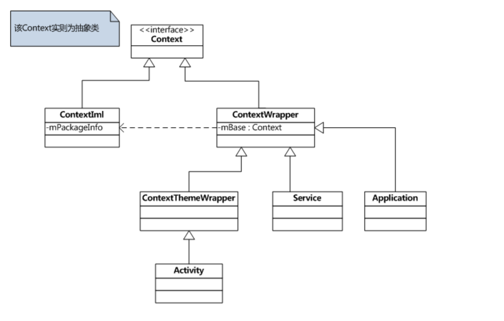

文章参考：http://gityuan.com/2017/04/09/android_context/


# 概述

 Context也就是上下文对象。相信所有的Android开发人员基本上每天都在接触，但是我们可能却并不能很好的理解

####   Context类型

在开发中我们经常使用Context，它的使用场景总的来说分为两大类：

-  使用Context调用方法，比如启动Activity、访问资源、调用系统级服务等。

-  调用方法时传入Context，比如弹出Toast、创建Dialog等

   

​		Activity、Service和Application都间接地继承自Context。下面我们来看一下Context的继承结构：



从图中我们可以清楚的看到。Context使用的是装饰者模式也称为包装模式（Wrapper Pattern），属于结构型设计模式。

Context的继承结构还是稍微有点复杂的，可以看到，直系子类有两个，一个是ContextWrapper，一个是ContextImpl。那么从名字上就可以看出：

Context 类本身是一个纯 abstract 类，他有两个具体的实现子类：ContextImpl 和ContextWrapper。

其中 ContextWrapper 类，只是一个包装而已，ContextWrapper构造函数中必须包含一个真正的 Context 引用，同时 ContextWrapper 提供了attachBaseContext（）用于给 ContextWrapper 对象中指定真正的 Context 对象，调用 ContextWrapper 的方法都会被转向其所包含的真正的 Context 对象。


ContextThemeWrapper 类，其内部包含了与主题（Theme）相关的接口，这里所说的主题就是指在 AndroidMainifest.xml 中通过 android：theme 为 Application 元素或者 Activity 元素指定的主题。当然，只有 Activity 才需要主题，Service 是不需要主题的，Application 同理。


我们需要知道的是：ContextThemeWrapper、Service和Application都继承自ContextWrapper，这样它们都可以通过mBase来使用Context的方法，同时它们也是装饰类，在ContextWrapper的基础上又添加了不同的功能。

而 ContextImpl 类则真正实现了 Context 中的所有函数，应用程序中所调用的各种Context 类的方法，其实现均来于该类。

Context 的两个子类分工明确，其中ContextImpl 是 Context 的具体实现类，ContextWrapper 是 Context 的包装类。

所以。这个Context的结构就很清晰明了了。

Context一共有三种类型，分别是Application、Activity和Service。Service、Application、Activity都是Context的对象实例。三个类虽然分别各种承担着不同的作用，但它们都属于Context的一种，而它们具体Context的功能则是由ContextImpl类去实现的。

  它主要有哪些功能呢？
1. 启动Activity (startActivity)
1. 启动服务 (startService)
1. 发送广播 (sendBroadcast), 注册广播接收者 (registerReceiver)
1. 获取ContentResolver (getContentResolver)
1. 获取类加载器 (getClassLoader)
1. 打开或创建数据库 (openOrCreateDatabase)
1. 获取资源 (getResources)
等等

由于Context的具体能力是由ContextImpl类去实现的，因此在绝大多数场景下，Activity、Service和Application这三种类型的Context都是可以通用的。不过有几种场景比较特殊，比如启动Activity，还有弹出Dialog。出于安全原因的考虑，Android是不允许Activity或Dialog凭空出现的，一个Activity的启动必须要建立在另一个Activity的基础之上，也就是以此形成的返回栈。而Dialog则必须在一个Activity上面弹出（除非是System Alert类型的Dialog），因此在这种场景下，我们只能使用Activity类型的Context，否则将会出错。

 Context数量

那么一个应用程序中到底有多少个Context呢？其实根据上面的Context类型我们就已经可以得出答案了。Context一共有Application、Activity和Service三种类型，因此一个应用程序中Context数量的计算公式就可以这样写：
        
```
Context数量 = Activity数量 + Service数量 + 1
```

上面的1代表着Application的数量，因为一个应用程序中可以有多个Activity和多个Service，但是只能有一个Application。

#### Context的设计

为了更好的理解Context的关联类的设计理念，就需要理解Application、Activity、Service的Context的创建过程，下面分别对它们进行介绍。

#### performLaunchActivity

```java
// 代码位于：/android/app/ActivityThread.java  基于Android-29

   /**
     * Activity启动的核心流程
     * 创建对象LoadedApk;
     * 创建对象Activity;
     * 创建对象Application;
     * 创建对象ContextImpl;
     * Application/ContextImpl都attach到Activity对象;
     * 执行onCreate()等回调;
     */
    /**  Core implementation of activity launch. */
    private Activity performLaunchActivity(ActivityClientRecord r, Intent customIntent) {
        ActivityInfo aInfo = r.activityInfo;
        if (r.packageInfo == null) {
            //1: 创建LoadedApk对象
            r.packageInfo = getPackageInfo(aInfo.applicationInfo, r.compatInfo,
                    Context.CONTEXT_INCLUDE_CODE);
        }
        //2:component初始化过程
        ComponentName component = r.intent.getComponent();
        if (component == null) {
            component = r.intent.resolveActivity(
                mInitialApplication.getPackageManager());
            r.intent.setComponent(component);
        }

        if (r.activityInfo.targetActivity != null) {
            component = new ComponentName(r.activityInfo.packageName,
                    r.activityInfo.targetActivity);
        }
        //3: 创建ContextImpl对象。这个地方就是Activity的上下文对象的创建
        ContextImpl appContext = createBaseContextForActivity(r);
        Activity activity = null;
        try {
            java.lang.ClassLoader cl = appContext.getClassLoader();
            //4: 创建Activity对象、通过仪表盘类来进行实例化
            activity = mInstrumentation.newActivity(
                    cl, component.getClassName(), r.intent);
            StrictMode.incrementExpectedActivityCount(activity.getClass());
            r.intent.setExtrasClassLoader(cl);
            r.intent.prepareToEnterProcess();
            if (r.state != null) {
                r.state.setClassLoader(cl);
            }
        } catch (Exception e) {
            if (!mInstrumentation.onException(activity, e)) {
                throw new RuntimeException(
                    "Unable to instantiate activity " + component
                    + ": " + e.toString(), e);
            }
        }

        try {
            //5: 创建Application对象
            Application app = r.packageInfo.makeApplication(false, mInstrumentation);

            if (localLOGV) Slog.v(TAG, "Performing launch of " + r);
            if (localLOGV) Slog.v(
                    TAG, r + ": app=" + app
                    + ", appName=" + app.getPackageName()
                    + ", pkg=" + r.packageInfo.getPackageName()
                    + ", comp=" + r.intent.getComponent().toShortString()
                    + ", dir=" + r.packageInfo.getAppDir());

            if (activity != null) {
                CharSequence title = r.activityInfo.loadLabel(appContext.getPackageManager());
                Configuration config = new Configuration(mCompatConfiguration);
                if (r.overrideConfig != null) {
                    config.updateFrom(r.overrideConfig);
                }
                if (DEBUG_CONFIGURATION) Slog.v(TAG, "Launching activity "
                        + r.activityInfo.name + " with config " + config);
                Window window = null;
                if (r.mPendingRemoveWindow != null && r.mPreserveWindow) {
                    window = r.mPendingRemoveWindow;
                    r.mPendingRemoveWindow = null;
                    r.mPendingRemoveWindowManager = null;
                }
                appContext.setOuterContext(activity);
                //6: 将Application/ContextImpl都attach到Activity对象
                activity.attach(appContext, this, getInstrumentation(), r.token,
                        r.ident, app, r.intent, r.activityInfo, title, r.parent,
                        r.embeddedID, r.lastNonConfigurationInstances, config,
                        r.referrer, r.voiceInteractor, window, r.configCallback,
                        r.assistToken);

                if (customIntent != null) {
                    activity.mIntent = customIntent;
                }
                r.lastNonConfigurationInstances = null;
                checkAndBlockForNetworkAccess();
                activity.mStartedActivity = false;
                int theme = r.activityInfo.getThemeResource();
                if (theme != 0) {
                    activity.setTheme(theme);
                }

                activity.mCalled = false;
                if (r.isPersistable()) {
                    //6: 执行回调onCreate
                    mInstrumentation.callActivityOnCreate(activity, r.state, r.persistentState);
                } else {
                    mInstrumentation.callActivityOnCreate(activity, r.state);
                }
                if (!activity.mCalled) {
                    throw new SuperNotCalledException(
                        "Activity " + r.intent.getComponent().toShortString() +
                        " did not call through to super.onCreate()");
                }
                r.activity = activity;
            }
            r.setState(ON_CREATE);

            // updatePendingActivityConfiguration() reads from mActivities to update
            // ActivityClientRecord which runs in a different thread. Protect modifications to
            // mActivities to avoid race.
            synchronized (mResourcesManager) {
                mActivities.put(r.token, r);
            }

        } catch (SuperNotCalledException e) {
            throw e;

        } catch (Exception e) {
            if (!mInstrumentation.onException(activity, e)) {
                throw new RuntimeException(
                    "Unable to start activity " + component
                    + ": " + e.toString(), e);
            }
        }

        return activity;
    }
```
startActivity的过程最终会在目标进程执行performLaunchActivity()方法, 该方法主要功能:

1. 创建对象LoadedApk;
1. 创建对象Activity;
1. 创建对象Application;
1. 创建对象ContextImpl;
1. Application/ContextImpl都attach到Activity对象;
1. 执行onCreate()等回调;

以上就是在启动Activity的时候，Context的创建过程。

下面，我们来看一下Service在启动的时候，Context的创建过程

```java
     @UnsupportedAppUsage
    private void handleCreateService(CreateServiceData data) {
        // If we are getting ready to gc after going to the background, well
        // we are back active so skip it.
        unscheduleGcIdler();
        //1: 创建LoadedApk
        LoadedApk packageInfo = getPackageInfoNoCheck(
                data.info.applicationInfo, data.compatInfo);
        Service service = null;
        try {
            java.lang.ClassLoader cl = packageInfo.getClassLoader();
            //step 2: 通过反射来创建Service对象
            service = packageInfo.getAppFactory()
                    .instantiateService(cl, data.info.name, data.intent);
        } catch (Exception e) {
            if (!mInstrumentation.onException(service, e)) {
                throw new RuntimeException(
                    "Unable to instantiate service " + data.info.name
                    + ": " + e.toString(), e);
            }
        }

        try {
            if (localLOGV) Slog.v(TAG, "Creating service " + data.info.name);
            //3: 创建ContextImpl对象
            ContextImpl context = ContextImpl.createAppContext(this, packageInfo);
            context.setOuterContext(service);
            //4: 创建Application对象
            Application app = packageInfo.makeApplication(false, mInstrumentation);
            //5: 将Application/ContextImpl都attach到Activity对象
            service.attach(context, this, data.info.name, data.token, app,
                    ActivityManager.getService());
            //6: 执行onCreate回调
            service.onCreate();
            mServices.put(data.token, service);
            try {
                ActivityManager.getService().serviceDoneExecuting(
                        data.token, SERVICE_DONE_EXECUTING_ANON, 0, 0);
            } catch (RemoteException e) {
                throw e.rethrowFromSystemServer();
            }
        } catch (Exception e) {
            if (!mInstrumentation.onException(service, e)) {
                throw new RuntimeException(
                    "Unable to create service " + data.info.name
                    + ": " + e.toString(), e);
            }
        }
    }
```
整个过程:

1. 创建对象LoadedApk;
1. 创建对象Service;
1. 创建对象ContextImpl;
1. 创建对象Application;
1. Application/ContextImpl分别attach到Service对象;
1. 执行onCreate()回调;


我们来看一下handleReceiver。看BroadcastReceiver的创建过程中，Context是怎么绑定上去的。


```java
    private void handleReceiver(ReceiverData data) {
        // If we are getting ready to gc after going to the background, well
        // we are back active so skip it.
        unscheduleGcIdler();

        String component = data.intent.getComponent().getClassName();

        LoadedApk packageInfo = getPackageInfoNoCheck(
                data.info.applicationInfo, data.compatInfo);

        IActivityManager mgr = ActivityManager.getService();

        Application app;
        BroadcastReceiver receiver;
        ContextImpl context;
        try {
            //step 3: 创建Application对象
            app = packageInfo.makeApplication(false, mInstrumentation);

            //step 4: 创建ContextImpl对象
            context = (ContextImpl) app.getBaseContext();
            if (data.info.splitName != null) {
                context = (ContextImpl) context.createContextForSplit(data.info.splitName);
            }
            java.lang.ClassLoader cl = context.getClassLoader();
            data.intent.setExtrasClassLoader(cl);
            data.intent.prepareToEnterProcess();
            data.setExtrasClassLoader(cl);
            //step 2: 创建BroadcastReceiver对象
            receiver = packageInfo.getAppFactory()
                    .instantiateReceiver(cl, data.info.name, data.intent);
        } catch (Exception e) {
            if (DEBUG_BROADCAST) Slog.i(TAG,
                    "Finishing failed broadcast to " + data.intent.getComponent());
            data.sendFinished(mgr);
            throw new RuntimeException(
                "Unable to instantiate receiver " + component
                + ": " + e.toString(), e);
        }

        try {
            if (localLOGV) Slog.v(
                TAG, "Performing receive of " + data.intent
                + ": app=" + app
                + ", appName=" + app.getPackageName()
                + ", pkg=" + packageInfo.getPackageName()
                + ", comp=" + data.intent.getComponent().toShortString()
                + ", dir=" + packageInfo.getAppDir());

            sCurrentBroadcastIntent.set(data.intent);
            receiver.setPendingResult(data);
            //step 5: 执行onReceive回调
            receiver.onReceive(context.getReceiverRestrictedContext(),
                    data.intent);
        } catch (Exception e) {
            if (DEBUG_BROADCAST) Slog.i(TAG,
                    "Finishing failed broadcast to " + data.intent.getComponent());
            data.sendFinished(mgr);
            if (!mInstrumentation.onException(receiver, e)) {
                throw new RuntimeException(
                    "Unable to start receiver " + component
                    + ": " + e.toString(), e);
            }
        } finally {
            sCurrentBroadcastIntent.set(null);
        }

        if (receiver.getPendingResult() != null) {
            data.finish();
        }
    }
```
说明:

1. 以上过程是静态广播接收者, 即通过AndroidManifest.xml的标签来申明的BroadcastReceiver;
1. 如果是动态广播接收者,则不需要再创建那么多对象, 因为动态广播的注册时进程已创建, 基本对象已创建完成. 那么只需要回调BroadcastReceiver的onReceive()方法即可.

##### installProvider

该方法主要功能:

1. 创建对象LoadedApk;
1. 创建对象ContextImpl;
1. 创建对象ContentProvider;
1. ContextImpl都attach到ContentProvider对象;
1. 执行onCreate回调;


```java
private IActivityManager.ContentProviderHolder installProvider(Context context, IActivityManager.ContentProviderHolder holder, ProviderInfo info, boolean noisy, boolean noReleaseNeeded, boolean stable) {
    ContentProvider localProvider = null;
    IContentProvider provider;
    if (holder == null || holder.provider == null) {
        Context c = null;
        ApplicationInfo ai = info.applicationInfo;
        if (context.getPackageName().equals(ai.packageName)) {
            c = context;
        } else if (mInitialApplication != null &&
                mInitialApplication.getPackageName().equals(ai.packageName)) {
            c = mInitialApplication;
        } else {
            //step 1 && 2: 创建LoadedApk和ContextImpl对象
            c = context.createPackageContext(ai.packageName,Context.CONTEXT_INCLUDE_CODE);
        }

        final java.lang.ClassLoader cl = c.getClassLoader();
        //step 3: 创建ContentProvider对象
        localProvider = (ContentProvider)cl.loadClass(info.name).newInstance();
        provider = localProvider.getIContentProvider();

        //step 4: ContextImpl都attach到ContentProvider对象 [见小节4.4]
        //step 5: 并执行回调onCreate
        localProvider.attachInfo(c, info);
    } else {
        ...
    }
    ...
    return retHolder;
}
```

