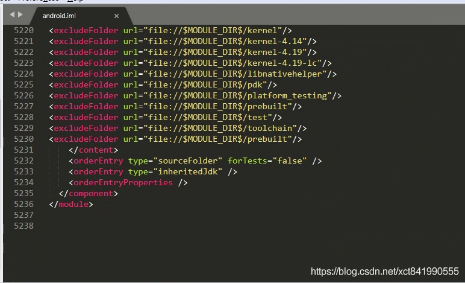
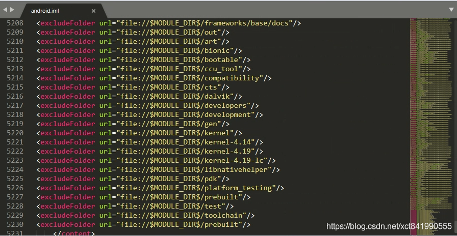

[TOC]


文章参考：https://blog.csdn.net/xct841990555/article/details/119131460


下载好全包源码后，在源码根目录执行以下四条命令：

```shell
source build/envsetup.sh
lunch aosp_x86-eng  #或者直接输入lunch，然后选择对应的target
make idegen -j4  #(这里的 -j4 表示用4线程来编译，可以不加)
development/tools/idegen/idegen.sh
```

完成以上四个步骤之后，会发现在源码根目录下出现了三个新的文件(也有可能是两个)

```shell
1. android.iml (记录项目所包含的module、依赖关系、SDK版本等等，类似一个XML文件)

2. android.ipr (工程的具体配置，代码以及依赖的lib等信息，类似于Visual Studio的sln文件)

3. android.iws (主要包含一些个人的配置信息，也有可能在执行上述操作后没有生成，这个没关系，在打开过一次项目之后就会自动生成了)
```


"android.iml"和"android.ipr"一般是"只读"的属性，我们这里建议大家，把这两个文件改成可读可写，否则，在更改一些项目配置的时候可能会出现无法保存的情况，执行如下两条命令即可。

```shell
sudo chmod 777 android.iml
sudo chmod 777 android.ipr
```


## 调整配置文件

假如你的电脑性能足够好(内存大于16G，代码下载在SSD上)，那么可以直接打开Android Studio，点击"Open an existing Android Studio project"选项，找到并选中刚刚生成的"android.ipr"文件，点击OK，就可以开始导入项目了。 第一次导入，这个过程可能会持续很久，几十分钟或者超过一个小时。不过成功之后，以后再打开项目就会快很多了。 如果电脑性能一般的话，我建议，可以在导入项目前，手动对"android.iml"文件进行一下修改，可以使我们导入的时间尽可能的缩短一些。
**删除orderEntry ，只保留以下几行**


​	


**将不需要导入的目录去除，后面在android studio 中也可以配置，具体见4**



