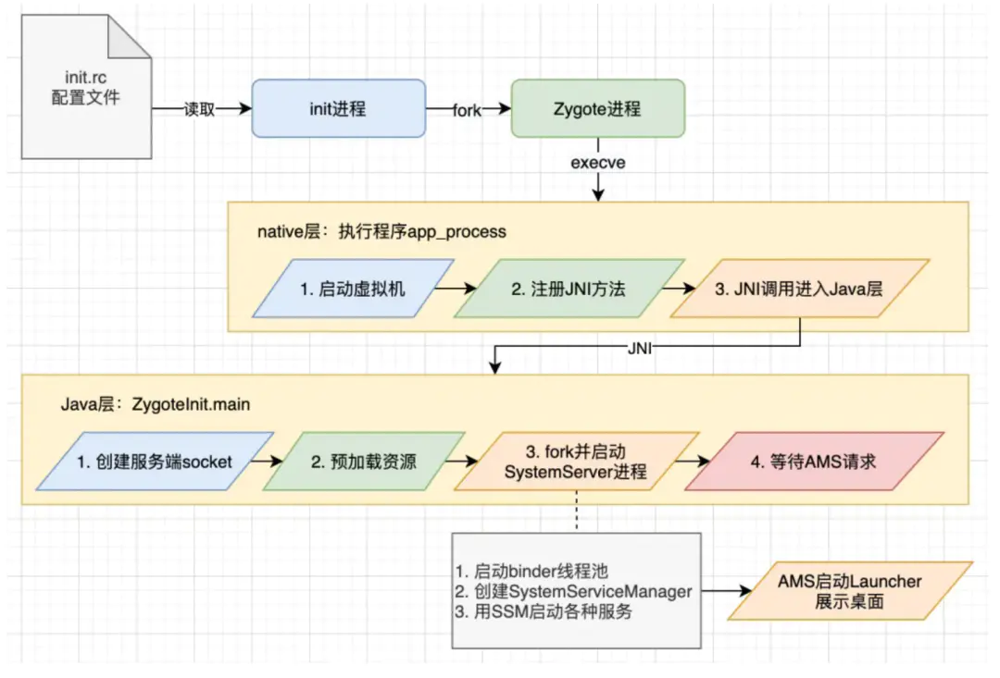
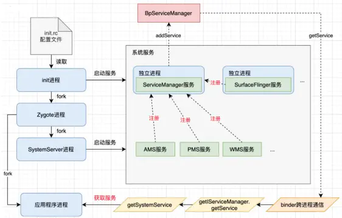

文章参考：https://mp.weixin.qq.com/s/ZT4E_ZoDj9GbeBhUXPjERA

文章参考：https://blog.csdn.net/u010206565/article/details/121743253


## 概述

先回顾一下Android系统的启动过程：

init进程fork出Zygote进程后，Zygote进程会创建一个服务端socket，等待AMS发起socket请求。

同时，由Zygote进程fork出的SystemServer进程会启动各项系统服务，其中就包含了AMS，AMS会启动Launcher桌面，此时就可以等待用户点击App图标来启动应用进程了。



然后看下系统服务的启动，不管是由init进程启动的独立进程的系统服务如SurfaceFlinger，还是由SystemServer进程启动的非独立进程的系统服务如AMS，都是在ServiceManager进程中完成注册和获取的，在跨进程通信上使用了Android的binder机制。



ServiceManager进程本身也是一个系统服务，经过启动进程、启动binder机制、发布自己和等待请求4个步骤，就可以处理其他系统服务的获取和注册需求了。

## 启动流程

点击桌面App图标，Launcher进程采用Binder IPC向system_server进程发起startActivity请求；

system_server进程接收到请求后，向zygote进程发送创建进程的请求；

Zygote进程fork出新的子进程，即App进程；

App进程，通过Binder IPC向sytem_server进程发起attachApplication请求；

system_server进程在收到请求后，进行一系列准备工作后，再通过binder IPC向App进程发送scheduleLaunchActivity请求；

App进程的binder线程（ApplicationThread）在收到请求后，通过handler向主线程发送LAUNCH_ACTIVITY消息；

主线程在收到Message后，通过发射机制创建目标Activity，并回调Activity.onCreate()等方法。

App便正式启动，开始进入Activity生命周期，执行完onCreate/onStart/onResume方法，UI渲染结束后便可以看到App的主界面。


### 点击Launcher图标


### ActivityStarter

```java
   /**
     * 代码位于：frameworks/base/services/core/java/com/android/server/wm/ActivityStarter.java
     * 这个App端执行请求SystemServer进程进行Activity启动的开始，
     * 这个方法是做一些启动之前权限的检查,然后就会执行startActivityUnchecked.以及startActivityInner
     * Executing activity start request and starts the journey of starting an activity. Here
     * begins with performing several preliminary checks. The normally activity launch flow will
     * go through {@link #startActivityUnchecked} to {@link #startActivityInner}.
     */
    private int executeRequest(Request request) {
        if (TextUtils.isEmpty(request.reason)) {
            throw new IllegalArgumentException("Need to specify a reason.");
        }
        // ......
        ActivityRecord sourceRecord = null;
        ActivityRecord resultRecord = null;
        if (resultTo != null) {
            sourceRecord = ActivityRecord.isInAnyTask(resultTo);
            if (DEBUG_RESULTS) {
                Slog.v(TAG_RESULTS, "Will send result to " + resultTo + " " + sourceRecord);
            }
            if (sourceRecord != null) {
                if (requestCode >= 0 && !sourceRecord.finishing) {
                    resultRecord = sourceRecord;
                }
            }
        }

        // .....
        boolean abort = !mSupervisor.checkStartAnyActivityPermission(intent, aInfo, resultWho,
                requestCode, callingPid, callingUid, callingPackage, callingFeatureId,
                request.ignoreTargetSecurity, inTask != null, callerApp, resultRecord,
                resultRootTask);
        abort |= !mService.mIntentFirewall.checkStartActivity(intent, callingUid,
                callingPid, resolvedType, aInfo.applicationInfo);
        abort |= !mService.getPermissionPolicyInternal().checkStartActivity(intent, callingUid,
                callingPackage);

   			// ......
        final ActivityRecord r = new ActivityRecord.Builder(mService)
                .setCaller(callerApp)
                .setLaunchedFromPid(callingPid)
                .setLaunchedFromUid(callingUid)
                .setLaunchedFromPackage(callingPackage)
                .setLaunchedFromFeature(callingFeatureId)
                .setIntent(intent)
                .setResolvedType(resolvedType)
                .setActivityInfo(aInfo)
                .setConfiguration(mService.getGlobalConfiguration())
                .setResultTo(resultRecord)
                .setResultWho(resultWho)
                .setRequestCode(requestCode)
                .setComponentSpecified(request.componentSpecified)
                .setRootVoiceInteraction(voiceSession != null)
                .setActivityOptions(checkedOptions)
                .setSourceRecord(sourceRecord)
                .build();

        mLastStartActivityRecord = r;

      	// ......
        // 执行完权限检查之后。调用startActivityUnchecked进行Activty的请求
        mLastStartActivityResult = startActivityUnchecked(r, sourceRecord, voiceSession,
                request.voiceInteractor, startFlags, true /* doResume */, checkedOptions,
                inTask, inTaskFragment, restrictedBgActivity, intentGrants);

        if (request.outActivity != null) {
            request.outActivity[0] = mLastStartActivityRecord;
        }

        return mLastStartActivityResult;
    }

```

executeRequest方法执行一系列权限检查，对于合法的请求才继续；**startActivityUnchecked**: 调用该方法时表示大部分初步的权限检查已经完成，执行 Trace，以及异常处理。

```java
 		/**
     * 代码位于：frameworks/base/services/core/java/com/android/server/wm/ActivityStarter.java
     */
    private int startActivityUnchecked(final ActivityRecord r, ActivityRecord sourceRecord,
            IVoiceInteractionSession voiceSession, IVoiceInteractor voiceInteractor,
            int startFlags, boolean doResume, ActivityOptions options, Task inTask,
            TaskFragment inTaskFragment, boolean restrictedBgActivity,
            NeededUriGrants intentGrants) {
       	// ......
        transitionController.collect(r);
        final boolean isTransient = r.getOptions() != null && r.getOptions().getTransientLaunch();
        try {
            mService.deferWindowLayout();
            // 添加“startActivityInner”的systrace tag
            Trace.traceBegin(Trace.TRACE_TAG_WINDOW_MANAGER, "startActivityInner");
            // 执行startActivityInner启动应用的逻辑
            result = startActivityInner(r, sourceRecord, voiceSession, voiceInteractor,
                    startFlags, doResume, options, inTask, inTaskFragment, restrictedBgActivity,
                    intentGrants);
            startResultSuccessful = ActivityManager.isStartResultSuccessful(result);
            final boolean taskAlwaysOnTop = options != null && options.getTaskAlwaysOnTop();
            // Apply setAlwaysOnTop when starting an Activity is successful regardless of creating
            // a new Activity or recycling the existing Activity.
            if (taskAlwaysOnTop && startResultSuccessful) {
                final Task targetRootTask =
                        mTargetRootTask != null ? mTargetRootTask : mTargetTask.getRootTask();
                targetRootTask.setAlwaysOnTop(true);
            }
        } finally {
           // ......
        }

        postStartActivityProcessing(r, result, startedActivityRootTask);

        return result;
    }

```

在执行`startActivityInner`启动应用逻辑中，`AMS`中的`Activity`栈管理的逻辑，**检查发现当前处于前台`Resume`状态的`Activity`是桌面应用，所以第一步需要通知桌面应用的`Activity`进入`Paused`状态**，相关简化代码逻辑如下：


在 Android 中系统维护了所有应用的状态信息，因此用户才可以在不同应用中无缝切换和返回。同时在处理启动应用请求的时候还需要进行额外的判断，比如当前栈顶是否是同样的 Activity，如果是则根据设置决定是否重复启动等等。

忽略 ActivityStack、WindowContainer 等任务窗口管理的代码，只关注其中真正启动应用相关的:


mTargetRootTask 是 Task 类型， Task 是 WindowContainer 的子类，用于管理和表示属于同一栈帧的所有 activity，其中每个 activity 使用 ActivityRecord 表示。mRootWindowContainer 是 RootWindowContainer 类型，也是 WindowContainer 的子类，特别代表根窗口。
		


```java
 boolean resumeFocusedTasksTopActivities() {
        return resumeFocusedTasksTopActivities(null, null, null);
    }

    boolean resumeFocusedTasksTopActivities(
            Task targetRootTask, ActivityRecord target, ActivityOptions targetOptions) {
        return resumeFocusedTasksTopActivities(targetRootTask, target, targetOptions,
                false /* deferPause */);
    }
```


## Launch Activity

ActivityThread 中的 **performLaunchActivity** 是启动 Activity 的核心实现。其主要伪代码为:

```java
 /** 
     * 代码位于：frameworks/base/core/java/android/app/ActivityThread.java
     *  Core implementation of activity launch.
     **/
    private Activity performLaunchActivity(ActivityClientRecord r, Intent customIntent) {
        ActivityInfo aInfo = r.activityInfo;
        // ......
        ContextImpl appContext = createBaseContextForActivity(r);
        Activity activity = null;
        try {
            // 创建应用上下文(Context)，获取 ClassLoader
            java.lang.ClassLoader cl = appContext.getClassLoader();
            // Instrumentation通过反射创建Activity对象
            activity = mInstrumentation.newActivity(
                    cl, component.getClassName(), r.intent);
            StrictMode.incrementExpectedActivityCount(activity.getClass());
            r.intent.setExtrasClassLoader(cl);
            r.intent.prepareToEnterProcess(isProtectedComponent(r.activityInfo),
                    appContext.getAttributionSource());
            if (r.state != null) {
                r.state.setClassLoader(cl);
            }
        } catch (Exception e) {
            if (!mInstrumentation.onException(activity, e)) {
                throw new RuntimeException(
                    "Unable to instantiate activity " + component
                    + ": " + e.toString(), e);
            }
        }

        try {
            // 进行Application的创建
            Application app = r.packageInfo.makeApplication(false, mInstrumentation);
						// ......
            if (activity != null) {
               // .....

                appContext.setOuterContext(activity);
                // 执行Activity的attach方法. 创建PhoneWindow.实现PhoneWindows的回调接口.设置WindowManager         
                activity.attach(appContext, this, getInstrumentation(), r.token,
                        r.ident, app, r.intent, r.activityInfo, title, r.parent,
                        r.embeddedID, r.lastNonConfigurationInstances, config,
                        r.referrer, r.voiceInteractor, window, r.configCallback,
                        r.assistToken, r.shareableActivityToken);

                if (customIntent != null) {
                    activity.mIntent = customIntent;
                }
                r.lastNonConfigurationInstances = null;
                checkAndBlockForNetworkAccess();
                activity.mStartedActivity = false;
                int theme = r.activityInfo.getThemeResource();
                if (theme != 0) {
                    activity.setTheme(theme);
                }

                if (r.mActivityOptions != null) {
                    activity.mPendingOptions = r.mActivityOptions;
                    r.mActivityOptions = null;
                }
                activity.mLaunchedFromBubble = r.mLaunchedFromBubble;
                activity.mCalled = false;
                // Assigning the activity to the record before calling onCreate() allows
                // ActivityThread#getActivity() lookup for the callbacks triggered from
                // ActivityLifecycleCallbacks#onActivityCreated() or
                // ActivityLifecycleCallback#onActivityPostCreated().
                r.activity = activity;
                // 使用Instrumentation进行Activty的onCreate方法的调用
                if (r.isPersistable()) {
                    mInstrumentation.callActivityOnCreate(activity, r.state, r.persistentState);
                } else {
                    mInstrumentation.callActivityOnCreate(activity, r.state);
                }
                if (!activity.mCalled) {
                    throw new SuperNotCalledException(
                        "Activity " + r.intent.getComponent().toShortString() +
                        " did not call through to super.onCreate()");
                }
                mLastReportedWindowingMode.put(activity.getActivityToken(),
                        config.windowConfiguration.getWindowingMode());
            }
            r.setState(ON_CREATE);

        } catch (SuperNotCalledException e) {
            throw e;

        } catch (Exception e) {
            if (!mInstrumentation.onException(activity, e)) {
                throw new RuntimeException(
                    "Unable to start activity " + component
                    + ": " + e.toString(), e);
            }
        }

        return activity;
    }

```

performLaunchActivity是一个很重要的方法	


