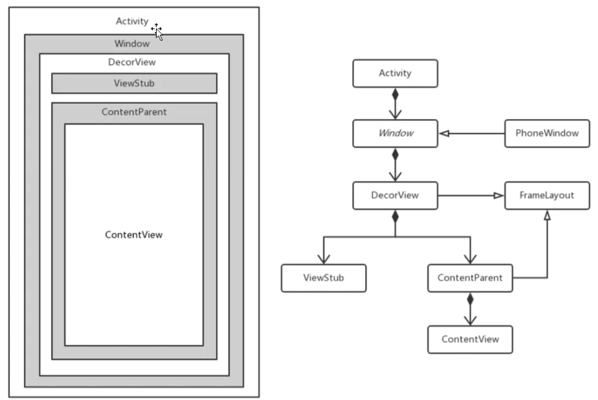

[TOC]

文章参考：https://www.jianshu.com/p/40a9c93b5a8d

# 概述


首先，我们先来看一下Android之Window的具体结构



我们来简单介绍一下这个窗口的布局结构

1、每一个Activity都包含一个Window对象，Window对象通常由PhoneWindow实现。

2、PhoneWindow：将Decoriew设置为整个应用窗口的根View。是Window的实现类。它是Android中的最基本的窗口系统，每个Activity 均会创建一个PhoneWindow对象，是Activity和整个View系统交互的接口。

3、DecorView：顶层视图，将要显示的具体内容呈现在PhoneWindow上. DecorView是当前Activity所有View的祖先，它并不会向用户呈现任何东西，它主要有如下几个功能，可能不全：

（1）Dispatch ViewRoot分发来的key、touch、trackball等外部事件；
		（2）DecorView有一个直接的子View，我们称之为System Layout,这个View是从系统的Layout.xml中解析出的，它包含当前UI的风格，如是否带title、是否带process bar等。可以称这些属性为Window decorations。
		（3）作为PhoneWindow与ViewRoot之间的桥梁，ViewRoot通过DecorView设置窗口属性。//可以这样获取 View view = getWindow().getDecorView();
		（4）DecorView只有一个子元素为LinearLayout。代表整个Window界面，包含通知栏，标题栏，内容显示栏三块区域。DecorView里面TitleView：标题，可以设置requestWindowFeature(Window.FEATURE_NO_TITLE)取消掉ContentView：是一个id为content的FrameLayout。我们平常在Activity使用的setContentView就是设置在这里，也就是在FrameLayout上

# Window

我们来看下源码里面的说明

```java
public abstract class Window {
    // ......
    @Nullable
    public View findViewById(@IdRes int id) {
        return getDecorView().findViewById(id);
    }
    /**
     * Convenience for * {@link #setContentView(View, android.view.ViewGroup.LayoutParams)}
     * to set the screen content from a layout resource.  The resource will be * inflated, adding all top-level views to the screen. * * @param layoutResID Resource ID to be inflated.
     * @see #setContentView(View, android.view.ViewGroup.LayoutParams)
     */
     public abstract void setContentView(@LayoutRes int layoutResID);
     // ......
}
```

一个顶级窗口查看和行为的一个抽象基类。这个类的实例作为一个顶级View添加到Window Manager。它提供了一套标准的UI方法，比如添加背景，标题等等。当你需要用到Window的时候，你应该使用它的唯一实现类PhoneWindow。可以看到，Window是一个抽象基类，它提供了一系列窗口的方法，比如设置背景，标题等等，而它的唯一实现类则是PhoneWindow

# PhoneWindow

PhoneWindow是Window的唯一实现类，我们来看Windows的具体实现。

```java
public class PhoneWindow extends Window implements MenuBuilder.Callback {

    private final static String TAG = "PhoneWindow";
    // ...
    // This is the top-level view of the window, containing the window decor.
    // 这是Window的顶层View。包含Window的装饰器
    private DecorView mDecor;
    // This is the view in which the window contents are placed. It is either
    // mDecor itself, or a child of mDecor where the contents go.
    // 这是放置窗口内容的视图。它要么是mDecor本身，要么是mDecor的子节点。
    ViewGroup mContentParent;

    private ViewGroup mContentRoot;
    ...
}
```

可以看到，在PhoneWindow里面，出现了成员变量DecorView的而这里，DecorView则是PhoneWindow里面的一个内部类，它是继承与FrameLayout。

既然是FrameLayout，也就可以加载布局文件，也就是说，我们那些标题栏，内容栏，顶级上看是加载在DecorView上的。而DecorView则是由PhoneWindow负责添加

```java
/**
 * 代码位于：frameworks/base/core/java/com/android/internal/policy/DecorView.java
 * DecorView则是PhoneWindow里面的一个内部类，它是继承与FrameLayout.
 * 可以加载布局文件，也就是说，我们那些标题栏，内容栏，顶级上看是加载在DecorView上的。而DecorView则是由PhoneWindow负责添加
 */
/** @hide */
public class DecorView extends FrameLayout implements RootViewSurfaceTaker, WindowCallbacks {
	// ......
}
```

关于DecorView我们不在这里进行展开学习。学习他我们有一个很常见的函数。Activity.setContentView的对他有一个详细的介绍：

具体参见：TODO


在setContentView的方法的最后，我们可以看到：

此时已经创建完DecorView并且获取到mContentParent，接着就是将你setContentView的内容添加到mContentParent中，也就是

```java
 mContentParent.addView(view, params);
```

最后调用Callback来通知界面发生改变。Callback是Window里面的一个接口，里面声明了当界面更改触摸时调用的各种方法。这里的话，我们看下onContentChanged，在PhoneWindow里面并没有看到onContentChanged的实现类，而我们又知道Activity本身又是加载在Window上的，我们看下Activity

```java
public class Activity extends ContextThemeWrapper
        implements LayoutInflater.Factory2,
        Window.Callback, KeyEvent.Callback,
        OnCreateContextMenuListener, ComponentCallbacks2,
        Window.OnWindowDismissedCallback { ..... }
```

可以看到Activity里面实现了Window.Callback接口而里面onContentChanged则是空的，也就是我们可以通过重写该方法来监听布局内容的改变了

```java
public void onContentChanged() {
		......
}
```


# WindowManager

`Window`操作的具体实现是在`WindowManagerService`中，`WindowMager`和`WindowManagerService`交互是`IPC`的过程.

Android中所有的视图都是附加在`Window上`上呈现的，不管`Activity,Dialog,Toast`,他们的视图都是附加在`Window`上的,因此`Window`实际上是`View`的直接管理者

我们先来了解一下如何使用`WindwoMagaer`来添加一个`Window`

```java
Button button = new Button(this);
button.setText("Window");
WindowManager.LayoutParams layoutParams = new WindowManager.LayoutParams(
      WindowManager.LayoutParams.WRAP_CONTENT, WindowManager.LayoutParams.WRAP_CONTENT, 0, 0, PixelFormat.TRANSPARENT);
layoutParams.type = WindowManager.LayoutParams.TYPE_APPLICATION;
layoutParams.flags= WindowManager.LayoutParams.FLAG_NOT_TOUCH_MODAL
       | WindowManager.LayoutParams.FLAG_NOT_FOCUSABLE;
layoutParams.gravity= Gravity.LEFT|Gravity.TOP;
layoutParams.x=100;
layoutParams.y=300;
WindowManager windowManager = getWindowManager();
windowManager.addView(button,layoutParams);
```

这段代码可以添加一个`Window`，位置在(100，300)处,这里面有俩个参数比较重要分别是，`type`和`flag`,下面分别介绍一下这俩个参数

## Window的type

`type`参数表示`Window`的类型，`Window`有三种类型，分别是`Application Window`（应用窗口），`Sub Window`（子窗口）和`System Window`（系统窗口），每个大类型又包含多个小类型，他们都定义在`WindowMager`的静态内部类`LayoutParams`中，下面对这三种类型进行讲解

### **Application Window(应用窗口)**

Activity就是典型的应用窗口，应用窗口包含的类型如下：


