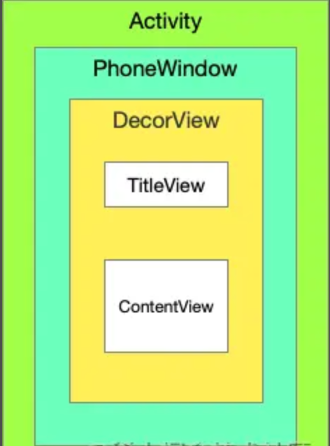

[TOC]

文章参考：https://juejin.cn/post/6844904146227691527

# 概述

本文主要分析 Activity、Window、PhoneWindow、WindowManager 之间的关系，为我们后面的文章 **「如何在 Andorid 系统里添加自定义View」** 等等文章奠定基础，先来了解一下它们的基本概念



WindowManager：它是一个接口类，继承自接口 ViewManager，对 Window 进行管理

Window：它是一个抽象类，它作为一个顶级视图添加到 WindowManager 中，对 View 进行管理

PhoneWindow：Window唯一实现类，Window是一个抽象概念，添加到WindowManager的根容器

DecorView: 它是 PhoneWindow 内部的一个成员变量，继承自 FrameLayout，FrameLayout 继承自 ViewGroup


# Activity、Window、WindowManager 的关系

在 Activity 内部维护着一个 Window 的实例变量 mWindow

```java
   /**
     * 代码位于：frameworks/base/core/java/android/app/Activity.java
     * 获取当前Activity绑定的Window
     */
    public Window getWindow() {
        return mWindow;
    }
```

Window 是一个抽象类，它的具体实现类为 PhoneWindow，在 Activity 的 attach 方法中给 Window 的实例变量 mWindow 赋值

```java
	/**
     * 代码位于：frameworks/base/core/java/android/app/Activity.java
     */
    @UnsupportedAppUsage
    final void attach(Context context, ActivityThread aThread,
            Instrumentation instr, IBinder token, int ident,
            Application application, Intent intent, ActivityInfo info,
            CharSequence title, Activity parent, String id,
            NonConfigurationInstances lastNonConfigurationInstances,
            Configuration config, String referrer, IVoiceInteractor voiceInteractor,
            Window window, ActivityConfigCallback activityConfigCallback, IBinder assistToken) {
        attachBaseContext(context);
        mFragments.attachHost(null /*parent*/);
        // PhoneWindow的创建时间是Activity在被调用attach的时候
        mWindow = new PhoneWindow(this, window, activityConfigCallback);
        mWindow.setWindowControllerCallback(mWindowControllerCallback);
        // 设置PhoneWindow的 Callback回调
        mWindow.setCallback(this);
        mWindow.setOnWindowDismissedCallback(this);
        mWindow.getLayoutInflater().setPrivateFactory(this);
        if (info.softInputMode != WindowManager.LayoutParams.SOFT_INPUT_STATE_UNSPECIFIED) {
            mWindow.setSoftInputMode(info.softInputMode);
        }
        if (info.uiOptions != 0) {
            mWindow.setUiOptions(info.uiOptions);
        }
        mUiThread = Thread.currentThread();

        mMainThread = aThread;
        // ..........
        // 设置 WindowManager
        mWindow.setWindowManager(
                // 设置获取WIndowManagerService的代理对象
                (WindowManager)context.getSystemService(Context.WINDOW_SERVICE),
                mToken, mComponent.flattenToString(),
                (info.flags & ActivityInfo.FLAG_HARDWARE_ACCELERATED) != 0);
        if (mParent != null) {
            mWindow.setContainer(mParent.getWindow());
        }
        mWindowManager = mWindow.getWindowManager();
        mCurrentConfig = config;

        mWindow.setColorMode(info.colorMode);
        mWindow.setPreferMinimalPostProcessing(
                (info.flags & ActivityInfo.FLAG_PREFER_MINIMAL_POST_PROCESSING) != 0);

        setAutofillOptions(application.getAutofillOptions());
        setContentCaptureOptions(application.getContentCaptureOptions());
    }
```

我们看到Activity的attach的方法主要是执行了如下的逻辑：

- 创建了 PhoneWindow 并赋值给 mWindow
- 调用 PhoneWindow 的 setWindowManager 方法，这个方法的具体实现发生在 Window 中，最终调用的是 Window 的 setWindowManager 方法

那我们来看WIndow里面的setWindowManager的方法的具体是实现：

```java
    public void setWindowManager(WindowManager wm, IBinder appToken, String appName,
            boolean hardwareAccelerated) {
        mAppToken = appToken;
        mAppName = appName;
        mHardwareAccelerated = hardwareAccelerated;
        // 如果传入的WindowManager的null.则通过getSystemService来获取
        if (wm == null) {
            wm = (WindowManager)mContext.getSystemService(Context.WINDOW_SERVICE);
        }
        // 通过WindowManagerImpl来进行穿件本地的LocalWindowManager
        mWindowManager = ((WindowManagerImpl)wm).createLocalWindowManager(this);
    }
```

将 WindowManager 转换为 WindowManagerImpl，之后调用 createLocalWindowManager 方法，并传递当前的 Window 对象，构建 WindowManagerImpl 对象，之后赋值给 mWindowManager

```java
public WindowManagerImpl createLocalWindowManager(Window parentWindow) {
    return new WindowManagerImpl(mContext, parentWindow);
}
```

其实在 createLocalWindowManager 方法中，就做了一件事，将 Window 作为参数构建了一个 WindowManagerImpl 对象返还给调用处。

总的来说，其实就是在 Activity 的 attach 方法中，通过调用 Window 的 setWindowManager 方法将 Window 和 WindowManager 关联在了一起。

PhoneWindow 是 Window 的实现类，它是一个窗口，本身并不具备 View 相关的能力，实际上在 PhoneWindow 内部维护这一个变量 mDecor。

```java
public class PhoneWindow extends Window{
  // This is the top-level view of the window, containing the   window decor.
  private DecorView mDecor; 
  
  private void installDecor() {
        mForceDecorInstall = false;
        if (mDecor == null) {
            // 完成DecorView的实例化
            mDecor = generateDecor(-1);
            ......
        }
        
        if (mContentParent == null) {
            // 调用 generateLayout 方法 要负责了DecorView的初始设置，诸如主题相关的feature、DecorView的背景
            mContentParent = generateLayout(mDecor);
        } 
        ......
    }
    
    // 完成DecorView的实例化
    protected DecorView generateDecor(int featureId) {
        ......
        return new DecorView(context, featureId, this, getAttributes());
    }
    
    // 调用 generateLayout 方法 要负责了DecorView的初始设置，
    // 诸如主题相关的feature、DecorView的背景，同时也初始化 contentParent
    protected ViewGroup generateLayout(DecorView decor) {
        ......
        ViewGroup contentParent = (ViewGroup)findViewById(ID_ANDROID_CONTENT);
        ......
    }

}

```


mDecor 是 window 的顶级视图，它继承自 FrameLayout，它的创建过程由 installDecor 完成，然后在 installDecor 方法中通过 generateDecor 方法来完成DecorView的实例化。

调用 generateLayout 方法 要负责了DecorView的初始设置，诸如主题相关的feature、DecorView的背景，同时也初始化 contentParent。

mDecor 它实际上是一个 ViewGroup，当在 Activity 中调用 setContentView 方法，通过调用 inflater 方法把布局资源转换为一个 View，然后添加到 DecorView 的 mContenParnent 中。


当 View 初始化完成之后，最后会进入 ActivityThread 的 handlerResumeActivity 方法，执行 执行了r.activity.makeVisible()方法

```java
// 代码位于：frameworks/base/core/java/android/app/ActivityThread.java
public void handleResumeActivity(IBinder token, boolean finalStateRequest, boolean isForward,
            String reason) {
        ......
        
        if (r.activity.mVisibleFromClient) {
            r.activity.makeVisible();
        }
        ......
    }
```

最终调用 Activity 的 makeVisible 方法，把 decorView 添加到 WindowManage 中

```java
// frameworks/base/core/java/android/app/Activity.java
void makeVisible() {
    if (!mWindowAdded) {
        ViewManager wm = getWindowManager();
        wm.addView(mDecor, getWindow().getAttributes());
        mWindowAdded = true;
    }
    mDecor.setVisibility(View.VISIBLE);
}

```


到这里他们之间的关系明确了：

一个 Activity 持有一个 PhoneWindow 的对象，而一个 PhoneWindow 对象持有一个 DecorView 的实例

PhoneWindow 继承自 Window，一个 Window 对象内部持有 mWindowManager 的实例，通过调用 setWindowManager 方法与 WindowManager 关联在一起

WindowManager 继承自 ViewManager，WindowManagerImpl 是 WindowManager 接口的实现类，但是具体的功能都会委托给 WindowManagerGlobal 来实现

调用 WindowManager 的 addView 方法，实际上调用的是 WindowManagerImpl 的 addView 方法


