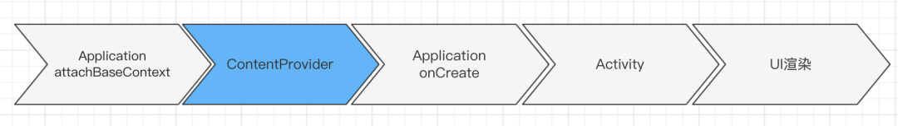
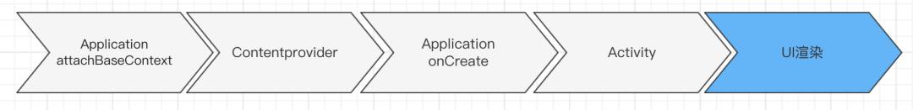

文章参考：https://mp.weixin.qq.com/s/-3uY3aSF67xTzWEJsa7e-A

## 概述

随着项目版本的迭代，App的性能问题会逐渐暴露出来，而好的用户体验与性能表现紧密相关。

那么第一篇文章我就从应用的启动优化开始，根据实际案例，打造闪电般的App启动速度，会直接影响留存和转化等核心数据。

启动是指用户从点击 icon 到看到页面首帧的整个过程，启动优化的目标就是减少这一过程的耗时。

启动过程比较复杂，在**进程与线程维度**，它涉及到多次跨进程的通信与多个线程之间的切换；在**耗时成因维度**，它包括 CPU、CPU 调度、IO、锁等待等多类耗时。虽然启动过程比较复杂，但是我们最终可以把它抽象成主线程的一个线性过程。因此对于启动性能的优化，就是去缩短主线程的这个线性过程。


开始，我们先说一下Android性能优化可以从哪些点去出发：

- 1、启动加速之主题切换。使用Activity的windowBackground主题属性来为启动的Activity提供一个简单的drawable。
- 2、避免在Application里面进行过度的初始化操作
- 3、启动加速之Diagnosing The Problem（借助工具进行耗时问题诊断）
- 4、优化Application的启动逻辑


下面我们就会根据上述几个方向。进行启动速度的优化。

下面，我们看一些原理性的东西。


## 应用启动原理

我们先来看一下Google官方文档《Launch-Time Performance》对应用启动优化的概述；

https://developer.android.com/topic/performance/vitals/launch-time

应用有三种启动状态，每种状态都会影响应用向用户显示所需的时间：冷启动、温启动或热启动。

在冷启动中，应用从头开始启动。在另外两种状态中，系统需要将后台运行的应用带入前台。建议您始终在假定冷启动的基础上进行优化。这样做也可以提升温启动和热启动的性能。

#### 冷启动

冷启动是指应用从头开始启动：系统进程在冷启动后才创建应用进程。发生冷启动的情况包括应用自设备启动后或系统终止应用后首次启动。这种启动给最大限度地减少启动时间带来了最大的挑战，因为系统和应用要做的工作比在另外两种启动状态中更多。

在冷启动开始时，系统有三个任务，它们是：

- 加载并启动应用。
- 在启动后立即显示应用的空白Windows。
- 创建应用进程。

系统一创建应用进程，应用进程就负责后续阶段：

- 创建应用Application对象。
- 启动主线程。
- 创建主Activity。
- 扩充视图。
- 布局屏幕。
- 执行初始绘制。进行首帧绘制


主要流程：点击Icon(Click Event) -> IPC -> Process.start() -> ActivityThread -> bindApplication -> launchActivity - ViewRootImpl

一旦应用进程完成第一次绘制，系统进程就会换掉当前显示的后台窗口，替换为主 Activity。此时，用户可以开始使用应用。

冷启动存在的问题：

1、冷启动耗时最多


## 启动时间的测量

#### 1、ADB命令测量

这种方式，在线下使用非常方便，但是不能带到线上去。其次，这种方式打印的时间并非严谨、精确的时间。

```java
// 命令如下：
adb shell am start -W packageName/LaunchActivity

ThisTime: 2335       //最后一个Activity启动消耗的时间。一般就是我们的MainActivity
TotalTime: 2335      //这次启动所有Activity所消耗的时间（包含启动所有的Activity,如SplashActivity、MainActivity）
WaitTime: 2342       //这个是AMS启动Activity和Application的总耗时。所以他比TotalTime要多些

// 举例如下：
➜  HelloAndroid git:(dev) ✗ adb shell am start -W com.frewen.android.demo.debug/com.frewen.android.demo.ui.SplashActivity

Starting: Intent { act=android.intent.action.MAIN cat=[android.intent.category.LAUNCHER] cmp=com.frewen.android.demo.debug/com.frewen.android.demo.ui.SplashActivity }
Status: ok
LaunchState: COLD    //启动方式冷启动
Activity: com.frewen.android.demo.debug/com.frewen.android.demo.ui.SplashActivity
TotalTime: 2335      //这次启动所消耗的时间（包含启动所有的Activity和Application的启动时间）
WaitTime: 2342       //这个是AMS启动Activity的总耗时。所以他比TotalTime要多些
Complete

```

#### 优缺点

 线下使用非常方便。不能再线上使用。

而且这个方法并不是非常精确。

#### 2、手动打点的方式

```
    @Override
    protected void attachBaseContext(Context base) {
        // 打点调用记录应用启动的开始时间
        LaunchTimeRecord.INSTANCE.startRecord("Application");
        // 在这里调用Context的方法会崩溃
        super.attachBaseContext(base);
        // 在这里可以正常调用Context的方法
        HookHelper.hookActivityManager();
    }
    
    // 
        /**
         * 
         * TODO 关于View的addOnPreDrawListener需要学习
         */
        splashBg!!.viewTreeObserver.addOnPreDrawListener(
                object : ViewTreeObserver.OnPreDrawListener {
                    override fun onPreDraw(): Boolean {
                        splashBg!!.viewTreeObserver.removeOnPreDrawListener(this)
                        endRecord("Application")
                        return true
                    }
                })

//        splashBg!!.doOnPreDraw { endRecord("Application") }

```

这种方法可以比较精确的计算出启动耗时，可以带到线上去使用，推荐使用。


#### 3、通过AOP方式优雅获取启动方法执行耗时。

使用常规的统计方法，侵入性比较大。而且工作量大。

#### 1、常规方式

获取启动阶段所有方法的耗时，通过手动埋点的方式。


最后的那条代码指的是执行时CPU执行的时间

缺点：代码丑陋，代码侵入性严重。本来其实也是耗时逻辑。工作量大。

普通手动埋点的一般不建议是项目中使用。

#### 2、AOP方式

面向切面编程。 针对同一类问题的统一处理。比如性能问题统一处理、比如针对同

##### 优缺点：

1、无侵入添加代码

2、修改方便


工具：AspectJ的使用（需要重点研究）

我们先贴一下他的官方文档：https://github.com/HujiangTechnology/gradle_plugin_android_aspectjx

在项目根目录的build.gradle里依赖AspectJX


```
dependencies {
        classpath 'com.hujiang.aspectjx:gradle-android-plugin-aspectjx:2.0.8'
        }
```

或者使用product目录下的jar包，在你的项目根目录下新建目录plugins，把product/gradle-android-plugin-aspectjx-2.0.0.jar拷贝到plugins，依赖jar包

```
dependencies {
        classpath fileTree(dir:'plugins', include:['*.jar'])
        }
```

注意:

区别于旧版本，离线新版本不再需要依赖org.aspectj:aspectjtools:1.8.+

```
compile 'org.aspectj:aspectjrt:1.8.+' 必须添加到包含有AspectJ代码的module. 可以参考Demo
```

在app项目的build.gradle里应用插件

```
apply plugin: 'android-aspectjx'
//或者这样也可以
apply plugin: 'com.hujiang.android-aspectjx'
```


我们先学习一下基础概念：

**Join Points**  运行时的执行点，可以作为切面的地方。

比如：函数调用，执行的地方。获取或者设置变量，类的初始化

**Point Cut**  带条件的Join Points

**Advice**  一种Hook机制，要插入代码的位置


## 启动优化内容

### 一、闪屏页优化

消除启动时的白屏/黑屏，市面上大部分App都采用了这种方法，非常简单，是一个障眼法，不会缩短实际冷启动时间。

简单贴下实现方式吧。

```
<application
    android:name=".MainApplication"
    ...
    android:theme="@style/AppThemeWelcome>

```

styles.xml 增加一个主题叫AppThemeWelcome


```
<style name="AppThemeWelcome" parent="Theme.AppCompat.NoActionBar">
    ...
    <item name="android:windowBackground">@drawable/logo</item>  <!-- 默认背景-->
</style>

```
闪屏页设置这个主题，或者全局给Application设置


```
<activity android:name=".ui.activity.DemoSplashActivity"
            android:configChanges="orientation|screenSize|keyboardHidden"
            android:theme="@style/AppThemeWelcome"
            android:screenOrientation="portrait">
            <intent-filter>
                <action android:name="android.intent.action.MAIN" />

                <category android:name="android.intent.category.LAUNCHER" />
            </intent-filter>
        </activity>
```

### 二、异步初始化优化

我们可以把一些Application中不需要即时初始化的逻辑。放到异步线程中去进行初始化。我们可以知道我们一般在异步线程中进行初始化的时候，最好不要自己去new一些线程对象，造成额外的资源开销。所以我们可以考虑使用线程池的方式。

```java
    // 根据CPU的核心数来进行设置核心线程的数量
    // 这个我们是模仿Android的源码中AsyncTask的实现。我们希望核心池中至少有 2 个线程，最多 4 个线程，
    // 但是如果CPU的核心数都不超过4个(3个、4个)。则宁愿比 CPU 数量少 1，以避免后台工作使 CPU 饱和
    // 但是注意。在最新的android-29的源码里面这种设计已经被更优的解决方案替代。我们有空可以学习一下
    private static final int CPU_COUNT = Runtime.getRuntime().availableProcessors();
    private static final int CORE_POOL_SIZE = Math.max(2, Math.min(CPU_COUNT - 1, 4));

	  //CPU的数量. 我们在启动的时候尽量使用CPU密集型的线程池，我们尽量榨取CPU执行的调度能力
    ExecutorService executorService = Executors.newFixedThreadPool(CORE_POOL_SIZE, new ThreadFactoryImpl("Application"));
        executorService.submit(() -> {
            initAuraHttp();
            mCountDownLatch.countDown();
        });

        /**
         * 将任务会在这个地方进行等待。需要判断mCountDownLatch是否需要满足等待。
         * 我们这个对象的在实例化的时候，我们可以判断需要满足几次
         * 任务的最后需要阻塞等待，一直等所有需要满足的任务执行完毕，再通过
         */
        try {
            mCountDownLatch.await();
        } catch (InterruptedException e) {
            e.printStackTrace();
        }
```

​		通过上面的代码。我们可以把我们所有Application里面onCreate中初始化的任务都放到线程池里面进行执行。
​		思考一下：
​		1、很多场景一下，我们有些的初始化逻辑其实是不能被简单的放到异步线程里面初始化
​		2、有些三方SDK不允许在子线程里面初始化。
​		3、有些模块放在子线程里面初始化，可能使用的时候还没有初始化完成。

关于问题三。我们可以考虑使用CountDownLatch来解决。


上面的方法还是有很多的问题：

1、代码不够优雅

2、场景不好处理（依赖关系比较复杂）

3、维护成本高

#### 		有向无环图异步启动器	

充分利用CPU多核的优势

代码Task化，启动的抽象逻辑为Task

根据所有的任务关系生成有向无环图


### 三、MultiDex优化

了解MultiDex的相关优化之前，我们可以先看一下Android之APK编译相关的知识：
http://note.youdao.com/s/Jnq0QZ49

MultiDex的初始化，是非常耗时的操作

首先我们来看第一个阶段，也就是 Application 的 attachBaseContext 阶段。这个阶段由于 Applicaiton Context 赋值等问题，一般不会有太多的业务代码，预期中也不会有多少耗时。但在实际测试过程中，我们发现在某些机型上，应用安装后的首次启动耗时非常严重，经过初步定位，主要耗时在**MultiDex.install**。

在Android 4.4的机器打印MultiDex.install(context)耗时如下：

```
MultiDex.install() 
// 耗时：1320
```
平均耗时1秒以上，目前大部分应用应该还是会兼容5.0以下手机，那么MultiDex优化是冷启动优化的大头。


为什么MultiDex会这么耗时？老规矩，分析一下MultiDex原理~

具体的原理分析，大家可以参见：https://zhuanlan.zhihu.com/p/24305296

这里我们就不详述MultiDex原理相关的知识。

我们只讲解决方案：

知道了MultiDex原理之后，可以理解install过程为什么耗时，因为涉及到解压apk取出dex、压缩dex、将dex文件通过反射转换成DexFile对象、反射替换数组。

那么MultiDex到底应该怎么优化呢，放子线程可行吗？


#### 方案1：子线程install（不推荐）

这个方法大家很容易就能想到，在闪屏页开一个子线程去执行MultiDex.install，然后加载完才跳转到主页。需要注意的是闪屏页的Activity，包括闪屏页中引用到的其它类必须在主dex中，不然在MultiDex.install之前加载这些不在主dex中的类会报错Class Not Found。这个可以通过gradle配置，如下：


```
    defaultConfig {
        //分包，指定某个类在main dex
        multiDexEnabled true
        multiDexKeepProguard file('multiDexKeep.pro') // 打包到main dex的这些类的混淆规制，没特殊需求就给个空文件
        multiDexKeepFile file('maindexlist.txt') // 指定哪些类要放到main dex
    }

```
maindexlist.txt 文件指定哪些类要打包到主dex中，内容格式如下

```
com/frewen/android/demo/ui/SplashActivity.class
```
在已有项目中用这种方式，一顿操作猛如虎之后，编译运行在4.4的机器上，启动闪屏页，加载完准备进入主页直接崩掉了。

报错NoClassDefFoundError，一般都是该类没有在主dex中，要在maindexlist.txt 将配置指定在主dex。 **第三方库中的ContentProvider必须指定在主dex中，否则也会找不到，为什么？


ContentProvider初始化太早了，如果不在主dex中，还没启动闪屏页就已经crash了。

所以这种方案的缺点很明显：

- MultiDex加载逻辑放在闪屏页的话，闪屏页中引用到的类都要配置在主dex。
- ContentProvider必须在主dex，一些第三方库自带ContentProvider，维护比较麻烦，要一个一个配置。

#### MultiDex优化方案2：今日头条方案

今日头条没有加固，反编译后很容易通过关键字搜索找到MultidexApplication这个类，


#### 四、ContentProvider 优化

接下来介绍的是**ContentProvider**的相关优化，ContentProvider 作为 Android 四大组件之一，其在生命周期方面有着独特性——Activity、Service、BroadcastReceiver 这三大组件都只有在它们被调用到时，才会进行实例化，并执行它们的生命周期；ContentProvider 即使在没有被调用到，也会在启动阶段被自动实例化并执行相关的生命周期。在进程的初始化阶段调用完 Application 的 attachBaseContext 方法后，会再去执行 installContentProviders 方法，对当前进程的所有 ContentProvider 进行 install。

这个过程将会对当前进程的所有 ContentProvider 通过 for 循环的方式逐一进行实例化、调用它们的 attachInfo 与 onCreate 生命周期方法，最后将这些 ContentProvider 关联的 ContentProviderHolder 一次性 publish 到 AMS 进程。



ContentProvider 这种在进程初始化阶段自动初始化的特性，使得在其作为跨进程通信组件的同时，也被一些模块用来进行自动初始化，这其中最为典型的就是官方的 **Lifecycle** 组件，其初始化就是借助了一个叫 ProcessLifecycleOwnerInitializer 的 ContentProvider 进行初始化的。

LifeCycle 的初始化只是进行了 Activity 的 LifecycleCallbacks 的注册耗时不多，我们在逻辑层面上不需要做太多的优化。值得注意的是，如果这类用于进行初始化的 ContentProvider 非常多，ContentProvider 本身的创建、生命周期执行等堆积起来也会非常耗时。针对这个问题，我们可以通过 **JetPack 提供的 Startup** 将多个初始化的 ContentProvider 聚合成一个来进行优化。

除了这类耗时很少的 ContentProvider，在实际优化过程中我们也发现了一些耗时较长的 ContentProvider，这里大致介绍一下我们的优化思路。

```java
public class ProcessLifecycleOwnerInitializer extends ContentProvider {
    @Override
    public boolean onCreate() {
        LifecycleDispatcher.init(getContext());
        ProcessLifecycleOwner.init(getContext());
        return true;
    }
}
```

对于我们自己的 ContentProvider，如果初始化耗时我们可以通过重构的方式将自动初始化改为按需初始化。对于一些三方甚至是官方的 ContentProvider，则无法直接通过重构的方式进行优化。这里以官方的 FileProvider 为例，来介绍我们的优化思路。


### 六、UI渲染优化

介绍完 Activity 阶段的优化我们再来看一下 UI 渲染阶段的相关优化，这个阶段我们将介绍 View 加载的相关优化。



一般来说创建 View 有两种方式，第一种方式就是直接通过代码构建 View，第二种方式就是 LayoutInflate 去加载 xml 文件，这里将重点介绍**LayoutInflate 加载 xml 的优化**。LayoutInflate 进行 xml 加载包括三个步骤：

1. 将 xml 文件解析到内存中 XmlResourceParser 的 IO 过程；
2. 根据 XmlResourceParser 的 Tag name 获取 Class 的 Java 反射过程；
3. 创建 View 实例，最终生成 View 树。


### 三、启动加速之Diagnosing The Problem

平时的时候，如果我们不进行专项排查的时候，我们可以借助一些工具，来进行耗时操作的监控。

下面推介两个工具：

BlockCanary：https://github.com/markzhai/AndroidPerformanceMonitor

具体的使用方法，我们这里不做介绍，我们可以参考：https://www.jianshu.com/p/e58992439793

ANRWatchDog：https://github.com/SalomonBrys/ANR-WatchDog

具体的使用方法：https://cloud.tencent.com/developer/article/1611773

https://testerhome.com/topics/15708


上面的两个工具，在用起来的时候都简单明了，但是无法得到每一个方法的执行时间以及更详细的对比信息。我们可以通过Method Tracing或者DDMS来获得更全面详细的信息。


### 线上监控的完善


### 启动优化的其他方案

#### 提前加载SharedPreferences

在Multidex之前进行加载，充分利用此阶段的CPU


#### 启动阶段不启动子进程

子进程会共享CPU资源，导致主进程的CPU紧张

注意启动顺序：App onCreate之前是ContentProvider的初始化。


#### 异步进行类加载

我们在启动阶段进行提前的类的异步加载

我们可以通过Class.forName() 只进行类本身的及其静态变量的引用类。这个我们可以放在一个异步线程

我们可以通过new 类的实例。这个可以进行额外的加载类的成员变量的引用类


#### 启动阶段抑制GC

使用Native Hook的方案


#### CPU锁频

拉升CPU的的频率


### 启动优化方案总结

获取方案耗时

AOP方案

异步与延迟初始化

