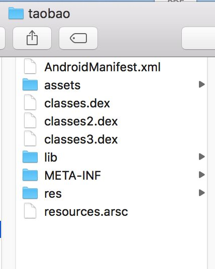
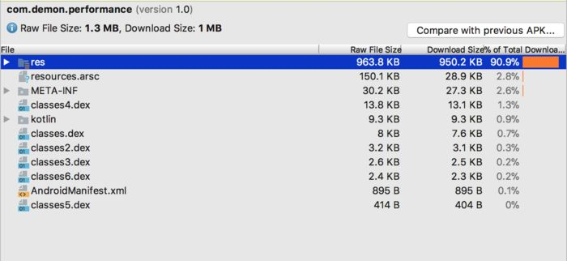

文章参考：https://mp.weixin.qq.com/s/TyGFnSkewqyHZoqFrPf2rQ

文章参考：https://juejin.cn/post/7016225898768629773

## 概述

实际开发应用时，包体积优化是必不可少的。毕竟手机内存有限，如果包体积过大很多用户会直接放弃(以前手机内存很小的时候，这个真的很重要)，现在由于手机内存大了(512G已经挡不住了)，现在的用户更关注流畅度和美观作为参考，但是该有的优化还是要优化的。

## APK结构解析

了解应用程序APK的结构对于我们来说很有帮助。APK文件由一个ZIP存档组成，其中包含组成应用程序的所有文件。这些文件包括Java类文件，资源文件和包含编译资源的文件。

APK包含以下目录：

- META-INF/：包含CERT.SF和 CERT.RSA签名文件以及MANIFEST.MF 清单文件。

- assets/：包含应用可以使用AssetManager对象检索的应用资源。

- res/：包含未编译到的资源 resources.arsc。

- lib/：包含特定于处理器软件层的编译代码。该目录包含了每种平台的子目录，像armeabi，armeabi-v7a， arm64-v8a，x86，x86_64，和mips。

- resources.arsc：包含已编译的资源。该文件包含res/values/ 文件夹所有配置中的XML内容。打包工具提取此XML内容，将其编译为二进制格式，并将内容归档。此内容包括语言字符串和样式，以及直接包含在resources.arsc文件中的内容路径 ，例如布局文件和图像。

- classes.dex：包含以Dalvik / ART虚拟机可理解的DEX文件格式编译的类。

- AndroidManifest.xml：包含核心Android清单文件。该文件列出应用程序的名称，版本，访问权限和引用的库文件。该文件使用Android的二进制XML格式。

  

  看看淘宝APP的unzip之后的文件目录

  

一般来讲APK结构中比较大的部分一般是classes.dex、lib、res、assets这些文件或者目录。所以接下来将会针对这四种情况进行讲解。
另外，我们通过APK Analyser 可以分析 APK

## 安装包监控

APK Analyser 是 Android Studio 提供的一个 APK 检测工具，通过它可以查看一个 apk 文件内部各项内容所占的大小，并且按照大小排序显示。因此我们很容易观察到 APK 中哪一部分内容占用了最大空间。APK Analyzer 的使用非常简单，只要将需要分析的 APK 文件拖入 Android Studio 中即可(直接点击项目中的apk也可以)，显示内容类似下图所示：

从上图中可以看出classes.dex都代码文件，不是很好东，看图片也占用了比较大的资源空间，因此可以针对性地对其做压缩优化等操作。(我这个项目是个demo所以显得代码占比较多。实际项目中肯定是图片资源占比相对较大)。

从上图看出，实际上 APK Analyzer 的作用不光是查看 APK 大小，从它的名字也能看出它是用来分析 APK 的，因此可以使用它来分析一些优秀 APK 的目录结构、代码规范，甚至是使用了哪些动态库技术等。

Matrix是微信终端自研和正在使用的一套APM（Application Performance Management）系统。 Matrix-ApkChecker 作为Matrix系统的一部分，是针对android安装包的分析检测工具，根据一系列设定好的规则检测apk是否存在特定的问题，并输出较为详细的检测结果报告，用于分析排查问题以及版本追踪。

## 安装包体积优化方案

- 减小classes.dex

  ​		classes.dex 包含了所有 Java 代码。当你编译你的应用时，gradle 会将你的所有模块里的 .class 文件转换成 .dex 文件并将这些文件合成一个 classes.dex 文件。

  ​		单个的 classes.dex 文件可以容纳大约 64K 方法。如果你达到了这个限制，你必须要在你的工程中启用 multidexing。这将会创建另一个 classes1.dex 文件去存储剩下的方法。所以 classes.dex 文件数目由你的方法数而定。

- 减少应用中不必要的资源文件，比如图片，在不影响APP效果的情况下尽量压缩图片，有一定的效果

- 在使用了SO库的时候优先保留v7版本的SO库，删掉其他版本的SO库。原因是在2018年，v7版本的SO库可以满足市面上绝大多数的要求，可能八九年前的手机满足不了，但我们也没必要去适配老掉牙的手机。实际开发中减少apk体积的效果是十分显著的，如果你使用了很多SO库，比方说一个版本的SO库一共10M，那么只保留v7版本，删掉armeabi和v8版本的SO库，一共可以减少20M的体积。

- res资源优化

  （1）只使用一套图片，使用高分辨率的图片。

  （2）UI设计在ps安装TinyPNG插件，对图片进行无损压缩。

  （3）svg图片：一些图片的描述，牺牲CPU的计算能力的，节省空间。使用的原则：简单的图标。

  （4）图片使用WebP(https://developers.google.com/speed/webp/)的格式（Facebook、腾讯、淘宝在用。）缺点：加载相比于PNG要慢很多。但是配置比较高。工具：http://isparta.github.io/

  （5）使用tintcolor(android - Change drawable color programmatically)实现按钮反选效果。

- 代码优化

  （1）实现功能模块的逻辑简化。

  （2）

  （3）Lint工具检查无用文件将无用的资源列在“UnusedResources: Unused resources”，删除。

  （4）移除无用的依赖库。减少第三方库的使用。我们往往会使用第三方Libaray，有时候我们可能仅仅用到了很少一部分的功能，这个时候就需要慎重考虑完全引用。从我的开发经验上来讲，宁愿参照自己去实现，也不愿意多引入一个第三方库。

- lib资源优化

  （1）动态下载的资源。

  （2）一些模块的插件化动态添加。

  （3）so文件的剪裁和压缩。

- assets资源优化

  （1）音频文件最好使用有损压缩的格式，比如采用opus、mp3等格式，但是最好不要使用无损压缩的音乐格式

  （2）对ttf字体文件压缩，可以采用FontCreator工具只提取出你需要的文字。比如在做日期显示时，其实只需要数字字体，但是使用原有的字体库可能需要10MB大小，如果只是把你需要的字体提取出来生成的字体文件只有10KB

- 代码混淆。

- 使用proGuard 代码混淆器工具，它包括压缩、优化、混淆等功能。

- 插件化

- 可将功能模块放服务器，需要用时再加载。

- 7z极限压缩