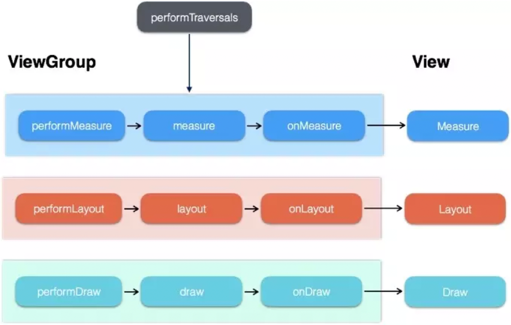
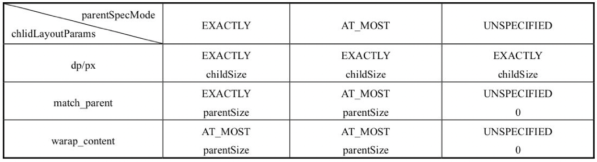

[TOC]


文章参考：https://www.jianshu.com/p/3d2c49315d68

在Android的知识体系中，View扮演着很重要的角色，简单来理解，View是Android在视觉上的呈现。在界面上Android提供了一套GUI库，里面有很多控件，但是很多时候我们并不满足于系统提供的控件，因为这样就意味这应用界面的同类化比较严重。

但是，通过自定义View我们可以实现各种五花八门的效果。但是自定义View是有一定难度的，尤其是复杂的自定义View，大部分时候我们仅仅了解基本控件的使用方法是无法做出复杂的自定义控件的。为了更好地自定义View，还需要掌握View的底层工作原理，比如View的测量流程、布局流程以及绘制流程，掌握这几个基本流程后，我们就对View的底层更加了解，这样我们就可以做出一个比较完善的自定义View。

 我们从上面的这段话中，可以看到View的绘制流程总共分三个阶段：测量流程（measure）、布局流程（layout）、绘制流程（draw）。

 View的绘制流程是从ViewRoot的performTraversals方法开始的，它经过measure、layout和draw三个过程才能最终将一个View绘制出来，其中measure用来测量View的宽和高，layout用来确定View在父容器中的放置位置，而draw则负责将View绘制在屏幕上。针对performTraversals（执行遍历）的大致流程

 我们贴一张图，来大概的看一下View的渲染流程。

 

 如上图所示：

 performTraversals会依次调用performMeasure、performLayout和performDraw三个方法，这三个方法分别完成顶级View的measure、layout和draw这三大流程，其中在performMeasure中会调用measure方法，在measure方法中又会调用onMeasure方法，在onMeasure方法中则会对所有的子元素进行measure过程，这个时候measure流程就从父容器传递到子元素中了，这样就完成了一次measure过程。

 接着子元素会重复父容器的measure过程，如此反复就完成了整个View树的遍历。同理，performLayout和performDraw的传递流程和performMeasure是类似的，唯一不同的是，performDraw的传递过程是在draw方法中通过dispatchDraw来实现的，不过这并没有本质区别。


 View的绘制是从上往下一层层迭代下来的。DecorView-->ViewGroup（--->ViewGroup）-->View ，按照这个流程从上往下，依次measure(测量),layout(布局),draw(绘制)。这个后续我们会详细讲解。

 除了View的三大流程以外，View常见的回调方法也是需要熟练掌握的，比如构造方法、onAttach、onVisibilityChanged、onDetach等。另外对于一些具有滑动效果的自定义View，我们还需要处理View的滑动，如果遇到滑动冲突就还需要解决相应的滑动冲突。自定义View的实现看起来很复杂，实际上说简单也简单。

###  View的绘制流程


```
    @UnsupportedAppUsage
    void scheduleTraversals() {
        //1、注意这个标志位，多次调用 requestLayout，要这个标志位false才有效
        if (!mTraversalScheduled) {
            mTraversalScheduled = true;
            // 2. 同步屏障
            mTraversalBarrier = mHandler.getLooper().getQueue().postSyncBarrier();
            // 3. 向 Choreographer 提交一个任务。然后
            mChoreographer.postCallback(
                    Choreographer.CALLBACK_TRAVERSAL, mTraversalRunnable, null);
            if (!mUnbufferedInputDispatch) {
                scheduleConsumeBatchedInput();
            }
            //绘制前发一个通知
            notifyRendererOfFramePending();
            //这个是释放锁，先不管
            pokeDrawLockIfNeeded();
        }
    }
```

其实后续会调用mTraversalRunnable的Runable任务


```
    final class TraversalRunnable implements Runnable {
        @Override
        public void run() {
            doTraversal();
        }
    }
    final TraversalRunnable mTraversalRunnable = new TraversalRunnable();
```

 这个Runnable任务里面就调用了一个方法doTraversal（执行View的遍历）


```
    void doTraversal() {
        if (mTraversalScheduled) {
            mTraversalScheduled = false;
            mHandler.getLooper().getQueue().removeSyncBarrier(mTraversalBarrier);

            if (mProfile) {
                Debug.startMethodTracing("ViewAncestor");
            }

            performTraversals();

            if (mProfile) {
                Debug.stopMethodTracing();
                mProfile = false;
            }
        }
    }
```

 这个方法里面很好的调用了我们需要调用performTraversals的执行View遍历的方法。这个也是我们图中所调用的方法。

 在这个方法里面，我们就可以看到很熟悉的调用我们上面的所说的几个方法。performTraversals会依次调用performMeasure、performLayout和performDraw三个方法。


###  初识ViewRoot和DecorView

正式介绍View的三大流程之前，我们必须先介绍一些基本概念，这样才能更好地理解View的measure、layout和draw过程，本节主要介绍ViewRoot和DecorView的概念。

 ViewRoot对应于ViewRootImpl类，它是连接WindowManager和DecorView的纽带，View的三大流程均是通过ViewRoot来完成的。在ActivityThread中，当Activity对象被创建完毕后，会将DecorView添加到Window中，同时会创建ViewRootImpl对象，并将ViewRootImpl对象和DecorView建立关联，这个过程可参看如下源码：


```
// 将DecorView的添加到Window的过程中。会实例化ViewRootImpl对象
root = new ViewRootImpl(view.getContext(),display);
root.setView(view,wparams,panelParentView);
```


 DecorView作为顶级View，一般情况下它内部会包含一个竖直方向的LinearLayout，在这个LinearLayout里面有上下两个部分（具体情况和Android版本及主题有关），上面是标题栏，下面是内容栏。

 在Activity中我们通过setContentView所设置的布局文件其实就是被加到内容栏之中的，而内容栏的id是content，因此可以理解为Activity指定布局的方法不叫setview而叫setContentView，因为我们的布局的确加到了id为content的FrameLayout中。如何得到content呢？可以这样：ViewGroup content= findViewById (R.android.id.content)。如何得到我们设置的View呢？可以这样：content.getChildAt(0)。


 通过源码我们可以知道，DecorView其实是一个FrameLayout，View层的事件都先经过DecorView，然后才传递给我们的View。


###  理解MeasureSpec

MeasureSpec看起来像“测量规格”或者“测量说明书”，不管怎么翻译，它看起来都好像是或多或少地决定了View的测量过程。

通过源码可以发现，MeasureSpec的确参与了View的measure过程。

MeasureSpec是干什么的呢？

确切来说，MeasureSpec在很大程度上决定了一个View的尺寸规格，之所以说是很大程度上是因为这个过程还受父容器的影响，因为父容器影响View的MeasureSpec的创建过程。在测量过程中，系统会将View的LayoutParams根据父容器所施加的规则转换成对应的MeasureSpec，然后再根据这个measureSpec来测量出View的宽/高。上面提到过，这里的宽/高是测量宽/高，不一定等于View的最终宽/高。MeasureSpec看起来有点复杂，其实它的实现是很简单的，下面会详细地分析MeasureSpec。


MeasureSpec代表一个32位int值，高2位代表SpecMode，低30位代表SpecSize，SpecMode是指测量模式，而SpecSize是指在某种测量模式下的规格大小。下面先看一下MeasureSpec内部的一些常量的定义，通过下面的代码，应该不难理解MeasureSpec的工作原理：


```java
 private static final int MODE_SHIFT = 30;
    private static final int MODE_MASK = 0x3 << MODE_SHIFT;
    public static final int UNSPECIFIED = 0 << MODE_SHIFT;
    public static final int EXACTLY = 1 << MODE_SHIFT;
    public static final int AT_MOST = 2 << MODE_SHIFT;

    // 生成MeasureSpec的32位int值
    public static int makeMeasureSpec(int size,int mode) {
        if (sUseBrokenMakeMeasureSpec) {
                return size + mode;
        } else {
                return (size & ~MODE_MASK) | (mode & MODE_MASK);
        }
    }
    // 获取测量模式
    public static int getMode(int measureSpec) {
        return (measureSpec & MODE_MASK);
    }
    // 获取测量尺寸的大小
    public static int getSize(int measureSpec) {
        return (measureSpec & ~MODE_MASK);
    }
```

MeasureSpec通过将SpecMode和SpecSize打包成一个int值来避免过多的对象内存分配，为了方便操作，其提供了打包和解包方法。这个我们很好理解，能用一个int值来表示测量规格和尺寸，那么我们又何必用两个呢？

SpecMode和SpecSize也是一个int值，一组SpecMode和SpecSize可以打包为一个MeasureSpec，而一个MeasureSpec可以通过解包的形式来得出其原始的SpecMode和SpecSize，需要注意的是这里提到的MeasureSpec是指MeasureSpec所代表的int值，而并非MeasureSpec本身。

####  SpecMode

SpecMode有三类，每一类都表示特殊的含义，如下所示。


```
UNSPECIFIED
// 父容器不对View有任何限制，要多大给多大，
// 这种情况一般用于系统内部，表示一种测量的状态。所以我们可以暂时不管
EXACTLY
// 父容器已经检测出View所需要的精确大小，这个时候View的最终大小就是SpecSize所指定的值。
// 它对应于LayoutParams中的match_parent(和父容器一样的长度))和具体的数值这两种模式。
AT_MOST
// 父容器指定了一个可用大小即SpecSize，View的大小不能大于这个值，
//具体是什么值要看不同View的具体实现。它对应于LayoutParams中的wrap_content(即和自身内容一样长度)。
```

#### MeasureSpec和LayoutParams的对应关系。

上面提到，系统内部是通过MeasureSpec来进行View的测量，但是正常情况下我们使用View指定MeasureSpec，尽管如此，但是我们可以给View设置LayoutParams。在View测量的时候，系统会将LayoutParams在父容器的约束下转换成对应的MeasureSpec，然后再根据这个MeasureSpec来确定View测量后的宽/高。

需要注意的是，MeasureSpec不是唯一由LayoutParams决定的，LayoutParams需要和父容器一起才能决定View的MeasureSpec，从而进一步决定View的宽/高。

另外，对于顶级View（即DecorView）和普通View来说，MeasureSpec的转换过程略有不同。

DecorView，其MeasureSpec由窗口的尺寸和其自身的LayoutParams来共同确定；对于普通View，其MeasureSpec由父容器的MeasureSpec和自身的LayoutParams来共同决定，MeasureSpec一旦确定后，onMeasure中就可以确定View的测量宽/高。

```
private static int getRootMeasureSpec(int windowSize, int rootDimension) {
        // 声明测量的MeasureSpec
        int measureSpec;
        // 根据LayoutParams的参数来确定DecorView的
        switch (rootDimension) {
        // 如果是MATCH_PARENT 很好理解。直接确定尺寸为屏幕尺寸    
        case ViewGroup.LayoutParams.MATCH_PARENT:
            // Window can't resize. Force root view to be windowSize.
            measureSpec = MeasureSpec.makeMeasureSpec(windowSize, MeasureSpec.EXACTLY);
            break;
        // 如果是WRAP_CONTENT 那么设置测量规格为AT_MOST。  
        case ViewGroup.LayoutParams.WRAP_CONTENT:
            // Window can resize. Set max size for root view.
            measureSpec = MeasureSpec.makeMeasureSpec(windowSize, MeasureSpec.AT_MOST);
            break;
        default:
            // Window wants to be an exact size. Force root view to be that size.
            // 如果是申请的具体的尺寸值，那么就设置为具体的尺寸值。规格为EXACTLY
            measureSpec = MeasureSpec.makeMeasureSpec(rootDimension, MeasureSpec.EXACTLY);
            break;
        }
        return measureSpec;
    }
```

通过上述代码，DecorView的MeasureSpec的产生过程就很明确了，具体来说其遵守如下规则，根据它的LayoutParams中的宽/高的参数来划分。

LayoutParams.MATCH_PARENT：精确模式，大小就是窗口的大小；

LayoutParams.WRAP_CONTENT：最大模式，大小不定，但是不能超过窗口的大小；

固定大小（比如100dp）：精确模式，大小为LayoutParams中指定的大小。


对于普通View来说，这里是指我们布局中的View，他的MeasureSpec的计算就稍微复杂一些了。


普通View的measure过程由ViewGroup传递而来，先看一下ViewGroup的measureChildWithMargins方法：


```java
    /**
     * 我们在进行子View测量的时候，必须要注意到：
     * 子View在声明的时候，很多时候会声明padding和margin。所以我们在测量的时候，要注意这两个参数的设置。
     * 下面我们来分析一下measureChildWithMargins的这种情况：
     **/
    protected void measureChildWithMargins(View child,
            int parentWidthMeasureSpec, int widthUsed,
            int parentHeightMeasureSpec, int heightUsed) {
        // 获取子View的MarginLayoutParams
        final MarginLayoutParams lp = (MarginLayoutParams) child.getLayoutParams();
        //我们来看一下子View的宽度测量规格、子View的高度测量规格
        // 很明显我们要研究一下getChildMeasureSpec这个方法。

        // 我们先看一下这个方法传入的参数：
        // 父View的MeasureSpec
        // 父View的总pading = (父View声明的pading+子View的margin+已经用掉的width）
        // 子View声明的宽度
        final int childWidthMeasureSpec = getChildMeasureSpec(parentWidthMeasureSpec,
                mPaddingLeft + mPaddingRight + lp.leftMargin + lp.rightMargin
                        + widthUsed, lp.width);
        final int childHeightMeasureSpec = getChildMeasureSpec(parentHeightMeasureSpec,
                mPaddingTop + mPaddingBottom + lp.topMargin + lp.bottomMargin
                        + heightUsed, lp.height);

        child.measure(childWidthMeasureSpec, childHeightMeasureSpec);
    }
```

上述方法会对子元素进行measure，在调用子元素的measure方法之前会先通过getChildMeasureSpec方法来得到子元素的MeasureSpec。从代码来看，很显然，子元素的MeasureSpec的创建与父容器的MeasureSpec和子元素本身的LayoutParams有关，此外还和View的margin及padding有关，具体情况可以看一下ViewGroup的getChildMeasureSpec方法，如下所示。


下面，我们就来看看获取ChildView的MeasureSpec的方法实现

```
    * // 我们先看一下这个方法传入的参数：
     *    父View的MeasureSpec
     *    父View的总pading = (父View声明的pading+子View的margin+已经用掉的width）
     *    子View声明的宽度
     */
    public static int getChildMeasureSpec(int spec, int padding, int childDimension) {
        // 根据父View的MeasureSpec来获取测量规格和尺寸
        int specMode = MeasureSpec.getMode(spec);
        int specSize = MeasureSpec.getSize(spec);
        // 我们计算子View可用的尺寸大小。就是父View的测量尺寸-父View的总padding.剩余的就是View的可用尺寸
        int size = Math.max(0, specSize - padding);
        // 声明子View的测量尺寸和测量规格
        int resultSize = 0;
        int resultMode = 0;
        // 我们根据父View的测量模式来一次计算子View的测量模式
        // 我们可以用表格来进行来归纳总结
        switch (specMode) {
        /// 如果父View是确切尺寸
        // Parent has imposed an exact size on us
        case MeasureSpec.EXACTLY:
            // 如果子View的测量尺寸是确切值，
            if (childDimension >= 0) {
                // 如果子View的尺寸大于0 ，则设置
                resultSize = childDimension;
                resultMode = MeasureSpec.EXACTLY;
            } else if (childDimension == LayoutParams.MATCH_PARENT) {
                // Child wants to be our size. So be it.
                // 如果子View的尺寸是MATCH_PARENT  则子View等于占满父View的剩余尺寸
                resultSize = size;
                resultMode = MeasureSpec.EXACTLY;
            } else if (childDimension == LayoutParams.WRAP_CONTENT) {
                // Child wants to determine its own size. It can't be
                // bigger than us.
                // 如果子View的尺寸是WRAP_CONTENT 则子View为AT_MOST  小于等于size
                resultSize = size;
                resultMode = MeasureSpec.AT_MOST;
            }
            break;

        // Parent has imposed a maximum size on us
        // 如果父View的测量规格是AT_MOST
        case MeasureSpec.AT_MOST:
            if (childDimension >= 0) {
                // Child wants a specific size... so be it
                // 如果子View的尺寸大于0 ，则设置
                resultSize = childDimension;
                resultMode = MeasureSpec.EXACTLY;
            } else if (childDimension == LayoutParams.MATCH_PARENT) {
                // 如果子View的尺寸是MATCH_PARENT  则子View等于占满父View的剩余尺寸
                // Child wants to be our size, but our size is not fixed.
                // Constrain child to not be bigger than us.
                resultSize = size;
                resultMode = MeasureSpec.AT_MOST;
            } else if (childDimension == LayoutParams.WRAP_CONTENT) {
                // Child wants to determine its own size. It can't be
                // bigger than us.
                resultSize = size;
                resultMode = MeasureSpec.AT_MOST;
            }
            break;

        // Parent asked to see how big we want to be
        case MeasureSpec.UNSPECIFIED:
            if (childDimension >= 0) {
                // Child wants a specific size... let him have it
                resultSize = childDimension;
                resultMode = MeasureSpec.EXACTLY;
            } else if (childDimension == LayoutParams.MATCH_PARENT) {
                // Child wants to be our size... find out how big it should
                // be
                resultSize = View.sUseZeroUnspecifiedMeasureSpec ? 0 : size;
                resultMode = MeasureSpec.UNSPECIFIED;
            } else if (childDimension == LayoutParams.WRAP_CONTENT) {
                // Child wants to determine its own size.... find out how
                // big it should be
                resultSize = View.sUseZeroUnspecifiedMeasureSpec ? 0 : size;
                resultMode = MeasureSpec.UNSPECIFIED;
            }
            break;
        }
        //noinspection ResourceType
        return MeasureSpec.makeMeasureSpec(resultSize, resultMode);
    }
```

上述方法不难理解，它的主要作用是根据父容器的MeasureSpec同时结合View本身的LayoutParams来确定子元素的MeasureSpec，参数中的padding是指父容器中已占用的空间大小，因此子元素可用的大小为父容器的尺寸减去padding，具体代码如下所示。


```
int specSize = MeasureSpec.getSize(spec);
int size = Math.max(0,specSize -padding);
```

getChildMeasureSpec清楚展示了普通View的MeasureSpec的创建规则，为了更清晰地理解getChildMeasureSpec的逻辑，这里提供一个表，表中对getChildMeasureSpec的工作原理进行了梳理。


普通View的MeasureSpec的创建规则



前面已经提到，对于普通View，其MeasureSpec由父容器的MeasureSpec和自身的LayoutParams来共同决定，那么针对不同的父容器和View本身不同的LayoutParams，View就可以有多种MeasureSpec。


#### MeasureSpec到底是怎么来的？

这个问题，我想现在已经很好回答了。

传给一个View的MeasureSpec是他的父View的MeasureSpec和其自身View的LayoutParams共同作用之后的结果。


当View采用固定宽/高的时候，不管父容器的MeasureSpec是什么，View的MeasureSpec都是精确模式并且其大小遵循Layoutparams中的大小。

当View的宽/高是match_parent时，所有的此View的SpecMode就等于父View的SpecMode。如果父容器的模式是精准模式，那么View也是精准模式并且其大小是父容器的剩余空间；如果父容器是最大模式，那么View也是最大模式并且其大小不会超过父容器的剩余空间。


当View的宽/高是wrap_content时，那么此View的SpecMode就是AT_MOST模式。不管父容器的模式是精准还是最大化，View的模式总是最大化并且大小不能超过父容器的剩余空间。

可能读者会发现，在我们的分析中漏掉了UNSPECIFIED模式，那是因为这个模式主要用于系统内部多次Measure的情形，一般来说，我们不需要关注此模式。
       
只要提供父容器的MeasureSpec和子元素的LayoutParams，就可以快速地确定出子元素的MeasureSpec了，有了MeasureSpec就可以进一步确定出子元素测量后的大小了。