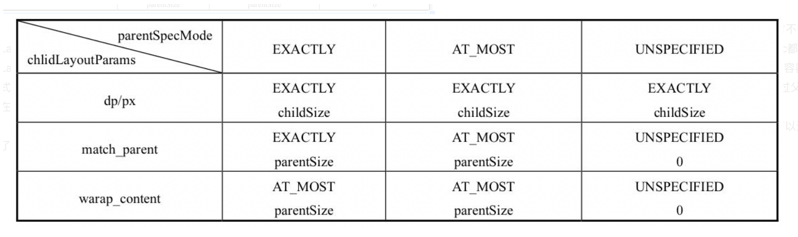

[TOC]


文章参考：https://blog.csdn.net/briblue/article/details/72190143

文章参考：https://www.jianshu.com/p/1dab927b2f36

View的工作流程主要是指measure()、layout()、draw()这三大流程，即测量、布局和绘制，其中measure确定View的测量宽/高，layout确定View的最终宽/高和四个顶点的位置，而draw则将View绘制到屏幕上。

下面我们来学习measure()方法。为了更好地理解View的测量过程。


我们还需要理解下面两个类：
- ViewGroup.LayoutParams类
- MeasureSpecs 类（父视图对子视图的测量要求）

#### 理解 ViewGroup.LayoutParams

ViewGroup 的子类（RelativeLayout、LinearLayout）有其对应的 ViewGroup.LayoutParams 子类

如：RelativeLayout的 ViewGroup.LayoutParams子类
= RelativeLayoutParams

他的作用是指定视图View 的高度（height） 和 宽度（width）等布局参数。可通过以下参数指定

```java
android:layout_height="wrap_content"   //自适应大小  
android:layout_height="match_parent"   //与父视图等高  
android:layout_height="fill_parent"    //与父视图等高  
android:layout_height="100dip"         //精确设置高度值为 100dip  
```


#### 理解MeasureSpec

MeasureSpec我们在上一章节已经详细的讲到，这里我们简单的回顾一下。


从名字上来看，MeasureSpec看起来像“测量规格”或者“测量说明书”，不管怎么翻译，它看起来都好像是或多或少地决定了View的测量过程。通过源码可以发现，MeasureSpec的确参与了View的measure过程。读者可能有疑问，MeasureSpec是干什么的呢？

确切来说，MeasureSpec在很大程度上决定了一个View的尺寸规格，之所以说是很大程度上是因为这个过程还受父容器的影响，因为父容器影响View的MeasureSpec的创建过程。在Viewde的measure过程中，系统会将View的LayoutParams结合父容器所施加的规则转换成对应的MeasureSpec，然后再根据这个measureSpec来测量出View的宽/高。

上面提到过，这里的宽/高是测量宽/高，不一定等于View的最终宽/高。MeasureSpec看起来有点复杂，其实它的实现是很简单的，下面会通过源码详细地分析MeasureSpec。

MeasureSpec代表一个32位int值，高2位代表SpecMode，低30位代表SpecSize，SpecMode是指测量模式，而SpecSize是指在某种测量模式下的规格大小。下面先看一下MeasureSpec内部的一些常量的定义，通过下面的代码，应该不难理解MeasureSpec的工作原理：

```
private static final int MODE_SHIFT = 30;
    private static final int MODE_MASK = 0x3 << MODE_SHIFT;
    public static final int UNSPECIFIED = 0 << MODE_SHIFT;
    public static final int EXACTLY = 1 << MODE_SHIFT;
    public static final int AT_MOST = 2 << MODE_SHIFT;

    // 生成MeasureSpec的32位int值
    public static int makeMeasureSpec(int size,int mode) {
        if (sUseBrokenMakeMeasureSpec) {
                return size + mode;
        } else {
                return (size & ~MODE_MASK) | (mode & MODE_MASK);
        }
    }
    // 获取测量模式
    public static int getMode(int measureSpec) {
        return (measureSpec & MODE_MASK);
    }
    // 获取测量尺寸的大小
    public static int getSize(int measureSpec) {
        return (measureSpec & ~MODE_MASK);
    }
```
 MeasureSpec通过将SpecMode和SpecSize打包成一个int值来避免过多的对象内存分配，为了方便操作，其提供了打包和解包方法。SpecMode和SpecSize也是一个int值，一组SpecMode和SpecSize可以打包为一个MeasureSpec，而一个MeasureSpec可以通过解包的形式来得出其原始的SpecMode和SpecSize，需要注意的是这里提到的MeasureSpec是指MeasureSpec所代表的int值，而并非MeasureSpec本身。

 SpecMode有三类，每一类都表示特殊的含义，如下所示。

```
UNSPECIFIED
// 父容器不对View有任何限制，要多大给多大，
// 这种情况一般用于系统内部，表示一种测量的状态。
EXACTLY
// 父容器已经检测出View所需要的精确大小，这个时候View的最终大小就是SpecSize所指定的值。
// 它对应于LayoutParams中的match_parent(和父容器一样的长度))和具体的数值这两种模式。
AT_MOST
// 父容器指定了一个可用大小即SpecSize，View的大小不能大于这个值，
//具体是什么值要看不同View的具体实现。它对应于LayoutParams中的wrap_content(即和自身内容一样长度)。
```
#### MeasureSpec和LayoutParams的对应关系

上面提到，系统内部是通过MeasureSpec来进行View的测量，但是正常情况下我们使用View指定MeasureSpec，尽管如此，但是我们可以给View设置LayoutParams。

在View测量的时候，系统会将LayoutParams在父容器的约束下转换成对应的MeasureSpec，然后再根据这个MeasureSpec来确定View测量后的宽/高。

需要注意的是，MeasureSpec不是唯一由LayoutParams决定的，LayoutParams需要和父容器一起才能决定View的MeasureSpec，从而进一步决定View的宽/高。

另外，对于顶级View（即DecorView）和普通View来说，MeasureSpec的转换过程略有不同。对于DecorView，其MeasureSpec由窗口的尺寸和其自身的LayoutParams来共同确定；对于普通View，其MeasureSpec由父容器的MeasureSpec和自身的LayoutParams来共同决定，MeasureSpec一旦确定后，onMeasure中就可以确定View的测量宽/高。

对于DecorView来说，在ViewRootImpl中的measureHierarchy方法中有如下一段代码，它展示了DecorView的MeasureSpec的创建过程，其中desiredWindowWidth和desired-WindowHeight是屏幕的尺寸：

```
childWidthMeasureSpec = getRootMeasureSpec(desiredWindowWidth,lp.width);
childHeightMeasureSpec = getRootMeasureSpec(desiredWindowHeight,lp.height);
performMeasure(childWidthMeasureSpec,childHeightMeasureSpec);
        接着再看一下getRootMeasureSpec方法的实现：
 
private static int getRootMeasureSpec(int windowSize,int rootDimension) {
        int measureSpec;
        switch (rootDimension) {
        case ViewGroup.LayoutParams.MATCH_PARENT:
                // Window can't resize. Force root view to be windowSize.
                // 这个时候就是精确的大小，就是窗口的大小
                measureSpec = MeasureSpec.makeMeasureSpec(windowSize,MeasureSpec.EXACTLY);
                break;
        case ViewGroup.LayoutParams.WRAP_CONTENT:
                // Window can resize. Set max size for root view.
                // 最大模式，大小不确定。但是不能超过窗口的大小
                measureSpec = MeasureSpec.makeMeasureSpec(windowSize,MeasureSpec.AT_MOST);
                break;
        default:
                // Window wants to be an exact size. Force root view to be that size.      // 精确大小。大小就是LayoutParams中指定的大小
                measureSpec = MeasureSpec.makeMeasureSpec(rootDimension,Measure-Spec.EXACTLY);
                break;
        }
        return measureSpec;
    }
```

通过上述代码，DecorView的MeasureSpec的产生过程就很明确了，具体来说其遵守如下规则，根据它的LayoutParams中的宽/高的参数来划分。

LayoutParams.MATCH_PARENT：精确模式，大小就是窗口的大小；

LayoutParams.WRAP_CONTENT：最大模式，大小不定，但是不能超过窗口的大小；

固定大小（比如100dp）：精确模式，大小为LayoutParams中指定的大小。

 对于普通View来说，这里是指我们布局中的View，View的measure过程由ViewGroup传递而来，先看一下ViewGroup的measureChildWithMargins方法：

 // 根据Margin进行子View的测量


### measure过程源码分析

measure过程要分情况来看，如果只是一个原始的View，那么通过measure方法就完成了其测量过程，如果是一个ViewGroup，除了完成自己的测量过程外，还会遍历去调用所有子元素的measure方法，各个子元素再递归去执行这个流程，下面针对这两种情况分别讨论。

#### 1. View的measure过程

 View的measure过程由其measure方法来完成，measure方法是一个final类型的方法，这意味着子类不能重写此方法，在View的measure方法中会去调用View的onMeasure方法，因此只需要看onMeasure的实现即可，View的onMeasure方法如下所示。


```
protected void onMeasure(int widthMeasureSpec,int heightMeasureSpec) {
    // View的onmeasure方法很简单，就是再里面调用了setMeasuredDimension设置测量的尺寸。那这个方法就比较重要了。     
     setMeasuredDimension(getDefaultSize(getSuggestedMinimumWidth(),widthMeasureSpec),getDefaultSize(getSuggestedMinimumHeight(),heightMeasureSpec));
    }
```

上述代码很简洁，但是简洁并不代表简单，setMeasuredDimension方法会设置View宽/高的测量值，在分析之前，我们先来看一下getDefaultSize()这个方法。


因此我们只需要看getDefaultSize这个方法即可：

```
    /**
     * Utility to return a default size. Uses the supplied size if the
     * MeasureSpec imposed no constraints. Will get larger if allowed
     * by the MeasureSpec.
     *
     * @param size Default size for this view  当前View的默认尺寸
     * @param measureSpec Constraints imposed by the parent  父View施加的measureSpec约束
     * @return The size this view should be.
     * 获取View测量出来的默认尺寸的大小。传入的参数是尺寸和MeasureSpec
     * 我们要清晰理解这个传入尺寸和MeasureSpec
     */
    public static int getDefaultSize(int size, int measureSpec) {
        // 设置默认大小
        int result = size;
        // 获取父View施加的宽/高测量规格的模式 & 测量大小
        int specMode = MeasureSpec.getMode(measureSpec);
        int specSize = MeasureSpec.getSize(measureSpec);

        switch (specMode) {
        case MeasureSpec.UNSPECIFIED:
            // 模式为UNSPECIFIED时，使用提供的默认大小 = 参数Size
            result = size;
            break;
        // 模式为AT_MOST,EXACTLY时，使用View测量后的宽/高值 = measureSpec中的Size
        case MeasureSpec.AT_MOST:
        case MeasureSpec.EXACTLY:
            result = specSize;
            break;
        }
        // 返回View的宽/高值
        return result;
    }
```

可以看出，getDefaultSize这个方法的逻辑很简单，对于我们来说，我们只需要看AT_MOST和.EXACTLY这两种情况。

单地理解，其实getDefaultSize返回的大小就是measureSpec中的specSize，而这个specSize就是View测量后的大小，这里多次提到测量后的大小，是因为View最终的大小是在layout阶段确定的，所以这里必须要加以区分，但是几乎所有情况下View的测量大小和最终大小是相等的。

至于UNSPECIFIED这种情况，一般用于系统内部的测量过程，在这种情况下，View的大小为getDefaultSize的第一个参数size，即宽/高分别为getSuggestedMinimumWidth和getSuggestedMinimumHeight这两个方法的返回值，看一下它们的源码：


```
// 获取建议的小好的宽度和高度
protected int getSuggestedMinimumWidth() {
        return (mBackground == null) ? mMinWidth : max(mMinWidth,mBackground.getMinimumWidth());
    }
    protected int getSuggestedMinimumHeight() {
        return (mBackground == null) ? mMinHeight : max(mMinHeight,mBackground.getMinimumHeight());
    }
```

这里只分析getSuggestedMinimumWidth方法的实现，getSuggestedMinimumHeight和它的实现原理是一样的。

从getSuggestedMinimumWidth的代码可以看出，如果View没有设置背景，那么View的宽度为mMinWidth，而mMinWidth对应于android:minWidth这个属性所指定的值，因此View的宽度即为android:minWidth属性所指定的值。这个属性如果不指定，那么mMinWidth则默认为0；如果View指定了背景，则View的宽度为max(mMinWidth,mBackground.getMinimumWidth())。如果View指定了背景，则View的宽度为max(mMinWidth,mBackground.getMinimumWidth())。

mMinWidth的含义我们已经知道了，那么mBackground.getMinimumWidth()是什么呢？我们看一下Drawable的getMinimumWidth方法，如下所示。

```
public int getMinimumWidth() {
        final int intrinsicWidth = getIntrinsicWidth();
        return intrinsicWidth > 0 ? intrinsicWidth : 0;
}
```
 可以看出，getMinimumWidth返回的就是Drawable的原始宽度，前提是这个Drawable有原始宽度，否则就返回0。那么Drawable在什么情况下有原始宽度呢？这里先举个例子说明一下，ShapeDrawable无原始宽/高，而BitmapDrawable有原始宽/高（图片的尺寸）

 再总结一下getSuggestedMinimumWidth的逻辑：如果View没有设置背景，那么返回android:minWidth这个属性所指定的值，这个值可以为0；如果View设置了背景，则返回android:minWidth和背景的最小宽度这两者中的最大值，getSuggestedMinimumWidth和getSuggestedMinimumHeight的返回值就是View在UNSPECIFIED情况下的测量宽/高。


 从getDefaultSize方法的实现来看，View的宽/高由specSize决定，所以我们可以得出如下结论：

 **直接继承View的自定义控件需要重写onMeasure方法并设置wrap_content时的自身大小，否则在布局中使用wrap_content就相当于使用match_parent。**



为什么呢？这个原因需要结合上述代码和上面的表格才能更好地理解。从上述代码中我们知道，如果View在布局中使用wrap_content，那么它的specMode是AT_MOST模式，在这种模式下，它的宽/高等于specSize；查表4-1可知，这种情况下View的specSize是parentSize，而parentSize是父容器中目前可以使用的大小，也就是父容器当前剩余的空间大小。很显然，View的宽/高就等于父容器当前剩余的空间大小，这种效果和在布局中使用match_parent完全一致。如何解决这个问题呢？也很简单，代码如下所示。

```java
// 所以，从上面这段话中，我们可以清楚的知道：当我们重写自定义View的时候。也就是继承自View的自定义View
protected void onMeasure(int widthMeasureSpec,int heightMeasureSpec) {
        super.onMeasure(widthMeasureSpec,heightMeasureSpec);
       // 获取子View的SpecMode和SpecSize
        int widthSpecMode = MeasureSpec.getMode(widthMeasureSpec);
        int widthSpecSize = MeasureSpec.getSize(widthMeasureSpec);
        int heightSpecMode = MeasureSpec.getMode(heightMeasureSpec);
        int heightSpecSize = MeasureSpec.getSize(heightMeasureSpec);
        // 然后根据宽度和高度
        if (widthSpecMode == MeasureSpec.AT_MOST && heightSpecMode == MeasureSpec.AT_MOST) {
                // 如果是都是AT_MOST 那就是按照自定义View的大小直接设定
                setMeasuredDimension(mWidth,mHeight);
                // 否则是谁就是设定谁的大小
        } else if (widthSpecMode == MeasureSpec.AT_MOST) {
                setMeasuredDimension(mWidth,heightSpecSize);
        } else if (heightSpecMode == MeasureSpec.AT_MOST) {
                setMeasuredDimension(widthSpecSize,mHeight);
        }
    }
```
在上面的代码中，我们只需要给View指定一个默认的内部宽/高（mWidth和mHeight），并在wrap_content时设置此宽/高即可。对于非wrap_content情形，我们沿用系统的测量值即可，至于这个默认的内部宽/高的大小如何指定，这个没有固定的依据，根据需要灵活指定即可。如果查看TextView、ImageView等的源码就可以知道，针对wrap_content情形，它们的onMeasure方法均做了特殊处理，读者可以自行查看它们的源码。

 我们可以参考TextView和ImageView的源码。来看一下他们是怎么处理这个情形的。

 其实很简单，VIew的Measure过程就是上面这些内容。下面我们来看一下ViewGroup的measure过程。


#### 2. ViewGroup的measure过程

对于ViewGroup来说，除了完成自己的measure过程以外，还会遍历去调用所有子元素的measure方法，各个子元素再递归去执行这个过程。和View不同的是，ViewGroup是一个抽象类，因此它没有重写View的onMeasure方法，但是它提供了一个叫measureChildren的方法，如下所示。
```java
// 测量子View的方法
protected void measureChildren(int widthMeasureSpec,int heightMeasureSpec) {
        final int size = mChildrenCount;
        final View[] children = mChildren;
        for (int i = 0; i < size; ++i) {
                final View child = children[i];
                if ((child.mViewFlags & VISIBILITY_MASK) != GONE) {
                        measureChild(child,widthMeasureSpec,heightMeasureSpec);
                }
        }
    }
```
从上述代码来看，ViewGroup在measure时，会对每一个子元素进行measure，measureChild这个方法的实现也很好理解，如下所示。

```java
    /**
     * Ask one of the children of this view to measure itself, taking into
     * account both the MeasureSpec requirements for this view and its padding.
     * The heavy lifting is done in getChildMeasureSpec.
     *
     * @param child The child to measure
     * @param parentWidthMeasureSpec The width requirements for this view
     * @param parentHeightMeasureSpec The height requirements for this view
     */
    protected void measureChild(View child, int parentWidthMeasureSpec,
            int parentHeightMeasureSpec) {
        // 获取Child的LayoutParams.主要是为了获取View的宽高等尺寸
        final LayoutParams lp = child.getLayoutParams();
        /// 这个方法很重要，我们可看一下，这个参数传入的parentWidthMeasureSpec(父View的测量规格)、父View的padding、子View的宽度
        final int childWidthMeasureSpec = getChildMeasureSpec(parentWidthMeasureSpec,
                mPaddingLeft + mPaddingRight, lp.width);
        /// 这个方法很重要，我们可看一下，这个参数传入的parentHeightMeasureSpec(父View的测量规格)、父View的padding、子View的高度
        final int childHeightMeasureSpec = getChildMeasureSpec(parentHeightMeasureSpec,
                mPaddingTop + mPaddingBottom, lp.height);
        /// 正式由这些共同作用，然后确定生成了子View的测量规格
        // 然后最后计算子View的measure方法
        child.measure(childWidthMeasureSpec, childHeightMeasureSpec);
    }

```

很显然，measureChild的思想就是取出子元素的LayoutParams，然后再通过getChildMeasureSpec来创建子元素的MeasureSpec，接着将MeasureSpec直接传递给View的measure方法来进行测量。getChildMeasureSpec的工作过程已经在上面进行了详细分析，通过表4-1可以更清楚地了解它的逻辑。


```java
    public static int getChildMeasureSpec(int spec, int padding, int childDimension) {
        //父view的测量模式
        int specMode = MeasureSpec.getMode(spec);
        //父view的大小
        int specSize = MeasureSpec.getSize(spec);
        //通过父view计算出的子view = 父大小-父控件的内边距（父要求的大小，但子view不一定用这个值）
        int size = Math.max(0, specSize - padding);
        //子view想要的实际大小和模式（需要计算）  
        int resultSize = 0;
        int resultMode = 0;
         //通过父view的MeasureSpec和子view的LayoutParams确定子view的大小  
         //所以我们根据父布局的specMode
         // 当父view的模式为EXACITY时，父view强加给子view确切的值
         //一般是父view设置为match_parent或者固定值的ViewGroup 
        switch (specMode) {
        // Parent has imposed an exact size on us
        case MeasureSpec.EXACTLY:
            // 当子view的LayoutParams>0，即有确切的值  
            if (childDimension >= 0) {
                //子view大小为子自身所赋的值，模式大小为EXACTLY  
                resultSize = childDimension;
                resultMode = MeasureSpec.EXACTLY;
                // 当子view的LayoutParams为MATCH_PARENT时(-1)  
            } else if (childDimension == LayoutParams.MATCH_PARENT) {
                // Child wants to be our size. So be it.
                //子view大小为父view大小，模式为EXACTLY  
                resultSize = size;
                resultMode = MeasureSpec.EXACTLY;
            } else if (childDimension == LayoutParams.WRAP_CONTENT) {
                // Child wants to determine its own size. It can't be
                // bigger than us.
                // 当子view的LayoutParams为WRAP_CONTENT时(-2)      
                 //子view决定自己的大小，但最大不能超过父view，模式为AT_MOST  
                resultSize = size;
                resultMode = MeasureSpec.AT_MOST;
            }
            break;

        // Parent has imposed a maximum size on us
        // 当父view的模式为AT_MOST时，父view强加给子view一个最大的值。（一般是父view设置为wrap_content） 
        case MeasureSpec.AT_MOST:
            if (childDimension >= 0) {
                // Child wants a specific size... so be it
                resultSize = childDimension;
                resultMode = MeasureSpec.EXACTLY;
            } else if (childDimension == LayoutParams.MATCH_PARENT) {
                // Child wants to be our size, but our size is not fixed.
                // Constrain child to not be bigger than us.
                resultSize = size;
                resultMode = MeasureSpec.AT_MOST;
            } else if (childDimension == LayoutParams.WRAP_CONTENT) {
                // Child wants to determine its own size. It can't be
                // bigger than us.
                resultSize = size;
                resultMode = MeasureSpec.AT_MOST;
            }
            break;

        // Parent asked to see how big we want to be
        // 当父view的模式为UNSPECIFIED时，父容器不对view有任何限制，要多大给多大
        // 多见于ListView、GridView  
        case MeasureSpec.UNSPECIFIED:
            // 子view大小为子自身所赋的值  
            if (childDimension >= 0) {
                // Child wants a specific size... let him have it
                resultSize = childDimension;
                resultMode = MeasureSpec.EXACTLY;
            } else if (childDimension == LayoutParams.MATCH_PARENT) {
                // Child wants to be our size... find out how big it should
                // be
                // 因为父view为UNSPECIFIED，所以MATCH_PARENT的话子类大小为0
                resultSize = View.sUseZeroUnspecifiedMeasureSpec ? 0 : size;
                resultMode = MeasureSpec.UNSPECIFIED;
            } else if (childDimension == LayoutParams.WRAP_CONTENT) {
                // Child wants to determine its own size.... find out how
                // big it should be
                 // 因为父view为UNSPECIFIED，所以WRAP_CONTENT的话子类大小为0  
                resultSize = View.sUseZeroUnspecifiedMeasureSpec ? 0 : size;
                resultMode = MeasureSpec.UNSPECIFIED;
            }
            break;
        }
        //noinspection ResourceType
        return MeasureSpec.makeMeasureSpec(resultSize, resultMode);
    }
```


### LinearLayout的布局流程

 我们知道，ViewGroup并没有定义其测量的具体过程，这是因为ViewGroup是一个抽象类，其测量过程的onMeasure方法需要各个子类去具体实现，比如LinearLayout、RelativeLayout等，为什么ViewGroup不像View一样对其onMeasure方法做统一的实现呢？那是因为不同的ViewGroup子类有不同的布局特性，这导致它们的测量细节各不相同，比如LinearLayout和RelativeLayout这两者的布局特性显然不同，因此ViewGroup无法做统一实现。下面就通过LinearLayout的onMeasure方法来分析ViewGroup的measure过程，其他Layout类型读者可以自行分析。

 首先来看LinearLayout的onMeasure方法，如下所示。

```
// LinearLayout的onMuasure的方法。是根据其布局方法。水平布局和垂直布局是不同的测过程
protected void onMeasure(int widthMeasureSpec,int heightMeasureSpec) {
        if (mOrientation == VERTICAL) {
                measureVertical(widthMeasureSpec,heightMeasureSpec);
        } else {
                measureHorizontal(widthMeasureSpec,heightMeasureSpec);
        }
    }
```
上述代码很简单，我们选择一个来看一下，比如选择查看竖直布局的LinearLayout的测量过程，即measureVertical方法，measureVertical的源码比较长，下面只描述其大概逻辑，首先看一段代码： 

```
// See how tall everyone is. Also remember max width.
    for (int i = 0; i < count; ++i) {
        // 获取所有的子View
        final View child = getVirtualChildAt(i);
        ...
        // Determine how big this child would like to be. If this or
        // previous children have given a weight,then we allow it to
        // use all available space (and we will shrink things later
        // if needed).
        // 遍历所有的子View然后针对每个子View执行measureChildBeforeLayout方法    
        measureChildBeforeLayout(
                   child,i,widthMeasureSpec,0,heightMeasureSpec,
                   totalWeight == 0 ? mTotalLength : 0);
        if (oldHeight != Integer.MIN_VALUE) {
           lp.height = oldHeight;
        }
        final int childHeight = child.getMeasuredHeight();
        final int totalLength = mTotalLength;
// 这样就通过mTotalLength这个变量来存储LinearLayout在竖直方向的初步高度
        mTotalLength=Math.max(totalLength,totalLength+childHeight+lp.topMargin +
                   lp.bottomMargin + getNextLocationOffset(child));
    }
```

 从上面这段代码可以看出，系统会遍历子元素并对每个子元素执行measureChild-BeforeLayout方法，这个方法内部会调用子元素的measure方法，这样各个子元素就开始依次进入measure过程，并且系统会通过mTotalLength这个变量来存储LinearLayout在竖直方向的初步高度。每测量一个子元素，mTotalLength就会增加，增加的部分主要包括了子元素的高度以及子元素在竖直方向上的margin等。当子元素测量完毕后，LinearLayout会测量自己的大小，源码如下所示。

```
 // Add in our padding
    mTotalLength += mPaddingTop + mPaddingBottom;
    // 设置初始的heightSize等于测量子View的高度总和
    int heightSize = mTotalLength;
    // Check against our minimum height
    heightSize = Math.max(heightSize,getSuggestedMinimumHeight());
    // Reconcile our calculated size with the heightMeasureSpec
    int heightSizeAndState=resolveSizeAndState(heightSize,heightMeasureSpec,
    0);
    heightSize = heightSizeAndState & MEASURED_SIZE_MASK;
     ...
    setMeasuredDimension(resolveSizeAndState(maxWidth,widthMeasureSpec,
    childState),
    heightSizeAndState);
```
这里对上述代码进行说明，当子元素测量完毕后，LinearLayout会根据子元素的情况来测量自己的大小。针对竖直的LinearLayout而言，它在水平方向的测量过程遵循View的测量过程，在竖直方向的测量过程则和View有所不同。具体来说是指，如果它的布局中高度采用的是match_parent或者具体数值，那么它的测量过程和View一致，即高度为specSize；如果它的布局中高度采用的是wrap_content，那么它的高度是所有子元素所占用的高度总和，但是仍然不能超过它的父容器的剩余空间，当然它的最终高度还需要考虑其在竖直方向的padding，这个过程可以进一步参看如下源码：

```
public static int resolveSizeAndState(int size,int measureSpec,int
    childMeasuredState) {
        int result = size;
        int specMode = MeasureSpec.getMode(measureSpec);
        int specSize =  MeasureSpec.getSize(measureSpec);
        switch (specMode) {
        case MeasureSpec.UNSPECIFIED:
                result = size;
                break;
        case MeasureSpec.AT_MOST:
                if (specSize < size) {
                        result = specSize | MEASURED_STATE_TOO_SMALL;
                } else {
                        result = size;
                }
                break;
        case MeasureSpec.EXACTLY:
                result = specSize;
                break;
        }
        return result | (childMeasuredState&MEASURED_STATE_MASK);
    }
```

View的measure过程是三大流程中最复杂的一个，measure完成以后，通过getMeasured-Width/Height方法就可以正确地获取到View的测量宽/高。需要注意的是，在某些极端情况下，系统可能需要多次measure才能确定最终的测量宽/高，在这种情形下，在onMeasure方法中拿到的测量宽/高很可能是不准确的。一个比较好的习惯是在onLayout方法中去获取View的测量宽/高或者最终宽/高。

上面已经对View的measure过程进行了详细的分析，现在考虑一种情况，比如我们想在Activity已启动的时候就做一件任务，但是这一件任务需要获取某个View的宽/高。这个问题读者可能会说，这很简单啊，在onCreate或者onResume里面去获取这个View的宽/高不就行了？读者可以自行试一下，实际上在onCreate、onStart、onResume中均无法正确得到某个View的宽/高信息，这是因为View的measure过程和Activity的生命周期方法不是同步执行的，因此无法保证Activity执行了onCreate、onStart、onResume时某个View已经测量完毕了，如果View还没有测量完毕，那么获得的宽/高就是0。有没有什么方法能解决这个问题呢？答案是有的，这里给出四种方法来解决这个问题：

1）Activity/View#onWindowFocusChanged。

onWindowFocusChanged这个方法的含义是：View已经初始化完毕了，宽/高已经准备好了，这个时候去获取宽/高是没问题的。需要注意的是，onWindowFocusChanged会被调用多次，当Activity的窗口得到焦点和失去焦点时均会被调用一次。具体来说，当Activity继续执行和暂停执行时，onWindowFocusChanged均会被调用，如果频繁地进行onResume和onPause，那么onWindowFocusChanged也会被频繁地调用。典型代码如下：

```
public void onWindowFocusChanged(boolean hasFocus) {
        super.onWindowFocusChanged(hasFocus);
        if (hasFocus) {
                int width = view.getMeasuredWidth();
                int height = view.getMeasuredHeight();
        }
    }
```
（2）view.post(runnable)。

通过post可以将一个runnable投递到消息队列的尾部，然后等待Looper调用此runnable的时候，View也已经初始化好了。典型代码如下：

```
protected void onStart() {
        super.onStart();
        view.post(new Runnable() {
                @Override
                public void run() {
                        int width = view.getMeasuredWidth();
                        int height = view.getMeasuredHeight();
                }
        });
    }
```
（3）ViewTreeObserver。

使用ViewTreeObserver的众多回调可以完成这个功能，比如使用OnGlobalLayoutListener这个接口，当View树的状态发生改变或者View树内部的View的可见性发现改变时，onGlobalLayout方法将被回调，因此这是获取View的宽/高一个很好的时机。需要注意的是，伴随着View树的状态改变等，onGlobalLayout会被调用多次。典型代码如下：


```
protected void onStart() {
        super.onStart();
        ViewTreeObserver observer = view.getViewTreeObserver();
        observer.addOnGlobalLayoutListener(new OnGlobalLayoutListener() {
                @SuppressWarnings("deprecation")
                @Override
                public void onGlobalLayout() {
                        view.getViewTreeObserver().removeGlobalOnLayoutListener(this);
                        int width = view.getMeasuredWidth();
                        int height = view.getMeasuredHeight();
                }
        });
    }
```
（4）view.measure(int widthMeasureSpec,int heightMeasureSpec)。


  

 