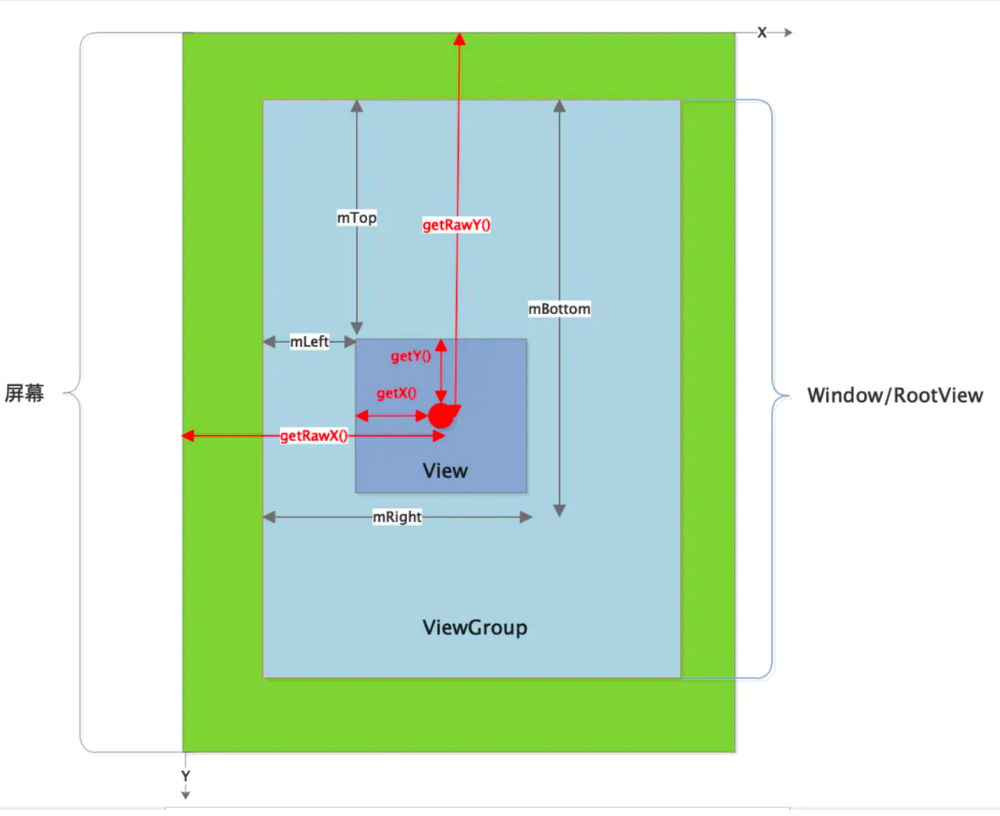
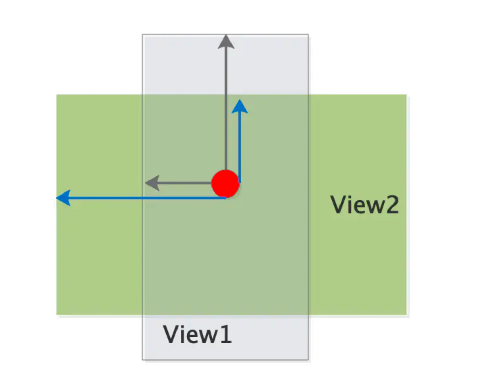

[TOC]

文章参考：https://www.jianshu.com/p/071e04108f4d

# 概述

可以看出与传统的坐标系有所不同的是，屏幕的左上角作为坐标原点，X轴向右为正，Y轴向下为正。

上图分为四个层次，由内到外依次为：

- 第一层为触摸点MotionEvent
- 第二层为View，作为第三层的子布局
- 第三层为Window/RootView(根View的尺寸与Window尺寸一致)，作为第二层的父布局，也是作为整个ViewTree的根布局
- 第四层为屏幕

### 基础概念讲解

触摸点(MotionEvent)坐标

上图红色部分为触摸点坐标相关的。

getX()、getY()获取的坐标是相对于其所在的View，相对于View的左上角

getRawX()、getRawY()获取的坐标是相对于整个屏幕的，相对于屏幕的左上角

对于同一个坐标点(getRawX()/getRawY()相同)，在不同的View里，getX()、getY()可能不同：

黑色箭头是触摸点在View1里的getX()/getY()。

蓝色箭头是触摸点在View2里的getX()/getY()。

### View坐标

在Layout阶段会计算：mLeft、mTop、mRight、mBottom的值，也就是确定了该View的四个顶点距离父布局的左上角的偏移。这些值可正可负，以X轴为例，如果View的顶点在父布局左上角的右侧，即为正，否则为负。

这四个值用来确定View在父布局内的摆放位置。

接下来引入两个经典问题：
这四个值用来确定View在父布局内的摆放位置。

#### 1、这四个值由什么决定的？

我们知道Measure过程计算了View长、宽，以LinearLayout为例，看看其如何摆放子布局的。