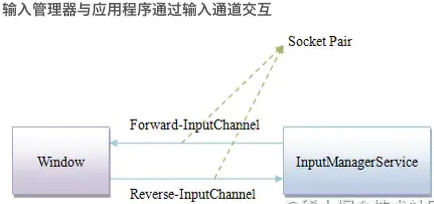

文章参考：https://mp.weixin.qq.com/s/YyJu3b_-InWjgyVXz48B4g

## 概述

我们将整个Touch事件可以分解为以下几个部分：

\1. Touch事件如何从屏幕到我们的App

\2. Touch事件到达App后怎么传递到对应页面

\3. Touch事件到达对应页面后内部怎样分发


其中与上层软件开发息息相关的就是第3条，也是我们最关注的，它也可以拆解为以下几个问题


- ViewGroup是否拦截事件,拦截与不拦截后分别怎么处理？

- 子View是否拦截事件，拦截与不拦截后分别怎么处理？

- ViewGroup与子View都不拦截，最终事件如何处理？

- 如何处理事件冲突？

  

## 从屏幕到APP  

### **硬件与内核部分**

当我们触摸屏幕或者按键操作时，首先触发的是硬件驱动

驱动收到事件后，将相应事件写入到输入设备节点，这便产生了最原生态的内核事件
当屏幕被触摸，Linux内核会将硬件产生的触摸事件包装为Event存到/dev/input/event[x]目录下

这样做的目的是将输入事件封装为通用的Event，供后续处理


### **SystemServer部分**

我们知道，当系统启动时，在SystemServer进程会启动一系列系统服务，如AMS,WMS等。

其中还有一个就是我们管理事件输入的InputManagerService。这个服务就是用来负责与硬件通信，接受屏幕输入事件。

在其内部，会启动一个读线程，也就是InputReader，它会从系统也就是/dev/input/目录拿到任务，并且分发给InputDispatcher线程，然后进行统一的事件分发调度。


### **跨进程通信传递给App**

现在系统进程已经拿到输入事件了，但还需要传递给App进程，这就涉及到跨进程通信的部分

我们的App中的Window与InputManagerService之间的通信实际上使用的InputChannel
InputChannel是一个pipe，底层实际是通过socket进行通信。

我们知道在Activity启动时会调用ViewRootImpl.setView()

在ViewRootImpl.setView()过程中，也会同时注册InputChannel：

```java
   /**
     * 代码位于：/frameworks/base/core/java/android/view/ViewRootImpl.java
     * We have one child
     */
    public void setView(View view, WindowManager.LayoutParams attrs, View panelParentView,
            int userId) {
        synchronized (this) {
            		// ..........
      								// 创建InputChannel
      								mInputChannel = new InputChannel();
                try {
                     
                    mOrigWindowType = mWindowAttributes.type;
                    mAttachInfo.mRecomputeGlobalAttributes = true;
                    collectViewAttributes();
                    adjustLayoutParamsForCompatibility(mWindowAttributes);
                    // 通过Binder在SystemServer进程中完成InputChannel的注册
                    res = mWindowSession.addToDisplayAsUser(mWindow, mSeq, mWindowAttributes,
                            getHostVisibility(), mDisplay.getDisplayId(), userId, mTmpFrame,
                            mAttachInfo.mContentInsets, mAttachInfo.mStableInsets,
                            mAttachInfo.mDisplayCutout, inputChannel,
                            mTempInsets, mTempControls);
                    setFrame(mTmpFrame);
                } catch (RemoteException e) {
                    mAdded = false;
                    mView = null;
                    mAttachInfo.mRootView = null;
                    inputChannel = null;
                    mFallbackEventHandler.setView(null);
                    unscheduleTraversals();
                    setAccessibilityFocus(null, null);
                    throw new RuntimeException("Adding window failed", e);
                } finally {
                    if (restore) {
                        attrs.restore();
                    }
                }

                // ..............
            }
        }
    }

```

这里涉及到了WindowManagerService和Binder跨进程通信，读者不需要纠结于详细的细节

只需了解最终在SystemServer进程中，WindowManagerService根据当前的Window创建了SocketPair用于跨进程通信，同时并对App进程中传过来的InputChannel进行了注册

这之后，ViewRootImpl里的InputChannel就指向了正确的InputChannel, 作为Client端，其fd与SystemServer进程中Server端的fd组成SocketPair, 它们就可以双向通信了。




然后我们App进程的主线程就会监听socket客户端，当收到消息（输入事件）后，回调NativeInputEventReceiver.handleEvent()方法，最终会走到InputEventReceiver.dispachInputEvent方法。

经过以上操作App终于拿到输入事件了，接下来就是传递到对应页面。


## 从APP到页面 


```java
		/**
     * 代码位于：frameworks/base/core/java/android/view/ViewRootImpl.java
     */
    final class WindowInputEventReceiver extends InputEventReceiver {
        public WindowInputEventReceiver(InputChannel inputChannel, Looper looper) {
            super(inputChannel, looper);
        }

        @Override
        public void onInputEvent(InputEvent event) {
            Trace.traceBegin(Trace.TRACE_TAG_VIEW, "processInputEventForCompatibility");
            List<InputEvent> processedEvents;
            try {
                processedEvents =
                    mInputCompatProcessor.processInputEventForCompatibility(event);
            } finally {
                Trace.traceEnd(Trace.TRACE_TAG_VIEW);
            }
            if (processedEvents != null) {
                if (processedEvents.isEmpty()) {
                    // InputEvent consumed by mInputCompatProcessor
                    finishInputEvent(event, true);
                } else {
                    for (int i = 0; i < processedEvents.size(); i++) {
                        // InputManagerService传递过来的事件进行入队列
                        enqueueInputEvent(
                                processedEvents.get(i), this,
                                QueuedInputEvent.FLAG_MODIFIED_FOR_COMPATIBILITY, true);
                    }
                }
            } else {
                // InputManagerService传递过来的事件进行入队列
                enqueueInputEvent(event, this, 0, true);
            }
        }
      // ..........
    }       
```

可以看到事件还是回到了ViewRootImpl中，可见ViewRootImpl不仅负责界面的绘制，同时负责事件的传递.

进入enqueueInputEvent的时间队列处理

```
    @UnsupportedAppUsage
    void enqueueInputEvent(InputEvent event,
            InputEventReceiver receiver, int flags, boolean processImmediately) {
        QueuedInputEvent q = obtainQueuedInputEvent(event, receiver, flags);

        // Always enqueue the input event in order, regardless of its time stamp.
        // We do this because the application or the IME may inject key events
        // in response to touch events and we want to ensure that the injected keys
        // are processed in the order they were received and we cannot trust that
        // the time stamp of injected events are monotonic.
        QueuedInputEvent last = mPendingInputEventTail;
        if (last == null) {
            mPendingInputEventHead = q;
            mPendingInputEventTail = q;
        } else {
            last.mNext = q;
            mPendingInputEventTail = q;
        }
        mPendingInputEventCount += 1;
        Trace.traceCounter(Trace.TRACE_TAG_INPUT, mPendingInputEventQueueLengthCounterName,
                mPendingInputEventCount);

        if (processImmediately) {
            doProcessInputEvents();
        } else {
            scheduleProcessInputEvents();
        }
    }
```

接下来走到doProcessInputEvents中，其中涉及到事件分发中的第一次责任链分发

​	

### **第一次责任链分发**

```java
    private void scheduleProcessInputEvents() {
        if (!mProcessInputEventsScheduled) {
            mProcessInputEventsScheduled = true;
            Message msg = mHandler.obtainMessage(MSG_PROCESS_INPUT_EVENTS);
            msg.setAsynchronous(true);
            mHandler.sendMessage(msg);
        }
    }

    void doProcessInputEvents() {
        // Deliver all pending input events in the queue.
        while (mPendingInputEventHead != null) {
            // QueuedInputEvent是一种输入事件，链表结构，遍历传递给InputStage
            QueuedInputEvent q = mPendingInputEventHead;
            mPendingInputEventHead = q.mNext;
            if (mPendingInputEventHead == null) {
                mPendingInputEventTail = null;
            }
            q.mNext = null;

            mPendingInputEventCount -= 1;
            Trace.traceCounter(Trace.TRACE_TAG_INPUT, mPendingInputEventQueueLengthCounterName,
                    mPendingInputEventCount);

            long eventTime = q.mEvent.getEventTimeNano();
            long oldestEventTime = eventTime;
            if (q.mEvent instanceof MotionEvent) {
                MotionEvent me = (MotionEvent)q.mEvent;
                if (me.getHistorySize() > 0) {
                    oldestEventTime = me.getHistoricalEventTimeNano(0);
                }
            }
            mChoreographer.mFrameInfo.updateInputEventTime(eventTime, oldestEventTime);

            deliverInputEvent(q);
        }

        // We are done processing all input events that we can process right now
        // so we can clear the pending flag immediately.
        if (mProcessInputEventsScheduled) {
            mProcessInputEventsScheduled = false;
            mHandler.removeMessages(MSG_PROCESS_INPUT_EVENTS);
        }
    }

    private void deliverInputEvent(QueuedInputEvent q) {
        Trace.asyncTraceBegin(Trace.TRACE_TAG_VIEW, "deliverInputEvent",
                q.mEvent.getId());

        if (Trace.isTagEnabled(Trace.TRACE_TAG_VIEW)) {
            Trace.traceBegin(Trace.TRACE_TAG_VIEW, "deliverInputEvent src=0x"
                    + Integer.toHexString(q.mEvent.getSource()) + " eventTimeNano="
                    + q.mEvent.getEventTimeNano() + " id=0x"
                    + Integer.toHexString(q.mEvent.getId()));
        }
        try {
            if (mInputEventConsistencyVerifier != null) {
                Trace.traceBegin(Trace.TRACE_TAG_VIEW, "verifyEventConsistency");
                try {
                    mInputEventConsistencyVerifier.onInputEvent(q.mEvent, 0);
                } finally {
                    Trace.traceEnd(Trace.TRACE_TAG_VIEW);
                }
            }
            // InputStage是处理输入的责任链，在调用deliver时会遍历责任链传递事件
            InputStage stage;
            if (q.shouldSendToSynthesizer()) {
                stage = mSyntheticInputStage;
            } else {
                stage = q.shouldSkipIme() ? mFirstPostImeInputStage : mFirstInputStage;
            }

            if (q.mEvent instanceof KeyEvent) {
                Trace.traceBegin(Trace.TRACE_TAG_VIEW, "preDispatchToUnhandledKeyManager");
                try {
                    mUnhandledKeyManager.preDispatch((KeyEvent) q.mEvent);
                } finally {
                    Trace.traceEnd(Trace.TRACE_TAG_VIEW);
                }
            }
            //stage赋值操作
            if (stage != null) {
                handleWindowFocusChanged();
                stage.deliver(q);
            } else {
                // 事件分发完成后会调用finishInputEvent，
                // 告知SystemServer进程的InputDispatcher线程，最终将该事件移除，完成此次事件的分发消费。
                finishInputEvent(q);
            }
        } finally {
            Trace.traceEnd(Trace.TRACE_TAG_VIEW);
        }
    }
```


那么问题来了,InputStage的责任链是什么时候组件的呢？


### **组装责任链**

我们得回到ViewRootImpl.setView方法中


