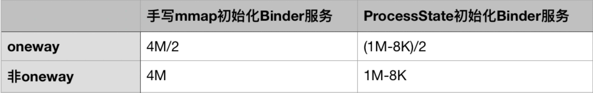

[TOC]

文章转自：https://cloud.tencent.com/developer/article/1639706

# 概述

我通过匿名共享内存的方式解决Binder通信是无法传递大数据的问题，一次Binder通信最大可以传输是1MB-8KB（PS：8k是两个pagesize，一个pagesize是申请物理内存的最小单元）

但是这个答案对不对呢，我只能说不准确，接下来我们来仔细研究一下。


# 1MB-8KB的限制来源于哪里

```c++

// 代码位于：frameworks/native/libs/binder/ProcessState.cpp
#define BINDER_VM_SIZE ((1 * 1024 * 1024) - sysconf(_SC_PAGE_SIZE) * 2)//这里的限制是1MB-4KB*2

ProcessState::ProcessState(const char *driver)
{
    if (mDriverFD >= 0) {
        // mmap the binder, providing a chunk of virtual address space to receive transactions.
        // 调用mmap接口向Binder驱动中申请内核空间的内存
        mVMStart = mmap(0, BINDER_VM_SIZE, PROT_READ, MAP_PRIVATE | MAP_NORESERVE, mDriverFD, 0);
        if (mVMStart == MAP_FAILED) {
            // *sigh*
            ALOGE("Using %s failed: unable to mmap transaction memory.\n", mDriverName.c_str());
            close(mDriverFD);
            mDriverFD = -1;
            mDriverName.clear();
        }
    }
}
```

如果一个进程使用ProcessState这个类来初始化Binder服务，这个进程的Binder内核内存上限就是BINDER_VM_SIZE，也就是1MB-8KB。

我们知道一个进程在启动的时候，进程会使用使用ProcessState这个类初始化BInder服务。会调用mmap接口像Binder驱动申请内核空间。这个进程的Binder内核内存上限就是BINDER_VM_SIZE，也就是1MB-8KB。

这个内核空间就是在进行BInder跨进程通信的时候，用于通信传输数据存储共享内存数据的。所以次Binder通信最大可以传输1MB-8KB的数据。

```c
// 代码位于：frameworks/base/cmds/app_process/app_main.cpp
virtual void onZygoteInit()
{
   sp<ProcessState> proc = ProcessState::self();
   ALOGV("App process: starting thread pool.\n");
   proc->startThreadPool();
}
```

对于普通的APP来说，我们都是Zygote进程孵化出来的，Zygote进程的初始化Binder服务的时候提前调用了ProcessState这个类，所以普通的APP进程上限就是1MB-8KB。


### 问一下自己，能否不用ProcessState来初始化Binder服务，来突破1M-8KB的限制？

答案是当然可以了，Binder服务的初始化有两步，open打开Binder驱动，mmap在Binder驱动中申请内核空间内存，所以我们只要手写open，mmap就可以轻松突破这个限制。源码中已经给了类似的例子。


```c
// 代码位于：frameworks/native/cmds/servicemanager/bctest.c

int main(int argc, char **argv)
{
    struct binder_state *bs;
    uint32_t svcmgr = BINDER_SERVICE_MANAGER;
    uint32_t handle;

    bs = binder_open("/dev/binder", 128*1024);//我们可以把这个数值改成2*1024*1024就可以突破这个限制了
    if (!bs) {
        fprintf(stderr, "failed to open binder driver\n");
        return -1;
    }
```


```c
// 代码位于：frameworks/native/cmds/servicemanager/binder.c
struct binder_state *binder_open(const char* driver, size_t mapsize)
{
    ...//省略部分代码
    bs->fd = open(driver, O_RDWR | O_CLOEXEC);
    ....//省略部分代码
    bs->mapsize = mapsize;//这里mapsize=128*1024
    bs->mapped = mmap(NULL, mapsize, PROT_READ, MAP_PRIVATE, bs->fd, 0);
    ....//省略部分代码
}
```


# 难道Binder驱动不怕我们传递一个超级大的数字进去吗？

其实是我们想多了，在Binder驱动中mmap的具体实现中还有一个4M的限制


```c
// 代码位于： /drivers/staging/android/binder.c
static int binder_mmap(struct file *filp, struct vm_area_struct *vma)
{
    int ret;
    struct vm_struct *area;
    struct binder_proc *proc = filp->private_data;
    const char *failure_string;
    struct binder_buffer *buffer;

    if (proc->tsk != current)
        return -EINVAL;

    if ((vma->vm_end - vma->vm_start) > SZ_4M)
        vma->vm_end = vma->vm_start + SZ_4M;//如果申请的size大于4MB了，会在驱动中被修改成4MB

    binder_debug(BINDER_DEBUG_OPEN_CLOSE,
             "binder_mmap: %d %lx-%lx (%ld K) vma %lx pagep %lx\n",
             proc->pid, vma->vm_start, vma->vm_end,
             (vma->vm_end - vma->vm_start) / SZ_1K, vma->vm_flags,
             (unsigned long)pgprot_val(vma->vm_page_prot));
```


# 目前的结论

#### 1.通过手写open，mmap初始化Binder服务的限制是4MB

#### 2.通过ProcessState初始化Binder服务的限制是1MB-8KB


# 再问一下自己，4M或1MB-8KB这个答案是不是正确？


我发现一处代码


```c
static int binder_mmap(struct file *filp, struct vm_area_struct *vma)
{
     //省内部分代码
    proc->free_async_space = proc->buffer_size / 2;//这个代码引起我注意，async代码异步的意思
    barrier();
    proc->files = get_files_struct(current);
    proc->vma = vma;
    proc->vma_vm_mm = vma->vm_mm;
```


```c
static struct binder_buffer *binder_alloc_buf(struct binder_proc *proc,
                          size_t data_size,
                          size_t offsets_size, int is_async)
{

    //省略部分代码
    if (is_async &&
        proc->free_async_space < size + sizeof(struct binder_buffer)) {
        //对于oneway的Binder调用，可申请内核空间，最大上限是buffer_size的一半，也就是mmap时候传递的值的一半。
        binder_debug(BINDER_DEBUG_BUFFER_ALLOC,
                 "%d: binder_alloc_buf size %zd failed, no async space left\n",
                  proc->pid, size);
        return NULL;
    }
```

为什么要做这样子的限制，我的猜想是Binder调用中同步调用优先级大于oneway（异步）的调用，为了充分满足同步调用的内存需要，所以将oneway调用的内存限制到申请内存上限的一半。


# 问题：一次Binder通信最大可以传输多大的数据？



# 再问一下自己，自己写的APP能否突破1M-8KB的限制

答案是理论上可以，但是不建议这样子操作，因为Binder驱动中并没有对open，mmap有调用次数的限制，App可以通过JNI调用open，mmap来突破这个限制，但是会对当前正在进行Binder调用的APP造成不可想象问题，当然可以先close Binder驱动。但是一旦这个APP没有Binder通信了，这个APP就不能正常使用了，APP和其他应用，AMS，WMS的交互可都是依赖于Binder通信，所以还是那句话，无Binder无Android。


