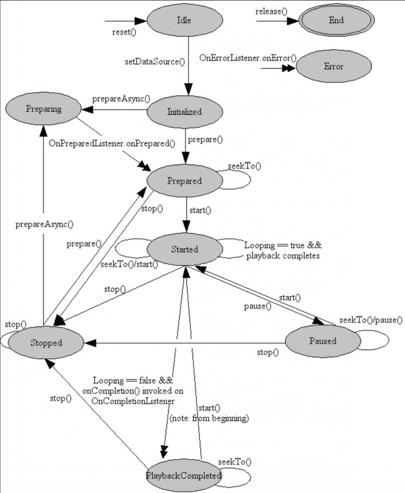
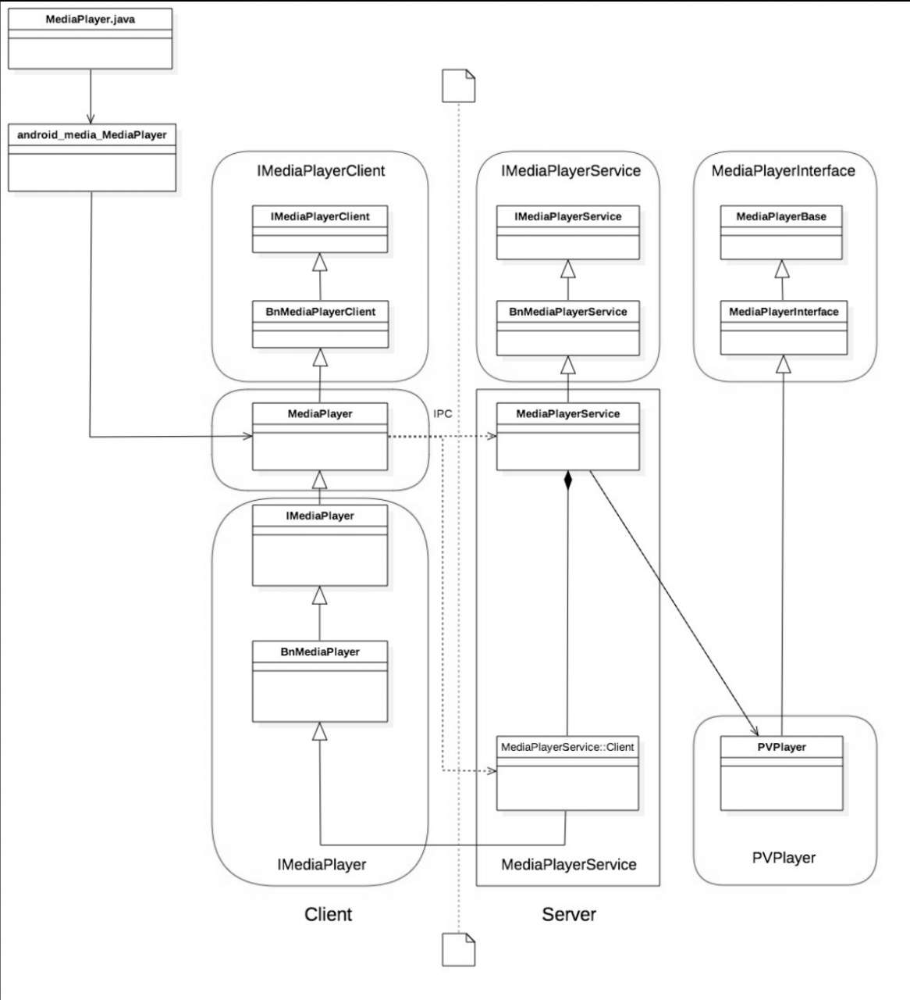

[TOC]

# 概述

MediaPlayer是Android中的一个多媒体播放类，我们能通过它控制音视频流或本地音视频资源的播放过程。


MediaPlayer类用于视频/音频文件的播放控制。本节主要覆盖MediaPlayer如下知识点。

• MediaPlayer的状态图

•  Idle状态

• End状态

• Error状态

• Initialized状态

• Prepared状态

• Preparing状态

• Started状态

• Paused状态

• Stopped状态

• PlaybackCompleted状态


## MediaPlayer的状态图





## Idle状态及End状态

在MediaPlayer创建实例或者调用reset函数后，播放器就被创建了，这时处于Idle（就绪）状态，调用release函数后，就会变成End（结束）状态，在这两种状态之间的就是MediaPlayer的生命周期。


## Error状态

在构造一个新MediaPlayer或者调用reset函数后，上层应用程序调用getCurrentPosition、getVideoHeight、getDuration、getVideoWidth、setAudioStreamType(int)、setLooping(boolean)、setVolume(float,float)、pause、start、stop、seekTo(int)、prepare、prepareAsync这些函数会出错。如果调用reset函数后再调用它们，用户提供的回调函数OnErrorListener.onError将触发MediaPlayer状态到Error（错误）状态，所以一旦不再使用MediaPlayer，就需要调用release函数，以便MediaPlayer资源得到合理释放。

当MediaPlayer处于End（结束）状态时，它将不能再被使用，这时不能再回到MediaPlayer的其他状态，因为本次生命周期已经终止。

由于支持的音视频格式分辨率过高，输入数据流超时，或者其他各种各样的原因将导致播放失败。在这种错误的条件下，如果用户事先通过setOnErrorListener注册过OnErrorListener，当player内部调用OnErrorListener.onError回调函数时，将会返回错误信息。一旦有错误，MediaPlayer会进入Error（错误）状态，为了重新使用MediaPlayer，调用reset函数，这时将重新恢复到Idle（就绪）状态，所以需要给MediaPlayer设置错误监听，出错后就可以从播放器内部返回的信息中找到错误原因。

## Initialized状态

当调用setDataSource(FileDescriptor)、setDataSource(String)、setDataSource(Context, Uri)、setDataSource(FileDescriptor, long, long)其中一个函数时，将传递MediaPlayer的Idle状态变成Initialized（初始化）状态，如果setDataSource在非Idle状态时调用，会抛出IllegalStateException异常。当重载setDataSource时，需要抛出IllegalArgumentException和IOException这两个异常。

## Prepared状态


## MediaPlayer创建

当外部调用MediaPlayer.create(this, ＂http://www.xxx.mp4＂)时，进入MediaPlayer的创建过程：

```java
public static MediaPlayer create(Context context, Uri uri, SurfaceHolder holder,
                                     AudioAttributes audioAttributes, int audioSessionId) {
        try {
            // MediaPlayer的静态create方法
            MediaPlayer mp = new MediaPlayer(audioSessionId);
            // 声音相关的处理，若为空，则创建
            final AudioAttributes aa = audioAttributes != null ? audioAttributes :
                    new AudioAttributes.Builder().build();
            // 设置音频属性
            mp.setAudioAttributes(aa);
            mp.native_setAudioSessionId(audioSessionId);
            // 设置声音的会话ID，音频和视频是分开渲染的
            // 设置dataSource uri即统一资源定位符
            mp.setDataSource(context, uri);
            // 判断surfaceHolder是否为空，这是一个控制器
            // Surface的控制器，用来操纵Surface.处理它在Canvas上作画的效果和动画控制表面、大小、像素等
            if (holder != null) {
                // 给Surface设置一个suface的控制器
                mp.setDisplay(holder);
            }
            // 开始准备
            mp.prepare();
            return mp;
        } catch (IOException ex) {
            Log.d(TAG, "create failed:", ex);
            // fall through
        } catch (IllegalArgumentException ex) {
            Log.d(TAG, "create failed:", ex);
            // fall through
        } catch (SecurityException ex) {
            Log.d(TAG, "create failed:", ex);
            // fall through
        }
        return null;
    }
```


以上代码可以总结为，当MediaPlayer通过create的方式创建播放器时，内部new出MediaPlayer对象，并setDataSource，做好prepare的动作。这时外部只需调用start函数，就能播放音视频资源了。

实例化MediaPlayer有如下两种方式。

（1）可以使用直接new的方式：

```java
MediaPlayer mp = new MediaPlayer();
```

（2）也可以使用create的方式，如：

```java
MediaPlayer mp = new MediaPlayer(this,R.raw.test);
```

上面两种实例化MediaPlayer的方式，都要经过new MediaPlayer，下面看看构造中做了什么操作。

播放页处理主页面：

```java
    private MediaPlayer(int sessionId) {
        super(new AudioAttributes.Builder().build(),
                AudioPlaybackConfiguration.PLAYER_TYPE_JAM_MEDIAPLAYER);
        // 定义一个Looper
        Looper looper;
        // 通过Looper.myLooper()获取当前的线程绑定的Looper。如果不为null,则赋值到looper，创建EventHandler
        if ((looper = Looper.myLooper()) != null) {
            mEventHandler = new EventHandler(this, looper);
        } else if ((looper = Looper.getMainLooper()) != null) {
            // 如果主线程不为null，也可以赋值到looper，创建EventHandler
            mEventHandler = new EventHandler(this, looper);
        } else {
            mEventHandler = null;
        }
        // 时间数据容器，一般Provider都是和数据联系起来，如VideoProvider、ContentProvider
        mTimeProvider = new TimeProvider(this);
        mOpenSubtitleSources = new Vector<InputStream>();

        AttributionSource attributionSource = AttributionSource.myAttributionSource();
        // set the package name to empty if it was null
        if (attributionSource.getPackageName() == null) {
            attributionSource = attributionSource.withPackageName("");
        }
        /* Native setup requires a weak reference to our object.
         * It's easier to create it here than in C++.
         */
        // 调用native层的setup
        try (ScopedParcelState attributionSourceState = attributionSource.asScopedParcelState()) {
            native_setup(new WeakReference<MediaPlayer>(this), attributionSourceState.getParcel());
        }
        baseRegisterPlayer(sessionId);
    }
```

接下来看Native层如何创建一个MediaPlayer。在介绍native_setup之前，请注意一般都是在静态代码块中加载.so文件的，在MediaPlayer中有一段静态代码块，用于加载和链接库文件media_jni.so，早于构造函数，在加载类时就执行。一般全局性的数据、变量都可以放在这里。下面是加载和链接media_jni.so文件的代码：

```java
    static {
        System.loadLibrary("media_jni");
        native_init();
    }

 private static native final void native_init();
```

我们看看native_init的函数的具体实现：

下面开始进入android_media_MediaPlayer.cpp分析，第一个函数android_media_MediaPlayer_native_init就是从Java静态代码块调过来的native_init：

```c++
static void android_media_MediaPlayer_native_init(JNIEnv *env){
    // *env可以理解为万能指针表。通过操作符(->）访问JNI函数
    // frameworks/base/media/java/android/media/MediaPlayer.java
    // 定义jclass的对象，通过env->FindClass(全路径名)拿到class对象）
    // 通过Native层调用Java层获取MediaPlayer对象
    jclass clazz;
    clazz = env->FindClass("android/media/MediaPlayer");
    if (clazz == NULL) {
        return;
    }
    // 获取MediaPlayer中mNativeContext，它在MediaPlayer.java中是一个long型整数。实际对象的是一个内存地址
    fields.context = env->GetFieldID(clazz, "mNativeContext", "J");
    if (fields.context == NULL) {
        return;
    }
    // 获取MediaPlayer中postEventFromNative的静态方法，后面是方法的描述表
    fields.post_event = env->GetStaticMethodID(clazz, "postEventFromNative",
                                               "(Ljava/lang/Object;IIILjava/lang/Object;)V");
    if (fields.post_event == NULL) {
        return;
    }
    
    // ......

    gPlaybackParamsFields.init(env);
    gSyncParamsFields.init(env);
    gVolumeShaperFields.init(env);
}
```

上面这种方式是通过JNI调用Java层的MediaPlayer类，然后拿到mNativeContext的指针，接着调用了MediaPlayer.java中的静态方法postEventFromNative，把Native的事件回调到Java层，使用EventHandler post事件回到主线程中，用软引用指向原生的MediaPlayer，以保证Native代码是安全的。代码如下：

```java
    private static void postEventFromNative(Object mediaplayer_ref,
                                            int what, int arg1, int arg2, Object obj) {
        // 得到MediaPlayer的软引用对象
        final MediaPlayer mp = (MediaPlayer)((WeakReference)mediaplayer_ref).get();
        if (mp == null) {
            return;
        }
				// .......

        if (mp.mEventHandler != null) {
            Message m = mp.mEventHandler.obtainMessage(what, arg1, arg2, obj);
            mp.mEventHandler.sendMessage(m);
        }
    }

```

之前我们在Java层的MediaPlayer.java文件的构造函数中，分析到最后有一个native_setup，在android_media_MediaPlayer.cpp中找到对应的函数，代码如下：

```java
/**
     * 调用C++层的native setup方法
     * @param mediaplayerThis
     * @param attributionSource
     */
    private native void native_setup(Object mediaplayerThis,
            @NonNull Parcel attributionSource);
```


```C++
// 代码位于：frameworks/base/media/jni/android_media_MediaPlayer.cpp
static void android_media_MediaPlayer_native_setup(JNIEnv *env, jobject thiz, jobject weak_this,
                                       jobject jAttributionSource){
    ALOGV("native_setup");
    Parcel* parcel = parcelForJavaObject(env, jAttributionSource);
    android::content::AttributionSourceState attributionSource;
    attributionSource.readFromParcel(parcel);
    sp<MediaPlayer> mp = sp<MediaPlayer>::make(attributionSource);
    if (mp == NULL) {
        jniThrowException(env, "java/lang/RuntimeException", "Out of memory");
        return;
    }
    //  给MediaPlayer创建一个listener 以便我们在Java设置的setPrepareListener、setOnCompleteListener能产生回调
    // create new listener and give it to MediaPlayer
    sp<JNIMediaPlayerListener> listener = new JNIMediaPlayerListener(env, thiz, weak_this);
    mp->setListener(listener);
    // 对于Java层来说。C++中的MediaPlayer事不透明的，也无需关心其对应的逻辑
    // Stow our new C++ MediaPlayer in an opaque field in the Java object.
    setMediaPlayer(env, thiz, mp);
}
```

可以看到会设置一些回调用的listener及创建C++中的MediaPlayer对象。

## setDataSource过程

上面就是MediaPlayer的构造过程。构造后接下来要设置数据源，进而到了setDataSource过程，下面看看setDataSource做了什么操作：

```java
    @UnsupportedAppUsage(maxTargetSdk = Build.VERSION_CODES.R, trackingBug = 170729553)
    private void setDataSource(String path, String[] keys, String[] values,
            List<HttpCookie> cookies)
            throws IOException, IllegalArgumentException, SecurityException, IllegalStateException {
        final Uri uri = Uri.parse(path); //解析path
        final String scheme = uri.getScheme();
        if ("file".equals(scheme)) {
            path = uri.getPath();
        } else if (scheme != null) {
            // 处理非文件资源
            nativeSetDataSource(
                MediaHTTPService.createHttpServiceBinderIfNecessary(path, cookies),
                path,
                keys,
                values);
            return;
        }
        // 处理文件类型的视频播放
        final File file = new File(path);
        try (FileInputStream is = new FileInputStream(file)) {
            setDataSource(is.getFD());
        }
    }


    private native void nativeSetDataSource(
        IBinder httpServiceBinder, String path, String[] keys, String[] values)
        throws IOException, IllegalArgumentException, SecurityException, IllegalStateException;
```

调用nativeSetDataSource代码逻辑开始进入JNI层，

```c++
    {
        "nativeSetDataSource",
        "(Landroid/os/IBinder;Ljava/lang/String;[Ljava/lang/String;"
        "[Ljava/lang/String;)V",
        (void *)android_media_MediaPlayer_setDataSourceAndHeaders
    },
```

我们看一下android_media_MediaPlayer_setDataSourceAndHeaders方法

```c++
/**
 * 代码位于：frameworks/base/media/jni/android_media_MediaPlayer.cpp
 *
 */
static void
android_media_MediaPlayer_setDataSourceAndHeaders(
        JNIEnv *env, jobject thiz, jobject httpServiceBinderObj, jstring path,
        jobjectArray keys, jobjectArray values) {

    sp<MediaPlayer> mp = getMediaPlayer(env, thiz);
    if (mp == NULL ) {
        jniThrowException(env, "java/lang/IllegalStateException", NULL);
        return;
    }

    if (path == NULL) {
        jniThrowException(env, "java/lang/IllegalArgumentException", NULL);
        return;
    }

    const char *tmp = env->GetStringUTFChars(path, NULL);
    if (tmp == NULL) {  // Out of memory
        return;
    }
    ALOGV("setDataSource: path %s", tmp);

    String8 pathStr(tmp);
    env->ReleaseStringUTFChars(path, tmp);
    tmp = NULL;

    // We build a KeyedVector out of the key and val arrays
    KeyedVector<String8, String8> headersVector;
    if (!ConvertKeyValueArraysToKeyedVector(
            env, keys, values, &headersVector)) {
        return;
    }

    sp<IMediaHTTPService> httpService;
    if (httpServiceBinderObj != NULL) {
        // 通过Binder机制将httpServiceBinderObj传给IPC，并且返回Binder对象
        sp<IBinder> binder = ibinderForJavaObject(env, httpServiceBinderObj);
        // 然后强转成IMediaHTTPService
        httpService = interface_cast<IMediaHTTPService>(binder);
    }
    // 开始进行设置setDataSource的状态判断，和上面的文件操作一张
    status_t opStatus =
        mp->setDataSource(
                httpService,
                pathStr,
                headersVector.size() > 0? &headersVector : NULL);
    // 从这里开始调用JNIEnv*中的getIntField函数获取对应变量
    process_media_player_call(
            env, thiz, opStatus, "java/io/IOException",
            "setDataSource failed." );
}
```

至此，setDataSource过程就完成了。这里需要注意两点，一点是从Java→JNI→C++的正向调用过程（前面从Java层到Native层都是正向过程），一点是C++→JNI→Java的过程（如mp->setDataSource( httpService, pathStr,headersVector.size() > 0? &headersVector : NULL），这样来回调的好处是什么？好处有如下这几点。

安全性，封装在Native层的代码是so形式的，破坏性风险小。

 效率高，在运行速度上C++执行时间短，且底层也是用C++语言编写的。对于复杂的渲染及对时间要求高的渲染，放在Native层是最好不过的选择。

连通性，正向调用将值传入，反向调用把处理过的值通知回去。相当于一根管道。

## setDisplay过程

接下来看看在setDataSource之后，开始进行的mp.setDisplay(holder)：

```java
    /**
     * 代码位于：frameworks/base/media/java/android/media/MediaPlayer.java
     */
    public void setDisplay(SurfaceHolder sh) {
        // 给Surfacesh设置一个控制器，用于展示视频图像
        mSurfaceHolder = sh;
        // 获取surface的对象实例
        Surface surface;
        if (sh != null) {
            surface = sh.getSurface();
        } else {
            surface = null;
        }
        // 给视频设置一个surface.
        // 这个函数是一个Native函数
        _setVideoSurface(surface);
        // 更新surface到屏幕上
        updateSurfaceScreenOn();
    }
```

对于上面代码中的_setVideoSurface，同样在android_media_MediaPlayer.cpp中找到其对应的函数：

```c++
/**
 * 代码位于：frameworks/base/media/jni/android_media_MediaPlayer.cpp
 */
static void
setVideoSurface(JNIEnv *env, jobject thiz, jobject jsurface, jboolean mediaPlayerMustBeAlive)
{
    // 获取MediaPlayer对象
    sp<MediaPlayer> mp = getMediaPlayer(env, thiz);
    if (mp == NULL) {
        if (mediaPlayerMustBeAlive) {
            jniThrowException(env, "java/lang/IllegalStateException", NULL);
        }
        return;
    }

    decVideoSurfaceRef(env, thiz);

    sp<IGraphicBufferProducer> new_st;
    if (jsurface) {
        // 获取Java层的Surface
        sp<Surface> surface(android_view_Surface_getSurface(env, jsurface));
        // 判断如果Surface，则获取IGraphicBufferProducer
        if (surface != NULL) {
            new_st = surface->getIGraphicBufferProducer();
            if (new_st == NULL) {
                jniThrowException(env, "java/lang/IllegalArgumentException",
                    "The surface does not have a binding SurfaceTexture!");
                return;
            }
            new_st->incStrong((void*)decVideoSurfaceRef);
        } else {
            jniThrowException(env, "java/lang/IllegalArgumentException",
                    "The surface has been released");
            return;
        }
    }

    env->SetLongField(thiz, fields.surface_texture, (jlong)new_st.get());

    // This will fail if the media player has not been initialized yet. This
    // can be the case if setDisplay() on MediaPlayer.java has been called
    // before setDataSource(). The redundant call to setVideoSurfaceTexture()
    // in prepare/prepareAsync covers for this case.
    // MediaPlayer如果还未初始化setSurface将失败，
    mp->setVideoSurfaceTexture(new_st);
}
```

这里有如下几个概念需要理解。

 SurfaceTexture：SurfaceTexture是Android 3.0（API 11）加入的一个类。这个类跟SurfaceView很像，可以从视频解码里面获取图像流（image stream）。但是，和SurfaceView不同的是，SurfaceTexture在接收图像流之后，不需要显示出来。SurfaceTexture不需要显示到屏幕上，因此我们可以用SurfaceTexture接收解码出来的图像流，然后从SurfaceTexture中取得图像帧的副本进行处理，处理完毕后再送给另一个SurfaceView用于显示。

Surface：处理被屏幕排序的原生的Buffer，Android中的Surface就是一个用来画图形（graphic）或图像（image）的地方。对于View及其子类，都是画在Surface上的，各Surface对象通过SurfaceFlinger合成到frameBuffer。每个Surface都是双缓冲的（实际上就是两个线程，一个渲染线程，一个UI更新线程），它有一个backBuffer和一个frontBuffer。在Surface中创建的Canvas对象，可用来管理Surface绘图操作，Canvas对应Bitmap，存储Surface中的内容。

SurfaceView：在Camera、MediaRecorder、MediaPlayer中SurfaceView经常被用来显示图像。SurfaceView是View的子类，实现了Parcelable接口，其中内嵌了一个专门用于绘制的Surface，SurfaceView可以控制这个Surface的格式和尺寸，以及Surface的绘制位置。可以理解Surface就是管理数据的地方，SurfaceView就是展示数据的地方。

SurfaceHolder：顾名思义，是一个管理SurfaceHolder的容器。SurfaceHolder是一个接口，其可被理解为一个Surface的监听器。通过回调函数addCallback(SurfaceHolder.Callback callback)监听Surface的创建，通过获取Surface中的Canvas对象，锁定之。所得到的Canvas对象在完成修改Surface中的数据后，释放同步锁，并提交改变Surface的状态及图像，展示新的图像数据。

最后总结一下，SurfaceView中调用getHolder函数，可以获得当前SurfaceView中的Surface对应的SurfaceHolder，SurfaceHolder开始对Surface进行管理操作。这里按MVC模式可以更好地理解M:Surface（图像数据）、V:SurfaceView（图像展示）、C:SurfaceHolder（图像数据管理）。MediaPlayer.java中的setDisplay操作就是对将要显示的视频进行预设置。以上就是setDisplay的过程，Java层中setDisplay的最后一行，就是通过JNI返回的Surface，时时做好更新准备。


## prepare调用

上节中我们分析了MediaPlayer从创建到setDataSource的过程，尽管分析了代码，但是没有从MediaPlayer生态上认识各类库之间的依赖调用关系。

MediaPlayer的核心的源文件所在的目录：

```shell
frameworks/av/media/libmedia/include/media/IMediaPlayerClient.h
frameworks/av/media/libmedia/include/media/mediaplayer.h
frameworks/av/media/libmedia/include/media/IMediaPlayer.h
frameworks/av/media/libmedia/include/media/IMediaPlayerService.h
```

在这些头文件中，mediaplayer.h提供了对上层的接口，而其他的几个头文件提供的是一些接口类（即包含了纯虚函数的类），这些接口类必须被实现类继承才能够使用。

MediaPlayer各个具体类之间的依赖关系图如图所示。




在运行的时候，整个MediaPlayer可以大致上分成Client和Server两个部分，它们分别在两个进程中运行，它们之间使用Binder机制实现IPC通信。从框架结构上看，IMediaPlayer Service.h、IMediaPlayerClient.h和mediaplayer.h这3个头文件中定义了MediaPlayer的接口和架构，在目录中有专门的MediaPlayerService.cpp和mediaplayer.cpp文件对应上面3个头文件，用于MediaPlayer架构的实现。

在给播放器设置数据源且展现了Surface后，你应当开始调用prepare或prepareAsync函数。对于文件类型，调用prepare函数将暂时阻塞，因为prepare是一个同步函数，直到MediaPlayer已经准备好数据即将播放，也就是播放器回调了onPrepared函数，进入Prepared状态。

prepare函数的执行过程如下：

```java
    /**
     * 代码位于：frameworks/base/media/java/android/media/MediaPlayer.java
     * 同步调用prepare方法
     */
    public void prepare() throws IOException, IllegalStateException {
        // 调用Native方法
        _prepare();
        scanInternalSubtitleTracks();
        // DrmInfo, if any, has been resolved by now.
        synchronized (mDrmLock) {
            mDrmInfoResolved = true;
        }
    }

```

Native层的android_media_MediaPlayer_prepare函数：

```c++
/**
 * 代码位于：frameworks/base/media/jni/android_media_MediaPlayer.cpp
 */
static void
android_media_MediaPlayer_prepare(JNIEnv *env, jobject thiz)
{
    // 获取MediaPlayer对象
    sp<MediaPlayer> mp = getMediaPlayer(env, thiz);
    if (mp == NULL ) {
        jniThrowException(env, "java/lang/IllegalStateException", NULL);
        return;
    }

    // Handle the case where the display surface was set before the mp was
    // initialized. We try again to make it stick.
    // 通过getVideoSurfaceTexture获取一个IGraphicBufferProducer类型指针
    sp<IGraphicBufferProducer> st = getVideoSurfaceTexture(env, thiz);
    // setVideoSurfaceTexture，主要给MediaPlayer传入IGraphicBufferProducer。
    // 这里IGraphicBufferProducer就是App和BufferQueue的重要桥梁，GraphicBufferProducer承担着单个应用进程中的UI显示需求，
    // 与BufferQueue打交道的就是它。
    mp->setVideoSurfaceTexture(st);
    // process_media_player_call是对MediaPlayer调用prepare函数后是否有异常的检测
    process_media_player_call( env, thiz, mp->prepare(), "java/io/IOException", "Prepare failed." );
}
```

上面代码中的getVideoSurfaceTexture获取一个IGraphicBufferProducer类型指针，2中是setVideoSurfaceTexture，主要给MediaPlayer传入IGraphicBufferProducer。这里IGraphicBufferProducer就是App和BufferQueue的重要桥梁，GraphicBufferProducer承担着单个应用进程中的UI显示需求，与BufferQueue打交道的就是它。

BpGraphicBufferProducer是GraphicBufferProducer在客户端这边的代理对象，负责和SurfaceFlinger交互，GraphicBufferProducer通过gbp（IGraphicBufferProducer类对象）向BufferQueue获取Buffer，然后填充UI信息，填充完毕会通知SurfaceFlinger。

process_media_player_call是对MediaPlayer调用prepare函数后是否有异常的检测，如果出现参数不合法，或是I/O异常，就会抛出异常。

我们知道MediaPlayer还有一个prepareAsync函数，前面的思路都是顺着MediaPlayer中的create函数来的。如果是下面这种场景，即一个网络URL被发送过来，就是网络流数据传入MediaPlayer，这时就要用到prepareAsync函数了：

## prepareAsync调用

```java
    /**
     * 代码位于：frameworks/base/media/java/android/media/MediaPlayer.java
     */
    public native void prepareAsync() throws IllegalStateException;

```

可以看到prepareAsync是一个Native方法，那我们什么时候回用到这个方法呢？

如果是下面这种场景，即一个网络URL被发送过来，就是网络流数据传入MediaPlayer，这时就要用到prepareAsync函数了

分析MediaPlayer中的prepareAsync函数：在setDataSource中且展现了Surface后，开始调用prepare或prepareAsync函数，对于网络视频流类型，尽量调用prepareAsync函数，因为是异步的，不会导致没有足够的数据影响起播。

下面分析android_media_MediaPlayer_prepareAsync函数：

```c++
/**
 * 代码位于：frameworks/base/media/jni/android_media_MediaPlayer.cpp
 */
static void
android_media_MediaPlayer_prepareAsync(JNIEnv *env, jobject thiz)
{
    // 获取MediaPlayer的对象
    sp<MediaPlayer> mp = getMediaPlayer(env, thiz);
    if (mp == NULL ) {
        jniThrowException(env, "java/lang/IllegalStateException", NULL);
        return;
    }

    // Handle the case where the display surface was set before the mp was
    // initialized. We try again to make it stick.
    sp<IGraphicBufferProducer> st = getVideoSurfaceTexture(env, thiz);
    mp->setVideoSurfaceTexture(st);
    // 可以看到基本和android_media_MediaPlayer_prepare调用是一样的
    process_media_player_call( env, thiz, mp->prepareAsync(), "java/io/IOException", "Prepare Async failed." );
}
```

可以看到基本和android_media_MediaPlayer_prepare调用是一样的

除了最后process_media_player_call中的mp->prepareAsync在判断状态时不一样，它的操作结果经过回调通知Java层。

下面看看frameworks/av/media/libmedia/mediaplayer.cpp中的prepareAsync函数（C++代码）：

```c++
/**
 * 代码位于：frameworks/av/media/libmedia/mediaplayer.cpp
 */
status_t MediaPlayer::prepareAsync()
{
    ALOGV("prepareAsync");
    // 获取互斥信号量句柄
    Mutex::Autolock _l(mLock);
    // 调用prepareAsync_l
    return prepareAsync_l();
}
```

接着分析prepareAsync_l函数实现代码：

```c++
/**
 * 代码位于：代码位于：frameworks/av/media/libmedia/mediaplayer.cpp
 */
// 必须在锁住后调用此函数
status_t MediaPlayer::prepareAsync_l()
{
    // 必须获取到信号量锁之后调用此函数
    if ( (mPlayer != 0) && ( mCurrentState & (MEDIA_PLAYER_INITIALIZED | MEDIA_PLAYER_STOPPED) ) ) {
        if (mAudioAttributesParcel != NULL) {
            mPlayer->setParameter(KEY_PARAMETER_AUDIO_ATTRIBUTES, *mAudioAttributesParcel);
        } else {
            // 设置音频流类型，在IMediaPlayer对应的transact操作是SET_AUDIO_STREAM_TYPE
            mPlayer->setAudioStreamType(mStreamType);
        }
        // 将当前的状态设置为MEDIA_PLAYER_PREPARING
        mCurrentState = MEDIA_PLAYER_PREPARING;
        // 最好调用mPlayer->prepareAsync()方法）
        return mPlayer->prepareAsync();
    }
    ALOGE("prepareAsync called in state %d, mPlayer(%p)", mCurrentState, mPlayer.get());
    return INVALID_OPERATION;
}
```

下面继续分析prepareAsync函数，mp->prepareAsync对应的BnMediaPlayer操作如下：


接着分析MediaPlayerService::Client::prepareAsync函数：

```c++
/**
 * 代码位于：frameworks/av/media/libmediaplayerservice/MediaPlayerService.cpp
 */
status_t MediaPlayerService::Client::prepareAsync()
{
    ALOGV("[%d] prepareAsync", mConnId);
    sp<MediaPlayerBase> p = getPlayer();
    if (p == 0) return UNKNOWN_ERROR;
   // 这里调用了AwesomePlayer的prepareAsync函数：
    status_t ret = p->prepareAsync();
#if CALLBACK_ANTAGONIZER
    ALOGD("start Antagonizer");
    if (ret == NO_ERROR) mAntagonizer->start();
#endif
    return ret;
}
```

接着分析MediaPlayerService::Client::prepareAsync函数：

​	

这里调用了AwesomePlayer的prepareAsync函数：


