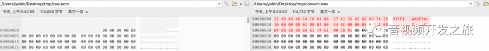

[TOC]

文章参考：https://mp.weixin.qq.com/s?__biz=MzU5NjkxMjE5Mg==&mid=2247483710&idx=1&sn=0613f56710ce856b8c1c22e47cf2cba9&chksm=fe5a3011c92db907625071cec6acfd5031024993e7d2b31c276b5caad2a44f80319c4398f84b&scene=178&cur_album_id=1555170733142622209#rd

## 目录 

1. 音频采集API AudioRecord和MediaRecorder介绍
2. PCM的介绍
3. AudioRecord的使用（构造、开始录制、停止录制、其他细节点）
4. ffplay播放pcm
5. pcm转为wav
6. 小结

AndroidSDK提供了两套音频录制的API，AudioRecord和MediaRecorder。其中MediaRecorder是更加上层的API，他可以直接对手机麦克风录入的音频数据进行压缩编码（比如 mp3），并存储为文件。而AudioRecord更底层些，让开发者能够得到内存中的PCM音频流数据，适用于需要对音频做进一步处理（比如，音效，第三方编码库进行压缩，或者网络传输等）。


MediaRecorder内部也是调用了AudioRecord与Framework层的AudioFlinger进行交互。


## 二、PCM的介绍

PCM（Pluse code Modulation 脉冲编码调制）是一种无压缩的音频格式。模拟音频信号经过A/D模数转换直接生成的二进制序列时，音频源数据（raw）。

声音经过麦克风，转换为一连串的电压信号，然后经过调制编码把电压信号转为数字信号。PCM格式使用三个参数来表示声音：采样率（sampleRate）、采样位数（audioFormat，有8位和16位，分大小端编码）以及声道数（channels）

采样频率：每秒取得声音样本的次数。采样频率越高，声音的质量也就越好，还原的声音就越真实，但同时它占用的资源越多。
		采样位数：即采样值（将采样样本幅度量化的容量），用来衡量声音波动变化的一个参数。也能够说是声卡的分辨率。它的数值越大，分辨率就越高，所发出声音的能力越强。
		声道数：有单声道和立体声之分。单声道的声音仅仅能使用一个喇叭发声，立体声的 PCM 能够使两个喇叭同时发声，更能感受到空间效果


## 三、AudioRecord的使用（构造、开始录制写入pcm文件，状态机）

### 3.1 构造AudioRecord

我们首先通过AudioRecord的构造器，来了解下需要的参数

```java
public AudioRecord(int audioSource, int sampleRateInHz, int channelConfig, int audioFormat,int bufferSizeInBytes)
```

来看下构造方法中的5个参数
audioSource：音频输入源，比如有麦克风等，通过MediaRecord.AudioSource获取。
sampleRateInHz：音频采样率，常见的采样率为44100即44.1KHZ
channelConfig：音频录制时的声道，分为单声道和立体声道，在AudioFormat中定义。
audioFormat：音频格式
bufferSizeInBytes：音频缓冲区大小，不同手机厂商有不同的实现（比如 我的一加手机该值为3584字节），可以通过下面的方法获取。

```java
static public int getMinBufferSize(int sampleRateInHz, int channelConfig, int audioFormat)
```

具体使用如下：

```java
private void createAudioRecord() {
		sampleRateInHz = 44100;
		channelConfig = AudioFormat.CHANNEL_IN_MONO;
		audioFormat = AudioFormat.ENCODING_PCM_16BIT;
		bufferSize = AudioRecord.getMinBufferSize(sampleRateInHz, channelConfig, audioFormat);
		audioRecord = new AudioRecord(MediaRecorder.AudioSource.MIC, sampleRateInHz, channelConfig, audioFormat, bufferSize);
   //audioRecord的状态
    int state = audioRecord.getState();
    Log.d(TAG, "createAudioRecord: state=" + state + " bufferSize=" + bufferSize);
    if (AudioRecord.STATE_INITIALIZED != state) {
        new Exception("AudioRecord无法初始化，请检查录制权限或者是否其他app没有释放录音器");
    }
}

private void initPCMFile() {
    pcmFile = new File(getExternalFilesDir(Environment.DIRECTORY_MUSIC), "raw.pcm");
    Log.d(TAG, "initPCMFile: pcmFile=" + pcmFile);
}
```

### 3.2 开始录制以及读取录制数到pcm文件

在录音过程中，应用所需要做的就是通过 read(byte[], int, int), read(short[], int, int) or read(ByteBuffer, int) 不断地获取数据

```java
private void startRecord() {
    if (pcmFile.exists()) {
        pcmFile.delete();
    }
    isRecording = true;
    final byte[] buffer = new byte[bufferSize];
    audioRecord.startRecording();

    new Thread(new Runnable() {
        @Override
        public void run() {
            FileOutputStream fileOutputStream = null;
            try {
                fileOutputStream = new FileOutputStream(pcmFile);
                if (fileOutputStream != null) {
                    while (isRecording) {
                        int readStatus = audioRecord.read(buffer, 0, bufferSize);
                        Log.d(TAG, "run: readStatus=" + readStatus);
                        fileOutputStream.write(buffer);
                    }
                }
            } catch (IOException e) {
                e.printStackTrace();
                Log.e(TAG, "run: ", e);
            } finally {
                if (fileOutputStream != null) {
                    try {
                        fileOutputStream.close();
                    } catch (IOException e) {
                        e.printStackTrace();
                    }
                }
            }
        }
    }).start();
}
```

### 3.3 停止录制释放资源

```
private void stopRecord() {
    isRecording = false;
    if (audioRecord != null) {
        audioRecord.stop();
    }
}   

protected void onDestroy() {
    super.onDestroy();
    if (audioRecord != null) {
        audioRecord.release();
    }
    audioRecord = null;
}
```

### 3.4 细节点（搞清楚为什么要在子线程开启读取录制数据）

audioRecord的read操作是一个阻塞的操作*(READ_BLOCKING)*，读取到buffersize大小后才释放.所以我们看到步骤三录制时，开启一个子线程进行数据的读取和写入pcm文件。

```java
public int read(@NonNull byte[] audioData, int offsetInBytes, int sizeInBytes) {
	return read(audioData, offsetInBytes, sizeInBytes, READ_BLOCKING);
}
```

AudioRecord的状态两个属性, 录制状态和初始化状态，
设置录制状态时首先片段是否已经初始化

```java
public static final int STATE_UNINITIALIZED = 0;

public static final int STATE_INITIALIZED   = 1;


public static final int RECORDSTATE_STOPPED = 1;  

public static final int RECORDSTATE_RECORDING = 3;

/**
 * Lock to make sure mRecordingState updates are reflecting the actual state of the object.
 */
private final Object mRecordingStateLock = new Object();
```

## 四、 ffplay播放pcm

PCM是源数据，没有封装格式头，一般播放器无法解析播放。可以采用ffplay进行播放或者对其进行转为为其他封装格式的文件（比如wav）进行播放

```
ffplay -f s16le -ar 44100 -ac 1 -i raw.pcm
```

参数解释

```
-f s16le: 即 设置音频格式（format）为有符号16位小端格式（signed 16 bits little endian）对应AudioFormat#ENCODING_PCM_16BIT
-ar：即audiorate 音频采样频率 ,对应AudioRecord构造方法中参数sampleRateInHz
-ac：即audiochannels ，采用的声道，单声为1，多声道为2
-i raw.pcm ：即要播放的pcm源
```

另外也可以通过ffplay直接直接把pcm转为wav，然后播放wav

```
ffmpeg -y -f s16le -ar 44100 -ac 1 -i raw.pcm out.wav
```

参数解释

```
-y：表示无需询问，直接覆盖输出文件
-i raw.pcm out.wav : raw.pcm是输入的文件，out.raw是输出的文件
```

然后可以直接使用ffplay进行wav的播放

```
ffplay out.wav
```


## 五、pcm转为wav

第四步我们看到了采用ffmpeg把pcm转为wav格式，那么有没有其他方式呐？

我们来看下wav的百科

 WAV是最常见的声音文件格式之一，是微软公司专门为Windows开发的一种标准数字音频文件，该文件能记录各种单声道或立体声的声音信息，并能保证声音不失真。它符合资源互换文件格式（RIFF）规范
它有两个特点 1. 无压缩；2. 符合RIFF规范。
那么我们可以采用给PCM文件写入wav的头，符合wav格式。具体实现

```java
private void convertPcmToWav() {
	wavFile = new File(getExternalFilesDir(Environment.DIRECTORY_MUSIC) , "convert.wav");
	if (wavFile.exists()) {
		wavFile.delete();
	}
	FileInputStream fileInputStream = null;
   FileOutputStream fileOutputStream = null;

    try {
        fileInputStream = new FileInputStream(pcmFile);
        fileOutputStream = new FileOutputStream(wavFile);

        long audioByteLen = fileInputStream.getChannel().size();
        long wavByteLen = audioByteLen + 36;

        addWavHeader(fileOutputStream, audioByteLen, wavByteLen, sampleRateInHz,
                channelConfig, audioFormat);
        byte[] buffer = new byte[bufferSize];
        while (fileInputStream.read(buffer) != -1) {
            fileOutputStream.write(buffer);
        }
    } catch (IOException e) {
        e.printStackTrace();
    } finally {
        try {
            if (fileInputStream != null) {
                fileInputStream.close();
            }
            if (fileOutputStream != null) {
                fileOutputStream.close();
            }
        } catch (IOException e) {
            e.printStackTrace();
        }
    }

}

private void addWavHeader(FileOutputStream fileOutputStream, long audioByteLen, long wavByteLen, int sampleRateInHz, int channelConfig, int audioFormat) {
    byte[] header = new byte[44];

    // RIFF/WAVE header chunk
    header[0] = 'R';
    header[1] = 'I';
    header[2] = 'F';
    header[3] = 'F';
    header[4] = (byte) (wavByteLen & 0xff);
    header[5] = (byte) ((wavByteLen >> 8) & 0xff);
    header[6] = (byte) ((wavByteLen >> 16) & 0xff);
    header[7] = (byte) ((wavByteLen >> 24) & 0xff);

    //WAVE
    header[8] = 'W';
    header[9] = 'A';
    header[10] = 'V';
    header[11] = 'E';

    // 'fmt ' chunk 4 个字节
    header[12] = 'f';
    header[13] = 'm';
    header[14] = 't';
    header[15] = ' ';
    // 4 bytes: size of 'fmt ' chunk（格式信息数据的大小 header[20] ~ header[35]）
    header[16] = 16;
    header[17] = 0;
    header[18] = 0;
    header[19] = 0;
    // format = 1 编码方式
    header[20] = 1;
    header[21] = 0;
    // 声道数目
    int channelSize = channelConfig == AudioFormat.CHANNEL_IN_MONO ? 1 : 2;
    header[22] = (byte) channelSize;
    header[23] = 0;
    // 采样频率
    header[24] = (byte) (sampleRateInHz & 0xff);
    header[25] = (byte) ((sampleRateInHz >> 8) & 0xff);
    header[26] = (byte) ((sampleRateInHz >> 16) & 0xff);
    header[27] = (byte) ((sampleRateInHz >> 24) & 0xff);
    // 每秒传输速率
    long byteRate = audioFormat * sampleRateInHz * channelSize;
    header[28] = (byte) (byteRate & 0xff);
    header[29] = (byte) ((byteRate >> 8) & 0xff);
    header[30] = (byte) ((byteRate >> 16) & 0xff);
    header[31] = (byte) ((byteRate >> 24) & 0xff);
    // block align 数据库对齐单位，每个采样需要的字节数
    header[32] = (byte) (2 * 16 / 8);
    header[33] = 0;
    // bits per sample 每个采样需要的 bit 数
    header[34] = 16;
    header[35] = 0;

    //data chunk
    header[36] = 'd';
    header[37] = 'a';
    header[38] = 't';
    header[39] = 'a';
    // pcm字节数
    header[40] = (byte) (audioByteLen & 0xff);
    header[41] = (byte) ((audioByteLen >> 8) & 0xff);
    header[42] = (byte) ((audioByteLen >> 16) & 0xff);
    header[43] = (byte) ((audioByteLen >> 24) & 0xff);

    try {
        fileOutputStream.write(header, 0, 44);
    } catch (IOException e) {
        e.printStackTrace();
    }
}
```


通过Beyond Compare对比pcm和wav发现，正如我们代码所示，在pcm数据源前加了44个字节的wav头



生成的wav可以直接播放器播放。

## 六、收获

通过对AudioRecord的学习实践，
了解音频录制中 （AudioSource录制输入源；smapleRate录制采样率；录制声道配置AudioForamt；采样的格式；以及音频缓冲区大小bufferSize）
了解了音频录制的流程；
pcm和wav的关系以及如何转化；
结合AudioRecord的源码对录制的状态机的同步的设计
AudioRecord的read耗时操作，避免ANR，要在子线程中处理


