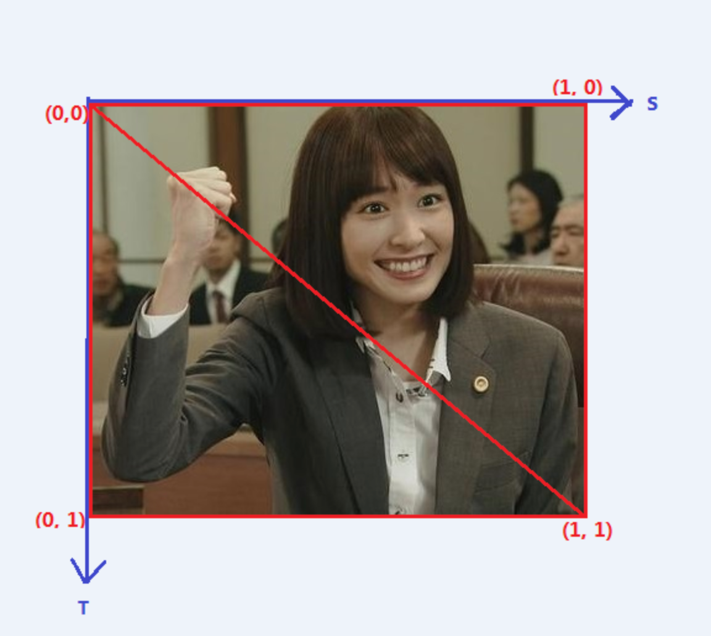
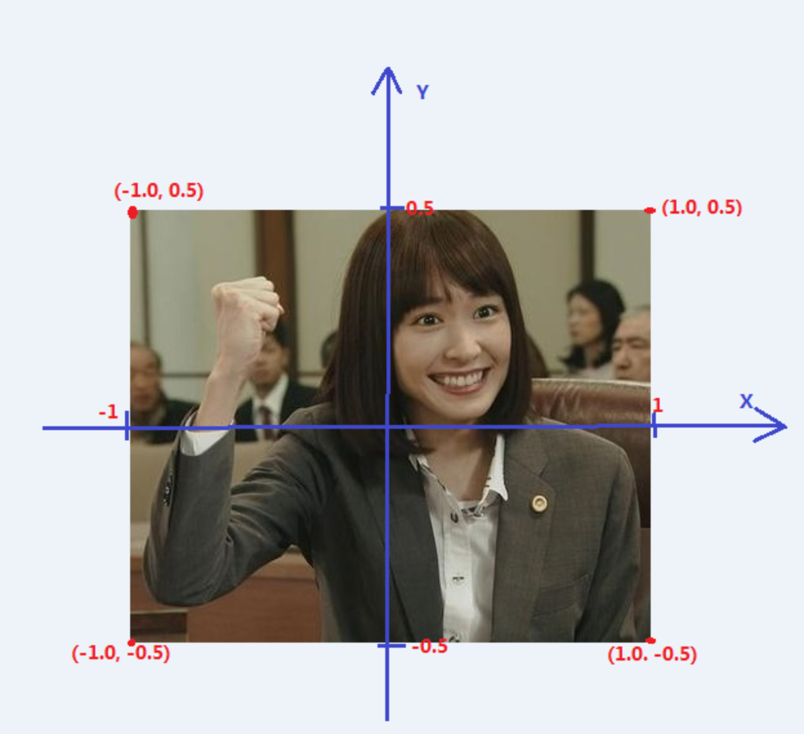

[TOC]

文章转自：https://blog.csdn.net/Kennethdroid/article/details/96887637

## 概述

现实生活中，纹理（Texture）最通常的作用是装饰 3D 物体，它就像是贴纸一样贴在物体表面，丰富物体的表面和细节。 在 OpenGLES 开发中，纹理除了用于装饰物体表面，还可以用来作为存储数据的容器。

**那么在 OpenGL 中，纹理实际上是一个可以被采样的复杂数据集合，是 GPU 使用的图像数据结构，纹理分为 2D 纹理、 立方图纹理和 3D 纹理。**

**2D 纹理是 OpenGLES 中最常用和最常见的纹理形式，是一个图像数据的二维数组。纹理中的一个单独数据元素称为纹素或纹理像素。**

立方图纹理是一个由 6 个单独的纹理面组成的纹理。立方图纹理像素的读取通过使用一个三维坐标（s,t,r）作为纹理坐标。

3D 纹理可以看作 2D 纹理作为切面的一个数组，类似于立方图纹理，使用三维坐标对其进行访问。

# 什么是纹理映射

在 OpenGLES 中，纹理映射就是**通过为图元的顶点坐标指定恰当的纹理坐标，通过纹理坐标在纹理图中选定特定的纹理区域，最后通过纹理坐标与顶点的映射关系，将选定的纹理区域映射到指定图元上**。

纹理映射也称为纹理贴图，简单地说就是将纹理坐标（纹理坐标系）所指定的纹理区域，映射到顶点坐标（渲染坐标系或OpenGLES 坐标系）对应的区域。

纹理坐标系



渲染坐标系或OpenGLES 坐标系:




4 个纹理坐标分别为：T0（0，0），T1（0，1），T2（1，1），T3（1，0）

4 个纹理坐标对于的顶点坐标分别为

```
V0（-1，0.5），V1（-1， -0.5），V2（1，-0.5），V3（1，0.5）
```


由于 OpenGLES 绘制是以三角形为单位的，设置绘制的 2 个三角形为 V0V1V2 和 V0V2V3 

当我们调整纹理坐标的顺序顶点坐标顺序不变，如 T0T1T2T3 -> T1T2T3T0 ，绘制后将得到一个顺时针旋转 90 度的纹理贴图。所以调整纹理坐标和顶点坐标的对应关系可以实现纹理图简单的旋转。

# 纹理映射的简单实现

纹理映射的一般步骤：

- 生成纹理，编译链接着色器程序
- 确定纹理坐标及对应的顶点坐标
- 加载图像数据到纹理，加载纹理坐标和顶点坐标到着色器程序
- 绘制

生成纹理并加载图像数据到纹理（TODO 没看懂）

```c++
//生成一个纹理，将纹理 id 赋值给 m_TextureId
glGenTextures(1, &m_TextureId); 

//将纹理 m_TextureId 绑定到类型 GL_TEXTURE_2D 纹理
glBindTexture(GL_TEXTURE_2D, m_TextureId);

//设置纹理 S 轴（横轴）的拉伸方式为截取
glTexParameterf(GL_TEXTURE_2D, GL_TEXTURE_WRAP_S, GL_CLAMP_TO_EDGE); 

//设置纹理 T 轴（纵轴）的拉伸方式为截取
glTexParameterf(GL_TEXTURE_2D, GL_TEXTURE_WRAP_T, GL_CLAMP_TO_EDGE);

//设置纹理采样方式
glTexParameteri(GL_TEXTURE_2D, GL_TEXTURE_MIN_FILTER, GL_LINEAR);
glTexParameteri(GL_TEXTURE_2D, GL_TEXTURE_MAG_FILTER, GL_LINEAR);

//加载 RGBA 格式的图像数据
glTexImage2D(GL_TEXTURE_2D, 0, GL_RGBA, m_RenderImage.width, m_RenderImage.height, 0, GL_RGBA, GL_UNSIGNED_BYTE, m_RenderImage.ppPlane[0]);
```

对纹理[采样](https://so.csdn.net/so/search?q=采样&spm=1001.2101.3001.7020)的片元着色器脚本

```c++
#version 300 es                                     
precision mediump float;                            
in vec2 v_texCoord;                                 
layout(location = 0) out vec4 outColor;             
uniform sampler2D s_TextureMap; //声明采用器                     
void main()                                         
{
  // texture() 为内置的采样函数，v_texCoord 为顶点着色器传进来的纹理坐标
  // 根据纹理坐标对纹理进行采样，输出采样的 rgba 值（4维向量）                                                  
  outColor = texture(s_TextureMap, v_texCoord);      
}                  
```


