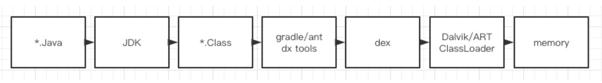
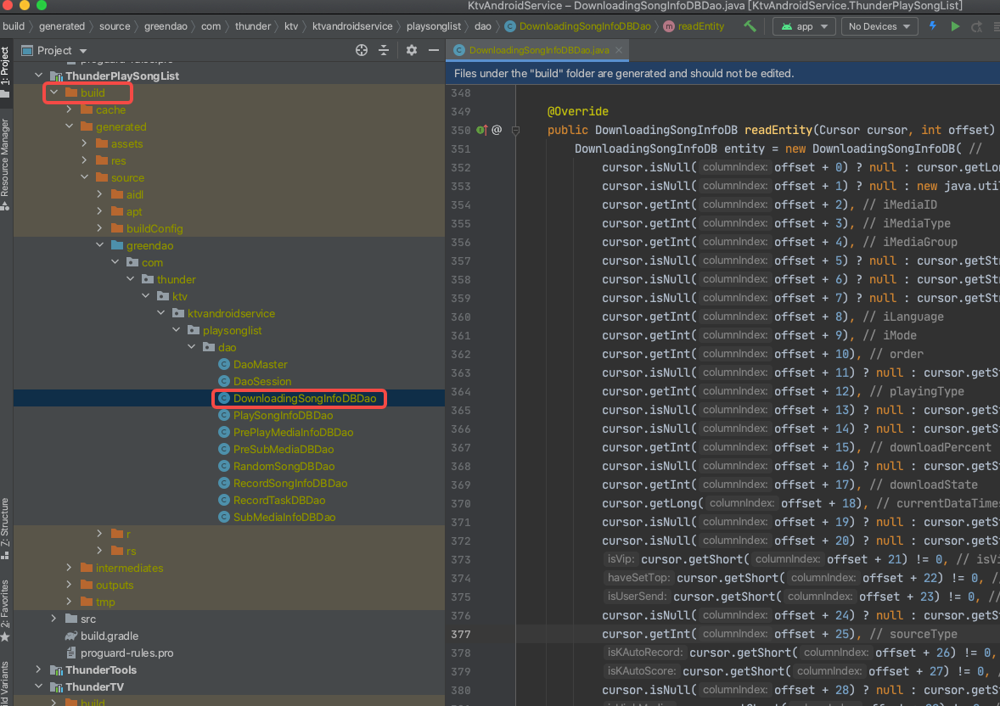

[TOC]

文章参考：https://mp.weixin.qq.com/s/dbseDMO3tqNPtSvBB5UL3Q

文章参考：https://www.yuque.com/docs/share/b49a3274-17d9-4c87-815a-4a13ab72e4e0

## 概述

插桩是什么？你在开发中有用过插桩的技术吗？

所谓的插桩就是在代码编译期间修改已有的代码或者生成新代码。

插桩具体在编译的哪个流程介入呢？

## 插桩的作用与场景

- 代码生成
- 代码监控
- 代码修改
- 代码分析

### Java 源文件方式

类似 AndroidAnnotation/APT(Annotation Processing Tool)，可以在代码编译期解析注解，并且生成新的 Java 文件，减少手动的代码输入。 这些代码生成的场景，它们生成的都是 Java 文件，是在编译的最开始介入。典型的有 Greendao、ButterKnife 

 上图是我们项目内在用的 ORM 映射数据库 Greendao。可见 build 目录下有很多 *.java 后缀的文件，build一般都是放置编译生成后的产物，很显然这些文件就是在我们 build 时候通过注解处理器产生的 Java 文件。

### 字节码

对于代码监控、代码修改以及代码分析这三个场景，一般采用操作字节码的方式。可以操作“.class”的 Java 字节码，也可以操作“.dex”的 Dalvik 字节码，这取决于我们使用的插桩方法，相对于 Java 文件方式，字节码操作方式功能更加强大，应用场景也更广，但是它的使用复杂度更高。

#### Java 字节码 

对于 Java 平台，Java 虚拟机运行的是 Class 文件，内部对应的是 Java 字节码。

### ASM

