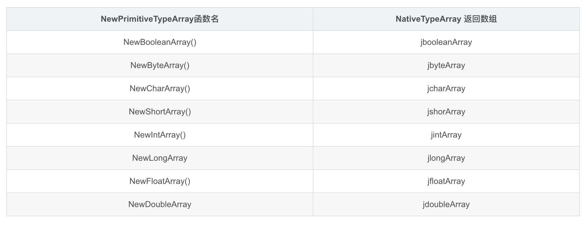

[TOC]

文章参考：https://blog.csdn.net/tkwxty/article/details/103665532

## 概述

JNI 中的数组分为基本类型数组和对象数组，它们的处理方式是不一样的，基本类型数组中的所有元素都是 JNI的基本数据类型，可以直接访问。而对象数组中的所有元素是一个类的实例或其它数组的引用，和字符串操作一样，不能直接访问 Java 传递给 JNI 层的数组，必须选择合适的 JNI 函数来访问和设置 Java 层的数组对象。阅读此文假设你已经了解了 JNI 与 Java 数据类型的映射关系。

下面让我们从JNI的基本数组操作函数开始，一步步带领读者攻破JNI对数组的处理。


## JNI数组处理函数

好了有了前面知识的铺垫，下面让我们来看看JNIEnv为我们提供了那些常见的数组处理函数。

### 1.1 GetArrayLength


### 1.4 New\<PrimitiveType>Array函数集

这里的PrimitiveType指代的是一系列的JNI基本数据类型。

**函数原型**: 

```shell
NativeTypeArray New<PrimitiveType>Array (JNIEnv* env, jsize size)
```

**函数功能**: 用于构造JNI基本类型数组对象的一系列操作。

**使用说明**： 在下表中会将特定的基本类型数组构造函数及其返回值一一对应。在实际应用中把PrimitiveType替换为某个实际的基本类型数据类型，然后再将NativeType替换成对应的JNI Native Type即可，。譬如我们以int型来说明，那么其对应的函数为：

```c++
jintArray     (*NewIntArray)(JNIEnv*, jsize);
```

**参数**:

- env: JNIEnv接口指针
- lenght: 需要创建的数组的长度

返回值:返回JNI基本数据类型数组。如果无法构造该数组，则为 NULL。




### 1.6 Get/Set\<PrimitiveType\>ArrayRegion函数集

这里的PrimitiveType指代的是一系列的JNI基本数据类型,这对函数集分别用来将基本类型数组某一区域复制到缓冲区中的一组函数/将基本类型数组的某一区域从缓冲区中复制回来的一组函数,下面让我们来分别分析：

**Get\<PrimitiveType>ArrayRegion**

**函数原型**：

```c++
void Set<PrimitiveType>ArrayRegion (JNIEnv *env, NativeTypeArray array, jsize start, jsize len, NativeType *buf);
```

**函数功能**：将基本类型数组某一区域复制到缓冲区中的一组函数。

**使用说明**: 将PrimitiveType替换成对应的数据类型，将NativeType 替换成JNI Native type类型，譬如我们以释放int数组为例：

```c++
void  (*GetIntArrayRegion)(JNIEnv*, jintArray,jsize, jsize, jint*);
```

**参数**:

- env：JNIEnv 接口指针
- array: Java基本类型数组，源缓冲区
- start：起始下标
- len：要复制的元素长度
- buf：目的缓冲区


