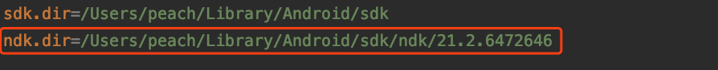

[TOC]

## 解决Could not find method ndkVersion() for arguments on object of type com.android.build.问题

解决方案：https://blog.csdn.net/u012558210/article/details/106427634

刚升级完Android Studio 4.0，偶然用到了 NDK 相关的项目，运行后出这个错，还以为我这台电脑没有装相应的 NDK 点击Update。

# 解决问题

通过提示Open File 发现文件的 android 标签的最下面AS给自动加了这么一行：

```
ndkVersion '21.2.6472646'
```

这行就是问题所在了，但去掉后还会出现最开始的NSK not configured的错误，套娃出现。这是因为项目中没有配置NDK的路径，编译时找不到了，所以打开local.properties文件，发现果然没有ndk的配置，加上本机的NDK路径：



再次编译，SUCCESSFUL！

