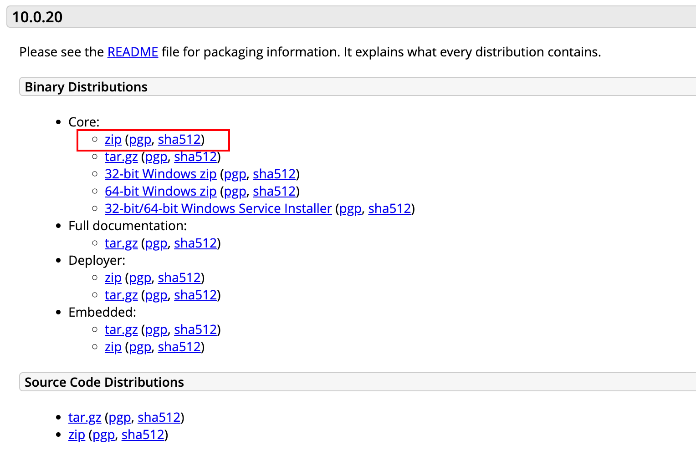
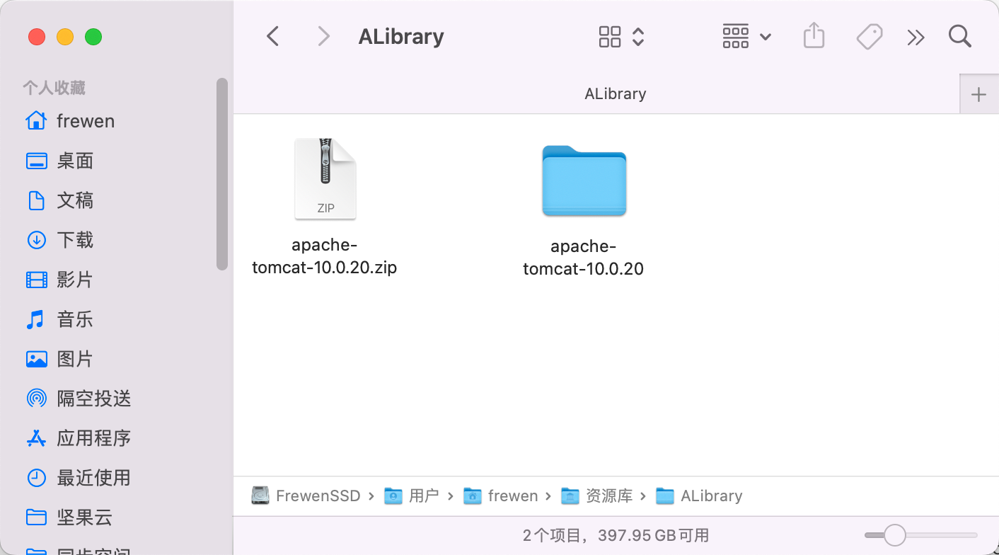

[TOC]

# 概述

文章参考：https://blog.csdn.net/waneto2008/article/details/52486357

# 下载Tomcat（以tomcat10为例）

下载地址：https://tomcat.apache.org/download-10.cgi

 直接下载如图选中的即可


### 下载zip压缩包完成后解压。

解压完成之后，随意放入目录。如我就把它放在/Library/目录下。



### 将Tomcat写入系统的环境变量PATH中

1.打开你的终端：然后输入  vim .bash_profile   回车。出现如下图的窗口。


```shell
// 进行编辑
vim ~/.bash_profile 

// 在控制台里输入以下语句
# >>> Tomcat Home  >>>
export PATH=$PATH:/Users/frewen/Library/AFrewenLib/apache-tomcat-10.0.20/bin
# <<< Tomcat Home  <<<

```

编辑完成之后保存。然后输入下面的命令，来使得设置的环境变量生效


```
source ~/.bash_profile
```

2.验证是否成功，终端中输入

```
$PATH
```

### 启动Tomcat.

如果你完成上述“第三步“，你可以直接在终端输入 startup.sh ；

```
➜  ~ source ~/.bash_profile
➜  ~ startup.sh
zsh: permission denied: startup.sh
```
注意：

如果当 startup.sh后出现类似 “Permission denied” 字样，那么需要你对此目录进行权限设置：

启动终端：输入 


```
sudo chmod 777 /Users/frewen/Library/AFrewenLib/apache-tomcat-10.0.20/bin/*.sh
```
之后在重新执行，输出以下内容：

```shell
frewen@FreweniMacBookPro ~ % startup.sh
Using CATALINA_BASE:   /Users/frewen/Library/AFrewenLib/apache-tomcat-10.0.20
Using CATALINA_HOME:   /Users/frewen/Library/AFrewenLib/apache-tomcat-10.0.20
Using CATALINA_TMPDIR: /Users/frewen/Library/AFrewenLib/apache-tomcat-10.0.20/temp
Using JRE_HOME:        /Library/Java/JavaVirtualMachines/jdk-11.0.14.jdk/Contents/Home
Using CLASSPATH:       /Users/frewen/Library/AFrewenLib/apache-tomcat-10.0.20/bin/bootstrap.jar:/Users/frewen/Library/AFrewenLib/apache-tomcat-10.0.20/bin/tomcat-juli.jar
Using CATALINA_OPTS:   
Tomcat started.
```

则表示权限设置成功。

打开你的浏览器，然后网址输入  http://localhost:8080/

如果能正常打开tomcat首页，说明tomcat 配置启动成功:

### 配置Tomcat环境

为了方便在终端中简单一个命令就可以启动，我们可以配置一个 Tomcat 启动脚本，再把脚本命令路径加入到系统环境后就可以快速调用了：

1. 使用文本编辑器添加以下运行脚本代码：


```shell
#!/bin/bash
# case语句
# Shell case语句为多选择语句。可以用case语句匹配一个值与一个模式，如果匹配成功，执行相匹配的命令。case语句格式如下：

case $1 in

TomcatStart)
	sh /Users/frewen/Library/AFrewenLib/apache-tomcat-10.0.20/bin/startup.sh
;;
TomcatStop)
	sh /Users/frewen/Library/AFrewenLib/apache-tomcat-10.0.20/bin/shutdown.sh
;;
TomcatRestart)
	sh /Users/frewen/Library/AFrewenLib/apache-tomcat-10.0.20/bin/shutdown.sh
	sh /Users/frewen/Library/AFrewenLib/apache-tomcat-10.0.20/bin/startup.sh
;;
*)
	echo “Usage: TomcatStart | TomcatStop | TomcatRestart”
;;
esac

exit 0
```
2. 将上述代码保存到文件文件中，文件命名为 tomcat，注意文件名小写并不带后缀。同样的，注意给文件赋予文件执行权限：

然后将这个文件放在Tomcat的bin目录下：/Users/frewen/Library/apache-tomcat-9.0.50/bin


```
chmod 777 tomcat
```

将文件命名为tomcat.sh


启动tomcat

```
tomcat.sh start
```

停止tomcat 

```shell
tomcat.sh stop
```

