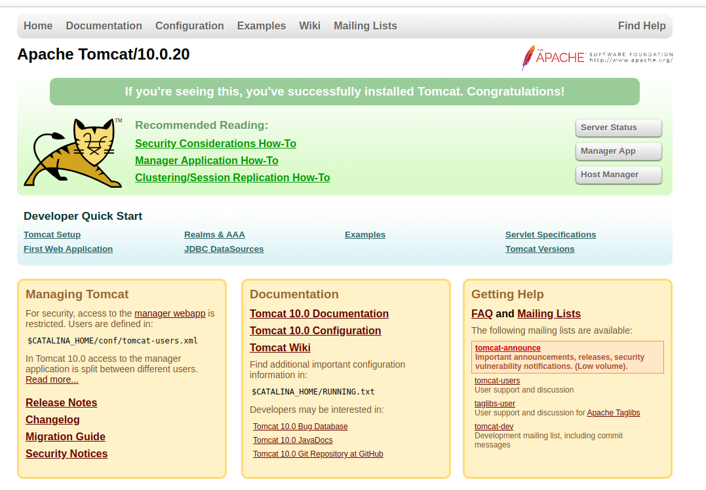

[TOC]

# 概述

文章参考：https://blog.csdn.net/xyphf/article/details/81158529


## 安装教程


1、进入developer目录，下载tomcat

```shell
# 下载tomcat
wget https://dlcdn.apache.org/tomcat/tomcat-10/v10.0.20/bin/apache-tomcat-10.0.20.tar.gz
```

2、解压tomcat

```
tar -zxvf  apache-tomcat-10.0.20.tar.gz  
```

3、进入tomcat目录

```
cd apache-tomcat-10.0.20
```


启动Tomcat

```shell
// 进入bin目录
cd bin/

./startup.sh
#输出
Using CATALINA_BASE:   /home/frewen/DevTools/apache-tomcat-10.0.20
Using CATALINA_HOME:   /home/frewen/DevTools/apache-tomcat-10.0.20
Using CATALINA_TMPDIR: /home/frewen/DevTools/apache-tomcat-10.0.20/temp
Using JRE_HOME:        /usr/local/jdk/jdk-11.0.14
Using CLASSPATH:       /home/frewen/DevTools/apache-tomcat-10.0.20/bin/bootstrap.jar:/home/frewen/DevTools/apache-tomcat-10.0.20/bin/tomcat-juli.jar
Using CATALINA_OPTS:   
Tomcat started.
```


