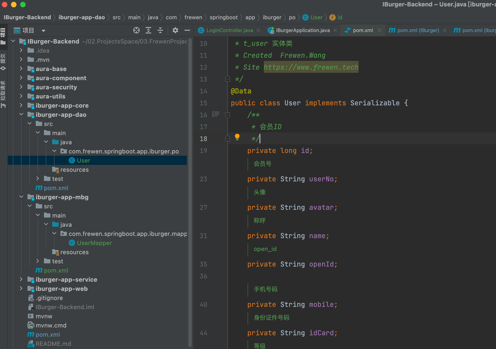

[TOC]

# 概述

文章参考：https://github.com/baomidou/mybatis-plus

文章参考：https://github.com/macrozheng/mall-learning

视频参考：https://www.bilibili.com/video/BV1NY411g7cf?p=6&spm_id_from=pageDriver&vd_source=0e017b0ae3925aa5166b3d4708f0dd0f


### 开始指南

文章参考：https://baomidou.com/

快速开始页面：https://baomidou.com/pages/24112f/

## 1.引入SpringBoot

引入 Spring Boot Starter 父工程：

```xml-dtd
<parent>
    <groupId>org.springframework.boot</groupId>
    <artifactId>spring-boot-starter-parent</artifactId>
    <version>2.0+ 版本</version>
    <relativePath/>
</parent>
```

### 1.添加项目依赖

在pom.xml中添加相关依赖。

引入 `spring-boot-starter`、`spring-boot-starter-test`、`mybatis-plus-boot-starter`依赖：

```html
    <!-- properties 是为pom定义一些常量，在pom中的其它地方可以直接引用 -->
    <properties>
        <java.version>11</java.version>
        <mybatis-plus.version>3.5.1</mybatis-plus.version>
        <pagehelper.version>5.3.0</pagehelper.version>
    </properties>

    <!-- 管理 children 的dependencies ，配置在parent项目中 -->
    <!-- maven的依赖（dependencies）有传递性 -->
    <dependencyManagement>
        <dependencies>
            <dependency>
        				<groupId>org.springframework.boot</groupId>
        				<artifactId>spring-boot-starter</artifactId>
    				</dependency>
    				<dependency>
        				<groupId>org.springframework.boot</groupId>
        				<artifactId>spring-boot-starter-test</artifactId>
        				<scope>test</scope>
    				</dependency>
					   <!--MyBatis Plus 依赖-->
            <dependency>
                <groupId>com.baomidou</groupId>
                <artifactId>mybatis-plus-boot-starter</artifactId>
                <version>${mybatis-plus.version}</version>
            </dependency>
            <!--MyBatis Plus 代码生成器-->
            <dependency>
                <groupId>com.baomidou</groupId>
                <artifactId>mybatis-plus-generator</artifactId>
                <version>${mybatis-plus.version}</version>
            </dependency>
        </dependencies>
    </dependencyManagement>
```


### 配置数据库

添加数据库驱动依赖

```xml-dtd
  					<!-- 添加数据库依赖 -->
            <dependency>
                <groupId>mysql</groupId>
                <artifactId>mysql-connector-java</artifactId>
                <version>${mysql-connector.version}</version>
                <scope>runtime</scope>
            </dependency>
```


```
dataSource.url=jdbc:mysql://localhost:3306/iburger?useUnicode=true&characterEncoding=utf-8&serverTimezone=Asia/Shanghai
dataSource.driverName=com.mysql.cj.jdbc.Driver
dataSource.username=root
dataSource.password=123456
package.base=com.frewen.springboot.app.iburger.modules
```


### 修改SpringBoot配置文件


### 创建实体类




### 创建mapper


```java
package com.frewen.springboot.app.iburger.mapper;

import com.baomidou.mybatisplus.core.mapper.BaseMapper;
import com.frewen.springboot.app.iburger.po.User;
import org.apache.ibatis.annotations.Mapper;

@Mapper
public interface UserMapper extends BaseMapper<User> {

}

```


### 创建Service


```java
package com.frewen.springboot.app.iburger.service;


import com.frewen.springboot.app.iburger.mapper.UserMapper;
import com.frewen.springboot.app.iburger.po.User;
import com.google.gson.Gson;
import org.springframework.beans.factory.annotation.Autowired;
import org.springframework.stereotype.Service;
import org.springframework.transaction.annotation.Transactional;

import java.util.List;

@SuppressWarnings("all")
@Service
@Transactional
public class UserService {

    @Autowired
    UserMapper userMapper;

    private Gson gson = new Gson();

    public String testUserList() {
        List<User> userList = userMapper.selectList(null);
        return gson.toJson(userList);
    }

}

```


### 创建Controller


```java
package com.frewen.springboot.app.iburger.controller;

import com.frewen.springboot.app.iburger.service.UserService;
import org.springframework.beans.factory.annotation.Autowired;
import org.springframework.web.bind.annotation.GetMapping;
import org.springframework.web.bind.annotation.RestController;


@SuppressWarnings("all")
@RestController
public class UserController {

    @Autowired
    UserService userService;

    @GetMapping("testUserList")
    public String testUserList() {
        return userService.testUserList();
    }

}

```


```java
package com.frewen.springboot.app.iburger;

import org.mybatis.spring.annotation.MapperScan;
import org.springframework.boot.SpringApplication;
import org.springframework.boot.autoconfigure.SpringBootApplication;

@SpringBootApplication
@MapperScan("com.frewen.springboot.app.iburger.mapper")
public class IBurgerApplication {

    public static void main(String[] args) {
        SpringApplication.run(IBurgerApplication.class, args);
    }
}
```


## 增加MyBatisPlusConfig


```java
@Configuration
@EnableTransactionManagement
@MapperScan({"com.frewen.springboot.app.iburger.mapper"})
public class MyBatisPlusConfig {

    /**
     * 设置MybatisPlus的拦截器
     * @return
     */
    @Bean
    public MybatisPlusInterceptor mybatisPlusInterceptor() {
        MybatisPlusInterceptor interceptor = new MybatisPlusInterceptor();
        interceptor.addInnerInterceptor(new PaginationInnerInterceptor(DbType.MYSQL));
        return interceptor;
    }
}

```


## 测试


