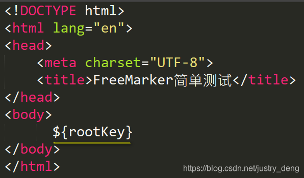
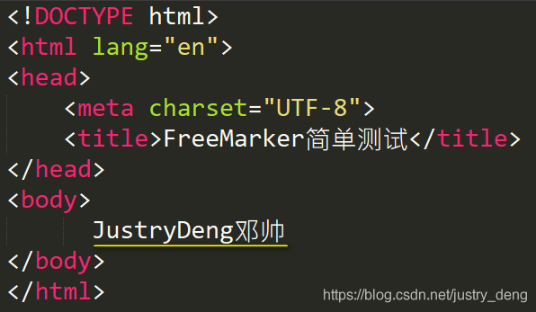

[TOC]

# 概述

 FreeMarker是一款模板引擎:即一种基于模板和要改变的数据,并用来生成输出文本(HTML网页、电子邮件、配置文件、源代码等)的通用工具。

# FreeMarker功能是：


注：虽然模板文件可以是任意后缀名的文件，但是我们一般都约定俗成的将模板文件后缀名改为ftl；这样一来，任何
    人一看就知道谁是FreeMarker的模板文件。

注：传入的数据必须要有一个key才行，FreeMarker模板语言以该key为根,并按照其一定的表达式语言，定位到根下的
    各个节点，从而取出相应的数据。
    追注：可类比JSP进行理解。


# FreeMarker一般的使用方式：

模板文件(normal.ftl)是这样的：




提示：上述代码需要引入FreeMarker的Jar包。

结果文件(normal.html)是这样的：




​		

首先是在pom.xml文件中添加依赖

```pom
<dependency>
    <groupId>org.springframework.boot</groupId>
    <artifactId>spring-boot-starter-freemarker</artifactId>
</dependency>
```


注：这里引入spring-boot-starter-freemarker才是关键；其余依赖都可以不引入；不过考虑到在接下来会给一个使用示
    例，所以还引入了web支持、快速快发lombok、热部署devtools；当然，test是基本依赖。


***\*第二步\**：**编辑系统配置文件application.properties，指定以什么后缀名的文件作为模板、指定在哪个文件夹下去找模板文件。

​	