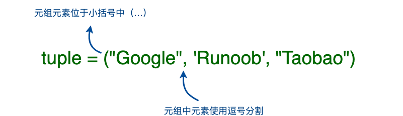

[TOC]


## 概述

Python 的元组与列表类似，不同之处在于元组的元素不能修改。

元组使用小括号 **( )**，列表使用方括号 **[ ]**。

元组创建很简单，只需要在括号中添加元素，并使用逗号隔开即可。

元组和列表在结构上没有什么区别，唯一的差异在于元组是只读的，不能修改。元组用“()”表示

在绝大多数编程语言中，集合的数据类型必须一致。不过，对于Python的列表和元组来说，并无此要求

其次，我们必须掌握它们的区别。

- **列表是动态的**，长度大小不固定，可以随意地增加、删减或者改变元素（mutable）。
- **而元组是静态的**，长度大小固定，无法增加删减或者改变（immutable）。




## 元组的不可变性

所谓元组的不可变指的是元组所指向的内存中的内容不可变。

```python
>>> tup = ('r', 'u', 'n', 'o', 'o', 'b')
>>> tup[0] = 'g'     # 不支持修改元素
Traceback (most recent call last):
  File "<stdin>", line 1, in <module>
TypeError: 'tuple' object does not support item assignment
>>> id(tup)     # 查看内存地址
4440687904
>>> tup = (1,2,3)
>>> id(tup)
4441088800    # 内存地址不一样了
```


## 元组使用场景

**1.** 如果存储的数据和数量不变，比如你有一个函数，需要返回的是一个地点的经纬度，然后直接传给前端渲染，那么肯定选用元组更合适。

**2.** 如果存储的数据或数量是可变的，比如社交平台上的一个日志功能，是统计一个用户在一周之内看了哪些用户的帖子，那么则用列表更合适。

**3.** 一般在**key中使用元祖**，其他情况多数都使用列表


