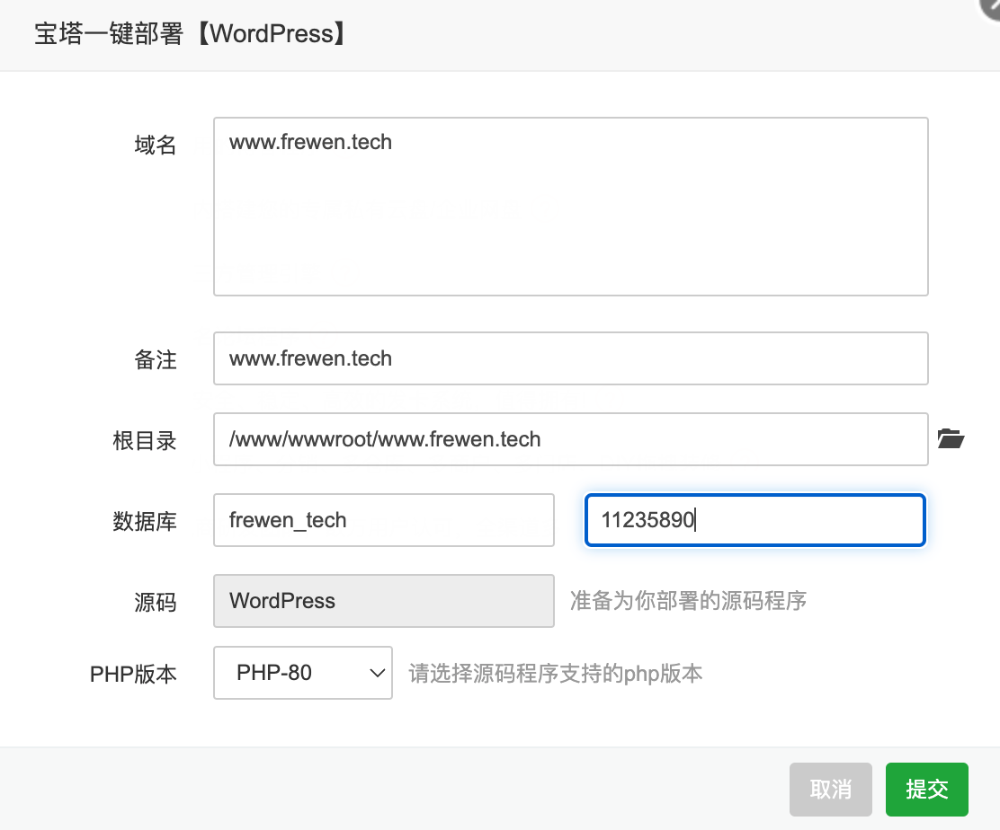

[TOC]

# 概述


> 使用 SSH 连接工具，如[堡塔SSH终端](https://download.bt.cn/xterm/BT-Term.zip)连接到您的 Linux 服务器后，[挂载磁盘](https://www.bt.cn/bbs/thread-50002-1-1.html)，根据系统执行相应命令开始安装（大约2分钟完成面板安装）：
>
> Centos安装脚本
>
> ```
> yum install -y wget && wget -O install.sh http://download.bt.cn/install/install_6.0.sh && sh install.sh ed8484bec
> ```
>
> Ubuntu/Deepin安装脚本
>
> ```
> wget -O install.sh http://download.bt.cn/install/install-ubuntu_6.0.sh && sudo bash install.sh ed8484bec
> ```
>
> Debian安装脚本
>
> ```
> wget -O install.sh http://download.bt.cn/install/install-ubuntu_6.0.sh && bash install.sh ed8484bec
> ```
>
> Fedora安装脚本
>
> ```
> wget -O install.sh http://download.bt.cn/install/install_6.0.sh && bash install.sh ed8484bec
> ```

注意：必须为没装过其它环境如Apache/Nginx/php/MySQL的新系统,推荐使用centos 7.X的系统安装宝塔面板


```
==================================================================
Congratulations! Installed successfully!
==================================================================
外网面板地址: http://[2409:8a00:78a8:a2b0:fa2d:7d11:76e4:14b0]:8888/0f64b593
内网面板地址: http://192.168.1.14:8888/0f64b593
username: 5jn15apm
password: a12e6f92
If you cannot access the panel,
release the following panel port [8888] in the security group
若无法访问面板，请检查防火墙/安全组是否有放行面板[8888]端口
==================================================================
Time consumed: 2 Minute!
```


## 部署WordPress




