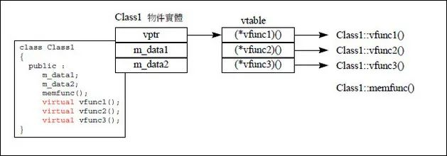
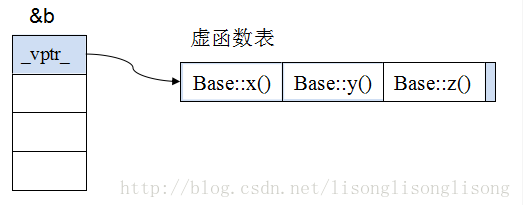
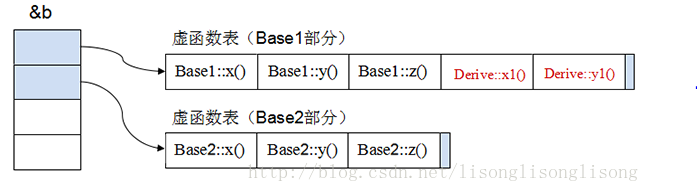
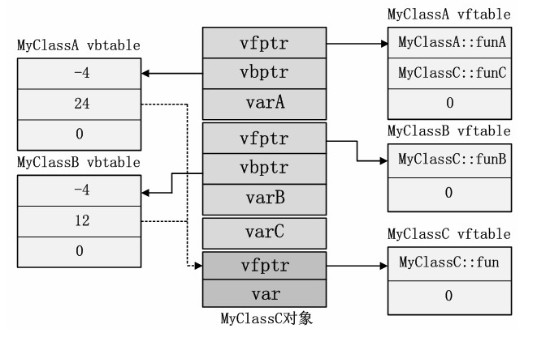

[TOC]


文章参考：https://mp.weixin.qq.com/s/mQsDlx1dSVaF_ou9KNRdYg

## 概述


## 多态

- 定义：“一个接口，多种方法”，程序在运行时才决定调用的函数。
- 实现：C++多态性主要是通过虚函数实现的，**虚函数允许子类重写override(注意和overload的区别，overload是重载**，是允许同名函数的表现，这些函数参数列表/类型不同）。
- 目的：接口重用。封装可以使得代码模块化，继承可以扩展已存在的代码，他们的目的都是为了代码重用。而多态的目的则是为了接口重用。
- 用法：声明基类的指针，**利用该指针指向任意一个子类对象，调用相应的虚函数**，可以根据指向的子类的不同而实现不同的方法。


## **虚函数表**

**多态是由虚函数实现的**，而虚函数主要是通过虚函数表（V-Table）来实现的。

**如果一个类中包含虚函数（virtual修饰的函数），那么这个类就会包含一张虚函数表**，虚函数表存储的每一项是一个虚函数的地址。如下图：



**虚指针（vptr）**:这个类的每一个对象都会包含一个虚指针（虚指针存在于对象实例地址的最前面，保证虚函数表有最高的性能），这个虚指针指向虚函数表。

注：对象不包含虚函数表，只有虚指针，类才包含虚函数表，派生类会生成一个兼容基类的虚函数表。


- **原始基类的虚函数表**

下图是原始基类的对象，可以看到**虚指针在地址的最前面，指向基类的虚函数表**（假设基类定义了3个虚函数）




- 多重继承时的虚函数（Derived ::public Base1,public Base2）

这个派生类多重继承了两个基类base1，base2，因此它有两个虚函数表。



它的对象会有多个虚指针（据说和编译器相关），指向不同的虚函数表。


多重继承时指针的调整：

```c++
Derive b;
Base1* ptr1 = &b;   // 指向 b 的初始地址
Base2* ptr2 = &b;   // 指向 b 的第二个子对象
```

因为 Base1 是第一个基类，所以 ptr1 指向的是 Derive 对象的起始地址，不需要调整指针（偏移）。

因为 Base2 是第二个基类，所以必须对指针进行调整，即加上一个 offset，让 ptr2 指向 Base2 子对象。


- 虚继承时的虚函数表

虚继承的引入把对象的模型变得十分复杂，除了每个基类（MyClassA和MyClassB）和公共基类（MyClass）的虚函数表指针需要记录外，每个虚拟继承了MyClass的父类还需要记录一个虚基类表vbtable的指针vbptr。MyClassC的对象模型如图4所示。




