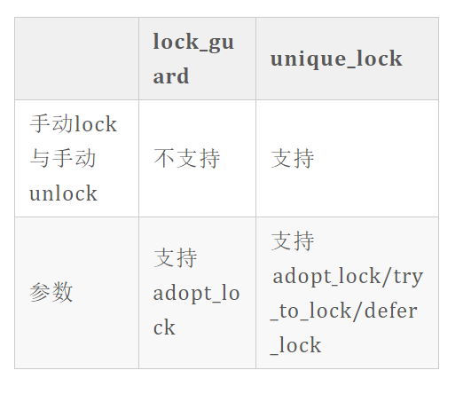

[TOC]

## 概述

文章参考：https://zhuanlan.zhihu.com/p/194198073

线程：线程是操作系统能够进行CPU调度的最小单位，它被包含在进程之中，一个进程可包含单个或者多个线程。可以用多个线程去完成一个任务，也可以用多个进程去完成一个任务，它们的本质都相当于多个人去合伙完成一件事。

多线程并发：多线程是实现并发(双核的真正并行或者单核机器的任务切换都叫并发）的一种手段，多线程并发即多个线程同时执行,一般而言，多线程并发就是把一个任务拆分为多个子任务，然后交由不同线程处理不同子任务,使得这多个子任务同时执行。

C++多线程并发： （简单情况下）实现C++多线程并发程序的思路如下：将任务的不同功能交由多个函数分别实现，创建多个线程，每个线程执行一个函数，一个任务就这样同时分由不同线程执行了。

**不要过多纠结多线程与多进程、并发与并行这些概念** （这些概念都是相当于多个人去合伙完成一件事），会用才是王道，理解大致意思即可,想要深入了解可阅读本文“延伸拓展”章节。

**我们通常在何时使用并发?** 程序使用并发的原因有两种，为了关注点分离（程序中不同的功能，使用不同的线程去执行），或者为了提高性能。当为了分离关注点而使用多线程时，设计线程的数量的依据，不再是依赖于CPU中的可用内核的数量，而是依据概念上的设计（依据功能的划分）。

**知道何时不使用并发与知道何时使用它一样重要。** 不使用并发的唯一原因就是收益（性能的增幅）比不上成本（代码开发的脑力成本、时间成本，代码维护相关的额外成本）。运行越多的线程，操作系统需要为每个线程分配独立的栈空间，需要越多的上下文切换，这会消耗很多操作系统资源，如果在线程上的任务完成得很快，那么实际执行任务的时间要比启动线程的时间小很多，所以在某些时候，增加一个额外的线程实际上会降低，而非提高应用程序的整体性能，此时收益就比不上成本。


# 创建线程

首先要引入头文件**#include\<thread>，**管理线程的函数和类在该头文件中声明，其中包括std::thread类。

```c
#include<thread>

std::thread th1(proc1);
std::thread th2(proc2,a,b)
```

创建了一个名为th1的线程，并且线程th1开始执行。

实例化std::thread类对象时，至少需要传递函数名作为参数。如果函数为有参函数,如"void proc2(int a,int b)",那么实例化std::thread类对象时，则需要传递更多参数，参数顺序依次为函数名、该函数的第一个参数、该函数的第二个参数，···，如上。这里的传参，后续章节还会有详解与提升。

**只要创建了线程对象**（前提是，实例化std::thread对象时传递了“函数名/可调用对象”作为参数），**线程就开始执行。所以不应该在创建了线程后马上join, 这样会马上阻塞主线程，创建了线程和没有创建一样，应该在晚一点的位置调用join**

**总之，使用C++线程库启动线程，可以归结为构造std::thread对象。**

**那么至此一个简单的多线程并发程序就编写完了吗？**

## join方法

不，还没有。**当线程启动后，一定要在和线程相关联的std::thread对象销毁前，对线程运用join()或者detach()方法。**

join()与detach()都是std::thread类的成员函数，是两种线程阻塞方法，两者的区别是是否等待子线程执行结束。

新手先把join()弄明白就行了，然后就可以去学习后面的章节，等过段时间再回头来学detach()。

等待调用线程运行结束后当前线程再继续运行，例如，主函数中有一条语句th1.join(),那么执行到这里，主函数阻塞，直到线程th1运行结束，主函数再继续运行。

整个过程就相当于：你在处理某件事情（你是主线程），中途你让老王帮你办一个任务（与你同时执行）（创建线程1，该线程取名老王），又叫老李帮你办一件任务（创建线程2，该线程取名老李），现在你的一部分工作做完了，剩下的工作得用到他们的处理结果，那就调用"老王.join()"与"老李.join()"，至此你就需要等待（主线程阻塞），等他们把任务做完（子线程运行结束），你就可以继续你手头的工作了（主线程不再阻塞）。

一提到join,你脑海中就想起两个字，"等待"，而不是"加入"，这样就很容易理解join的功能。

```c++
#include<iostream>
#include<thread>
using namespace std;
void proc(int &a)
{
    cout << "我是子线程,传入参数为" << a << endl;
    cout << "子线程中显示子线程id为" << this_thread::get_id()<< endl;
}
int main()
{
    cout << "我是主线程" << endl;
    int a = 9;
    thread th2(proc,ref(a));//第一个参数为函数名，第二个参数为该函数的第一个参数，如果该函数接收多个参数就依次写在后面。此时线程开始执行。
    cout << "主线程中显示子线程id为" << th2.get_id() << endl;
    th2.join()；//此时主线程被阻塞直至子线程执行结束。
    return 0;
}
```


## 互斥量（锁）使用

### 什么是互斥量（锁）？

这样比喻：单位上有一台打印机（共享数据a），你要用打印机（线程1要操作数据a），同事老王也要用打印机(线程2也要操作数据a)，但是打印机同一时间只能给一个人用，此时，规定不管是谁，在用打印机之前都要向领导申请许可证（lock），用完后再向领导归还许可证(unlock)，许可证总共只有一个,没有许可证的人就等着在用打印机的同事用完后才能申请许可证(阻塞，线程1lock互斥量后其他线程就无法lock,只能等线程1unlock后，其他线程才能lock)。**那么，打印机就是共享数据，访问打印机的这段代码就是临界区，这个必须互斥使用的许可证就是互斥量（锁）**。

互斥量是为了解决数据共享过程中可能存在的访问冲突的问题。这里的互斥量保证了使用打印机这一过程不被打断。

### 死锁

多线程编程时要考虑多个线程同时访问共享资源所造成的问题，因此可以通过加锁解锁来保证同一时刻只有一个线程能访问共享资源；使用锁的时候要注意，不能出现死锁的状况；

**死锁**就是多个线程争夺共享资源导致每个线程都不能取得自己所需的全部资源，从而程序无法向下执行。

**产生死锁的四个必要条件（面试考点）：**

1. 互斥（资源同一时刻只能被一个进程使用）
2. 请求并保持（进程在请资源时，不释放自己已经占有的资源）
3. 不剥夺（进程已经获得的资源，在进程使用完前，不能强制剥夺）
4. 循环等待（进程间形成环状的资源循环等待关系）

**死锁预防：**

破坏死锁产生的四个条件（完全杜绝死锁）

**死锁避免：**

对分配资源做安全性检查，确保不会产生循环等待（银行家算法）

**死锁检测：**

允许死锁的发生，但提供检测方法

**死锁解除：**

已经产生了死锁，强制剥夺资源或者撤销进程


**临界区、信号量、互斥量（锁）的区别与联系：**

三者都可用来进行进程的同步与互斥；

**临界区**速度最快，但只能作用于同一进程下不同线程，不能作用于不同进程；临界区可确保某一代码段同一时刻只被一个线程执行；

EnterCriticalSection（） 进入临界区

LeaveCriticalSection（） 离开临界区

**信号量**多个线程同一时刻访问共享资源，进行线程的计数，确保同时访问资源的线程数目不超过上限，当访问数超过上限后，不发出信号量；

P操作 申请资源

V操作 释放资源

**互斥量**（锁）比临界区满，但支持不同进程间的同步与互斥；


**同步与互斥**

任务运行时，有些任务片段间存在严格的先后顺序，**同步指维护任务片段的先后顺序;**

直观的表现就是若A片段执行完才能执行B片段，线程1执行A片段，线程2执行B片段，在B片段执行前申请锁l，在A片段执行结束后解锁l；未申请到锁l即A片段还未执行完，线程1等待线程2执行。A片段解锁了B片段才能申请到锁，保证了A片段执行结束了B片段才能运行，称之为同步；

**互斥就是保证资源同一时刻只能被一个进程使用；**互斥是为了保证数据的一致性，如果A线程在执行计算式A的时候，某个量被B线程改掉了，这可能会出现问题，于是要求资源互斥，我在用它你就不能用，等我用完了你再用，我们彼此互不干扰。


### **互斥锁**

互斥量mutex就是互斥锁，加锁的资源支持互斥访问；

互斥锁的使用：

需要在进入临界区之前对互斥量加锁，退出临界区时对互斥量解锁；

```c
#include<iostream>
#include<thread>
//首先需要#include<mutex>；（std::mutex和std::lock_guard都在<mutex>头文件中声明。）
#include<mutex>
using namespace std;
//然后需要实例化std::mutex对象；
mutex m;//实例化m对象，不要理解为定义变量
void proc1(int a)
{
    m.lock();
    cout << "proc1函数正在改写a" << endl;
    cout << "原始a为" << a << endl;
    cout << "现在a为" << a + 2 << endl;
    m.unlock();
}

void proc2(int a)
{
    m.lock();
    cout << "proc2函数正在改写a" << endl;
    cout << "原始a为" << a << endl;
    cout << "现在a为" << a + 1 << endl;
    m.unlock();
}
int main()
{
    int a = 0;
    thread t1(proc1, a);
    thread t2(proc2, a);
    t1.join();
    t2.join();
    return 0;
}
```

需要在进入临界区之前对互斥量加锁lock，退出临界区时对互斥量解锁unlock；当一个线程使用特定互斥量锁住共享数据时，其他的线程想要访问锁住的数据，都必须等到之前那个线程对数据进行解锁后，才能进行访问。

程序实例化mutex对象m,本线程调用成员函数m.lock()会发生下面 2 种情况： (1)如果该互斥量当前未上锁，则本线程将该互斥量锁住，直到调用unlock()之前，本线程一直拥有该锁。 (2)如果该互斥量当前被其他线程锁住，则本线程被阻塞,直至该互斥量被其他线程解锁，此时本线程将该互斥量锁住，直到调用unlock()之前，本线程一直拥有该锁。

不推荐直接去调用成员函数lock()，因为如果忘记unlock()，将导致锁无法释放，使用lock_guard或者unique_lock则能避免忘记解锁带来的问题。


### **读写锁**

shared_mutex读写锁把对共享资源的访问者划分成读者和写者，多个读线程能同时读取共享资源，但只有一个写线程能同时读取共享资源

shared_mutex通过lock_shared，unlock_shared进行读者的锁定与解锁；通过lock，unlock进行写者的锁定与解锁。


### **unique_lock:**

std::unique_lock类似于lock_guard,只是std::unique_lock用法更加丰富，同时支持std::lock_guard()的原有功能。 使用std::lock_guard后不能手动lock()与手动unlock();使用std::unique_lock后可以手动lock()与手动unlock(); 

std::unique_lock的第二个参数，除了可以是adopt_lock,还可以是try_to_lock与defer_lock;

try_to_lock: 尝试去锁定，**得保证锁处于unlock的状态**,然后尝试现在能不能获得锁；尝试用mutx的lock()去锁定这个mutex，但如果没有锁定成功，会立即返回，不会阻塞在那里，并继续往下执行；

defer_lock: 始化了一个没有加锁的mutex;




## **延伸拓展**


### **5.1 线程与进程/并发与并行**

为了更加准确、专业的表述这两者的联系与区别，这里借用了C++标准委员会成员Anthony Willianms在书籍《C++ Concurrency in Action, Second Edition》中的表述（强推这本书，写的真的很好）：

**并发的两种方式：** 双核及其的真正并行、单核机器的任务切换

**并发的两种基本途径：** 多进程并发、多线程并发


**多进程并发：** 优点是更容易编写安全的并发代码（操作系统为进程通信提供了一定的保护措施）、可分布式（可以通过远程连接的方式在不同的计算机上独立运行进程）；缺点是进程开销大、启动慢，进程之间的通信复杂耗时。

**多线程并发：** 优点是共享内存的灵活性（进程中的所有线程共享内存地址空间。虽然进程之前也共享内存，但这种共享通常是难以管理的，因为同一数据的内存地址在不同的进程中是不同的），缺点是编写代码时工作量大（需要保证多个线程访问到的共享数据是一致的）

结论是，多个进程（每个进程只包含单一线程）比多个线程（单一进程包含的多个线程）的开销大，若不考虑共享内存所带来的问题，多线程将会成为主流语言更加青睐的并发途径。

**并发与并行：** 对于多线程来说，两者概念大部分重叠，意思近乎相同，只是侧重点不同，关注于使用当前可用硬件来提高批量数据处理的速度时，我们讨论程序的并行性，关注于任务分离或任务响应时，就会讨论到程序的并发性。（我的理解：并发概念中涵盖了并行）


### **5.2 创建线程时的传参问题分析**

如“std::thread th1(proc1)”,创建线程时需要传递函数名作为参数，提供的函数对象会复制到新的线程的内存空间中执行与调用。

如果用于创建线程的函数为含参函数，那么在创建线程时，要一并将函数的参数传入。常见的，传入的参数的形式有基本数据类型(int，char,string等)、引用、指针、对象这些，下面总结了传递不同形式的参数时std::thread类的处理机制，以及编写程序时候的注意事项。本章节只给出了部分示例代码，没有必要为了证明处理机制而举例大量简单代码而使得文章冗长，但是推荐新手自行编写程序研究。

总体来说，**std::thread的构造函数会拷贝传入的参数:**

1. 当传入参数为**基本数据类型(int，char,string等)**时，**会拷贝**一份给创建的线程；

2. 当传入参数为**指针**时，**会浅拷贝**一份给创建的线程，也就是说，只会拷贝对象的指针，不会拷贝指针指向的对象本身。
3. 当传入的参数为**引用**时，实参必须**用ref()函数处理**后传递给形参，否则编译不通过，**此时不存在“拷贝”行为**。引用只是变量的别名，在线程中传递对象的引用，那么该对象始终只有一份，只是存在多个别名罢了（注意把引用与指针区别开：指针是一块内存指向另一块内存，指针侧重“指向”二字；引用是只有一块内存，存在多个别名。理解引用时不要想着别名“指向”内存，这是错误的理解，这样的理解会导致分不清指针和引用，别名与其本体侧重于“一体”二字，引用就是本体，本体就是引用，根本没有“指向”关系。）；

```c++
#include<thread>
#include<iostream>
using namespace std;
void proc(int& x)
{
	cout << x <<","<<&x<<endl;
}

int main()
{
	int a=10;
	cout<< a <<",,"<<&a<<endl;
	thread t1(proc,ref(a));
	t1.join();
	return 0;
} 
```


4. 当传入的参数为**类对象**时，**会拷贝**一份给创建的线程。此时会调用类对象的拷贝构造函数。


### 5.3 detach()

使用detach()时，可能存在**主线程比子线程先结束**的情况，主线程结束后会释放掉自身的内存空间；在创建线程时，如果std::thread类传入的参数含有**引用或指针**，则子线程中的数据依赖于主线程中的内存，主线程结束后会释放掉自身的内存空间，则子线程会出现错误。


