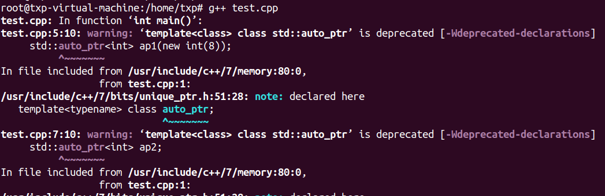

[TOC]

文章参考：https://mp.weixin.qq.com/s/glLPkBwWYlY9z_u-Iubgvg

## 概述

C/C++ 语言最为人所诟病的特性之一就是存在内存泄露问题，因此后来的大多数语言都提供了内置内存分配与释放功能，有的甚至干脆对语言的使用者屏蔽了内存指针这一概念。

这里不置贬褒，手动分配内存与手动释放内存有利也有弊，自动分配内存和自动释放内存亦如此，这是两种不同的设计哲学。有人认为，内存如此重要的东西怎么能放心交给用户去管理呢？而另外一些人则认为，内存如此重要的东西怎么能放心交给系统去管理呢？

在 C/C++ 语言中，内存泄露的问题一直困扰着广大的开发者，因此各类库和工具的一直在努力尝试各种方法去检测和避免内存泄露，如 boost，智能指针技术应运而生。

智能指针主要用于管理在堆上分配的内存，它将普通的指针封装为一个栈对象。当栈对象的生存周期结束后，会在析构函数中释放掉申请的内存，从而防止内存泄漏。简要的说，智能指针利用了 C++ 的 RAII 机制，在智能指针对象作用域结束后，会自动做内存释放的相关操作，不需要我们再手动去操作内存。但是智能指针也不只是说的简简单单的自动释放内存这么简单，在使用上有一些坑需要注意，将会在下文中提到。

C++中有四种智能指针：

- 1、auto_ptr
- 2、unique_ptr
- 3、shared_ptr
- 4、week_ptr

其中后三个是 C++11 支持，第一个已经被 C++11 弃用且被 unique_ptr 代替，不推荐使用。下文将对其逐个说明。


## std::auto_ptr

C++11 标准的出现（最新标准是 C++20），std::auto_ptr 已经被彻底放弃，取而代之是 std::unique_ptr。

然而，之所以还向介绍std::auto_ptr 的用法以及它的设计不足之处是想更多了解 C++ 语言中智能指针的发展过程，一项技术如果我们了解它过去的样子和发展的轨迹，我们就能更好地掌握它。

上面说到c++的新的特性学习，但是在嵌入式领域，c++还不会用太新的版本，但是作为自身学习的话，新的东西，还是要去探索学习的，紧跟技术发展，为此我发现这两个学习c++的网站不错，一个是cplusplus和standard c++以及boost库：

- cplusplus:http://www.cplusplus.com/  
-  这里面也可以学习STL：http://www.cplusplus.com/reference/stl/
- Standard c++: https://isocpp.org/
- boost：https://www.boost.org/

好的，我们继续这个std::auto_ptr分享，下面是简单的代码试验：

```c++
#include <memory>
int main()
{
    //初始化方式1
    std::auto_ptr<int> ap1(new int(8));
    //初始化方式2
    std::auto_ptr<int> ap2;
    ap2.reset(new int(8));
    return 0;
}
```


编译结果：



从警告deprecated 单词表明这个std::auto_ptr已经在新的标准中被抛弃了。

智能指针对象 ap1 和 ap2 均持有一个在堆上分配 int 对象，其值均是 8，这两块堆内存均可以在 ap1 和 ap2 释放时得到释放。这是 std::auto_ptr 的基本用法。

std::auto_ptr 真正让人容易误用的地方是其不常用的复制语义，即当复制一个 std::auto_ptr 对象时（拷贝复制或 operator= 复制），原对象所持有的堆内存对象也会转移给复制出来的对象。示例代码如下：

```c++
#include <memory>

int main()
{
    //测试拷贝构造
    std::auto_ptr<int> ap1(new int(8));
    std::auto_ptr<int> ap2(ap1);
    if (ap1.get() != NULL)
    {
        std::cout << "ap1 is not empty." << std::endl;
    }
    else
    {
        std::cout << "ap1 is empty." << std::endl;
    }
    if (ap2.get() != NULL)
    {
        std::cout << "ap2 is not empty." << std::endl;
    }
    else
    {
        std::cout << "ap2 is empty." << std::endl;
    }
    
    //测试赋值构造
    std::auto_ptr<int> ap3(new int(8));
    std::auto_ptr<int> ap4;
    ap4 = ap3;
    if (ap3.get() != NULL)
    {
        std::cout << "ap3 is not empty." << std::endl;
    }
    else
    {
        std::cout << "ap3 is empty." << std::endl;
    }

    if (ap4.get() != NULL)
    {
        std::cout << "ap4 is not empty." << std::endl;
    }
    else
    {
        std::cout << "ap4 is empty." << std::endl;
    }
    return 0;
}

```

运行结果如下：

```
ap1 is empty.
ap2 is not empty.
ap3 is empty.
ap4 is not empty.
```

分析：上述代码中分别利用拷贝构造（ap1 => ap2）和 赋值构造（ap3 => ap4）来创建新的 std::auto_ptr 对象，因此 ap1 持有的堆对象被转移给 ap2，ap3 持有的堆对象被转移给 ap4。而 ap1 和 ap2 已经指向 NULL，若现在再对 ap1 和 ap2 进行访问并操作，将会出现内存错误问题。

由于 std::auto_ptr 这种不常用的复制语义，我们应该避免在 stl 容器中使用 std::auto_ptr，例如我们绝不应该写出如下代码：

```
std::vector<std::auto_ptr<int>> myvectors;
```

当用算法对容器操作的时候（如最常见的容器元素遍历），很难避免不对容器中的元素实现赋值传递，这样便会使容器中多个元素被置为空指针，这不是我们想看到的，会造成很多意想不到的错误。

以史为鉴，作为 std::auto_ptr 的替代者 std::unique_ptr 吸取了这个经验教训。下文会来详细介绍。

正因为 std::auto_ptr 的设计存在如此重大缺陷，C++11 标准在充分借鉴和吸收了 boost 库中智能指针的设计思想，引入了三种类型的智能指针，即：std::unique_ptr、std::shared_ptr 和 std::weak_ptr。

- boost 还有 scoped_ptr，C++11 并没有全部照搬，而是选择了三个最实用的指针类型。在 C++11 中可以通过 std::unique_ptr 达到与 boost::scoped_ptr 一样的效果。

所有的智能指针类（包括 std::unique_ptr）均包含于头文件中。

所以在 C++11及后续语言规范中 std::auto_ptr 已经被废弃，你的代码不应该再使用它。


## std::unique_ptr

作为对 std::auto_ptr 的改进，std::unique_ptr 对其持有的堆内存具有唯一拥有权，也就是 std::unique_ptr 不可以拷贝或赋值给其他对象，其拥有的堆内存仅自己独占，std::unique_ptr 对象销毁时会释放其持有的堆内存。

可以使用以下方式初始化一个 std::unique_ptr 对象：

```c++
int main()
{
    //初始化方式1
    std::unique_ptr<int> up1(new int(123));
    //初始化方式2
    std::unique_ptr<int> up2;
    up2.reset(new int(123));
    //初始化方式3 (-std=c++14)
    std::unique_ptr<int> up3 = std::make_unique<int>(123);
}
```

应该尽量使用初始化方式 3 的方式去创建一个 std::unique_ptr 而不是方式 1 和 2，因为形式 3 更安全，原因 Scott Meyers 在其《Effective Modern C++》中已经解释过了，有兴趣的可以阅读此书相关章节.

令很多人对 C++11 规范不满的地方是，C++11 新增了 std::make_shared() 方法创建一个 std::shared_ptr 对象，却没有提供相应的 std::make_unique() 方法创建一个 std::unique_ptr 对象，这个方法直到 C++14 才被添加进来。当然，在 C++11 中你很容易实现出这样一个方法来：

```c++
template <typename T, typename... Ts>
std::unique_ptr<T> make_unique(Ts &&...params)
{
return std::unique_ptr<T>(new T(std::forward<Ts>(params)...));
}
```

鉴于 std::auto_ptr 的前车之鉴，std::unique_ptr 禁止复制语义，为了达到这个效果，std::unique_ptr 类的拷贝构造函数和赋值运算符（operator =）被标记为 delete。

```c++
template <class T>
class unique_ptr
{
    //省略其他代码...

    //拷贝构造函数和赋值运算符被标记为delete
    unique_ptr(const unique_ptr &) = delete;
    unique_ptr &operator=(const unique_ptr &) = delete;
};

```

因此，下列代码是无法通过编译的：

```c++
std::unique_ptr<int> up1(std::make_unique<int>(123));;

//以下代码无法通过编译
//std::unique_ptr<int> up2(up1);
std::unique_ptr<int> up3;
//以下代码无法通过编译
//up3 = up1;
```

禁止复制语义也存在特例，即可以通过一个函数返回一个 std::unique_ptr：

```c
#include <memory>

std::unique_ptr<int> func(int val)
{
    std::unique_ptr<int> up(new int(val));
    return up;
}

int main()
{
    std::unique_ptr<int> up1 = func(123);

    return 0;
}
```

上述代码从 func 函数中得到一个 std::unique_ptr 对象，然后返回给 up1。

既然 std::unique_ptr 不能复制，那么如何将一个 std::unique_ptr 对象持有的堆内存转移给另外一个呢？答案是使用移动构造，示例代码如下：

```c++
int main()
{
    std::unique_ptr<int> up1(std::make_unique<int>(123));
    std::unique_ptr<int> up2(std::move(up1));
    std::cout << ((up1.get() == nullptr) ? "up1 is NULL" : "up1 is not NULL") << std::endl;
    
    std::unique_ptr<int> up3;
    up3 = std::move(up2);
    std::cout << ((up2.get() == nullptr) ? "up2 is NULL" : "up2 is not NULL") << std::endl;
    
    return 0;
}

// 运行结果：
up1 is NULL
up2 is NULL
```

以上代码利用 std::move 将 up1 持有的堆内存（值为 123）转移给 up2，再把 up2 转移给 up3。最后，up1 和 up2 不再持有堆内存的引用，变成一个空的智能指针对象。并不是所有的对象的 std::move 操作都有意义，只有实现了移动构造函数或移动赋值运算符的类才行，而 std::unique_ptr 正好实现了这二者，以下是实现伪码：

```c
template <typename T, typename Deletor>
class unique_ptr
{
    //其他函数省略...
public:
    unique_ptr(unique_ptr &&rhs)
    {
        this->m_pT = rhs.m_pT;
        //源对象释放
        rhs.m_pT = nullptr;
    }

    unique_ptr &operator=(unique_ptr &&rhs)
    {
        this->m_pT = rhs.m_pT;
        //源对象释放
        rhs.m_pT = nullptr;
        return *this;
    }

private:
    T *m_pT;
};

```


这是 std::unique_ptr 具有移动语义的原因。关于移动构造和 std::move 也是 C++11 的新特性，这里不详细说明。

std::unique_ptr 不仅可以持有一个堆对象，也可以持有一组堆对象，示例如下：


