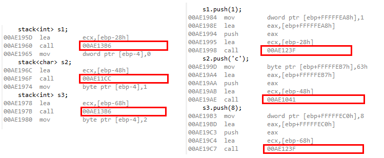

[TOC]

# 概述

## C++ 中的模板类声明头文件和实现文件分离后，如何能实现正常编译？

邀，这个问题让我想起我在实习的时候犯的一个错误，就是把模版类的定义和实现分开写了，结果编译出错，查了两天才查出问题。

C++中每一个对象所占用的空间大小，是在编译的时候就确定的，在模板类没有真正的被使用之前，编译器是无法知道，模板类中使用模板类型的对象的所占用的空间的大小的。只有模板被真正使用的时候，编译器才知道，模板套用的是什么类型，应该分配多少空间。这也就是模板类为什么只是称之为模板，而不是泛型的缘故。

既然是在编译的时候，根据套用的不同类型进行编译，那么，套用不同类型的模板类实际上就是两个不同的类型，也就是说，stack<int>和stack<char>是两个不同的数据类型，他们共同的[成员函数](https://www.zhihu.com/search?q=成员函数&search_source=Entity&hybrid_search_source=Entity&hybrid_search_extra={"sourceType"%3A"answer"%2C"sourceId"%3A15722407})也不是同一个函数，只不过具有相似的功能罢了。

如上图所示，很简短的六行代码，用的是STL里面的stack，stack<int>和stack<char>的默认构造函数和[push函数](https://www.zhihu.com/search?q=push函数&search_source=Entity&hybrid_search_source=Entity&hybrid_search_extra={"sourceType"%3A"answer"%2C"sourceId"%3A15722407})的入口地址是不一样的，而不同的stack<int>对象相同的函数入口地址是一样的，这个也反映了模板类在套用不同类型以后，会被编译出不同代码的现象。

所以模板类的实现，脱离具体的使用，是无法单独的编译的；把声明和实现分开的做法也是不可取的，必须把实现全部写在头文件里面。为了清晰，实现可以不写在class后面的花括号里面，可以写在class的外面。

