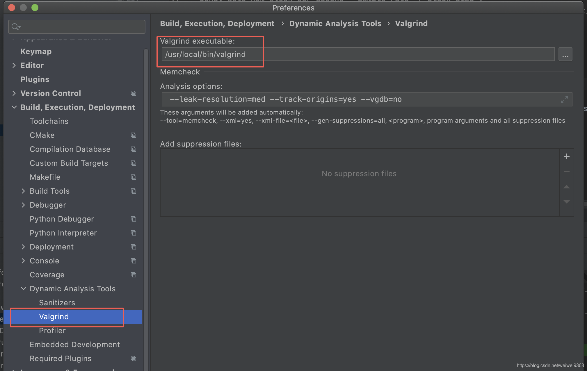
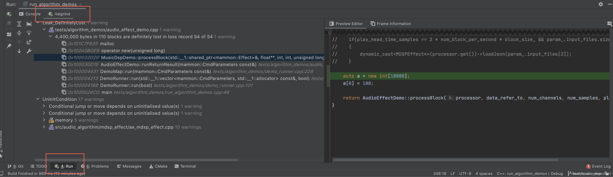

[TOC]


文章参考：http://senlinzhan.github.io/2017/12/31/valgrind/

文章参考：https://blog.csdn.net/weiwei9363/article/details/107834706

文章参考：https://www.jetbrains.com/help/clion/memory-profiling-with-valgrind.html

文章参考：https://github.com/LouisBrunner/valgrind-macos/


# 使用 Valgrind 检测 C++ 内存泄漏

## Valgrind 的介绍

Valgrind 可以用来检测程序是否有非法使用内存的问题，例如访问未初始化的内存、访问数组时越界、忘记释放动态内存等问题。在 Linux 可以使用下面的命令安装 Valgrind：

```
$ wget ftp://sourceware.org/pub/valgrind/valgrind-3.13.0.tar.bz2
$ bzip2 -d valgrind-3.13.0.tar.bz2
$ tar -xf valgrind-3.13.0.tar
$ cd valgrind-3.13.0
$ ./configure && make
$ sudo make install
```

也可以使用如下命令安装：

```shell
sudo apt install valgrind
```

MacOS:

```shell
brew tap LouisBrunner/valgrind
brew install --HEAD LouisBrunner/valgrind/valgrind
```

在 mac 下安装 Valgrind 比较麻烦，在尝试多次后，总结出上面的安装方式


Windows，WSL 环境下:

```
sudo apt-get install valgrind
```


# 配置 CLion

安装成功后，配置 Valgrind 路径



在 clion 下编译可执行文件，编译成功后，点击下图红框


等待程序运行结束，在 Run 面板中点击 Valgrind，即可查看结果：




## 检测内存泄漏

　Valgrind 可以用来检测程序在哪个位置发生内存泄漏，例如下面的程序：

```
#include <stdlib.h>
int main(){
    int *array = malloc(sizeof(int));
    return 0;
}

```

编译程序时，需要加上`-g`选项：

```shell
$ gcc -g -o main_c main.c
```

　使用 Valgrind 检测内存使用情况：

```shell
$ valgrind --tool=memcheck --leak-check=full  ./main_c
==31416== Memcheck, a memory error detector
==31416== Copyright (C) 2002-2017, and GNU GPL'd, by Julian Seward et al.
==31416== Using Valgrind-3.13.0 and LibVEX; rerun with -h for copyright info
==31416== Command: ./main_c
==31416==
==31416==
==31416== HEAP SUMMARY:
==31416==     in use at exit: 4 bytes in 1 blocks
==31416==   total heap usage: 1 allocs, 0 frees, 4 bytes allocated
==31416==
==31416== 4 bytes in 1 blocks are definitely lost in loss record 1 of 1
==31416==    at 0x4C2DBF6: malloc (vg_replace_malloc.c:299)
==31416==    by 0x400537: main (main.c:5)
==31416==
==31416== LEAK SUMMARY:
==31416==    definitely lost: 4 bytes in 1 blocks
==31416==    indirectly lost: 0 bytes in 0 blocks
==31416==      possibly lost: 0 bytes in 0 blocks
==31416==    still reachable: 0 bytes in 0 blocks
==31416==         suppressed: 0 bytes in 0 blocks
==31416==
==31416== For counts of detected and suppressed errors, rerun with: -v
==31416== ERROR SUMMARY: 1 errors from 1 contexts (suppressed: 0 from 0)
```


先看看输出信息中的`HEAP SUMMARY`，它表示程序在堆上分配内存的情况，其中的`1 allocs`表示程序分配了 1 次内存，`0 frees`表示程序释放了 0 次内存，`4 bytes allocated`表示分配了 4 个字节的内存。

另外，Valgrind 也会报告程序是在哪个位置发生内存泄漏。例如，从下面的信息可以看到，程序发生了一次内存泄漏，位置是`main.c`文件的第 5 行：


