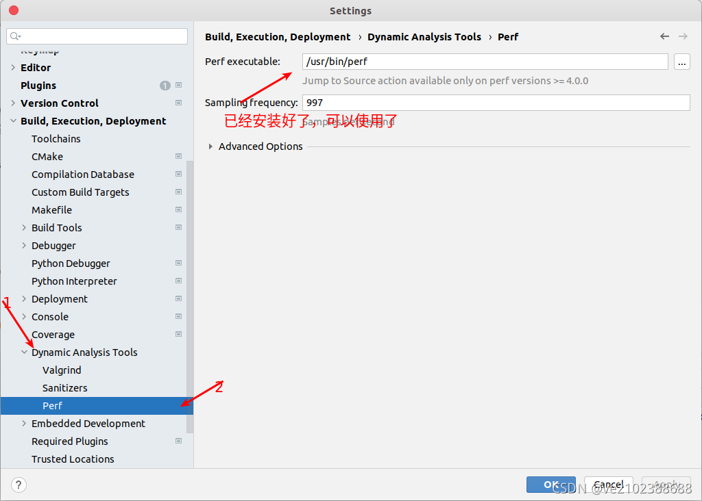

[TOC]


文章参考：[系统级性能分析工具perf的介绍与使用](https://www.cnblogs.com/arnoldlu/p/6241297.html)

文章参考：http://linux.51yip.com/search/perf

文章参考：https://www.jianshu.com/p/3f89b90a1717

文章参考；https://zhuanlan.zhihu.com/p/370121381

文章参考：https://my.oschina.net/u/4009527/blog/2979947

文章参考：https://github.com/gperftools/gperftools


## 概述

查看Google Perf工具

如果您没有安装brew：

请查看Homebrew安装的教程

如果你安装了brew：


## Ubuntu上perf软件安装

```shell
(base) frewen@FreweniUbuntu:~$ perf

Command 'perf' not found, but can be installed with:

sudo apt install linux-oem-5.6-tools-common  # version 5.6.0-1017.17, or
sudo apt install linux-tools-common          # version 5.4.0-113.127
sudo apt install linux-iot-tools-common      # version 5.4.0-1001.3

(base) frewen@FreweniUbuntu:~$ sudo apt install linux-tools-common
[sudo] frewen 的密码： 
正在读取软件包列表... 完成
正在分析软件包的依赖关系树       
正在读取状态信息... 完成       
下列【新】软件包将被安装：
  linux-tools-common
升级了 0 个软件包，新安装了 1 个软件包，要卸载 0 个软件包，有 18 个软件包未被升级。
需要下载 190 kB 的归档。
解压缩后会消耗 822 kB 的额外空间。
获取:1 http://mirrors.aliyun.com/ubuntu focal-updates/main amd64 linux-tools-common all 5.4.0-113.127 [190 kB]
已下载 190 kB，耗时 1秒 (365 kB/s)           
正在选中未选择的软件包 linux-tools-common。
(正在读取数据库 ... 系统当前共安装有 245139 个文件和目录。)
准备解压 .../linux-tools-common_5.4.0-113.127_all.deb  ...
正在解压 linux-tools-common (5.4.0-113.127) ...
正在设置 linux-tools-common (5.4.0-113.127) ...
正在处理用于 man-db (2.9.1-1) 的触发器 ...
(base) frewen@FreweniUbuntu:~$ perf
WARNING: perf not found for kernel 5.13.0-44

  You may need to install the following packages for this specific kernel:
    linux-tools-5.13.0-44-generic
    linux-cloud-tools-5.13.0-44-generic

  You may also want to install one of the following packages to keep up to date:
    linux-tools-generic
    linux-cloud-tools-generic

```

查看Linux内核版本

```
(base) frewen@FreweniUbuntu:~$ uname -r
5.13.0-44-generic
```

安装所需东西即可。

```shell
(base) frewen@FreweniUbuntu:~$ sudo apt-get install linux-tools-5.13.0-44-generic
正在读取软件包列表... 完成
正在分析软件包的依赖关系树       
正在读取状态信息... 完成       
将会同时安装下列软件：
  linux-hwe-5.13-tools-5.13.0-44
下列【新】软件包将被安装：
  linux-hwe-5.13-tools-5.13.0-44 linux-tools-5.13.0-44-generic
升级了 0 个软件包，新安装了 2 个软件包，要卸载 0 个软件包，有 18 个软件包未被升级。
需要下载 6,955 kB 的归档。
解压缩后会消耗 31.5 MB 的额外空间。
您希望继续执行吗？ [Y/n] Y
获取:1 http://mirrors.aliyun.com/ubuntu focal-updates/main amd64 linux-hwe-5.13-tools-5.13.0-44 amd64 5.13.0-44.49~20.04.1 [6,953 kB]
获取:2 http://mirrors.aliyun.com/ubuntu focal-updates/main amd64 linux-tools-5.13.0-44-generic amd64 5.13.0-44.49~20.04.1 [2,008 B]                  
已下载 6,955 kB，耗时 7秒 (1,003 kB/s)                                                                                                               
正在选中未选择的软件包 linux-hwe-5.13-tools-5.13.0-44。
(正在读取数据库 ... 系统当前共安装有 245243 个文件和目录。)
准备解压 .../linux-hwe-5.13-tools-5.13.0-44_5.13.0-44.49~20.04.1_amd64.deb  ...
正在解压 linux-hwe-5.13-tools-5.13.0-44 (5.13.0-44.49~20.04.1) ...
正在选中未选择的软件包 linux-tools-5.13.0-44-generic。
准备解压 .../linux-tools-5.13.0-44-generic_5.13.0-44.49~20.04.1_amd64.deb  ...
正在解压 linux-tools-5.13.0-44-generic (5.13.0-44.49~20.04.1) ...
正在设置 linux-hwe-5.13-tools-5.13.0-44 (5.13.0-44.49~20.04.1) ...
正在设置 linux-tools-5.13.0-44-generic (5.13.0-44.49~20.04.1) ...
(base) frewen@FreweniUbuntu:~$ perf

 usage: perf [--version] [--help] [OPTIONS] COMMAND [ARGS]

 The most commonly used perf commands are:
   annotate        Read perf.data (created by perf record) and display annotated code
   archive         Create archive with object files with build-ids found in perf.data file
   bench           General framework for benchmark suites
   buildid-cache   Manage build-id cache.
   buildid-list    List the buildids in a perf.data file
   c2c             Shared Data C2C/HITM Analyzer.
   config          Get and set variables in a configuration file.
   daemon          Run record sessions on background
   data            Data file related processing
   diff            Read perf.data files and display the differential profile
   evlist          List the event names in a perf.data file
   ftrace          simple wrapper for kernel's ftrace functionality
   inject          Filter to augment the events stream with additional information
   iostat          Show I/O performance metrics
   kallsyms        Searches running kernel for symbols
   kmem            Tool to trace/measure kernel memory properties
   kvm             Tool to trace/measure kvm guest os
   list            List all symbolic event types
   lock            Analyze lock events
   mem             Profile memory accesses
   record          Run a command and record its profile into perf.data
   report          Read perf.data (created by perf record) and display the profile
   sched           Tool to trace/measure scheduler properties (latencies)
   script          Read perf.data (created by perf record) and display trace output
   stat            Run a command and gather performance counter statistics
   test            Runs sanity tests.
   timechart       Tool to visualize total system behavior during a workload
   top             System profiling tool.
   version         display the version of perf binary
   probe           Define new dynamic tracepoints
   trace           strace inspired tool

 See 'perf help COMMAND' for more information on a specific command.


```





## Perf脚本采样

1. 查看采样程序的Pid

```
ps -aux|grep vision_demo
```

​	2. 生成采样文件

```shell
# 进行采样
sudo perf record -F 99 -p 432997 -g -o perf.data -- sleep 180
sudo perf script -i perf.data > cpu.perf


perfc cpu.perf > cpu.folded
```

 	3. 设置环境变量

```
# >>> 设置Perf火焰图工具路径 >>>
export PATH=$PATH:/home/frewen/tools/FlameGraph
alias perfc='stackcollapse-perf.pl'
alias perfg='flamegraph.pl'
# <<< 设置Perf火焰图工具路径 <<<
```


```
Usage: perf record [<options>] [<command>]
    or: perf record [<options>] -- <command> [<options>]

    -a, --all-cpus        system-wide collection from all CPUs
    -b, --branch-any      sample any taken branches
    -B, --no-buildid      do not collect buildids in perf.data
    -c, --count <n>       event period to sample
    -C, --cpu <cpu>       list of cpus to monitor
    -d, --data            Record the sample addresses
    -D, --delay <n>       ms to wait before starting measurement after program start (-1: start with events disabled)
    -e, --event <event>   event selector. use 'perf list' to list available events
    -F, --freq <freq or 'max'>
                          profile at this frequency
    -g                    enables call-graph recording
    -G, --cgroup <name>   monitor event in cgroup name only
    -I, --intr-regs[=<any register>]
                          sample selected machine registers on interrupt, use '-I?' to list register names
    -i, --no-inherit      child tasks do not inherit counters
    -j, --branch-filter <branch filter mask>
                          branch stack filter modes
    -k, --clockid <clockid>
                          clockid to use for events, see clock_gettime()
    -m, --mmap-pages <pages[,pages]>
                          number of mmap data pages and AUX area tracing mmap pages
    -N, --no-buildid-cache
                          do not update the buildid cache
    -n, --no-samples      don't sample
    -o, --output <file>   output file name
    -P, --period          Record the sample period
    -p, --pid <pid>       record events on existing process id
    -q, --quiet           don't print any message
    -R, --raw-samples     collect raw sample records from all opened counters
    -r, --realtime <n>    collect data with this RT SCHED_FIFO priority
    -S, --snapshot[=<opts>]
                          AUX area tracing Snapshot Mode
    -s, --stat            per thread counts
    -t, --tid <tid>       record events on existing thread id
    -T, --timestamp       Record the sample timestamps
    -u, --uid <user>      user to profile
    -v, --verbose         be more verbose (show counter open errors, etc)
    -W, --weight          sample by weight (on special events only)
        --affinity <node|cpu>
                          Set affinity mask of trace reading thread to NUMA node cpu mask or cpu of processed mmap buffer
        --aio[=<n>]       Use <n> control blocks in asynchronous trace writing mode (default: 1, max: 4)
        --all-cgroups     Record cgroup events
        --all-kernel      Configure all used events to run in kernel space.
        --all-user        Configure all used events to run in user space.
        --aux-sample[=<opts>]

```


# 查看perf.data

## 火焰图查看

火焰图(Flame Graph)由系统性能大牛Brendan Gregg提出的动态追踪技术而发扬光大，用于将性能分析工具生成的数据可视化处理。如何生成火焰图呢？这里介绍一个工具，叫做**FlameGraph**

工具下载

```shell
git clone https://github.com/brendangregg/FlameGraph

wget https://github.com/brendangregg/FlameGraph/archive/master.zip
unzip master.zip
```

对采样数据文件进行解析以生成堆栈信息

在生成的perf.data的目录下进行执行：

```shell
perf script > cpu.unfold
```

对perf.unfold进行符号折叠

```shell
./stackcollapse-perf.pl cpu.unfold > cpu.folded
```

生成SVG格式的火焰图

```shell
./flamegraph.pl cpu.folded > cpu.svg
```


生成的火焰图如下，使用浏览器进行打开：


- 纵轴表示调用栈，每一层都是一个函数，也是其上一层的父函数，最顶部就是采样时正在执行的函数，调用栈越深，火焰就越高。
- 横轴表示抽样数，并不是表示执行时间。若一个函数的宽度越宽，则表示它被抽到的次数越多，所有调用栈会在汇总后，按字母序列排列在横轴上。


