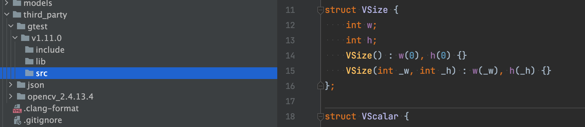
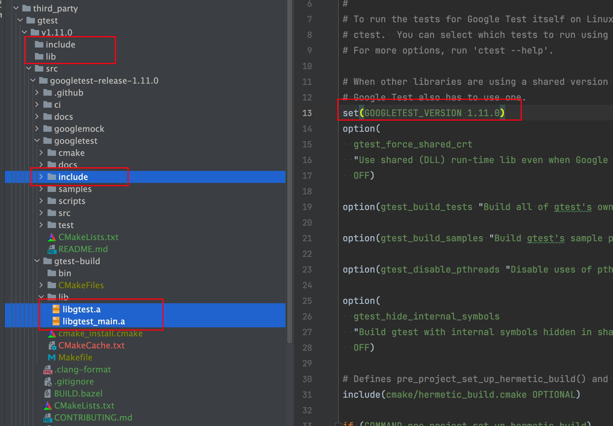

## 概述


## 集成GTest框架


在C++工程的third_party里面新建gtest目录



下载源码：https://github.com/google/googletest/releases

现在最新的版本是v1.11.0

下载源码完成之后，进行编译gtest

```shell
(base)  wangzhijiang@FreweniBaiduMacBook2  ~/03.ProgramSpace/15.CLang/01.WorkSpace/NyxCLang/AliceVisionAbility/third_party/gtest/v1.11.0/src/googlete
(base)  wangzhijiang@FreweniBaiduMacBook2  ~/03.ProgramSpace/15.CLang/01.WorkSpace/NyxCLang/AliceVisionAbility/third_party/gtest/v1.11.0/src/googletest-release-1.11.0   main ±✚  mkdir gtest-build
(base)  wangzhijiang@FreweniBaiduMacBook2  ~/03.ProgramSpace/15.CLang/01.WorkSpace/NyxCLang/AliceVisionAbility/third_party/gtest/v1.11.0/src/googlete
st-release-1.11.0   main ±✚ cd gtest-build 
(base)  wangzhijiang@FreweniBaiduMacBook2  ~/03.ProgramSpace/15.CLang/01.WorkSpace/NyxCLang/AliceVisionAbility/third_party/gtest/v1.11.0/src/googletest-release-1.11.0/gtest-build   main ±✚  cmake ../googletest -DCMAKE_INSTALL_PREFIX=./install

```


使用cmake生成makefile

```
 cmake ../googletest -DCMAKE_INSTALL_PREFIX=./install
```


编译出错

```shell
CMake Error at CMakeLists.txt:132 (set_target_properties):
  set_target_properties called with incorrect number of arguments.


CMake Error at CMakeLists.txt:134 (set_target_properties):
  set_target_properties called with incorrect number of arguments.

```

这个原因是：是因为没有指定gtest的版本号，我们在googletest的根目录下的CMakeLists.txt文件中增加一行：

```
set(GOOGLETEST_VERSION 1.11.0)
```

重新执行这个脚本

```shell
/gtest-build   main ±✚  cmake ../googletest -DCMAKE_INSTALL_PREFIX=./install
-- The CXX compiler identification is AppleClang 11.0.0.11000033
-- The C compiler identification is AppleClang 11.0.0.11000033
-- Detecting CXX compiler ABI info
-- Detecting CXX compiler ABI info - done
-- Check for working CXX compiler: /Applications/Xcode.app/Contents/Developer/Toolchains/XcodeDefault.xctoolchain/usr/bin/c++ - skipped
-- Detecting CXX compile features
-- Detecting CXX compile features - done
-- Detecting C compiler ABI info
-- Detecting C compiler ABI info - done
-- Check for working C compiler: /Applications/Xcode.app/Contents/Developer/Toolchains/XcodeDefault.xctoolchain/usr/bin/cc - skipped
-- Detecting C compile features
-- Detecting C compile features - done
-- Found Python: /Users/wangzhijiang/Library/AFrewenLib/anaconda3/bin/python3.9 (found version "3.9.7") found components: Interpreter 
-- Looking for pthread.h
-- Looking for pthread.h - found
-- Performing Test CMAKE_HAVE_LIBC_PTHREAD
-- Performing Test CMAKE_HAVE_LIBC_PTHREAD - Success
-- Found Threads: TRUE  
-- Configuring done
-- Generating done
-- Build files have been written to: /Users/wangzhijiang/03.ProgramSpace/15.CLang/01.WorkSpace/NyxCLang/AliceVisionAbility/third_party/gtest/v1.11.0/src/googletest-release-1.11.0/gtest-build
```

结果通过


执行编译生成静态库

```shell
/gtest-build   main ±✚  make && make install
[ 25%] Building CXX object CMakeFiles/gtest.dir/src/gtest-all.cc.o
[ 50%] Linking CXX static library lib/libgtest.a
[ 50%] Built target gtest
[ 75%] Building CXX object CMakeFiles/gtest_main.dir/src/gtest_main.cc.o
[100%] Linking CXX static library lib/libgtest_main.a
[100%] Built target gtest_main
make: *** No rule to make target `install'.  Stop.
```


然后将我们的生成产品拷贝到我们的工程：




综上完整脚本如下：


### 编译Linux版本

```
mkdir gtest-build
cd gtest-build 
cmake ../googletest -DCMAKE_INSTALL_PREFIX=./install
make && make install
```


### 编译Qnx版本

​	

```shell
mkdir gtest-build
cd gtest-build 
cmake ../googletest -DCMAKE_INSTALL_PREFIX=./install  -DCMAKE_TOOLCHAIN_FILE=./arm-unknown-nto-qnx700eabi.toolchain.cmake
make && make install
```


## 编写Cmake依赖文件


## 问题解决

问题一：

```shell
/usr/bin/ld: /home/frewen/03.ProgramSpace/15.CLang/01.WorkSpace/NyxCLang/AliceVisionAbility/third_party/gtest/v1.11.0/lib/linux-x86_64/libgtest.a(gtest-all.cc.o): undefined reference to symbol 'pthread_getspecific@@GLIBC_2.2.5'
/usr/bin/ld: /lib/x86_64-linux-gnu/libpthread.so.0: error adding symbols: DSO missing from command line
collect2: error: ld returned 1 exit status
ninja: build stopped: subcommand failed.
```

