[TOC]

# 概述

文章参考：[手把手教你安装双系统 windows11+ubuntu 22.04](https://www.bilibili.com/video/BV1wo4y177Gk/?spm_id_from=333.337.search-card.all.click&vd_source=0e017b0ae3925aa5166b3d4708f0dd0f)

最近接触Ubuntu，安装双系统时踩了不少坑，网上能查到的攻略和安装教程基本都看的差不多了，有些教程版本太老，解释得也不是很明确，现在再安装时可能会把人引入误区，因此写一篇安装指南，闲话少说，开始。

本文安装标准的双系统，非虚拟机，采用U盘安装方法，grub2引导。

# **准备工作**

## 1.关闭window下快速启动（FastBoot）

具体参考文档：[win11快速启动有必要关闭吗？如何关闭？_快速启动开启还是关闭_](https://blog.csdn.net/xitongzhijianet/article/details/129386228)

为什么关闭快速启动：[安装Linux双系统取消快速启动,为什么在双启动时禁用Windows 8上的快速启动](https://blog.csdn.net/weixin_39980184/article/details/116885406)

首先**关闭快速启动**，可以通过两种方式关闭，接着关闭**安全启动**，**安全启动的关闭方法**在关闭快速启动的第二种方法中。

win10界面下，按住系统键win+X快速打开功能界面，如图：

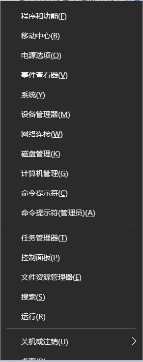

接着进入**“电源选项”**，进入如下界面

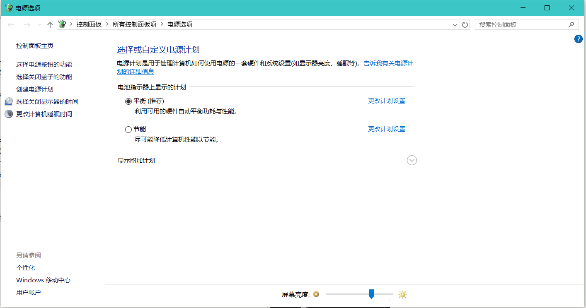

点击左上角的**“选择电源按钮的功能”**，进入如下界面

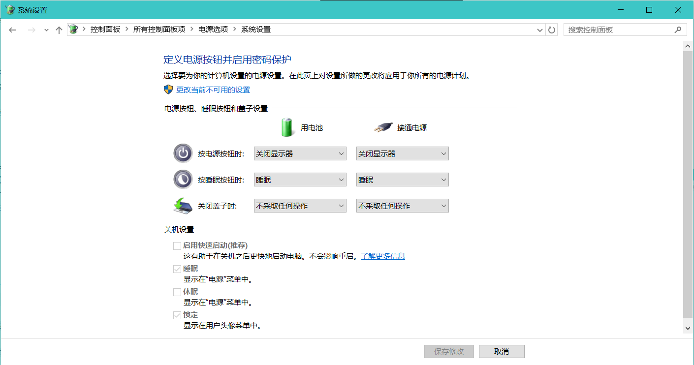

点击**“更改当前不可用设置”**，进入如下界面

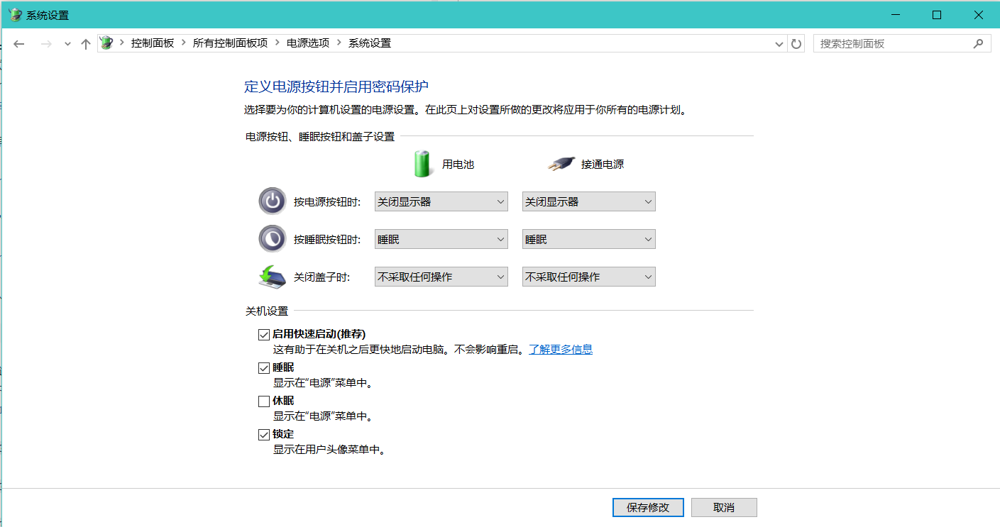

在中下部的关机设置中，点击“启用快速启动（推荐）”前面的对号，使其消失，也就是关闭快速启动的功能，点击保存修改。关闭后如下图所示，图中其他项和我不同可以不管，没有影响。

PS：一定记住点击**保存修改**。保存后如下图所示。

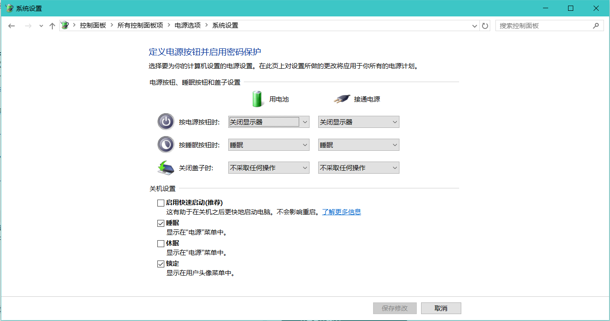

## 2.关闭Windows系统安全启动（SecureBoot）

首先，关闭安全启动需要进入BIOS不同型号的电脑（无论是台式机还是笔记本）进入BIOS的快捷键是不同，我的电脑是华硕ZX50J，快捷键是F2。
具体进入BIOS的方法是：首先重启电脑，在重启的过程中，会显示开机界面和计算机品牌的LOGO（也就是商标），在出现商标的时候快速点击快捷键（比如我的是F2）即可，LOGO持续的时间大概是3、4秒，绝对来得及。
具体自己的电脑快捷键是什么，只能去百度了，一般就是**F2，F10，F11，F12**等等。

快捷键汇总：

华硕的电脑快捷键是F2、惠普暗影精灵的快捷键是F10。

首先左右移动光标，进入BOOT选项中，将**Fastboot**后面的**enable**改成**disable**。
		接着顺便**关闭安全启动**，将光标移动到**secure boot**，把后面的**enable**也改成**disable**即可。

重新进入系统系统之后，此时键入 win + r，输入 `msinfo32`，可以看到安全启动状态为关闭。

## 3.制作U盘启动

首先在网上下载自己想装的Ubuntu系统，就是一个**ISO**后缀名的文件，百度一下很好下，有各种版本的，建议下载**Ubuntu 18.04LTS**版本或者**Ubuntu 20.04LTS**版本，比较稳定，而且官方持续更新和维护。

接着在网上下载**Ultraiso软碟通**工具，很好下，免费的，直接百度就可以。这是一款制作U盘启动装机工具的软件。

接着将U盘插入电脑**（注意在这之前保存好U盘中的资料，接下来的步骤会清空里面的所有东西）**，打开刚才下的Ultraiso软碟通，首先点**文件（F）**，然后打开你刚刚下载好的**ISO**后缀名的文件（即Ubuntu系统镜像），然后点击**启动（B）**，接着点击**写入硬盘映像…**，如下图所示。

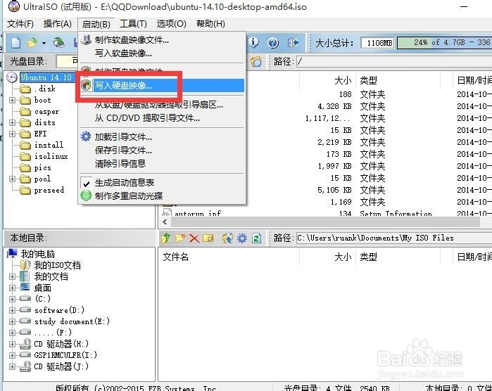

接着将下好的Ubuntu系统写入其中，如下图所示，注意硬盘驱动器一项一定要选自己的U盘，然后点击写入即可。

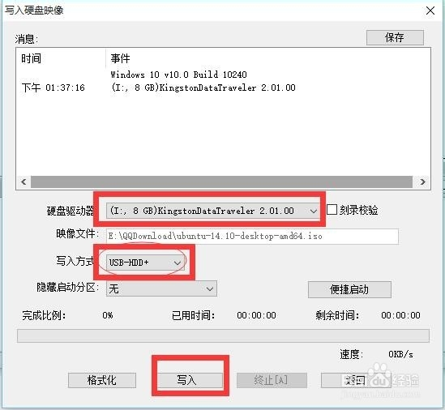

这样一个U盘启动装机工具就制作好了。

## 4.创建Ubuntu磁盘分区

前面两步完成后，将要进入比较重要的一步，就是给Ubuntu系统创建磁盘分区，也就是给你要装的Ubuntu系统在硬盘中划出一块地盘。首先要保证你的**硬盘足够大**，具体大小看你以后要用Ubuntu做什么，不过最少**10G**，上不封顶，如果硬盘空间不紧张的话，建议**50G**以上，最好**100G**以上，因为空间大了没坏处，但是如果现在装的时候空间分少了，以后再想改大，那麻烦事可就多了（我见过很多因为装系统时空间没分够而折腾重装多次的人，不仅费事，而且伤硬盘）。

还是点击**win+X**，这回选择**磁盘管理**，弹出来类似下面的界面。

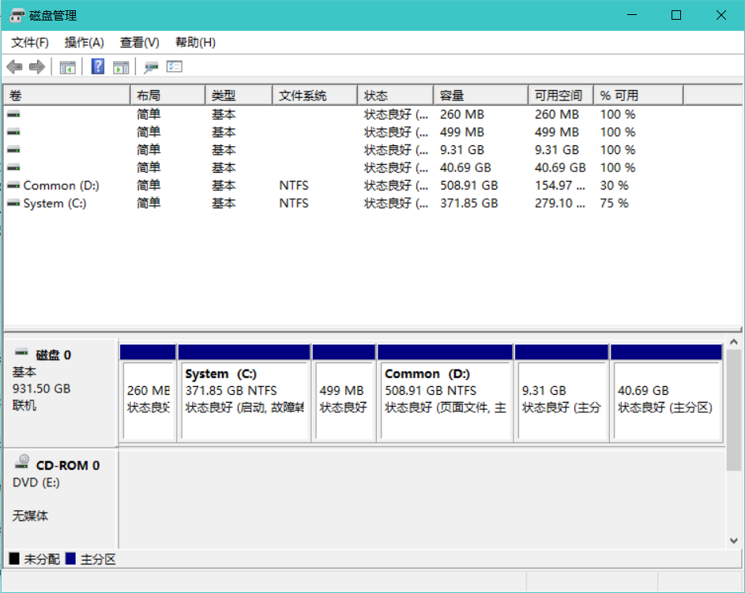

鼠标移动到你想要将它分区的硬盘，比如我要分我得D盘，然后右键单击，弹出一个对话框，如图，选择压缩卷。

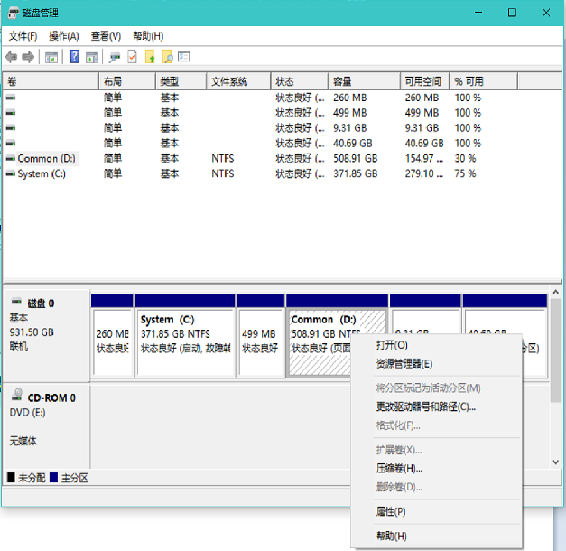

之后会弹出一个提示框，显示正在查询空间大小，如图。

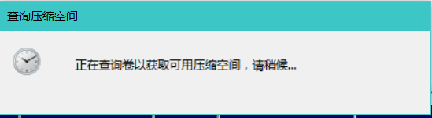

稍等片刻，查询完毕后弹出对话框，提示选择要分出的空间的大小，如图所示。

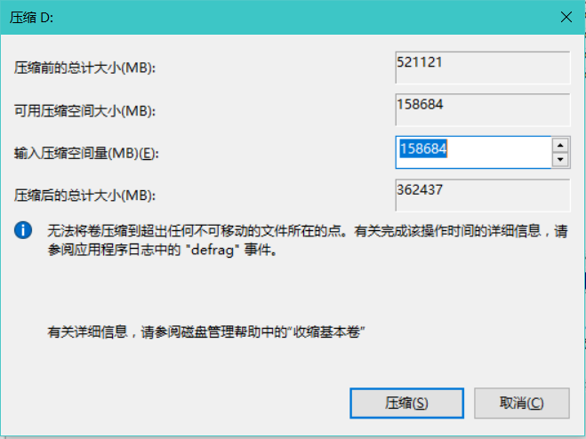

根据你自己的可用压缩空间大小，来决定你的输入压缩空间量，这个看个人需求，我的原则是，在不影响个人win10 使用的情况下，分的空间越大越好，原因还是之前说过的，一旦分小了，以后想改会很费劲。

输入好你的压缩量后，下面的压缩后总计大小会显示你压缩后得到的空间有多少，每个人具体不一样，一般不会损失太多，之后点击压缩即可开始压缩。
PS：**一定要慎重考虑给Ubuntu系统留出多少空间，尽量大些，不然之后不好改，建议50G以上，100G以上更好**。

点击压缩后，系统开始压缩，压缩时鼠标会由小箭头变成圈圈，这表示正在压缩，不要着急，这个过程时间的长短各自不同，由CPU的好坏决定和你压缩的空间大小等等因素决定，可能10分钟，半个小时，也可能一个小时，**切勿着急，也切勿关机**，否则容易出现未知错误，甚至损坏硬盘。

压缩成功后，会显示如下图所示的样子，有一个黑色的未分配的空间出现，我这里分配的空间大小是50G。

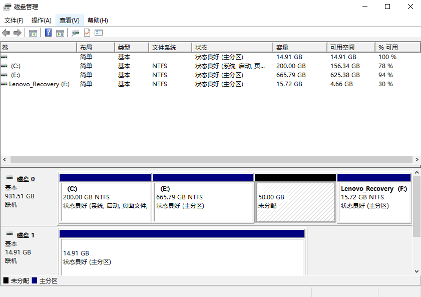

至此，磁盘空间分配完毕。
准备工作也完毕。

# **U盘安装Ubuntu系统**

准备工作结束，开始正式安装。

## 1.设置U盘启动

首先查询你的电脑快速进入**BOOT**的快捷键是什么，这个和之前快速进入**BIOS**不是一回事，要重新查询，不是一个快捷键。我得笔记本快速进入BOOT快捷键是ESC，自行百度就好。

设置U盘启动快捷键：华硕的电脑快捷键是F2、惠普暗影精灵的快捷键是F9。

开机启动完成之后，发现直接黑屏无法启动。

这个

将U盘插入到电脑上（如果你之前制作启动盘后将它拔下来了的话），然后重启电脑。在出现LOGO界面是，点击你的电脑快速进BOOT的快捷键，进入BOOT中，如下图所示。

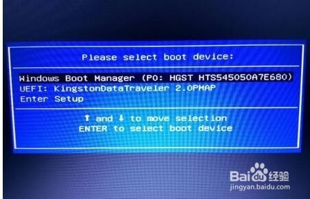

之后选择你的U盘名字，回车确定，也就开始了U盘启动，上图中第二项是我的U盘，第一项是默认的win10启动。

之后会进入一个界面，选择**Install Ubuntu**就行，如果你选了**Try Ubuntu**的话，就会进入下图所示界面，也没事，这是让你体验一下Ubuntu系统，鼠标点击图标**安装Ubuntu**即可进入安装。

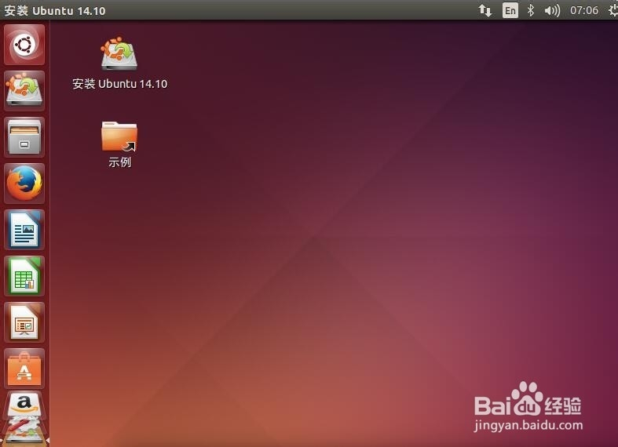

之后按提示一步一步，都没什么大的问题，如图所示，点击继续即可。

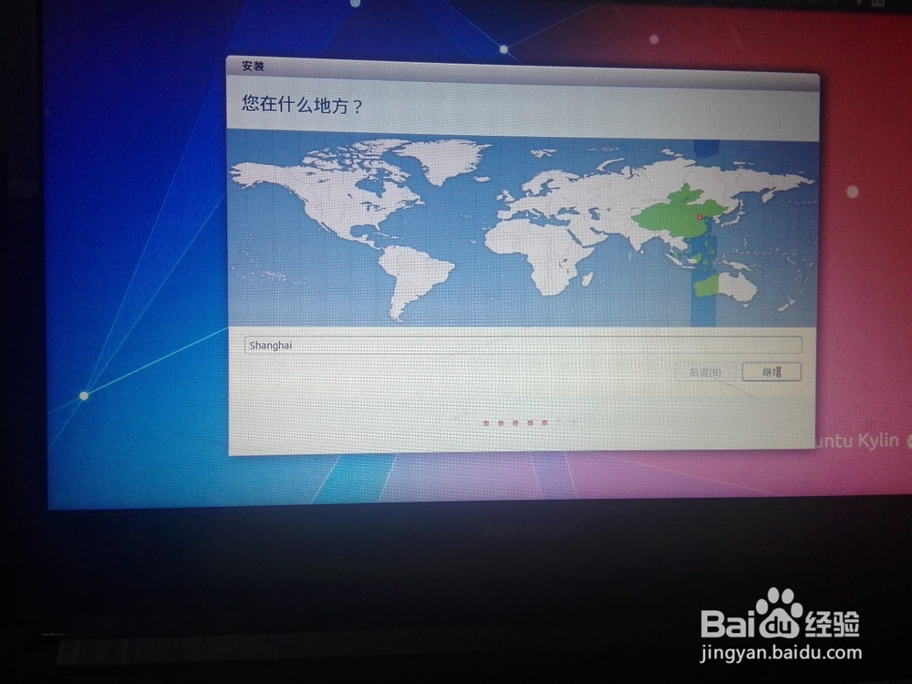

然后可以选择系统的语言，继续下一步。

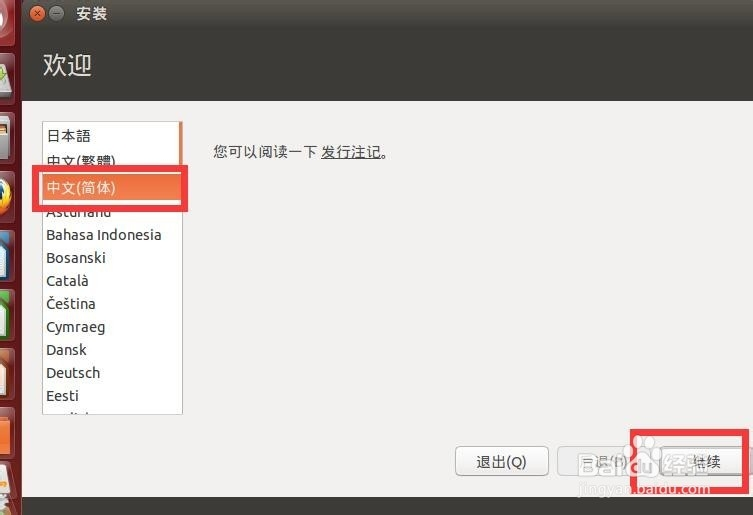

如果网络通畅的话，可以选**安装中下载更新**，这个不是很重要，因为以后也可以随时装。

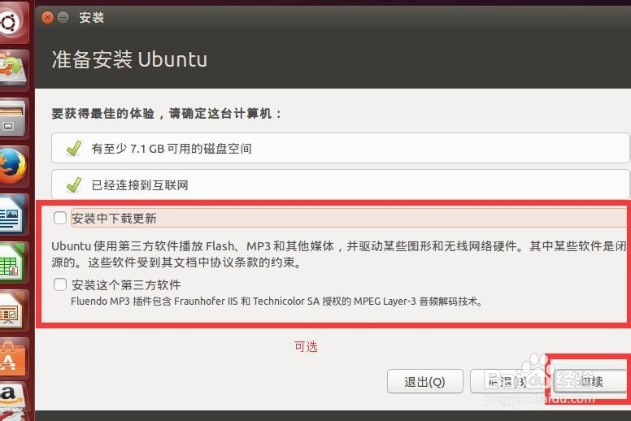

然后会进入这个界面，**注意注意注意**，这里要选择**其他选项**，可以自己创建、调整分区，因为系统自行分区的话，可能会导致你要用的分区比如usr等分的很小，以后想改很麻烦（重装Ubuntu是最简单的一种方式）。

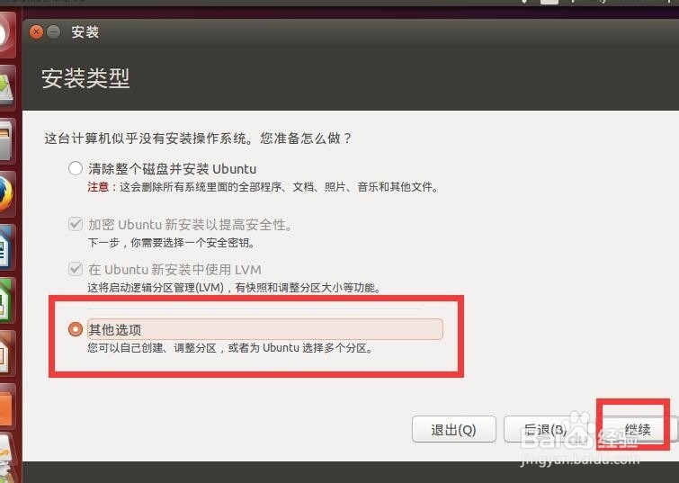

点击**其他**然后**继续**后，你会进入这个界面。

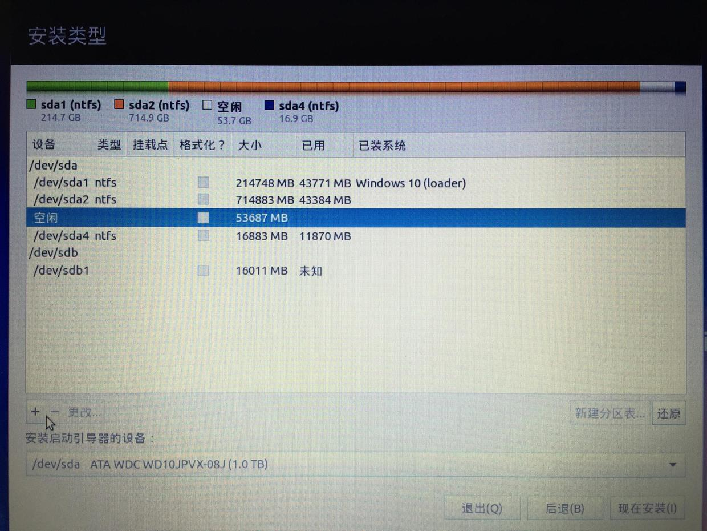

## 2.设置分区

如果是机械硬盘和固态硬盘双硬盘，则参考：https://blog.csdn.net/weixin_44120025/article/details/121714984

其中显示**空闲**的那一项，就是你刚才在win系统上分出的区，看看后面的空间大小，也和你分的空间大小一致。
选中**空闲**那一行，点击**+号**，这是要将整个**空闲**分区继续分区，以用来装Ubuntu系统。
你可能会在网上查到很多其他的教程，在这一步中会让你分很多个区，比如什么boot分区，比如home分区，比如swap分区，比如usr分区，比如/分区等等，记住，我们在这里只分两个区，一个事swap分区，另一个是/分区，其他统统不分，首先解释一下为什么只分两个分区。

**只分两个分区的原因**：
	分那么多分区，有白害而无一利，其他教程要求分boot分区，实际上是由于以前硬盘空间小，如果一台电脑上要装很多歌版本的Ubuntu，他们可以公用一个boot分区，然而一个boot分区只占100MB左右，根本没必要分区，而且一般情况下，我们也不会安装多个Ubuntu系统。

只分两个区：**swap交换空间**和**/分区**，swap是linux的虚拟内存，具体分的空间大小因个人电脑的内存而定，2g电脑分4g，4g内存的电脑分4-6个g即可，8g电脑分8-10g即可。
	余下的空间全部分给/分区，因为/分区是你所有东西的存放位置，里面包括的home，usr等等，千万不要单独给home、usr等等单独分区，这样纯属自己找麻烦，一旦之后usr空间快满了，而/分区中海油很大剩余空间，usr也调用不了，这是非常悲催的一件事，所以只给/分区划分空间，以后不管是home分区还是usr分区还是其他分区需要空间，都可以随便用。

下面说具体步骤：

### 设置swap分区

1. **swap分区**：选中**空闲磁盘**，点击**+**，选择**逻辑分区**、“**空间起始位置**”，**用于**后面选择“**交换空间**”，给它分区16g空间（举例），然后点击确定。

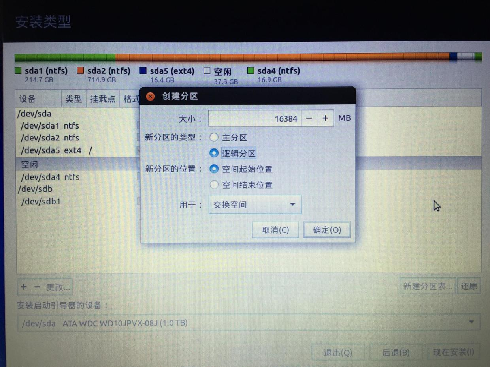

### 	设置/分区

2. **/分区**：继续选中**空闲磁盘**，点击**+**，所有空间都给/分区，选择**逻辑分区**、“**空间起始位置**”，**Ext4**和**“挂载点/”**。下图我选的是主分区，没有任何区别，逻辑分区也可以。

### 安装启动引导器

OK结束，再解释一下为什么选择逻辑分区而不是主分区，这个没什么影响，但是主分区数量少，逻辑分区数量多，所以不用浪费主分区了，逻辑分区就好，对于使用没有任何差别，实际上，一块硬盘最多容纳4个主分区。

分好后，看好界面上挂载点是**/**的那一行，前面**设备**那一列，显示应该是/dev/sdaX, X是一个阿拉伯数字，具体是几每个人不一样，表示的是你的**/分区**按在硬盘的第几块位置，记住**/这个分区**的sda后面是什么数字，然后在下面**安装启动引导器设备：**处，选择**sdaX（X是一个阿拉伯数字）**的那一项，也就是说，要将启动引导器安装在**/分区**中。

要将启动引导器安装在/分区中！！！

之后点击**现在安装**即可，会弹出提示，不用管直接确定。

OK，静等安装完毕吧，安装后会提示重启，可以直接重启，重启后会进入grub2引导界面，选择Ubuntu即可进入Ubuntu系统。

之后没必要使用EasyBCD引导Ubuntu，忽略EasyBCD吧。

# 安装问题

## 解决usr分区变满

最后，如果有朋友按照别的教程在安装时某个分区在分区时分少了（**比如只给usr分了5个G，然后发现usr要满了，提示usr空间不够**），不要着急在window上删除Ubuntu系统的分区，这可能会引起未知错误，不要着急，可以重新装系统，还是按照上面第二项的步骤直接重新安装，在安装到分区那一步时，可以点**-**号，将之前分的区删掉（具体操作就是选中你要删的区，然后点**-**），注意不要删错了别的区（别把自己的C盘给删了），只删装了Ubuntu的区（比如boot分区，home分区，swap分区等等，都要删，但不要删多，也不要少删，可以通过每个分区后面的空间大小来分辨是哪个区，比如boot分区可能只有100MB），这样你删的所有的区都会重新汇合在一起，然后可以重新分区，可以再次选择给/分区分几个G等等。分好之后继续安装，就没问题了。

## 安装系统黑屏

## 未发现WI-FI适配器

文章参考：[ubuntu18.04系统安装完之后显示未发现WiFi适配器（屡试不爽）_ubuntu未找到wifi适配器](https://blog.csdn.net/lduzhenlin/article/details/109678441)

