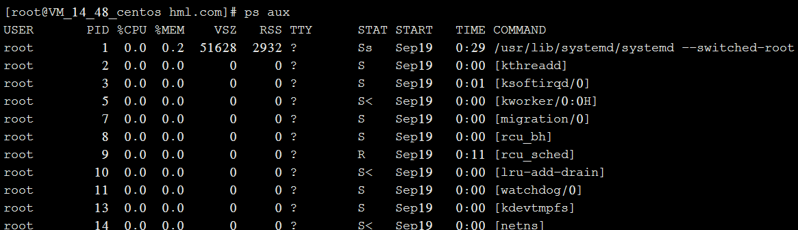

[TOC]

# 概述

进程是在 CPU 及内存中运行的程序代码，而每个进程可以创建一个或多个进程（父子进程）。


**第一种：**

```
ps aux
```

ps命令用于报告当前系统的进程状态。可以搭配kill指令随时中断、删除不必要的程序。ps命令是最基本同时也是非常强大的进程查看命令，使用该命令可以确定有哪些进程正在运行和运行的状态、进程是否结束、进程有没有僵死、哪些进程占用了过多的资源等等，总之大部分信息都是可以通过执行该命令得到的。

a：显示当前终端下的所有进程信息，包括其他用户的进程。

u：使用以用户为主的格式输出进程信息。

x：显示当前用户在所有终端下的进程。


示例： 




**上图中各字段解释：**

USER：启动该进程的用户账号名称

 PID：该进程的ID号，在当前系统中是唯一的 %CPU：CPU占用的百分比 %MEM：内存占用的百分比

VSZ：占用虚拟内存（swap空间）的大小 RSS：占用常驻内存（物理内存）的大小

TTY：该进程在哪个终端上运行。“？”表未知或不需要终端 STAT：显示了进程当前的状态，如S（休眠）、R（运行）、Z（僵死）、<（高优先级）、N（低优先级）、s（父进程）、+（前台进程）。对处于僵死状态的进程应予以手动终止。

START：启动该进程的时间 TIME：该进程占用CPU时间 COMMAND：启动该进程的命令的名称

**总结：ps aux 是以简单列表的形式显示出进程信息。**