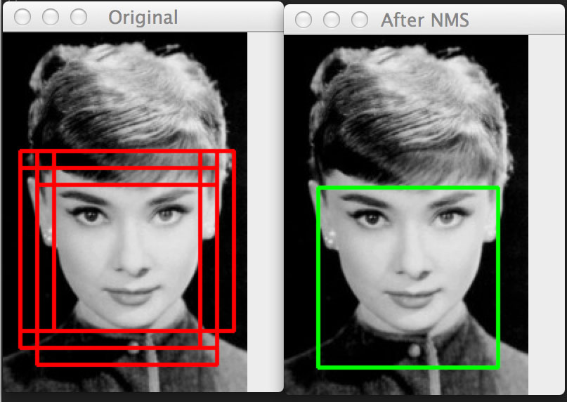

[TOC]

# 概述
文章参考：https://www.cnblogs.com/makefile/p/nms.html

文章参考：https://blog.csdn.net/lz867422770/article/details/100019587

文章参考：https://zhuanlan.zhihu.com/p/37489043

非极大值抑制，简称为NMS算法，英文为Non-Maximum Suppression。顾名思义就是抑制不是极大值的元素，可以理解为局部最大搜索。其思想是搜素局部最大值，抑制非极大值。这个局部代表的是一个邻域，邻域有两个参数可变，一是邻域的维数，二是邻域的大小。这里不讨论通用的NMS算法(参考论文《[Efficient Non-Maximum Suppression](https://pdfs.semanticscholar.org/52ca/4ed04d1d9dba3e6ae30717898276735e0b79.pdf)》对1维和2维数据的NMS实现)，而是用于目标检测中提取分数最高的窗口的。例如在行人检测中，滑动窗口经提取特征，经分类器分类识别后，每个窗口都会得到一个分数。但是滑动窗口会导致很多窗口与其他窗口存在包含或者大部分交叉的情况。这时就需要用到NMS来选取那些邻域里分数最高（是行人的概率最大），并且抑制那些分数低的窗口。
		NMS算法在不同应用中的具体实现不太一样，但思想是一样的。非极大值抑制，在计算机视觉任务中得到了广泛的应用，例如边缘检测、人脸检测、目标检测（DPM，YOLO，SSD，Faster R-CNN）等。
		

## NMS 在目标检测中的应用

以目标检测为例：目标检测的过程中在同一目标的位置上会产生大量的候选框，这些候选框相互之间可能会有重叠，此时我们需要利用非极大值抑制找到最佳的目标边界框，消除冗余的边界框。Demo如下图：

左图是人脸检测的候选框结果，每个边界框有一个置信度得分(confidence score)，如果不使用非极大值抑制，就会有多个候选框出现。右图是使用非极大值抑制之后的结果，符合我们人脸检测的预期结果。

我们的目的就是要去除冗余的检测框,保留最好的一个.
		有多种方式可以解决这个问题。 建议使用[`Mean-Shift`](http://en.wikipedia.org/wiki/Mean-shift) 算法,利用bbox的坐标和当前图片尺度的对数来检测bbox的多种模式.但效果可能并不如使用强分类器结合NMS的效果好.

### 目标检测 pipline

产生proposal后使用分类网络给出每个框的每类置信度,使用回归网络修正位置,最终应用NMS.

## 使用非极大值抑制

**前提：**目标边界框列表及其对应的置信度得分列表，设定阈值，阈值用来删除重叠较大的边界框。
**IoU**：intersection-over-union，即两个边界框的交集部分除以它们的并集。

