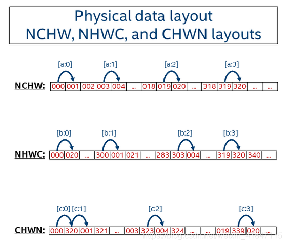
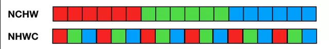
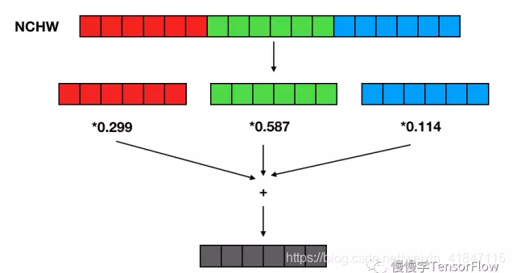
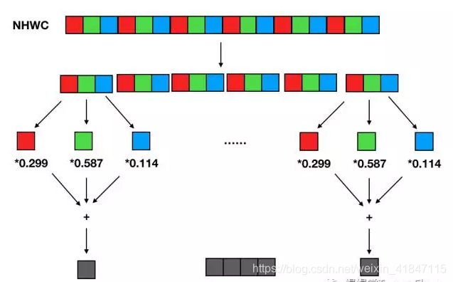

[TOC]

文章参考：https://blog.csdn.net/thl789/article/details/109037433

# 概述

流行的深度学习框架中有不同的数据格式，典型的有NCHW和NHWC格式。本文从逻辑表达和物理存储角度用图的方式来理解这两种数据格式，最后以RGB图像为例来加深NHWC和NCHW数据存储格式的理解。

深度学习框架中，数据一般是4D，用NCHW或NHWC表达，其中：

- N - Batch

- C - Channel

- H - Height

- W - Width

  

假定N = 2，C = 16，H = 5，W = 4，那么这个4D数据，看起来是这样的：

NCHW其实代表的是[W H C N]，第一个元素是000，第二个元素是沿着w方向的，即001，这样下去002 003，再接着呢就是沿着H方向，即004 005 006 007...这样到09后，沿C方向，轮到了020，之后021 022 ...一直到319，然后再沿N方向。


# 物理存储

NHWC的话以此类推，代表的是[C W H N]，第一个元素是000，第二个沿C方向，即020，040, 060..一直到300，之后沿W方向，001 021 041 061...301..到了303后，沿H方向，即004 024 .。。304.。最后到了319，变成N方向，320,340....




## NCHW

NCHW是先取W方向数据；然后H方向；再C方向；最后N方向。

所以，序列化出1D数据：

000 (W方向) 001 002 003，(H方向) 004 005 ... 019，(C方向) 020 ... 318 319，(N方向) 320 321 ...

## NHWC

NHWC是先取C方向数据；然后W方向；再H方向；最后N方向。

所以，序列化出1D数据：

000 (C方向) 020 ... 300，(W方向) 001 021 ... 303，(H方向) 004 ... 319，(N方向) 320 340 ...


# RGB图像

data_format 默认值为 "NHWC。其中 N 表示这批图像有几张，H 表示图像在竖直方向有多少像素，W 表示水平方向像素数，C 表示通道数（例如黑白图像的通道数 C = 1，而 RGB 彩色图像的通道数 C = 3）。为了便于演示，我们后面作图均使用 RGB 三通道图像。





NCHW 中，C 排列在外层，每个通道内像素紧挨在一起，即 'RRRRRRGGGGGGBBBBBB' 这种形式。

NHWC 格式，C 排列在最内层，多个通道对应空间位置的像素紧挨在一起，即 'RGBRGBRGBRGBRGBRGB' 这种形式。


如果我们需要对图像做彩色转灰度计算，NCHW 计算过程如下：





即 R 通道所有像素值乘以 0.299，G 通道所有像素值乘以 0.587，B 通道所有像素值乘以 0.114，最后将三个通道结果相加得到灰度值。

相应地，NHWC 数据格式的彩色转灰度计算过程如下：




输入数据分成多个(R, G, B) 像素组，每个像素组中 R 通道像素值乘以 0.299，G 通道像素值乘以 0.587，B 通道像素值乘以 0.114 后相加得到一个灰度输出像素。将多组结果拼接起来得到所有灰度输出像素。

以上使用两种数据格式进行 RGB -> 灰度计算的复杂度是相同的，区别在于访存特性。通过两张图对比可以发现，NHWC 的访存局部性更好（每三个输入像素即可得到一个输出像素），NCHW 则必须等所有通道输入准备好才能得到最终输出结果，需要占用较大的临时空间。

在 CNN 中常常见到 1x1 卷积（例如：用于移动和嵌入式视觉应用的 MobileNets），也是每个输入 channel 乘一个权值，然后将所有 channel 结果累加得到一个输出 channel。如果使用 NHWC 数据格式，可以将卷积计算简化为矩阵乘计算，即 1x1 卷积核实现了每个输入像素组到每个输出像素组的线性变换。

TensorFlow 为什么选择 NHWC 格式作为默认格式？因为早期开发都是基于 CPU，使用 NHWC 比 NCHW 稍快一些（不难理解，NHWC 局部性更好，cache（缓存） 利用率高）。

NCHW 则是 Nvidia cuDNN 默认格式，使用 GPU 加速时用 NCHW 格式速度会更快（也有个别情况例外）。

 

最佳实践：设计网络时充分考虑两种格式，最好能灵活切换，在 GPU 上训练时使用 NCHW 格式，在 CPU 上做预测时使用 NHWC 格式。

在不同的硬件加速的情况下，选用的类型不同，在intel GPU加速的情况下，因为GPU对于图像的处理比较多，希望在访问同一个channel的像素是连续的，一般存储选用NCHW，这样在做CNN的时候，在访问内存的时候就是连续的了，比较方便。

```python
# NCHW [batch,in_channels,in_height,in_weight]
# NHWC [batch,in_height,in_weight,in_channels]
# CHWN [in_channels,in_height,in_weight,batch]
 
# 转换 NCHW---NHWC
import tensorflow as tf
 
x = tf.reshape(tf.range(24),[1,2,3,4])
out = tf.transpose(x,[0,2,3,1])
 
print (x.shape)
print (out.shape)
 
 
 
#转换NHWC--NCHW
import tensorflow as tf
 
x = tf.reshape(tf.range(24), [1, 3, 4, 2])
out = tf.transpose(x, [0, 3, 1, 2])
 
print  (x.shape)
print  (out.shape)
```

