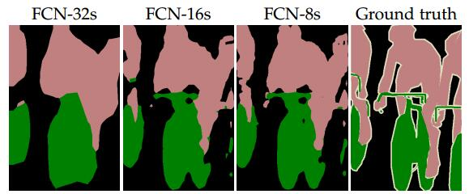

[TOC]

## 概述

有关图像分割评价标准详细信息可以看这里：


## IoU(Intersection over Union)

Intersection over Union是一种测量在特定数据集中检测相应物体准确度的一个标准。我们可以在很多物体检测挑战中，例如PASCAL VOC challenge中看多很多使用该标准的做法。

通常我们在 HOG + Linear SVM object detectors 和 Convolutional Neural Network detectors (R-CNN, Faster R-CNN, YOLO, etc.)中使用该方法检测其性能。注意，这个测量方法和你在任务中使用的物体检测算法没有关系。


IoU是一个简单的测量标准，只要是在输出中得出一个预测范围(bounding boxex)的任务都可以用IoU来进行测量。为了可以使IoU用于测量任意大小形状的物体检测，我们需要：

1、 ground-truth bounding boxes（人为在训练集图像中标出要检测物体的大概范围）；
2、我们的算法得出的结果范围。

2、我们的算法得出的结果范围。

也就是说，这个标准用于测量真实和预测之间的相关度，相关度越高，该值越高。

如下图：


下图展示了ground-truth和predicted的结果，绿色标线是人为标记的正确结果，红色标线是算法预测出来的结果，IoU要做的就是在这两个结果中测量算法的准确度。


如上图，很简单，IoU相当于两个区域重叠的部分除以两个区域的集合部分得出的结果。
**一般来说，这个score ＞ 0.5 就可以被认为一个不错的结果了。**


## python程序实现

具体实现过程请移步：https://www.pyimagesearch.com/2016/11/07/intersection-over-union-iou-for-object-detection/

```c++
def bb_intersection_over_union(boxA, boxB):
	# determine the (x, y)-coordinates of the intersection rectangle
	xA = max(boxA[0], boxB[0])
	yA = max(boxA[1], boxB[1])
	xB = min(boxA[2], boxB[2])
	yB = min(boxA[3], boxB[3])
 
	# compute the area of intersection rectangle
	interArea = (xB - xA + 1) * (yB - yA + 1)
 
	# compute the area of both the prediction and ground-truth
	# rectangles
	boxAArea = (boxA[2] - boxA[0] + 1) * (boxA[3] - boxA[1] + 1)
	boxBArea = (boxB[2] - boxB[0] + 1) * (boxB[3] - boxB[1] + 1)
 
	# compute the intersection over union by taking the intersection
	# area and dividing it by the sum of prediction + ground-truth
	# areas - the interesection area
	iou = interArea / float(boxAArea + boxBArea - interArea)
 
	# return the intersection over union value
	return iou
```

## 后记

IoU在FCN中称为IU，初看Fully Convolutional Networks for Semantic Segmentation论文，其中的IU概念没有能理解，其实那里的IU也就是IoU，检测物体轮廓不一定非得是方框，也可以是沿着物体的边线：



在实际的任务中，根据不同的任务要求来写不同具体实现的检测方法，但说白了其实都是IoU或者IU。

另外mean IU指的是不同类别识别准确度的平均值，比如一幅图中要识别三个物体，mean IU就是三个物体分别准确度加起来的平均值。

