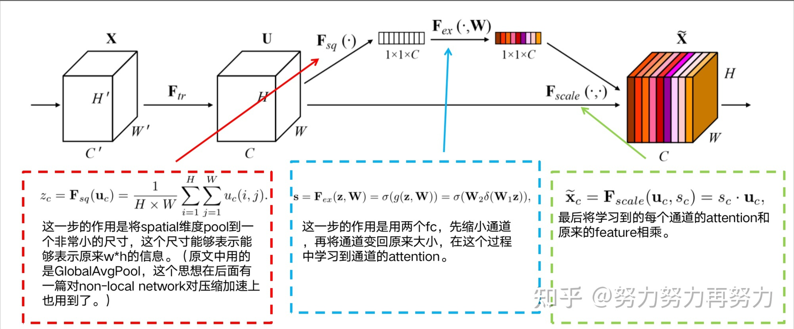
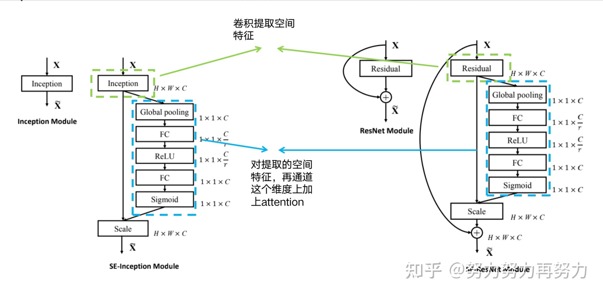

```
title: Linux系统上常用软件集锦
date: 2020-07-20 00:00:00
updated: 2022-01-05 00:00:00
tags: [Linux,四大组件,Activity]
type: [Linux,四大组件,Activity]
comments: Activity的生命周期完全解析
description: Activity的生命周期完全解析
keywords: Activity的生命周期完全解析
top_img:
mathjax:
katex:
aside:
aplayer:
highlight_shrink:
```

[TOC]

参考：https://zhuanlan.zhihu.com/p/350953067

文章参考：https://blog.csdn.net/jacke121/article/details/110789463

## 概述

本文整理了近期学习的关于通道和空间注意力机制的文章，如果遗漏和问题，欢迎在评论区或私信交流学习。

因为论文的official implementation往往和具体任务相关，对于新手小白要找到论文的核心代码，还是有一点不方便的。

因此，为了大家能够更方便的理解论文的思想，我在github上创建了一个关于CV Attention的项目，这个项目中主要就是各个CV Attention的**核心代码**，并且附上了如何使用。

目前这个项目还在继续扩展，如果有什么Attention没有被放到这个项目里的，大家可以在**评论区留言**，我会尽快加进去的，希望大家能随手一个**star**支持一下哈~~~

https://github.com/xmu-xiaoma666/External-Attention-pytorch


**1.论文名：Squeeze-and-Excitation Networks**

链接：

https://openaccess.thecvf.com/content_cvpr_2018/papers/Hu_Squeeze-and-Excitation_Networks_CVPR_2018_paper.pdf

代码：

https://github.com/hujie-frank/SENet





CVPR2018的文章，这篇文章是channel attention中非常著名的一篇文章，后面的channel attention的文章大多都是基于这篇文章的思想解决channel attention的问题。

大道至简，这篇文章的思想可以说非常简单，首先将spatial维度进行AdaptiveAvgPool（比如7 x 7 -->1 x 1，这一步称为Squeeze），然后通过两个FC学习到通道注意力（再用Sigmoid归一化，这一步称为Excitation），然后就这个学习到的矩阵与原来的矩阵相乘（e.g. 每个7x7的特征，乘上1x1的权重），就得到了在空间维度加权之后的特征。



SENet的高效率主要来自于2个模块：

（1）squeeze：global pool

将w*h压缩到了1减少了后续操作中对spatial维度的计算和参数。

（2）excitation：通道维度先降再升

如果直接用一个c->c的FC，那么参数为c**2；如果先降再升用两个FC，那么参数为(c**2)/r+(c**2)/r，原文中r=16，那么参数就变为了一个FC的1/8.


