[TOC]

文章转自：https://zhuanlan.zhihu.com/p/363345545

文章参考：https://juejin.cn/post/7130176282427392007

## **局部连接+权值共享**

全连接神经网络需要非常多的计算资源才能支撑它来做反向传播和前向传播，所以说全连接神经网络可以存储非常多的参数，如果你给它的样本如果没有达到它的量级的时候，它可以轻轻松松把你给他的样本全部都记下来，这会出现过拟合的情况。

所以我们应该把神经元和神经元之间的连接的权重个数降下来，但是降下来我们又不能保证它有较强的学习能力，所以这是一个纠结的地方，所以有一个方法就是**局部连接+权值共享**，局部连接+权值共享不仅权重参数降下来了，而且学习能力并没有实质的降低，除此之外还有其它的好处，下来看一下，下面的这几张图片：

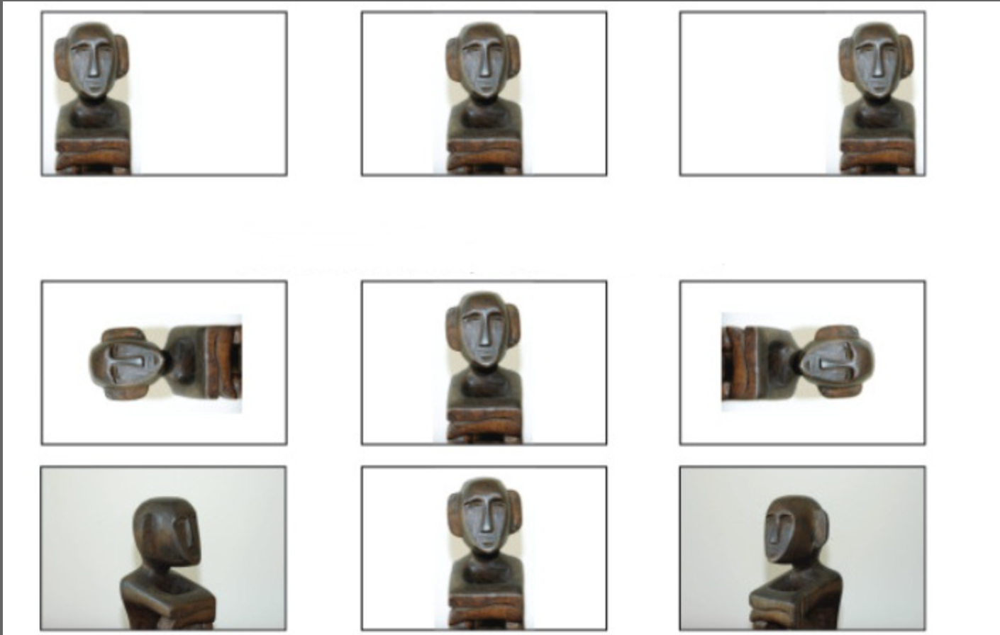

这几张图片描述的都是一个东西，但是有的大有的小，有的靠左边，有的靠右边，有的位置不同，但是我们构建的网络识别这些东西的时候应该是同一结果。为了能够达到这个目的，我们可以让图片的不同位置具有相同的权重（权值共享），也就是上面所有的图片，我们只需要在训练集中放一张，我们的神经网络就可以识别出上面所有的，这也是**权值共享**的好处。

**而卷积神经网络就是局部连接+权值共享的神经网络。**

## 卷积神经网络

现在我们对卷积神经网络有一个初步认识了，下面具体来讲解一下卷积神经网络，卷积神经网络依旧是层级结构，但层的功能和形式做了改变，卷积神经网络常用来处理图片数据，比如识别一辆汽车：

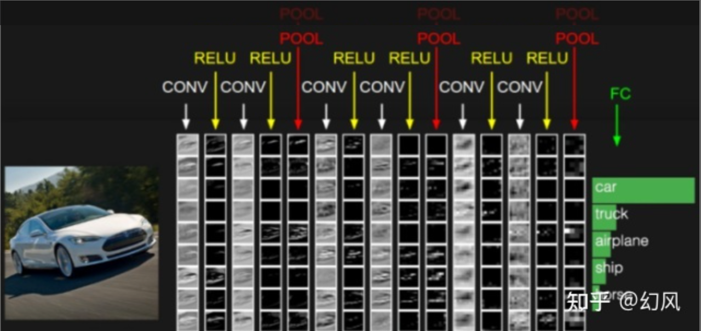

其中数据输入的是一张图片（**输入层**），CONV表示**卷积层**，RELU表示**激励层**，POOL表示**池化层**，Fc表示**全连接层**

## 卷积神经网络之输入层

在图片输出到神经网络之前，常常先进行图像处理，有**三种**常见的图像的处理方式：

1. 均值化：把输入数据各个维度都中心化到0，所有样本求和求平均，然后用所有的样本减去这个均值样本就是去均值。
2. 归一化：数据幅度归一化到同样的范围，对于每个特征而言，范围最好是[-1,1]
3. PCA/白化：用PCA降维，让每个维度的相关度取消，特征和特征之间是相互独立的。白化是对数据每个特征轴上的幅度归一化

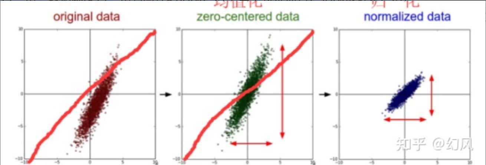

均值化和归一化

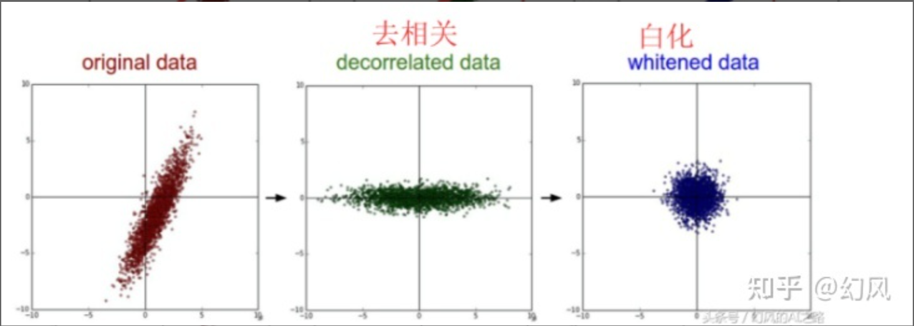

去相关和白化

## 卷神网络之卷积层

图片有一个性质叫做局部关联性质，一个图片的像素点影响最大的是它周边的像素点，而距离这个像素点比较远的像素点二者之间关系不大。这个性质意味着每一个神经元我们不用处理全局的图片了（和上一层全连接），我们的每一个神经元只需要和上一层局部连接，相当于每一个神经元扫描一小区域，然后许多神经元（这些神经元权值共享）合起来就相当于扫描了全局，这样就构成一个特征图，n个特征图就提取了这个图片的n维特征，每个特征图是由很多神经元来完成的。

在卷积神经网络中，我们先选择一个局部区域（filter），用这个局部区域（filter）去扫描整张图片。 局部区域所圈起来的所有节点会被连接到下一层的**一个节点上**。我们拿灰度图（只有一维）来举例：

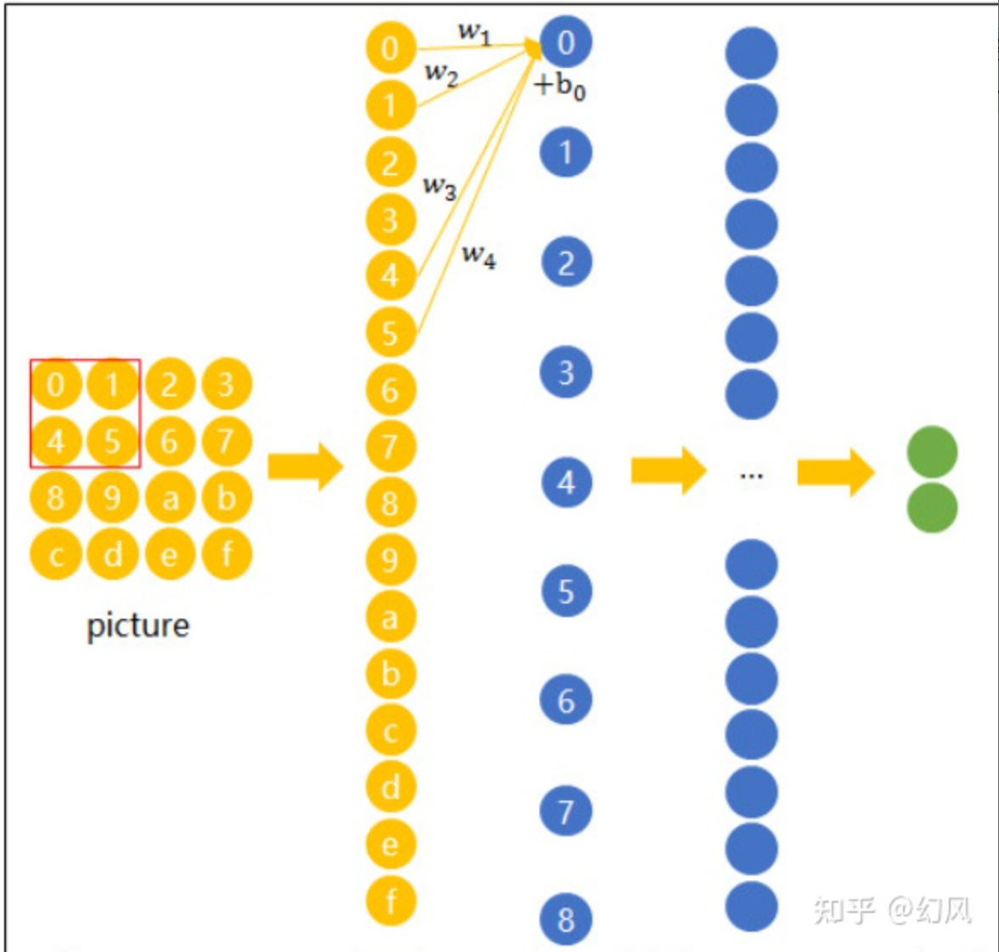

局部区域

图片是矩阵式的，将这些以矩阵排列的节点展成了向量。就能更好的看出来卷积层和输入层之间的连接，并不是全连接的，我们将上图中的红色方框称为filter，它是2*2的，这是它的尺寸，这不是固定的，我们可以指定它的尺寸。

我们可以看出来当前filter是2*2的小窗口，这个小窗口会将图片矩阵从左上角滑到右下角，每滑一次就会一下子圈起来四个，连接到下一层的一个神经元，然后产生四个权重，这四个权重(w1、w2、w3、w4)构成的矩阵就叫做卷积核。

卷积核是算法自己学习得到的，它会和上一层计算，比如，第二层的0节点的数值就是局部区域的线性组合（w1*0+w2*1+w3*4+w4*5），即被圈中节点的数值乘以对应的权重后相加。

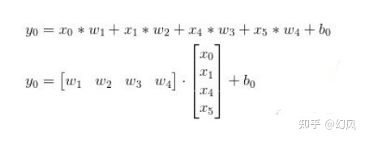

卷积核计算

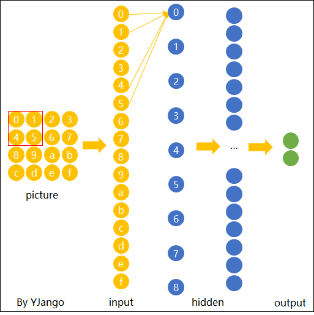

卷积操作

我们前面说过图片不用向量表示是为了保留图片平面结构的信息。 同样的，卷积后的输出若用上图的向量排列方式则丢失了平面结构信息。 所以我们依然用矩阵的方式排列它们，就得到了下图所展示的连接，每一个蓝色结点连接四个黄色的结点。

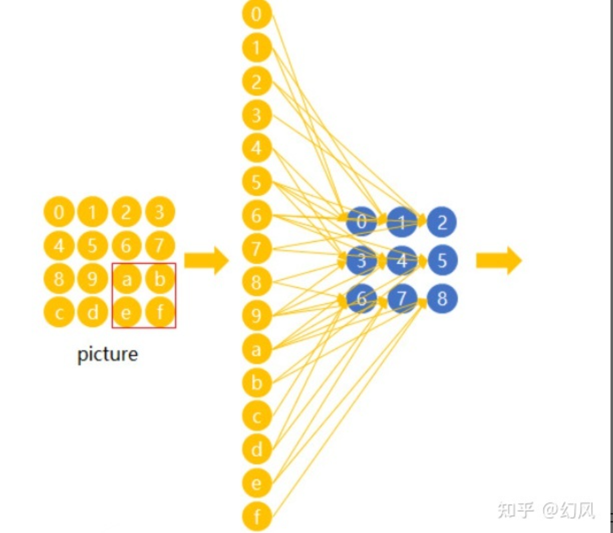

卷积层的连接方式

图片是一个矩阵然后卷积神经网络的下一层也是一个矩阵，我们用一个卷积核从图片矩阵左上角到右下角滑动，每滑动一次，当然被圈起来的神经元们就会连接下一层的一个神经元，形成参数矩阵这个就是卷积核，每次滑动虽然圈起来的神经元不同，连接下一层的神经元也不同，但是产生的参数矩阵确是一样的，这就是**权值共享**。

卷积核会和扫描的图片的那个局部矩阵作用产生一个值，比如第一次的时候，（w1*0+w2*1+w3*4+w4*5），所以，filter从左上到右下的这个过程中会得到一个矩阵（这就是下一层也是一个矩阵的原因），具体过程如下所示：

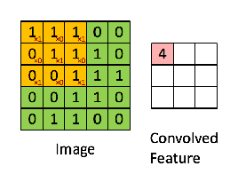

卷积计算过程

上图中左边是图矩阵，我们使用的filter的大小是3*3的，第一次滑动的时候，卷积核和图片矩阵作用（1*1+1*0+1*1+0*0+1*1+1*0+0*1+0*0+1*1）=4，会产生一个值，这个值就是右边矩阵的第一个值，filter滑动9次之后，会产生9个值，也就是说下一层有9个神经元，这9个神经元产生的值就构成了一个矩阵，这矩阵叫做特征图，表示image的某一维度的特征，当然具体哪一维度可能并不知道，可能是这个图像的颜色，也有可能是这个图像的轮廓等等。

**单通道图片总结**：以上就是单通道的图片的卷积处理，图片是一个矩阵，我们用指定大小的卷积核从左上角到右下角来滑动，每次滑动所圈起来的结点会和下一层的一个结点相连，连接之后就会形成局部连接，每一条连接都会产生权重，这些权重就是卷积核，所以每次滑动都会产生一个卷积核，因为权值共享，所以这些卷积核都是一样的。卷积核会不断和当时卷积核所圈起来的局部矩阵作用，每次产生的值就是下一层结点的值了，这样多次产生的值组合起来就是一个特征图，表示某一维度的特征。也就是从左上滑动到右下这一过程中会形成一个特征图矩阵（共享一个卷积核），再从左上滑动到右下又会形成另一个特征图矩阵（共享另一个卷积核），这些特征图都是表示特征的某一维度。

**三个通道的图片如何进行卷积操作？**

至此我们应该已经知道了单通道的灰度图是如何处理的，实际上我们的图片都是RGB的图像，有三个通道，那么此时图像是如何卷积的呢？

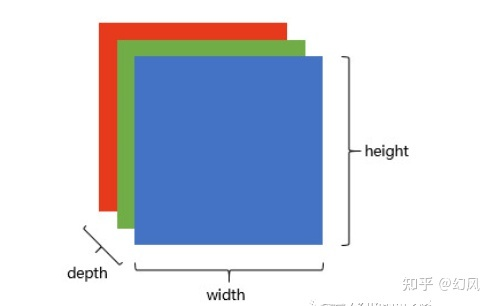

彩色图像

filter窗口滑的时候，我们只是从width和height的角度来滑动的，并没有考虑depth，所以每滑动一次实际上是产生一个卷积核，共享这一个卷积核，而现在depth=3了，所以每滑动一次实际上产生了具有三个通道的卷积核（它们分别作用于输入图片的蓝色、绿色、红色通道），卷积核的一个通道核蓝色的矩阵作用产生一个值，另一个和绿色的矩阵作用产生一个值，最后一个和红色的矩阵作用产生一个值，然后这些值加起来就是下一层结点的值，结果也是一个矩阵，也就是一张特征图。

三通道的计算过程

要想有多张特征图的话，我们可以再用新的卷积核来进行左上到右下的滑动，这样就会形成**新的特征图**。

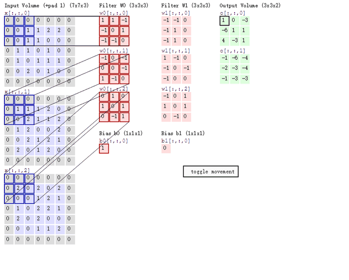

三通道图片的卷积过程

也就是说增加一个卷积核，就会产生一个特征图，总的来说就是输入图片有多少通道，我们的卷积核就需要对应多少通道，而本层中卷积核有多少个，就会产生多少个特征图。这样卷积后输出可以作为新的输入送入另一个卷积层中处理，有几个特征图那么depth就是几，那么下一层的每一个特征图就得用相应的通道的卷积核来对应处理，这个逻辑要清楚，我们需要先了解一下**基本的概念：**

1. 深度depth（通道）：由上一层滤波器的个数决定
2. 步长stride：每次滑动几步，步数越大得到的特征数越少，上面的例子中每次滑动1步。
3. 填充值zero-padding：我们设置了步长之后，很有可能某些位置滑不到，为了避免了边缘信息被一步步舍弃的问题，我们需要设置填充值来解决这个问题。还有一个问题，4x4的图片被2x2的filter卷积后变成了3x3的图片，每次卷积后都会小一圈的话，经过若干层后岂不是变的越来越小？zero padding就可以在这时帮助控制Feature Map的输出尺寸，同时避免了边缘信息被一步步舍弃的问题。

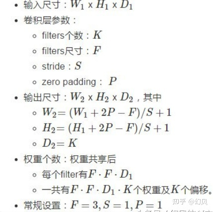

卷积计算的公式

4x4的图片在边缘Zero padding一圈后，再用3x3的filter卷积后，得到的Feature Map尺寸依然是4x4不变。

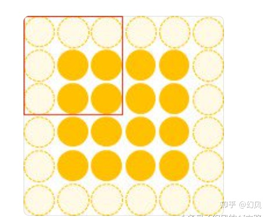

填充

当然也可以使用5x5的filte和2的zero padding可以保持图片的原始尺寸，3x3的filter考虑到了像素与其距离为1以内的所有其他像素的关系，而5x5则是考虑像素与其距离为2以内的所有其他像素的关系。

**规律：** Feature Map的尺寸等于

**(input_size + 2 \* padding_size − filter_size)/stride+1**

我们可以把卷积层的作用**总结一点：**卷积层其实就是在提取特征，卷积层中最重要的是卷积核（训练出来的），不同的卷积核可以探测特定的形状、颜色、对比度等，然后特征图保持了抓取后的空间结构，所以不同卷积核对应的特征图表示某一维度的特征，具体什么特征可能我们并不知道。特征图作为输入再被卷积的话，可以则可以由此探测到"更大"的形状概念，也就是说随着卷积神经网络层数的增加，特征提取的越来越具体化。

## 卷积神经网络之激励层(激活层)

下面讲解激励层的作用，激励层的作用可以理解为把卷积层的结果做**非线性映射**。

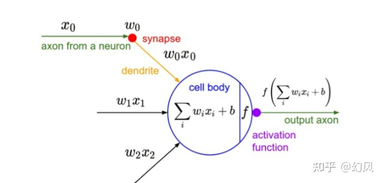

激励层

上图中的f表示激励函数，常用的激励函数几下几种：

常用的激励函数

我们先来看一下激励函数Sigmoid导数最小为0，最大为1/4，

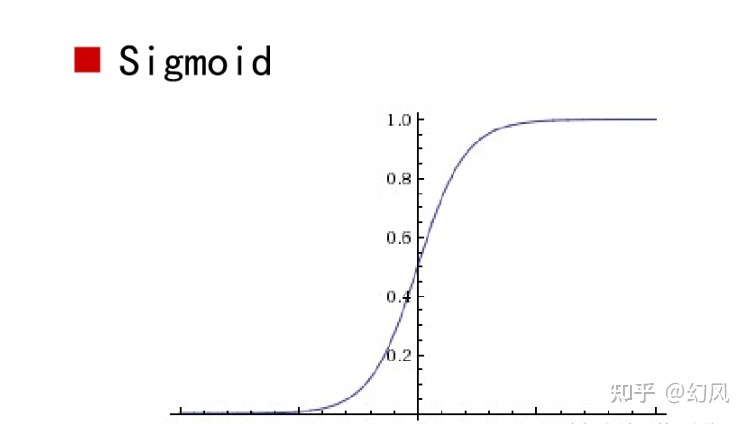

激励函数Sigmoid

Tanh激活函数：和sigmoid相似，它会关于x轴上下对应，不至于朝某一方面偏向

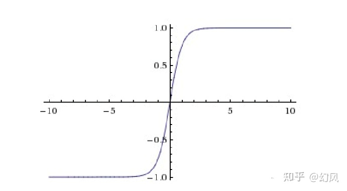

Tanh激活函数

ReLU激活函数（修正线性单元)：收敛快，求梯度快，但较脆弱，左边的梯度为0

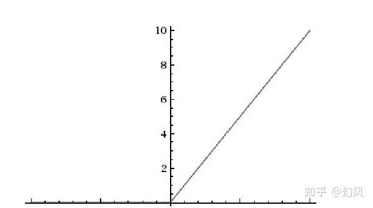

ReLU激活函数

Leaky ReLU激活函数：不会饱和或者挂掉，计算也很快，但是计算量比较大

Leaky ReLU激活函数

**一些激励函数的使用技巧**：一般不要用sigmoid，首先试RELU，因为快，但要小心点，如果RELU失效，请用Leaky ReLU，某些情况下tanh倒是有不错的结果。

这就是卷积神经网络的激励层，它就是将卷积层的线性计算的结果进行了非线性映射。可以从下面的图中理解。它展示的是将非线性操作应用到一个特征图中。这里的输出特征图也可以看作是"修正"过的特征图。如下所示：

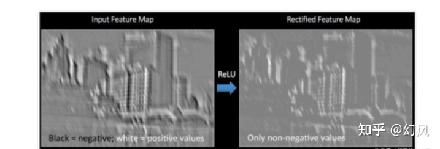

非线性操作

## 卷积神经网络之池化层

池化层的作用是降低输入图片的尺寸。在卷积神经网络中，每一个卷积层后面总会跟着一个池化层。

池化层：降低了各个特征图的维度，但可以保持大分重要的信息。池化层夹在连续的卷积层中间，压缩数据和参数的量，减小过拟合，池化层并没有参数，它只不过是把上层给它的结果做了一个下采样（数据压缩）。下采样有**两种**常用的方式：

**Max pooling**：选取最大的，我们定义一个空间邻域（比如，2x2 的窗口），并从窗口内的修正特征图中取出最大的元素，最大池化被证明效果更好一些。

**Average pooling**：平均的，我们定义一个空间邻域（比如，2x2 的窗口），并从窗口内的修正特征图算出平均值

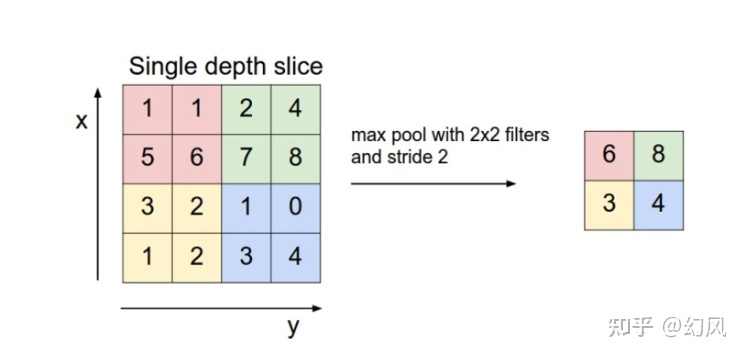

Max pooling

我们要注意一点的是：pooling在不同的depth上是分开执行的，也就是depth=5的话，pooling进行5次，产生5个池化后的矩阵，池化不需要参数控制。池化操作是分开应用到各个特征图的，我们可以从五个输入图中得到五个输出图。

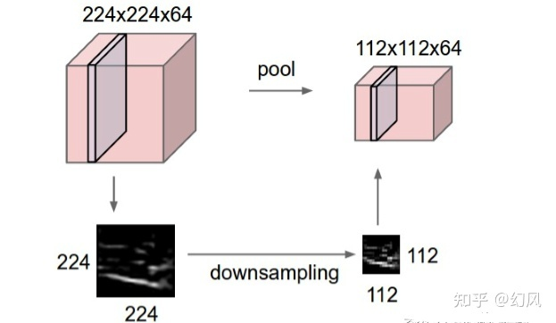

池化操作

无论是max pool还是average pool都有分信息被舍弃，那么部分信息被舍弃后会损坏识别结果吗？

因为卷积后的Feature Map中有对于识别物体不必要的冗余信息，我们下采样就是为了去掉这些冗余信息，所以并不会损坏识别结果。

我们来看一下卷积之后的冗余信息是怎么产生的？

我们知道卷积核就是为了找到特定维度的信息，比如说某个形状，但是图像中并不会任何地方都出现这个形状，但卷积核在卷积过程中没有出现特定形状的图片位置卷积也会产生一个值，但是这个值的意义就不是很大了，所以我们使用池化层的作用，将这个值去掉的话，自然也不会损害识别结果了。

比如下图中，假如卷积核探测"横折"这个形状。 卷积后得到3x3的Feature Map中，真正有用的就是数字为3的那个节点，其余数值对于这个任务而言都是无关的。 所以用3x3的Max pooling后，并没有对"横折"的探测产生影响。 试想在这里例子中如果不使用Max pooling，而让网络自己去学习。 网络也会去学习与Max pooling近似效果的权重。因为是近似效果，增加了更多的参数的代价，却还不如直接进行最大池化处理。

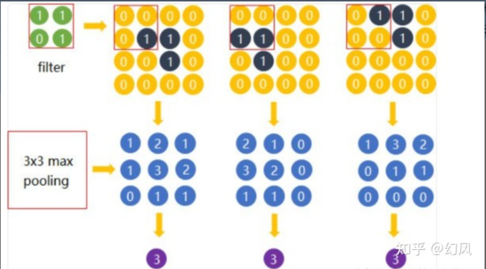

最大池化处理

## 卷积神经网络之全连接层

在全连接层中所有神经元都有权重连接，通常全连接层在卷积神经网络尾部。当前面卷积层抓取到足以用来识别图片的特征后，接下来的就是如何进行分类。 通常卷积网络的最后会将末端得到的长方体平摊成一个长长的向量，并送入全连接层配合输出层进行分类。比如，在下面图中我们进行的图像分类为四分类问题，所以卷积神经网络的输出层就会有四个神经元。

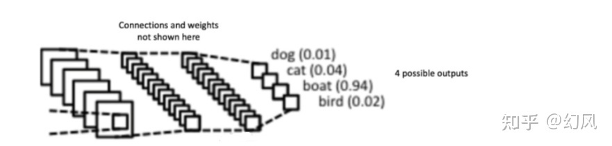

四分类问题

我们从卷积神经网络的输入层、卷积层、激活层、池化层以及全连接层来讲解卷积神经网络，我们可以认为全连接层之间的在做特征提取，而全连接层在做分类，这就是卷积神经网络的核心。

