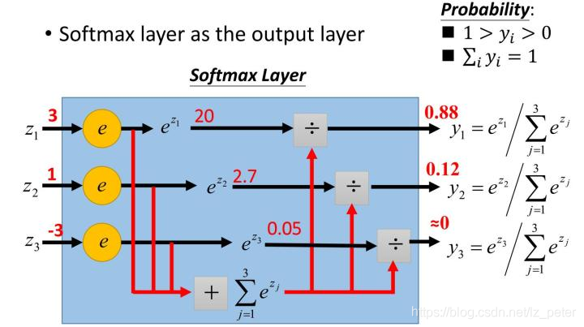

```
title: Linux系统上常用软件集锦
date: 2020-07-20 00:00:00
updated: 2022-01-05 00:00:00
tags: [Linux,四大组件,Activity]
type: [Linux,四大组件,Activity]
comments: Activity的生命周期完全解析
description: Activity的生命周期完全解析
keywords: Activity的生命周期完全解析
top_img:
mathjax:
katex:
aside:
aplayer:
highlight_shrink:
```

[TOC]


文章参考：https://www.zhihu.com/question/23765351

## 概述

​		做过多分类任务的同学一定都知道softmax函数。softmax函数，又称归一化指数函数。它是二分类函数sigmoid在多分类上的推广，目的是将多分类的结果以概率的形式展现出来。下图展示了softmax的计算方法：

​				


​		下面为大家解释一下为什么softmax是这种形式。

​		首先，我们知道概率有两个性质：1）预测的概率为非负数；2）各种预测结果概率之和等于1。

​		softmax就是将在负无穷到正无穷上的预测结果按照这两步转换为概率的。


​		**1）将预测结果转化为非负数**

​		下图为y=exp(x）的图像，我们可以知道**指数函数**的值域取值范围是零到正无穷。**softmax第一步就是将模型的预测结果转化到指数函数上，这样保证了概率的非负性。**

​				

​			

​	**2）各种预测结果概率之和等于1**

​		为了确保各个预测结果的概率之和等于1。我们只需要将转换后的结果进行归一化处理。方法就是**将转化后的结果除以所有转化后结果之和，可以理解为转化后结果占总数的百分比**。这样就得到近似的概率。

		下面为大家举一个例子，假如模型对一个三分类问题的预测结果为-3、1.5、2.7。我们要用softmax将模型结果转为概率。步骤如下：

1）将预测结果转化为非负数

y1 = exp(x1) = exp(-3) = 0.05

y2 = exp(x2) = exp(1.5) = 4.48

y3 = exp(x3) = exp(2.7) = 14.88

2）各种预测结果概率之和等于1

z1 = y1/(y1+y2+y3) = 0.05/(0.05+4.48+14.88) = 0.0026

z2 = y2/(y1+y2+y3) = 4.48/(0.05+4.48+14.88) = 0.2308

z3 = y3/(y1+y2+y3) = 14.88/(0.05+4.48+14.88) = 0.7666

总结一下softmax如何将多分类输出转换为概率，可以分为两步：


**1）分子：通过指数函数，将实数输出映射到零到正无穷。**

**2）分母：将所有结果相加，进行归一化。**	

​		

下图为斯坦福大学CS224n课程中最softmax的解释：


