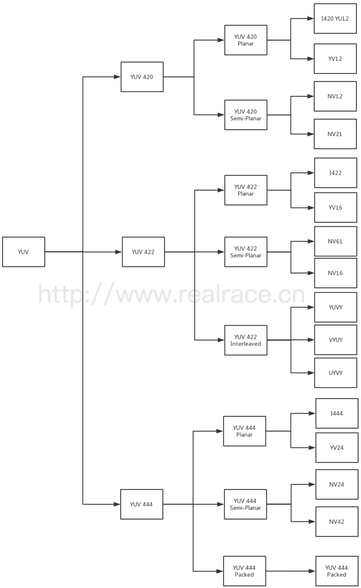

[TOC]

# 概述

文章参考：https://www.jianshu.com/p/538ee63f4c1c

音视频领域的人恐怕没有人不知道 YUV，但是 YUV 本身有好多种变种，名称也各种各样，本文就位大家总结一下YUV 的各种格式。

在开始之前，先向大家介绍一款 YUV 图像的查看工具---YUV Eye，大家可以使用这个工具，查看 YUV 图像。有的时候在进行 Debug 的时候，有这样一个工具会方便很多。

首先先介绍一下 YUV，我们都知道，YUV 是一种表示颜色的模型。但是我们常说的 YUV ，其实指的是 YCbCr，其中Y是指亮度分量，Cb指蓝色色度分量，而Cr指红色色度分量，是标准 YUV 的一个翻版，此文中，我们就用 YUV 指代 YCbCr 了。

首先，我们来看一下 YUV 的常见格式。你一定看过很多文章介绍 YUV 格式，但是对于 YUV 到底存在哪些格式，每种格式又有哪些变种，哪些别名，可能并没有一个系统的认识。没关系，我们用这篇文章帮你总结分析。

首先，我们对 YUV 格式先进性一下分类，大家可以参考下图。




## 分类标准

首先，我们可以将 YUV 格式按照数据大小分为三个格式，YUV 420，YUV 422，YUV 444。由于人眼对 Y 的敏感度远超于对 U 和 V 的敏感，所以有时候可以多个 Y 分量共用一组 UV，这样既可以极大得节省空间，又可以不太损失质量。这三种格式就是按照人眼的特性制定的。

- YUV 420，由 4 个 Y 分量共用一套 UV 分量，
- YUV 422，由 2 个 Y 分量共用一套 UV 分量
- YUV 444，不共用，一个 Y 分量使用一套 UV 分量

按照多个 Y 分量共用一个 UV 的方式，我们可以把 YUV 分为 420，422，444 三种类型，而在这三种类型之下，我们又可以按照 YUV 的排列储存顺序，将其细分为好多种格式，这些格式数量繁多，又不好记忆，这为我们学习过程中造成了不少困难。下面我就为大家一一介绍。

- Planar YUV 三个分量分开存放
- Semi-Planar Y 分量单独存放，UV 分量交错存放
- Packed YUV 三个分量全部交错存放

按照这三种方式，我们就可以将 YUV 格式进行比较细致的分类了。


## 具体分类

### I420（属于 YUV 420 Plannar）

I420 是 YUV 420 Planar 的一种，YUV 分量分别存放，先是 w * h 长度的 Y，后面跟 w * h * 0.25 长度的 U， 最后是 w * h * 0.25 长度的 V，总长度为 w * h * 1.5。

```shell
Y Y Y Y Y Y
Y Y Y Y Y Y
Y Y Y Y Y Y
Y Y Y Y Y Y
Y Y Y Y Y Y
Y Y Y Y Y Y
U U U
U U U
U U U
V V V
V V V
V V V
```


### YV12（属于 YUV 420 Plannar）

YV12 是 YUV 420 Planar 的一种，YUV 分量分别存放，先是 w * h 长度的 Y，后面跟 w * h * 0.25 长度的 V， 最后是 w * h * 0.25 长度的 U，总长度为 w * h * 1.5。与 I420 不同的是，YV12 是先 V 后 U

```
Y Y Y Y Y Y
Y Y Y Y Y Y
Y Y Y Y Y Y
Y Y Y Y Y Y
Y Y Y Y Y Y
Y Y Y Y Y Y
V V V
V V V
V V V
U U U
U U U
U U U
```


### NV12（属于 YUV 420 Semi-Planar）

NV12 是 YUV 420 Semi-Planar 的一种，Y 分量单独存放，UV 分量交错存放，UV 在排列的时候，从 U 开始。总长度为 w * h * 1.5。

```
Y Y Y Y Y Y
Y Y Y Y Y Y
Y Y Y Y Y Y
Y Y Y Y Y Y
Y Y Y Y Y Y
Y Y Y Y Y Y
U V U V U V
U V U V U V
U V U V U V
```

### NV21（属于 YUV 420 Semi-Planar）

NV21 是 YUV 420 Semi-Planar 的一种，Y 分量单独存放，UV 分量交错存放，与 NV12 不同的是，UV 在排列的时候，从 V 开始。总长度为 w * h * 1.5。

```
Y Y Y Y Y Y
Y Y Y Y Y Y
Y Y Y Y Y Y
Y Y Y Y Y Y
Y Y Y Y Y Y
Y Y Y Y Y Y
V U V U V U
V U V U V U
V U V U V U
```


### I422（属于 YUV 422 Plannar）

I422 是 YUV 422 Planar 的一种，YUV 分量分别存放，先是 w * h 长度的 Y，后面跟 w * h * 0.5 长度的 U， 最后是 w * h * 0.5 长度的 V，总长度为 w * h * 2。

```
Y Y Y Y Y Y
Y Y Y Y Y Y
Y Y Y Y Y Y
Y Y Y Y Y Y
Y Y Y Y Y Y
Y Y Y Y Y Y
U U U U U U
U U U U U U
U U U U U U
V V V V V V
V V V V V V
V V V V V V
```


### YV16（属于 YUV 422 Plannar）

YV16 是 YUV 422 Planar 的一种，YUV 分量分别存放，先是 w * h 长度的 Y，后面跟 w * h * 0.5 长度的 V， 最后是 w * h * 0.5 长度的 U，总长度为 w * h * 2。与 I422 不同的是，YV16 是先 V 后 U

```
Y Y Y Y Y Y
Y Y Y Y Y Y
Y Y Y Y Y Y
Y Y Y Y Y Y
Y Y Y Y Y Y
Y Y Y Y Y Y
V V V V V V
V V V V V V
V V V V V V
U U U U U U
U U U U U U
U U U U U U
```


### NV16（属于 YUV 422 Semi-Planar）

NV16 是 YUV 422 Semi-Planar 的一种，Y 分量单独存放，UV 分量交错存放，UV 在排列的时候，从 U 开始。总长度为 w * h * 2。

```
Y Y Y Y Y Y
Y Y Y Y Y Y
Y Y Y Y Y Y
Y Y Y Y Y Y
Y Y Y Y Y Y
Y Y Y Y Y Y
U V U V U V
U V U V U V
U V U V U V
U V U V U V
U V U V U V
U V U V U V
```


### NV61（属于 YUV 422 Semi-Planar）

NV61 是 YUV 422 Semi-Planar 的一种，Y 分量单独存放，UV 分量交错存放，UV 在排列的时候，从 V 开始。总长度为 w * h * 2。

```
Y Y Y Y Y Y
Y Y Y Y Y Y
Y Y Y Y Y Y
Y Y Y Y Y Y
Y Y Y Y Y Y
Y Y Y Y Y Y
V U V U V U
V U V U V U
V U V U V U
V U V U V U
V U V U V U
V U V U V U
```


### YUVY（属于 YUV 422 Interleaved）

YUVY 属于 YUV 422 Interleaved 的一种。事实上，Interleaved 是属于 Packed 的，但是在 422 中，用 Interleaved 更加形象一些。在 Packed 内部，YUV 的排列顺序是 Y U V Y，两个 Y 共用一组 UV。

```
Y U V Y   Y U V Y   Y U V Y
Y U V Y   Y U V Y   Y U V Y
Y U V Y   Y U V Y   Y U V Y
Y U V Y   Y U V Y   Y U V Y
Y U V Y   Y U V Y   Y U V Y
Y U V Y   Y U V Y   Y U V Y
```


## VYUY（属于 YUV 422 Interleaved）

VYUY 属于 YUV 422 Interleaved 的一种。在 Packed 内部，YUV 的排列顺序是 VYUY，两个 Y 共用一组 UV。

```
V Y U Y   V Y U Y   V Y U Y
V Y U Y   V Y U Y   V Y U Y
V Y U Y   V Y U Y   V Y U Y
V Y U Y   V Y U Y   V Y U Y
V Y U Y   V Y U Y   V Y U Y
V Y U Y   V Y U Y   V Y U Y
```


### UYVY（属于 YUV 422 Interleaved）

UYVY 属于 YUV 422 Interleaved 的一种。在 Packed 内部，YUV 的排列顺序是 UYVY，两个 Y 共用一组 UV。

```
U Y V Y   U Y V Y   U Y V Y
U Y V Y   U Y V Y   U Y V Y
U Y V Y   U Y V Y   U Y V Y
U Y V Y   U Y V Y   U Y V Y
U Y V Y   U Y V Y   U Y V Y
U Y V Y   U Y V Y   U Y V Y
```


### I444（属于 YUV 444 Planar）

I444（属于 YUV 444 Planar） I444 属于 YUV 444 Planar 的一种。YUV 分量分别存放，先是 w * h 长度的 Y，后面跟 w * h 长度的 U， 最后是 w * h 长度的 V，总长度为 w * h * 3。

```
Y Y Y Y Y Y
Y Y Y Y Y Y
Y Y Y Y Y Y
Y Y Y Y Y Y
Y Y Y Y Y Y
Y Y Y Y Y Y
U U U U U U
U U U U U U
U U U U U U
U U U U U U
U U U U U U
U U U U U U
V V V V V V
V V V V V V
V V V V V V
V V V V V V
V V V V V V
V V V V V V
```


### YV24（属于 YUV 444 Planar）

YV24 属于 YUV 444 Planar 的一种。YUV 分量分别存放，先是 w * h 长度的 Y，后面跟 w * h 长度的 V， 最后是 w * h 长度的 U，总长度为 w * h * 3。与 I444 不同的是，YV24 是先排列 V。

```
Y Y Y Y Y Y
Y Y Y Y Y Y
Y Y Y Y Y Y
Y Y Y Y Y Y
Y Y Y Y Y Y
Y Y Y Y Y Y
V V V V V V
V V V V V V
V V V V V V
V V V V V V
V V V V V V
V V V V V V
U U U U U U
U U U U U U
U U U U U U
U U U U U U
U U U U U U
U U U U U U
```


### NV24（属于 YUV 444 Semi-Planar）

NV24 是 YUV 444 Semi-Planar 的一种，Y 分量单独存放，UV 分量交错存放，UV 在排列的时候，从 U 开始。总长度为 w * h * 3。

```
Y Y Y Y Y Y
Y Y Y Y Y Y
Y Y Y Y Y Y
Y Y Y Y Y Y
Y Y Y Y Y Y
Y Y Y Y Y Y
U V U V U V 
U V U V U V 
U V U V U V 
U V U V U V 
U V U V U V 
U V U V U V 
U V U V U V 
U V U V U V 
U V U V U V 
U V U V U V 
U V U V U V 
U V U V U V 
```


### NV42（属于 YUV 444 Semi-Planar）

NV42 是 YUV 444 Semi-Planar 的一种，Y 分量单独存放，UV 分量交错存放，UV 在排列的时候，从 V 开始。总长度为 w * h * 3。

```
Y Y Y Y Y Y
Y Y Y Y Y Y
Y Y Y Y Y Y
Y Y Y Y Y Y
Y Y Y Y Y Y
Y Y Y Y Y Y
V U V U V U 
V U V U V U
V U V U V U 
V U V U V U
V U V U V U 
V U V U V U
V U V U V U 
V U V U V U
V U V U V U 
V U V U V U
V U V U V U 
V U V U V U
```


### YUV 444 Packed

这个就不解释了。。。

```
Y U V   Y U V   Y U V   Y U V   Y U V   Y U V
Y U V   Y U V   Y U V   Y U V   Y U V   Y U V
Y U V   Y U V   Y U V   Y U V   Y U V   Y U V
Y U V   Y U V   Y U V   Y U V   Y U V   Y U V
Y U V   Y U V   Y U V   Y U V   Y U V   Y U V
Y U V   Y U V   Y U V   Y U V   Y U V   Y U V
```

