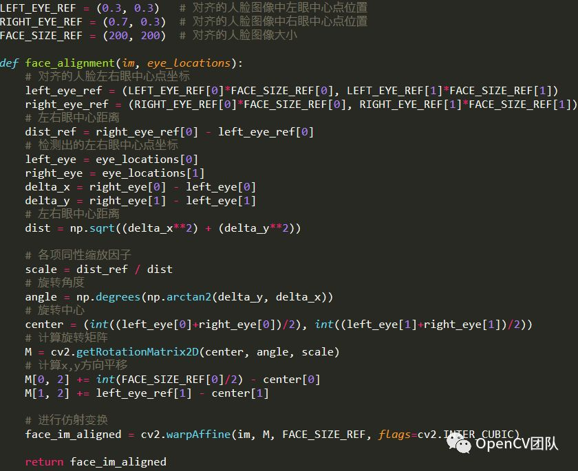

[TOC]

# 概述

文章参考：https://blog.csdn.net/oTengYue/article/details/79278572

文章参考：https://www.freesion.com/article/7721470729/

人脸对齐，即根据图像中人脸的几何结构对图像进行仿射变换（旋转、缩放、平移等），将人脸变换到一个统一的状态。人脸对齐是[人脸识别](https://cloud.tencent.com/product/facerecognition?from=10680)的一个重要步骤，可以提升人脸识别的精度。

根据人脸关键点进行对齐是人脸对齐的一种方法。下图显示了人脸检测和5点人脸关键点检测的结果。

 进行人脸对齐后：

 OpenCV中的一个函数estimateAffine2D()可以用来估计最优的仿射变换矩阵。

函数返回2x3仿射变换矩阵。以人脸对齐为例，输入参数from为图1中检测出的5个关键点的坐标，to为对齐的关键点位置坐标。对齐的关键点位置可以由训练数据计算得出。

   OpenCV中的另一个函数warpAffine()对图像进行仿射变换。

以人脸对齐为例，src是输入图像(图1)，dst是输出的对齐的人脸图像(图2b)，M是2x3的仿射变换矩阵，dsize是要求的对齐人脸图像的大小。

图2可以用下面的函数来实现。

如果只需对齐眼睛，也可以通过OpenCV的函数getRotationMatrix2D()直接计算变换矩阵。

