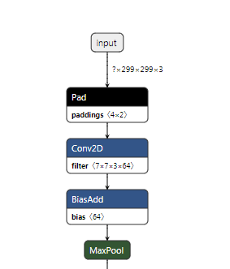

[TOC]

# 概述

很多时候发现通过tensorflow或者[pytorch](https://so.csdn.net/so/search?q=pytorch&spm=1001.2101.3001.7020)转过来的模型是没有中间的node的shape的，比如下面这样：




## 原理

ONNX本身提供了进行inference的[api](https://so.csdn.net/so/search?q=api&spm=1001.2101.3001.7020)：

```python
shape_inference.infer_shapes()
```

但是呢，这里进行inference并不是根据graph中的tensor，而是根据graph的input中各个tensor的tensor_value_info。所以我们需要做的就是根据各个tensor的信息创建出对应的tensor_value_info之后将其append进graph.inputs即可。
		最开始我进行infer_shapes之后发现没用就是因为graph.inputs中的tensor_value_info只有input node的。

```shell
import onnx
from onnx.tools import update_model_dims
import numpy as np
import onnx.helper as helper
from onnx import shape_inference, TensorProto
import sys

ONNX_DTYPE = {
    0: TensorProto.FLOAT,
    1: TensorProto.FLOAT,
    2: TensorProto.UINT8,
    3: TensorProto.INT8,
    4: TensorProto.UINT16,
    5: TensorProto.INT16,
    6: TensorProto.INT32,
    7: TensorProto.INT64,
    8: TensorProto.STRING,
    9: TensorProto.BOOL
}

# load model
onnx_model = onnx.load("tf_resnet_v2_50_onnx.onnx")
graph = onnx_model.graph

# rewrite the input tensor of graph
input_tensor = graph.input[0]
input_shape = input_tensor.type.tensor_type.shape.dim
input_tensor_new = onnx.helper.make_tensor_value_info(name = input_tensor.name, elem_type = 1, 
                                                      shape = [1, input_shape[1].dim_value, input_shape[2].dim_value, input_shape[3].dim_value])
graph.input.remove(input_tensor)
graph.input.insert(0, input_tensor_new)

# append all tensor infos to graph input
weight_infos = []
tensors = graph.initializer
for i, tensor in enumerate(tensors):
    value_info = helper.make_tensor_value_info(tensor.name, ONNX_DTYPE[tensor.data_type], tensor.dims)
    weight_infos.append(value_info)
    graph.input.insert(i+1, value_info) # because 0 is for placeholder, so start index is 1

# run node shape inference
node = graph.node
value_info = graph.value_info
print("Before shape inference: \n")
print(value_info)
print("------------------------------------------------------------")
print("After shape inference: \n")
inferred_onnx_model = shape_inference.infer_shapes(onnx_model)
onnx.checker.check_model(onnx_model)
inferred_graph = inferred_onnx_model.graph
inferred_value_info = inferred_graph.value_info
print(inferred_value_info)
onnx.save(inferred_onnx_model,"./new.onnx")
```

